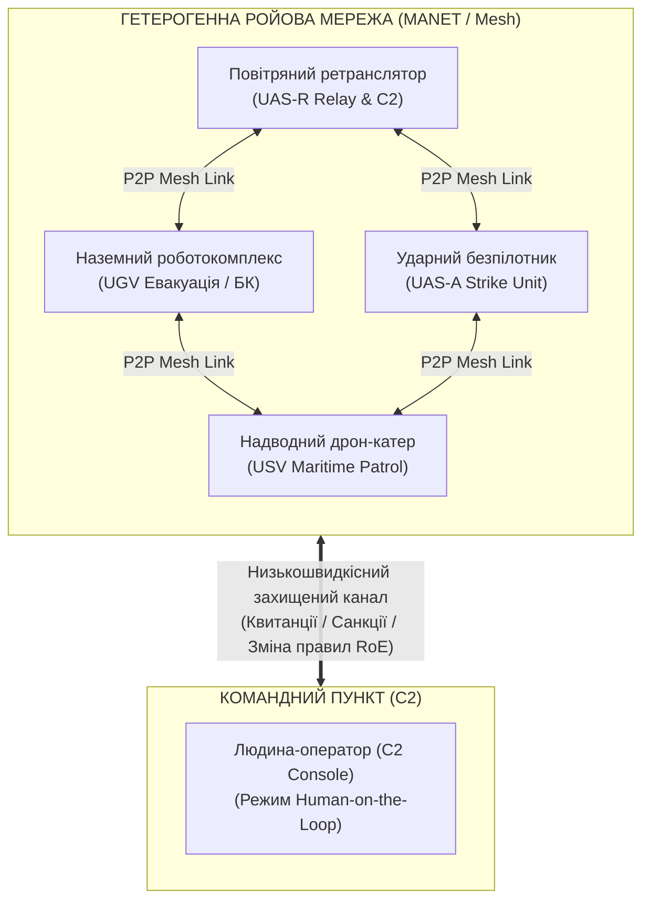

# Розділ 6. Ройовий інтелект і координація гетерогенних роботокомплексів

> **Монографія:** [Військова Кібернетика початку XXI століття](README.md) · [Частина II: Внутрішня кібернетика озброєння та автономних платформ](README.md#частина-ii-внутрішня-кібернетика-озброєння-та-автономних-платформ)  
> **Попередній розділ:** [← Розділ 5. Автономна навігація БАС без GNSS: VIO, DSMAC та арбітраж цілісності](Autonomous-Navigation-GNSS-Denied-MilTech-UA.md)  
> **Наступний розділ:** [Розділ 7. Військова кібернетика тактичного рівня: людино-машинна синергія відділення, взводу та роти →](Military-Cybernetics-Tactical-Level-UA.md)  
> **Зміст монографії:** [README.md](README.md)  
> **Автор:** [Микола Федчик (Mykola Fedchyk)](../ExpertSystem/book/about-the-author.md) · [LinkedIn](https://www.linkedin.com/in/nickfedchik/)  
> **Пов'язана монографія:** [«Експертні системи: інженерія знань, нейросимволічні архітектури та доказовий ШІ»](../ExpertSystem/book/README.md)

---

## 1. Межа класичного управління: чому централізація зазнає поразки

Традиційна парадигма бойового застосування робототехніки спирається на схему **«один оператор — один дрон»** або на централізований польовий сервер, куди стікаються потоки телеметрії від усіх платформ.

В умовах насиченого радіоелектронного придушення (РЕБ) та високодинамічного бою ця модель повністю втрачає працездатність через три фактори:

1. **Когнітивне перевантаження операторів:** людський мозок не здатний одночасно пілотувати кілька апаратів, сканувати сенсорні поля та координувати маневри за десяті частки секунди.
2. **Єдина точка відмови (Single Point of Failure):** вихід із ладу ретранслятора, командного пункту або базової станції миттєво паралізує всю групу.
3. **Деградація радіоліній (Bandwidth Starvation):** передавання високоякісного відеопотоку від десятків дронів до єдиного центру неможливе в завужених і зашумлених радіоканалах.

Відповіддю військової кібернетики є перехід до **гетерогенного ройового інтелекту (Heterogeneous Swarm Intelligence)** — децентралізованої координації повітряних (UAS), наземних (UGV) та морських надводних (USV) платформ на основі локальних правил взаємодії, динамічних самоорганізованих мереж (MANET) та розподіленого символічного виведення.



---

## 2. Математичний базис ройового руху: від локальних сил до емерджентної поведінки

Складна, узгоджена поведінка рою виникає без генерального плану — завдяки паралельному виконанню кожним агентом простих локальних фізико-математичних правил.

У розширеній моделі адаптивного рою сумарний вектор керуючого прискорення $\mathbf{a}_i$ для $i$-го агента розраховується як суперпозиція сил штучних потенційних полів (Artificial Potential Fields, APF):

$$
\mathbf{a}_i = w_{\text{sep}} \mathbf{F}_{\text{sep}, i} + w_{\text{align}} \mathbf{F}_{\text{align}, i} + w_{\text{coh}} \mathbf{F}_{\text{coh}, i} + w_{\text{goal}} \mathbf{F}_{\text{goal}, i} + w_{\text{obs}} \mathbf{F}_{\text{obs}, i}
$$

### Компоненти векторного поля

#### 1. Сила взаємного відштовхування (Separation)

Гарантує відсутність колізій між сусідами у радіусі безпеки $R_{\text{safe}}$:

$$
\mathbf{F}_{\text{sep}, i} = \sum_{j \in \mathcal{N}_i, \, j \neq i} \frac{\mathbf{p}_i - \mathbf{p}_j}{\|\mathbf{p}_i - \mathbf{p}_j\|^3}
$$

#### 2. Сила вирівнювання швидкостей (Alignment)

Синхронізує вектор курсу та швидкість із сусідніми апаратами у радіусі комунікації $R_{\text{comm}}$:

$$
\mathbf{F}_{\text{align}, i} = \frac{1}{|\mathcal{N}_i|} \sum_{j \in \mathcal{N}_i} (\mathbf{v}_j - \mathbf{v}_i)
$$

#### 3. Сила когезії (Cohesion)

Утримує єдність групи та спрямовує агента до локального центру мас:

$$
\mathbf{F}_{\text{coh}, i} = \left( \frac{1}{|\mathcal{N}_i|} \sum_{j \in \mathcal{N}_i} \mathbf{p}_j \right) - \mathbf{p}_i
$$

#### 4. Сила цільового притягання (Goal Attraction)

Спрямовує центр мас рою до заданого рубежу або навігаційного коридору:

$$
\mathbf{F}_{\text{goal}, i} = \frac{\mathbf{p}_{\text{target}} - \mathbf{p}_i}{\|\mathbf{p}_{\text{target}} - \mathbf{p}_i\|}
$$

#### 5. Сила відштовхування від перешкод та зон РЕБ (Obstacle Avoidance)

Активується при наближенні до рельєфних перешкод або виявлених секторів ворожого радіовипромінювання:

$$
\mathbf{F}_{\text{obs}, i} = \sum_{k \in \mathcal{O}_i} \eta \left( \frac{1}{d_k} - \frac{1}{d_{\text{safe}}} \right) \frac{1}{d_k^2} \frac{\mathbf{p}_i - \mathbf{p}_{\text{obs}, k}}{d_k}
$$

де дистанція до $k$-ї перешкоди становить $`d_k = \|\mathbf{p}_i - \mathbf{p}_{\text{obs}, k}\| \le d_{\text{safe}}`$.

---

## 3. Розподілений консенсус без зв'язку з хмарою (Raft-on-Mesh & CRDT)

Рой не може використовувати централізовану базу даних. Кожен безпілотний апарат є незалежним вузлом у динамічній радіомережі зі змінною топологією (MANET), де пакети губляться, а окремі вузли можуть бути знищені або тимчасово ізольовані завадами.

Для синхронізації оперативної обстановки використовуються дві взаємодоповнюючі технології:

### 1. CRDT (Conflict-free Replicated Data Types)

Для реплікації метрик сенсорного покриття, залишку палива/заряду акумуляторів та стану бортового обладнання застосовуються безконфліктні структури даних (LWW-Element-Set або ORSet). Злиття даних відбувається детерміновано за правилом:

$$
S_{\text{merged}} = S_A \sqcup S_B = \big\lbrace (x, t_x) \mid t_x = \max(t_A(x), t_B(x)) \big\rbrace
$$

Це гарантує математичну збіжність стану знань на всіх платформах після відновлення прямого радіоконтакту без необхідності блокування каналу.

### 2. Datalog-аукціони розподілу цілей (Distributed Contract Net Protocol)

Коли сенсори розвідувального дрона UAS-R виявляють об'єкт, розподіл завдання між ударними дронами UAS-A та наземними роботизованими платформами UGV відбувається за **децентралізованим аукціонним протоколом**, описаним формальними правилами:

```prolog
% Оцінка вартості виконання завдання платформою (Cost function)
task_bid(PlatformId, TaskId, BidScore) :-
    platform_status(PlatformId, ready),
    task_requirement(TaskId, payload_type, PType),
    platform_capability(PlatformId, PType),
    distance_to_task(PlatformId, TaskId, Dist),
    battery_reserve(PlatformId, Reserve),
    Reserve > 30,
    BidScore is (Dist * 0.6) + ((100 - Reserve) * 0.4).

% Визначення переможця розподіленого консенсусу
assign_task(WinnerPlatform, TaskId) :-
    task_bid(WinnerPlatform, TaskId, BestBid),
    not (task_bid(OtherPlatform, TaskId, OtherBid), OtherPlatform \= WinnerPlatform, OtherBid < BestBid).
```

Всі вузли рою паралельно розраховують власні ставки (`BidScore`), транслюють їх у радіус сусідства і детерміновано фіксують призначення завдання за мінімальною ціною без участі центрального диспетчера.

---

## 4. Просторово-часовий та частотний деконфліктинг

Масоване застосування десятків дронів у вузькому секторі створює високий ризик взаємних зіткнень та радіоелектронної інтерференції між власними каналами телеметрії та відео.

### Просторові інваріанти безпеки

Експертний модуль безпеки на кожному борту в реальному часі контролює дотримання формальних просторових обмежень:

- **Мінімальна дистанція ешелонування:** $\Delta d_{\text{horizontal}} \ge 15$ м, $\Delta h_{\text{vertical}} \ge 10$ м.
- **Заборона перетину векторів:** якщо дві платформи рухаються зустрічними курсами з часом зближення $TTC \le 3.0$ с, модуль безпеки детерміновано призначає маневр ухилення (правило: дрон із нижчим ID змінює висоту на +10 м, дрон із вищим ID — на -10 м).

### Динамічний розподіл радіочастот (TDMA / FHSS Coordination)

Для уникнення взаємного «забивання» відеопередавачів рой використовує символічний частотний координатор:

- Частотний діапазон розбивається на ортогональні канали з захисними інтервалами $\Delta f_{\text{guard}} \ge 20$ МГц.
- Потужність передавача $P_{tx}$ адаптивно знижується до мінімально необхідної для підтримки зв'язку з найближчим сусіднім ретранслятором (Mesh-hop), що мінімізує помітність рою для радіоелектронної розвідки противника (LPI/LPD — Low Probability of Intercept / Detection).

---

## 5. Система «Антифратрицид» (Anti-Fratricide) та протокол IFF

У хаосі сучасного бою критичним є унеможливлення дружнього вогню між суміжними підрозділами, гетерогенними дронами та наземними піхотними групами.

Комплекс запобігання «фратрициду» будується на трифакторній верифікації:

1. **Криптографічний бекон «Свій-Чужий» (Crypto-IFF):** періодична широкомовна трансляція коротких пакетів, підписаних еліптичною кривою Ed25519 з міткою поточного часу (захист від повтору / Replay Attack).
2. **Просторово-часовий геофенсинг (Blue Force Tracking Geofence):** автоматичне накладання заборонних зон ураження довкола відомих координат дружніх підрозділів і суміжних роботів.
3. **Оптичне розпізнавання маркерів (Visual Identification):** бортовий нейромережевий класифікатор перевіряє наявність інфрачервоних маяків (IR-strobes) або специфічної геометрії власних машин.

Якщо хоча б один із факторів вказує на наявність дружніх сил у секторі дії ($IFF = FRIEND$), бортовий Simplex-арбітр блокує бойову команду з рівнем пріоритету **Safety Critical**.

---

## 6. Людський контроль: концепція Human-on-the-Loop

Повна автономія рою допустима для навігації, перестроювання ордеру, ретрансляції сигналу та ухилення від завад. Проте в частині застосування спеціальних функцій військова кібернетика вимагає збереження контролю з боку людини.

### Режими людино-машинної взаємодії

| Рівень взаємодії | Роль рою | Роль людини-оператора | Канал зв'язку |
| :--- | :--- | :--- | :--- |
| **Human-in-the-Loop (HITL)** | Платформа є виконавцем; кожен крок санкціонується. | Безпосереднє пілотування та цілевказання. | Високошвидкісний, постійний (вразливий до РЕБ). |
| **Human-on-the-Loop (HOTL)** | Рой діє автономно в межах правил (RoE); координує рух і розподіл завдань. | Супервізорний нагляд, право накласти вето (Abort) або змінити пріоритети. | Низькошвидкісний, пакетний (стійкий до РЕБ). |
| **Human-out-of-the-Loop** | Повна автономія без можливості втручання. | Не бере участі в операції. | Відсутній (неприпустимо для критичних дій). |

В архітектурі HOTL оператор бачить не сирий потік телеметрії від 30 дронів, а **агрегований граф стану рою**: кількість боєготових машин, статус виконання місії, виявлені фактори ризику та пропозиції дій, що потребують санкціонування єдиним натисканням квитанції.

---

## 7. Програмно-апаратний стек реалізації

Для практичної розробки ройових комплексів застосовується модульний стек на базі протоколів нульового копіювання:

- **Мережевий транспорт:** Zenoh-P2P або Cyclone DDS через зашифровані тунелі WireGuard у топології Batman-adv / 802.11s Mesh.
- **Бортові агенти:** мікросервіси на мовах Go та Rust із мінімальним споживанням пам'яті та гарантією відсутності панік (Memory Safety).
- **Символічний рушій:** вбудована бібліотека Datalog (souffle-compiled або pure-Go datalog) для оцінки правил просторової безпеки з затримкою менше 2 мілісекунд.

---

## 8. Висновки

Гетерогенний ройовий інтелект є якісним стрибком від ручного пілотування до **масштабованої розподіленої кібернетичної системи**:

1. Локальні правила поведінки (APF) забезпечують відсутність зіткнень та адаптивне огинання перешкод без централізованого диспетчера.
2. Розподілені структури даних (CRDT) та Datalog-аукціони гарантують несуперечливий розподіл завдань в умовах розривів зв'язку.
3. Багаторівневий IFF-захист та детермінований просторовий деконфліктинг виключають ризики дружнього вогню.
4. Концепція Human-on-the-Loop зберігає повний юридичний та етичний контроль людини над операцією при мінімальному навантаженні на радіоканал.

---

## Посилання

- [Zenoh: Zero Overhead Pub/Sub, Store/Query and Compute for Robotics](https://zenoh.io/)
- [Reynolds, C. W. (1987). Flocks, herds and schools: A distributed behavioral model](https://dl.acm.org/doi/10.1145/37401.37406)
- [Eclipse Cyclone DDS: Ultra-reliable OMG DDS Implementation](https://cyclonedds.io/)
- [Війська зв'язку та кібербезпеки Збройних Сил України](https://mod.gov.ua/pro-nas/vijska-zv-yazku-ta-kiberbezpeki)

---

[← Розділ 5. Автономна навігація БАС без GNSS: VIO, DSMAC та арбітраж цілісності](Autonomous-Navigation-GNSS-Denied-MilTech-UA.md) | [Зміст монографії](README.md) | [Розділ 7. Військова кібернетика тактичного рівня: людино-машинна синергія відділення, взводу та роти →](Military-Cybernetics-Tactical-Level-UA.md)
