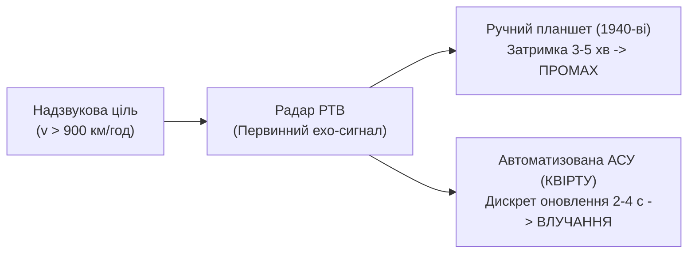
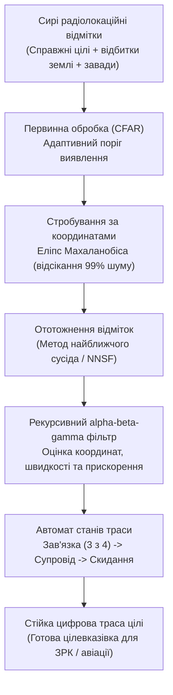
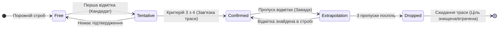
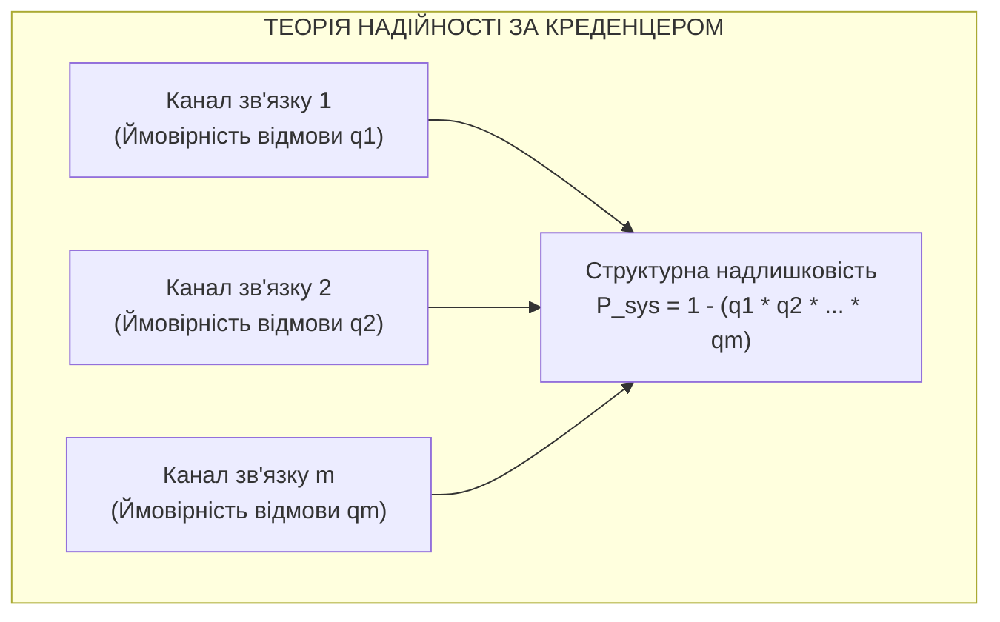
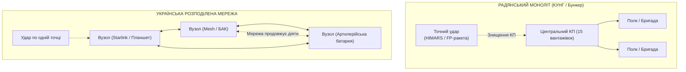

# Розділ 2. Українська військова кібернетика: від КВІРТУ ППО до цифрових систем управління

> **Монографія:** [Військова Кібернетика початку XXI століття](README.md) · [Частина I: Фундамент і спадковість](README.md#частина-i-фундамент-і-спадковість)  
> **Попередній розділ:** [← Розділ 1. Військова кібернетика: теорія керування, зворотний зв'язок та генезис](Ukrainian-Military-Cybernetics-UA.md)  
> **Наступний розділ:** [Розділ 3. Військова кібернетика в дії: C4ISTAR, моделювання та кіберфізичні системи →](Military-Cybernetics-In-Action-UA.md)  
> **Зміст монографії:** [README.md](README.md)  
> **Автор:** [Микола Федчик (Mykola Fedchyk)](../ExpertSystem/book/about-the-author.md) · [LinkedIn](https://www.linkedin.com/in/nickfedchik/)  
> **Пов'язана монографія:** [«Експертні системи: інженерія знань, нейросимволічні архітектури та доказовий ШІ»](../ExpertSystem/book/README.md)

---

У попередньому розділі було розглянуто фундаментальні засади кібернетики: зворотний зв'язок, динаміку часових запізнень та ентропію інформаційних каналів. Проте теорія залишається абстракцією, доки вона не втілюється в радіолокаційних антенах, сигнальних процесорах, бортових алгоритмах та польових інтерфейсах командних пунктів.

Україна володіє унікальною військово-інженерною школою, яка понад сімдесят років створювала складні автоматизовані системи управління військами (АСУВ). Ця традиція формувалася не в кабінетах теоретиків, а на стику математики радіолокаційного поля, надзвукової аеродинаміки, теорії надійності та жорстких обмежень обчислювальної техніки.

---

## 1. Виклик надзвукової епохи: криза пропускної спроможності людини

У середині XX століття поява реактивної авіації та перших крилатих ракет поставила військову протиповітряну оборону перед фізичним глухим кутом. Доти координати повітряних цілей наносилися вручну: спостерігач з біноклем чи оператор перших радарів передавав координати телефоном, а планшетист у штабі восковим олівцем малював трасу на скляному вертикальному планшеті.

Коли швидкості повітряних цілей зросли до 800–1200 км/год, ручний метод остаточно збанкрутував:

- Затримка проходження голосової інформації через 2–3 телефонні ланки становила 3–5 хвилин.
- За цей час надзвуковий літак долав від 40 до 100 кілометрів, повністю виходячи із зони прогнозованого курсу.
- Оператор фізично не міг одночасно відстежувати понад 3–4 цілі без катастрофічного падіння концентрації.

Виникла класична криза пропускної спроможності людини-оператора як ланки управління:

$$\Delta t_{human} \gg \Delta t_{process}$$

де $\Delta t_{human}$ — час зняття, озвучення та нанесення точки, а $\Delta t_{process}$ — допустимий дискрет оновлення інформації для наведення ракети.

Для подолання цієї кризи 1 лютого 1953 року постановою уряду було створено **Київське вище інженерне радіотехнічне училище протиповітряної оборони (КВІРТУ ППО)**.

Саме в Києві виникло розуміння: для протидії надзвуковій загрозі потрібен не просто оператор, а **військовий інженер-програміст**. У КВІРТУ було відкрито першу у світі кафедру військової кібернетики. Програмування тут викладалося не як створення офісних баз даних, а як бойова інженерія реального часу: оптимізація машинних команд під такт феритової пам'яті, цифрова фільтрація шумів на фоні відбитків від ґрунту та мілісекундна точність видачі цілевказівки зенітним ракетним комплексам.

---

## 2. Алгоритми класичних АСУ ППО: фільтрація $\alpha$-$\beta$-$\gamma$, стробування та селекція цілей

Інженери та випускники київської школи брали безпосередню участь у створенні й експлуатації перших поколінь армійських АСУ: комплексу управління винищувальною авіацією **«Повітря-1М»**, системи управління радіотехнічними полками **«Промінь»** та пізніше — бригадної системи **«Вектор-2У»**.

Головна інженерна проблема радіолокації полягає у тому, що приймач РЛС отримує не готові вектори цілей, а суміш корисного відбитого сигналу з потужними завадами: відбитками від земної поверхні, хмар, зграй птахів, а також навмисними активними шумовими й пасивними (дипольні відбивачі) завадами літаків РЕБ. На екрані первинного огляду це виглядає як сотні хаотичних точок на кожному оберті антени.

Для перетворення цього шуму на керовану бойову картину в київській школі кібернетики було реалізовано дворівневу архітектуру обробки: **первинну** (детекція імпульсу на фоні шуму) та **вторинну** (траєкторне супроводження, екстраполяція та автозав'язка трас).

---

### Геометрія стробування: еліпс довіри Махаланобіса

Обчислювальні машини командних пунктів 1970–1980-х років (наприклад, спеціалізовані процесори типу 5Е26) мали швидкодію лише у десятки тисяч операцій на секунду та оперативну пам'ять у кілька десятків кілобайтів. Здійснювати повний перебір усіх можливих комбінацій між сотнями відміток на кожному оберті антени було фізично неможливо.

Розв'язанням стало просторово-часове **стробування**. Навколо очікуваного положення цілі $\hat{\mathbf{x}}_{k|k-1}$, обчисленого на попередньому кроці, відкривається вузьке просторове вікно — «строб» захоплення. Будь-яка відмітка за межами стробу відкидається ще до початку складних розрахунків.

Розмір і форма стробу розраховуються як еліпс розсіювання помилок у полярних координатах радара (дальність $r$ та азимут $\theta$). Критерій потрапляння нового вимірювання $\mathbf{z}_k = [r_k, \theta_k]^T$ у строб визначається за квадратичною відстанню Махаланобіса:

$$d^2 = \frac{(r_k - \hat{r}_{k|k-1})^2}{\sigma_r^2} + \frac{(\theta_k - \hat{\theta}_{k|k-1})^2}{\sigma_{\theta}^2} \le \gamma_{gate}^2$$

де:

- $\sigma_r$ — сумарна середньоквадратична похибка визначення дальності (похибка радара плюс похибка прогнозу фільтра);
- $\sigma_{\theta}$ — середньоквадратична похибка за азимутом;
- $\gamma_{gate}$ — поріг стробування, який обирається за розподілом хі-квадрат ($\chi^2$). Для двовимірного простору при $\gamma_{gate}^2 = 9{,}2$ строб гарантовано захоплює 99% справжніх відміток цілі, відсікаючи понад 98% сторонніх завад простору.

Якщо ціль здійснює інтенсивний маневр, геометричний радіус стробу динамічно збільшується на величину максимального можливого поперечного зсуву за період огляду: $\Delta R_{man} = \frac{1}{2} n_{max} g (\Delta t)^2$, де $n_{max}$ — максимальне аеродинамічне перевантаження літака або ракети.

---

### Математичний апарат фільтрації: від $\alpha$-$\beta$ до $\alpha$-$\beta$-$\gamma$

Класичний матричний фільтр Калмана вимагає постійного обернення коваріаційних матриць розміром $6 \times 6$ або $9 \times 9$, що на ранніх ЕОМ займало надто багато часу. Тому в АСУ «Повітря» та «Вектор» застосовували детерміновані рекурсивні **$\alpha$-$\beta$ та $\alpha$-$\beta$-$\gamma$ фільтри**.

У стаціонарному режимі прямолінійного руху алгоритм працює за рекурсивними рівняннями. На кожному $k$-му оберті антени радара обчислюється прогнозований вектор координат:

$$\hat{x}_{k|k-1} = \hat{x}_{k-1|k-1} + \hat{v}_{k-1|k-1} \Delta t$$

$$\hat{v}_{k|k-1} = \hat{v}_{k-1|k-1}$$

де $\Delta t$ — період огляду радіолокатора (зазвичай 2–4 секунди).

Коли радар фіксує нове вимірювання $z_k$ всередині стробу, оцінки координат і швидкості коригуються:

$$\hat{x}_{k|k} = \hat{x}_{k|k-1} + \alpha (z_k - \hat{x}_{k|k-1})$$

$$\hat{v}_{k|k} = \hat{v}_{k|k-1} + \frac{\beta}{\Delta t} (z_k - \hat{x}_{k|k-1})$$

#### Подолання динамічного лагу при маневрі

Головна проблема фільтра $\alpha$-$\beta$ полягає у тому, що при переході цілі у віраж з постійним прискоренням $a$ виникає невпинна динамічна похибка відставання (лаг):

$$\Delta x_{lag} = \lim_{k \to \infty} (x_k - \hat{x}_{k|k}) = \frac{1 - \alpha}{\beta} \, a \, (\Delta t)^2$$

Для швидкісних винищувачів і крилатих ракет ця похибка досягала кілометрів, що призводило до зриву автосупроводу або вильоту цілі за межі стробу.

Для усунення цієї помилки інженери додали оцінку прискорення — трипараметричний **$\alpha$-$\beta$-$\gamma$ фільтр**:

Рівняння екстраполяції на такт уперед:

$$\hat{x}_{k|k-1} = \hat{x}_{k-1|k-1} + \hat{v}_{k-1|k-1} \Delta t + \frac{1}{2} \hat{a}_{k-1|k-1} (\Delta t)^2$$

$$\hat{v}_{k|k-1} = \hat{v}_{k-1|k-1} + \hat{a}_{k-1|k-1} \Delta t$$

$$\hat{a}_{k|k-1} = \hat{a}_{k-1|k-1}$$

Рівняння оновлення стану за новим сигналом $z_k$:

$$\hat{x}_{k|k} = \hat{x}_{k|k-1} + \alpha (z_k - \hat{x}_{k|k-1})$$

$$\hat{v}_{k|k} = \hat{v}_{k|k-1} + \frac{\beta}{\Delta t} (z_k - \hat{x}_{k|k-1})$$

$$\hat{a}_{k|k} = \hat{a}_{k|k-1} + \frac{2\gamma}{(\Delta t)^2} (z_k - \hat{x}_{k|k-1})$$

Коефіцієнти розраховуються за співвідношенням Бенедикта-Борднера через індекс маневреності цілі $\Lambda = \frac{\sigma_w (\Delta t)^2}{\sigma_v}$, забезпечуючи нульову помилку супроводу за положенням навіть під час перевантажень до $9g$.

Цей алгоритм потребував лише 6 операцій множення і 6 додавань на одну ціль за період огляду, дозволяючи вести сотні бойових трас у реальному часі.

---

### Життєвий цикл бойової траси: автомат станів «$M$ із $N$»

Сама по собі поодинока відмітка в стробі ще не є ціллю. Для захисту від хибних тривог АСУ реалізує дискретний автомат станів:

1. **Ініціалізація (Tentative):** при появі відмітки, що не потрапила в жоден наявний строб, створюється попередня траса-кандидат.
2. **Зав'язка (Confirmed):** застосовується мажоритарне правило «3 із 4». Якщо у трьох із чотирьох наступних обертів антени всередині прогнозованого стробу виявляються відмітки з вектором швидкості, узгодженим за напрямком, траса отримує статус офіційно підтвердженої цілі та унікальний формуляр (Track ID).
3. **Екстраполяція (Coasting):** якщо ціль поставила активну заваду або пішла за складку рельєфу, відмітка зникає. Система не втрачає її миттєво, а переходить у режим «пам'яті», продовжуючи вести екстраполяцію за останнім збереженим вектором швидкості протягом 2–3 тактів.
4. **Скидання (Dropped):** якщо відмітка не з'явилася після трьох тактів екстраполяції, формуляр цілі закривається.

---

### Проблема ототожнення відміток (Data Association)

Коли група ворожих літаків здійснює розпуск строю, або коли ціль викидає пачки дипольних відбивачів (chaff), в один строб потрапляють 3–5 радіолокаційних відміток. Виникає класична кібернетична задача: яку саме точку вважати продовженням справжньої цілі?

В армійських АСУ застосовувався алгоритм **глобального найближчого сусіда (Global Nearest Neighbor, GNN)**: будується матриця нев'язок між усіма наявними трасами $i$ та новими відмітками $j$:

$$C_{ij} = (\mathbf{z}_j - \hat{\mathbf{z}}_{i})^T \mathbf{S}_i^{-1} (\mathbf{z}_j - \hat{\mathbf{z}}_{i})$$

Задача мінімізації сумарної нев'язки $\min \sum C_{ij}$ розв'язувалася за поліноміальний час, що повністю виключало переплутування літаків у строю або помилковий перехід радара на супровід хмари пасивних завад.

Сьогодні ці самі математичні принципи, народжені в КВІРТУ, слугують ядром української системи ситуаційної обізнаності **«Віраж-Планшет»**: система об'єднує в єдині строби дані радіолокаційних постів ППО, акустичних датчиків та оптико-електронних камер спостереження, забезпечуючи надійну зав'язку траєкторій крилатих ракет і низьковисотних дронів у реальному часі.

---

## 3. Математика цілерозподілу: захист від паніки та дублювання залпів

Другою фундаментальною задачею, яку вирішувала військова кібернетика в АСУ рівня «Вектор-2У», був автоматизований розподіл цілей між вогневими засобами (зенітними ракетними дивізіонами С-300, Бук, Оса).

Коли на охоронюваний об'єкт налітає група з 20–30 цілей, людина-командир під дією бойового стресу схильна робити дві критичні помилки:

1. **Дублювання вогню (Overkill):** кілька дивізіонів одночасно відкривають вогонь по найближчій або найбільшій цілі, безглуздо витрачаючи дорогі ракети.
2. **Пропуск загроз:** швидкісні або маловисотні цілі залишаються поза увагою, оскільки оператори зосереджені на флагманських об'єктах.

У київській школі кібернетики ця проблема була формалізована як задача **оптимального призначення засобів ураження (Weapon-Target Assignment, WTA)**:

$$\max_{\mathbf{X}} \sum_{j=1}^{M} V_j \left( 1 - \prod_{i=1}^{N} (1 - p_{ij})^{x_{ij}} \right)$$

за умови ресурсного обмеження на кількість одночасно обстрілюваних цілей кожним дивізіоном:

$$\sum_{j=1}^{M} x_{ij} \le C_i, \quad \forall i \in \{1, \dots, N\}, \quad x_{ij} \in \{0, 1\}$$

де:

- $M$ — кількість виявлених повітряних цілей;
- $N$ — кількість доступних зенітно-ракетних дивізіонів або пускових установок;
- $V_j$ — бальна цінність (небезпека) $j$-ї цілі для прикриваного промислового чи військового об'єкта;
- $p_{ij}$ — розрахункова ймовірність ураження $j$-ї цілі $i$-м комплексом з урахуванням ракурсу, висоти, швидкості та маневру;
- $x_{ij} = 1$, якщо дивізіону $i$ призначено ціль $j$, і $0$ у протилежному випадку;
- $C_i$ — канальність дивізіону за ціллю.

У реальному часі ця NP-складна задача розв'язувалася за секунди за допомогою модифікованого угорського алгоритму або градієнтних евристик цілерозподілу. Результат розрахунку видавався на екран командира як готова таблиця оптимальної стрільби: жодна ціль не дублювалася без потреби, а всі доступні канали ЗРК завантажувалися рівномірно і ефективно.

---

## 4. Спадщина КВІУС та ВІТІ: надійність систем і радіоелектронна розвідка

Логічним спадкоємцем інженерних традицій КВІРТУ ППО та Київського вищого військового інженерного училища зв'язку (КВВІУЗ) став **Київський військовий інститут управління і зв'язку (КВІУС)**, згодом реорганізований у **Військовий інститут телекомунікацій та інформатизації імені Героїв Крут (ВІТІ)**.

У середині 1990-х років у КВІУС було здійснено новий науковий прорив: на новоствореній кафедрі радіоелектронної розвідки вперше в Україні почали цілеспрямовано готувати інженерів-програмістів для засобів РЕР та систем сигнальної розвідки (SIGINT).

Підготовка базувалася на фундаментальних роботах українських вчених, серед яких ключове місце посідає наукова школа професора **Б. П. Креденцера** (автора класичних праць з теорії надійності складних систем військового призначення).

Головна проблема систем бойового управління — раптові відмови апаратури та фізичне руйнування ліній зв'язку під ударами артилерії. Професор Креденцер довів: абсолютна надійність кожного окремого радіорелейного вузла є недосяжною і занадто дорогою інженерною утопією. Надійність повинна досягатися **структурною та інформаційною надлишковістю**.

Якщо система побудована з $m$ незалежних, паралельно функціонуючих каналів передавання даних, кожен з яких має ймовірність безвідмовної роботи $P_k$ (і відповідно ймовірність відмови $q_k = 1 - P_k$), то результуюча ймовірність проходження бойового сигналу становить:

$$P_{sys} = 1 - \prod_{k=1}^{m} (1 - P_k)$$

**Числовий доказ:** Якщо взяти три польові радіолінії з посередньою надійністю $P_k = 0{,}80$ (кожна п'ята спроба зв'язку зривається через завади або рельєф), то об'єднана система паралельного передавання забезпечує надійність:

$$P_{sys} = 1 - (1 - 0{,}8)^3 = 1 - 0{,}2^3 = 1 - 0{,}008 = 0{,}992$$

Ймовірність втрати бойового наказу знижується з 20% до 0,8%! Цей принцип надлишковості став фундаментальним правилом сучасної української військової телекомунікації: зв'язок ніколи не будується на одній технології — він комбінує супутникові канали, транкінгові мережі, спрямовані радіорелейні мости та цивільні стільникові протоколи.

---

## 5. Цифрова революція сучасної війни: крах радянського моноліту

Повномасштабна війна продемонструвала повний крах радянської концепції класичних АСУ у зіткненні з високоточною зброєю XXI століття.

Радянські АСУ типу «Маневр» або «Поляна» проектувалися під минулу доктрину:

- Централізований командний пункт складався з 10–15 важких броньованих машин (КУНГів) на шасі Урал чи КамАЗ.
- Для їхнього розгортання та підключення кілометрів кабелів живлення та зв'язку були потрібні години.
- В умовах сучасної супутникової та безпілотної розвідки таке скупчення техніки виявляється за лічені хвилини.
- Перший же точний удар керованої ракети повністю паралізує управління дивізією чи корпусом.

Українська військова кібернетика здійснила фундаментальну трансформацію: **перехід від стаціонарних монолітів до розподілених мережецентричних платформ**.

Яскравими публічними прикладами цієї трансформації стали системи:

- **«Кропива»:** інтелектуальний артилерійський комплекс на тактичних планшетах. Розраховує метеорологічні поправки, кути прицілу та балістичні траєкторії для артилерійських систем безпосередньо в полі.
- **«Delta»:** платформа інтеграції ситуаційної обізнаності, яка збирає дані з відеопотоків БАС, супутникових знімків, радіотехнічної розвідки та донесень піхоти в єдину геоінформаційну систему реального часу за стандартами НАТО (STANAG).
- **«Віраж-Планшет»:** система агрегації радіолокаційної інформації для протиповітряної оборони, що об'єднує дані десятків цивільних і військових радарів, оптико-електронних постів та акустичних датчиків виявлення крилатих ракет.

### Порівняльний результат: скорочення циклу Sensor-to-Shooter

Кібернетичну перевагу нової парадигми найкраще ілюструє час передавання цілевказівки від розвідувального безпілотника до пострілу артилерії:

| Параметр циклу управління | Радянська ієрархічна АСУ | Сучасні українські цифрові платформи |
| :--- | :--- | :--- |
| **Носій апаратури** | Важкі КУНГи, стаціонарні бункери | Тактичні планшети, смартфони, ноутбуки |
| **Канал передавання даних** | Польовий кабель, вузькосмуговий УКХ | Starlink, зашифрований MANET, LTE, оптоволокно |
| **Топологія зв'язку** | Жорстке дерево (командир -> штаб -> підлеглий) | Децентралізована горизонтальна мережа (Peer-to-Peer) |
| **Час від виявлення до пострілу** | **15 – 35 хвилин** | **30 – 90 секунд** |
| **Живучість при втраті вузла** | Катастрофічна (параліч управління) | Повна (самовідновлення маршрутів передавання) |

Цей стрибок у 15–20 разів стався завдяки тому, що інформація більше не долає багатоступеневі сходинки узгодження. Цифрова мережа передає координати розвіданої цілі безпосередньо розрахунку гармати чи оператору ударного дрона, які перебувають у найбільш вигідній позиції для відкриття вогню.

---

## 6. Національна кібернетична спроможність: синтез минулого та виклики майбутнього

Еволюція української військової кібернетики довела: технологічний успіх на війні неможливий без глибокого інженерного фундаменту.

Сьогодні ця національна спроможність спирається на три складові:

1. **Фундаментальна академічна спадщина:** теорія керування складною динамікою, розрахунок надлишковості та теорія цифрових автоматів Інституту кібернетики Глушкова, КВІРТУ та ВІТІ імені Героїв Крут.
2. **Практична адаптивність:** уміння бойових інженерів та волонтерських розробників миттєво адаптувати комерційні технології (COTS-електроніку, супутникові модеми, відкритий код) під жорсткі реалії фронту.
3. **Горизонтальна взаємодія:** швидкість прийняття рішень на тактичному рівні без страху перед бюрократичною вертикаллю.

Наступний історичний виклик полягає у переході від систем візуалізації (мап і чатів) до систем із **доказовим інтелектом**. Розподілені мережі продукують гігабайти даних щохвилини, і людина знову починає захлинатися в інформаційному шумі.

Розв'язанням стають експертні комплекси та нейросимволічні ядра правил, здатні автоматично перевіряти достовірність джерел, відсікати дезінформацію супротивника і пропонувати обґрунтовані варіанти вогневого маневру.

---

## Підсумок

Історія української військової кібернетики — це шлях безперервного подолання часової затримки:

- Від скляних планшетів ППО до автоматизованих $\alpha$-$\beta$ фільтрів радіолокаційного стеження КВІРТУ.
- Від громіздких монолітних КУНГів радянських АСУ до надлишкових, горизонтальних мереж ВІТІ та сучасних цифрових платформ «Кропива», «Delta» і «Віраж-Планшет».
- Від суб'єктивних наказів до математично оптимізованого цілерозподілу, що гарантує збереження людей і ресурсів.

У наступному розділі буде розглянуто, як ці принципи розгортаються безпосередньо на передньому краї у концепції C4ISTAR, при моделюванні бойових зіткнень та в архітектурі сучасних бойових кіберфізичних платформ.

---

## Посилання

- Креденцер Б. П. *Надежность систем с динамической избыточностью*. — М.: Сов. радио, 1978.
- Фарина А., Студер Ф. *Цифровая обработка радиолокационной информации. Сопровождение целей*. — М.: Радио и связь, 1993.
- [Київське вище інженерне радіотехнічне училище протиповітряної оборони (КВІРТУ ППО) — Вікіпедія](https://uk.wikipedia.org/wiki/%D0%9A%D0%B8%D1%97%D0%B2%D1%81%D1%8C%D0%BA%D0%B5_%D0%B2%D0%B8%D1%89%D0%B5_%D1%96%D0%BD%D0%B6%D0%B5%D0%BD%D0%B5%D1%80%D0%BD%D0%B5_%D1%80%D0%B0%D0%B4%D1%96%D0%BE%D1%82%D0%B5%D1%85%D0%BD%D1%96%D1%87%D0%BD%D0%B5_%D1%83%D1%87%D0%B8%D0%BB%D0%B8%D1%89%D0%B5_%D0%BF%D1%80%D0%BE%D1%82%D0%B8%D0%BF%D0%BE%D0%B2%D1%96%D1%82%D1%80%D1%8F%D0%BD%D0%BE%D1%97_%D0%BE%D0%B1%D0%BE%D1%80%D0%BE%D0%BD%D0%B8)
- [Київське вище військове інженерне училище зв'язку (КВВІУЗ) — Вікіпедія](https://uk.wikipedia.org/wiki/%D0%9A%D0%B8%D1%97%D0%B2%D1%81%D1%8C%D0%BA%D0%B5_%D0%B2%D0%B8%D1%89%D0%B5_%D0%B2%D1%96%D0%B9%D1%81%D1%8C%D0%BA%D0%BE%D0%B2%D0%B5_%D1%96%D0%BD%D0%B6%D0%B5%D0%BD%D0%B5%D1%80%D0%BD%D0%B5_%D1%83%D1%87%D0%B8%D0%BB%D0%B8%D1%89%D0%B5_%D0%B7%D0%B2%27%D1%8F%D0%B7%D0%BA%D1%83)
- [Військовий інститут телекомунікацій та інформатизації імені Героїв Крут (ВІТІ) — Вікіпедія](https://uk.wikipedia.org/wiki/%D0%92%D1%96%D0%B9%D1%81%D1%8C%D0%BA%D0%BE%D0%B2%D0%B8%D0%B9_%D1%96%D0%BD%D1%81%D1%82%D0%B8%D1%82%D1%83%D1%82_%D1%82%D0%B5%D0%BB%D0%B5%D0%BA%D0%BE%D0%BC%D1%83%D0%BD%D1%96%D0%BA%D0%B0%D1%86%D1%96%D0%B9_%D1%82%D0%B0_%D1%96%D0%BD%D1%84%D0%BE%D1%80%D0%BC%D0%B0%D1%82%D0%B8%D0%B7%D0%B0%D1%86%D1%96%D1%97_%D1%96%D0%BC%D0%B5%D0%BD%D1%96_%D0%93%D0%B5%D1%80%D0%BE%D1%97%D0%B2_%D0%9A%D1%80%D1%83%D1%82)
- [Центр інновацій та розвитку оборонних технологій Міністерства оборони України (система Delta)](https://mil.gov.ua/)

---

[← Розділ 1. Військова кібернетика: теорія керування, зворотний зв'язок та генезис](Ukrainian-Military-Cybernetics-UA.md) | [Зміст монографії](README.md) | [Розділ 3. Військова кібернетика в дії: C4ISTAR, моделювання та кіберфізичні системи →](Military-Cybernetics-In-Action-UA.md)
