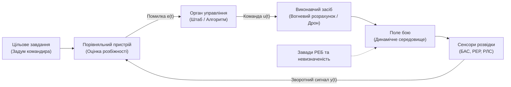
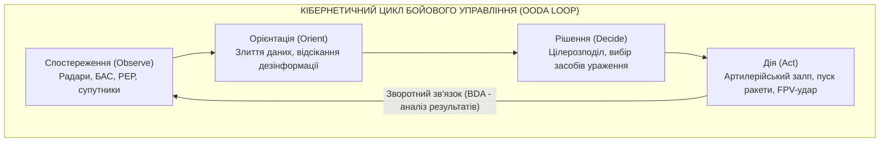
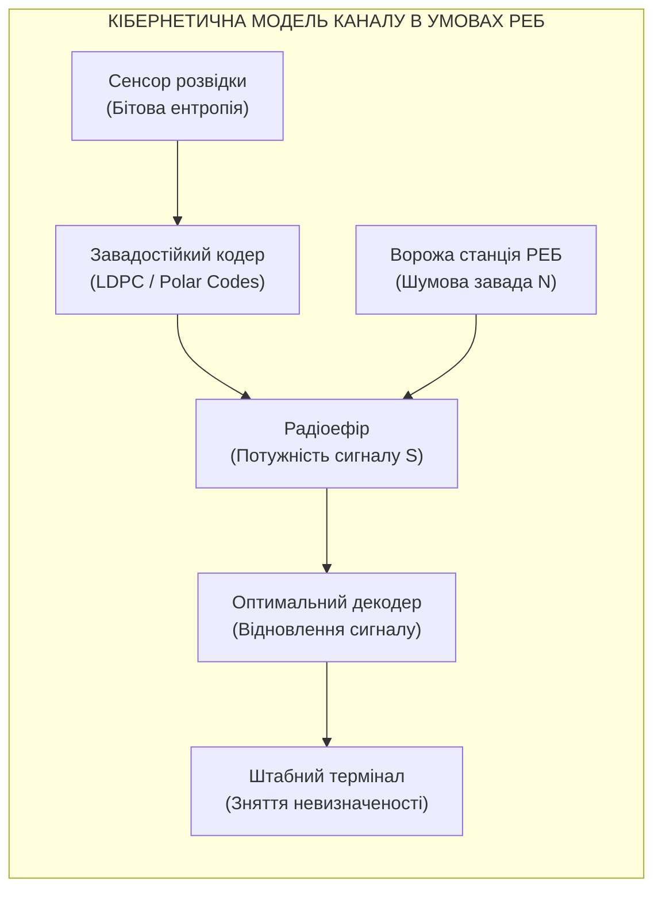

# Розділ 1. Військова кібернетика: теорія керування, зворотний зв'язок та генезис

> **Монографія:** [Військова Кібернетика початку XXI століття](README.md) · [Частина I: Фундамент і спадковість](README.md#частина-i-фундамент-і-спадковість)  
> **Попередній розділ:** [← До Частини I (Зміст)](README.md#частина-i-фундамент-і-спадковість)  
> **Наступний розділ:** [Розділ 2. Українська військова кібернетика: від КВІРТУ ППО до цифрових систем управління →](Ukrainian-Military-Cybernetics-School-UA.md)  
> **Зміст монографії:** [README.md](README.md)  
> **Автор:** [Микола Федчик (Mykola Fedchyk)](../ExpertSystem/book/about-the-author.md) · [LinkedIn](https://www.linkedin.com/in/nickfedchik/)  
> **Пов'язана монографія:** [«Експертні системи: інженерія знань, нейросимволічні архітектури та доказовий ШІ»](../ExpertSystem/book/README.md)

---

Коли на початку XXI століття говорять про трансформацію війни, зазвичай називають видимі інструменти: безпілотні літальні апарати, системи супутникового зв'язку, тепловізійні приціли чи планшети артилеристів. Проте самі по собі прилади, навіть найдосконаліші, не забезпечують перемоги. Військовий результат визначає здатність пов'язати розрізнені сенсори, вогневі розрахунки, штаби та логістику в стійку систему, яка випереджає супротивника в ухваленні рішень.

Ця дисципліна називається **військовою кібернетикою**. Вона розглядає бойові дії не як хаотичне зіткнення мас і калібрів, а як динамічне протиборство систем управління в умовах жорсткої радіоелектронної протидії, шумів, дефіциту часу та невизначеності.

---

## 1. Сутність кібернетики: зворотний зв'язок проти ентропії поля бою

Будь-яка складна діяльність без постійного контролю результатів деградує і розвалюється. У воєнній історії цей феномен відомий як «туман війни» (термін Карла фон Клаузевіца): плани штабів втрачають актуальність у перші ж хвилини реального бою. Якщо підрозділ отримує наказ і йде в бій без надійного передавання інформації про зміну обстановки, виникає некерований процес. Гармати б'ють по порожніх квадратах, резерви висуваються на вже втрачені рубежі, а командир командує підрозділами, яких більше немає на мапі.

Класична кібернетика, заснована Норбертом Вінером, запропонувала розв'язання цієї проблеми через принцип **зворотного зв'язку**. Замість сліпого виконання жорсткої програми система постійно вимірює розбіжність між поточним станом об'єкта та бажаною метою, обчислює помилку і вносить коригувальну дію:

$$e(t) = r(t) - y(t)$$

де:

- $r(t)$ — заданий цільовий стан (наприклад, рубіж оборони або маршрут коридору польоту);
- $y(t)$ — виміряний сенсорами фактичний стан системи;
- $e(t)$ — поточна неузгодженість (помилка наведення, відхилення від графіка операції тощо).

Якщо замкнений ланцюг зворотного зв'язку описується передатною функцією прямого каналу $W_{fw}(s)$ та ланцюга спостереження $W_{fb}(s)$, то загальна передатна функція замкненої системи керування становить:

$$W_{sys}(s) = \frac{W_{fw}(s)}{1 + W_{fw}(s) W_{fb}(s)}$$

Ця математична залежність доводить ключовий кібернетичний закон: поведінка складної системи визначається не потужністю виконавчих органів $W_{fw}(s)$, а характеристиками зворотного зв'язку $W_{fb}(s)$. Якщо сенсори передають спотворені дані або запізнюються, знаменник $1 + W_{fw}(s) W_{fb}(s)$ наближається до нуля. Система втрачає стабільність, починає неконтрольовано розгойдуватися і зазнає катастрофічного самозбудження.

---

## 2. Військова кібернетика проти кібербезпеки: різниця масштабів і задач

В інженерній та навколовійськовій спільноті нерідко виникає плутанина, коли поняття «кібернетика» зводять виключно до «кібербезпеки». Фахівці починають говорити про антивірусні сканери, міжмережеві екрани, парольні політики або патчі для операційних систем.

Кібербезпека є вкрай важливим, але суто захисним і допоміжним напрямом. Вона відповідає на вузьке технічне питання: *«Як зберегти конфіденційність, цілісність і доступність цифрових каналів від несанкціонованого проникнення противника?»*. Проте захищений комп'ютер у захищеному бліндажі не гарантує перемоги, якщо рішення приймаються повільно, а розвіддані суперечать одне одному.

Військова кібернетика вирішує завдання вищого системного рівня: *«Як організувати взаємодію розвідки, штабів, зброї та зв'язку, щоб уражати цілі швидше, точніше й надійніше за ворога?»*.

Найвідомішим практичним вираженням військової кібернетики став цикл Джона Бойда — концепція OODA (Observe — Orient — Decide — Act):

1. **Observe (Спостереження):** збір первинних даних з поля бою.
2. **Orient (Орієнтація):** фільтрація завад, перевірка джерел на достовірність і побудова карти оперативної обстановки.
3. **Decide (Рішення):** комбінаторний розподіл сил і засобів за критерієм мінімізації часу та втрат.
4. **Act (Дія):** фізичне нанесення удару або маневр сил.

Якщо тривалість власного повного циклу управління позначити як $\tau_{own}$, а тривалість ворожого циклу як $\tau_{enemy}$, то кібернетична умова домінування формулюється математично:

$$\tau_{own} < \tau_{enemy}$$

Якщо ця нерівність виконується стабільно, супротивник змушений ухвалювати рішення на основі інформації про минуле. Кожен його наступний крок спрямований на протидію тим загрозам, яких уже немає, що призводить до паралічу його системи бойового управління.

---

## 3. Динаміка запізнення інформації: критичний часовий поріг стійкості

Найбільш підступний ворог системи бойового управління — це не завади РЕБ, а часова затримка передавання сигналів. На практиці це виглядає так: розвідувальний безпілотник виявив ворожу САУ о 12:00. Оператор передав координати до аналітичного центру, звідти вони пішли черговому офіцеру, потім командувачу артилерії, далі комбату і командиру гармати. Постріл пролунав о 12:18. Але ворожа самохідка залишає вогневу позицію за 90 секунд після завершення залпу. Снаряди влучають у порожнє місце.

Чому затримка призводить до катастрофи математично? Розглянемо найпростішу динамічну модель виправлення помилки наведення або ліквідації тактичного відставання з чистим запізненням $\tau$:

$$\frac{d x(t)}{d t} = -a \, x(t - \tau)$$

де:

- $x(t)$ — відхилення системи від мети в момент часу $t$;
- $a > 0$ — коефіцієнт інтенсивності реагування штабу чи системи управління;
- $\tau$ — сумарний час затримки сигналу (час проходження радіоканалу, час дешифрування відео, час ухвалення рішення).

Характеристичне рівняння цього диференціального рівняння має вигляд:

$$s + a \, e^{-s \tau} = 0$$

Підставляючи граничне значення на межі стійкості $s = j \omega$, отримуємо систему для дійсної та уявної частин:

$$\omega = a \sin(\omega \tau), \quad a \cos(\omega \tau) = 0$$

Звідси $\omega \tau = \frac{\pi}{2}$, що визначає гранично допустимий час запізнення в системі:

$$\tau_{crit} = \frac{\pi}{2a}$$

Цей розрахунок дає фундаментальний інженерний висновок: якщо сумарна затримка в циклі зв'язку та рішень перевищує величину $\frac{\pi}{2a}$, система втрачає фазову стійкість. Замість згасання помилки виникають наростаючі автоколивання: підрозділи починають хаотично метушитися між старими й новими наказами, витрачаючи пальне, боєкомплект і сили. Боротьба за скорочення затримки $\tau$ — це серце військової кібернетики.

---

## 4. Інформаційна ентропія бою та передача сигналів під завадами РЕБ

Поле сучасного бою насичене електромагнітними завадами станцій РЕБ, розривами снарядів і суперечливими повідомленнями. Командир, отримуючи десятки неперевірених доповідей, перебуває у стані високої невизначеності.

Клод Шеннон визначив інформацію як зняту невизначеність, пов'язавши її зі статистичною ентропією ймовірнісного розподілу можливих станів обстановки $p_i$:

$$H(X) = - \sum_{i=1}^{n} p_i \log_2 p_i$$

Коли розвіддані відсутні, ентропія максимальна: противник із рівною ймовірністю може атакувати на будь-якому з напрямків. Одне достовірне повідомлення, що підтверджує пересування ворожої колони з імовірністю $p \approx 1$, різко знижує ентропію системи майже до нуля, перетворюючи здогадки на математично обґрунтований розрахунок оборони.

Проте доставлення цього біта інформації відбувається через зашумлений радіоканал. Гранична пропускна здатність каналу зв'язку за теоремою Шеннона-Гартлі становить:

$$C = B \log_2 \left( 1 + \frac{S}{N} \right)$$

де:

- $B$ — ширина смуги частот радіоканалу (Гц);
- $S$ — потужність корисного радіосигналу передавача (Вт);
- $N$ — спектральна потужність шумів та завад ворожого РЕБ (Вт);
- $C$ — максимальна швидкість безпомилкового передавання даних (біт/с).

Якщо ворожа станція РЕБ підвищує рівень завад $N$ у $10^4$ разів (на 40 дБ), співвідношення сигнал/шум $S/N$ прямує до нуля. За формулою Тейлора при $x \to 0$ маємо $\ln(1+x) \approx x$, тому:

$$C \approx B \cdot \frac{S}{N} \cdot \log_2 e \approx 1{,}4427 \cdot B \cdot \frac{S}{N}$$

За таких умов потокове відео високої роздільної здатності передати фізично неможливо — пропускна здатність каналу падає до сотих часток кілобіта на секунду.

Кібернетичне вирішення цієї проблеми полягає в перенесенні обчислень ближче до сенсора: бортовий мікрокомп'ютер дрона або станції РТР повинен локально розпізнати ціль і передати через заглушений ефір не гігабайти відеопотоку, а коротке текстове повідомлення обсягом 64 байти (тип цілі, координати, час, рівень достовірності). Навіть за умов катастрофічного придушення ефіру 64 байти успішно долають заваду, гарантуючи виконання бойового завдання.

---

## 5. Український кібернетичний генезис: спадщина Віктора Глушкова

Широко поширена хибна думка, ніби цифровізація Збройних Сил України почалася стихійно лише у 2022 році завдяки ентузіазму волонтерів і закупівлям цивільних дронів. Насправді підґрунтя для цього формувалося десятиліттями у межах всесвітньо визнаної української кібернетичної школи.

Фундатором вітчизняної школи кібернетики став академік Віктор Михайлович Глушков (1923–1982), засновник Інституту кібернетики Академії наук України. Саме в Києві ще у 1950–1960-х роках було закладено базові наукові принципи:

- **Теорія дискретних перетворювачів і цифрових автоматів:** математичне обґрунтування того, як дискретні схеми можуть моделювати складні логічні процеси мислення та управління.
- **Концепція ОГАС (Загальнодержавна автоматизована система обліку та обробки інформації):** проєкт розподіленої комп'ютерної мережі для обробки даних у реальному часі задовго до появи комерційного інтернету.
- **ЕОМ серії «Київ», «Дніпро», «МИР»:** перші вітчизняні машини для інженерних розрахунків та автоматизації управління складними технологічними й військовими об'єктами.

Глушков розглядав кібернетику не просто як програмування, а як інструмент посилення інтелектуальних можливостей людини. У його концепції обчислювальна машина виступала не заміною особи, що приймає рішення, а інтелектуальним партнером, здатним аналізувати мільйони варіантів обстановки, відсікати завідомо програшні сценарії та пропонувати оптимальні рішення.

Ця наукова традиція створила в Україні критичну масу математиків, системних аналітиків, схемотехніків та інженерів зв'язку, які розуміли природу великих систем задовго до термінів Big Data чи Cloud Computing.

---

## 6. Ризики кібернетизації: від візуалізації до доказовості рішень

Швидке насичення військ цифровими технологіями несе системні ризики, про які інженер зобов'язаний пам'ятати:

1. **«Культ інтерфейсу»:** яскрава цифрова мапа на планшеті створює ілюзію повного контролю. Якщо координати на мапі не мають позначки джерела та часу актуальності, командир бачить не реальність, а кольорову ілюзію.
2. **«Культ генеративного ШІ»:** спроби застосовувати непрозорі нейромережі типу «чорна скринька» для автоматичного вибору цілей загрожують трагічними помилками (ураженням дружніх сил чи цивільних об'єктів). Імовірнісна перцепція повинна суворо обмежуватися детермінованими правилами перевірки.
3. **Фрагментація рішень:** поява десятків несумісних між собою волонтерських або комерційних програмних продуктів створює інформаційний хаос у штабах замість єдиного операційного поля.
4. **Централізація без права на деградацію:** якщо цифрова система розрахована виключно на наявність супутникового інтернету та віддалених серверів, вона перетворюється на тягар у разі застосування ворогом засобів глушіння зв'язку.

Кібернетична дисципліна вимагає, щоб кожен елемент системи мав математично обґрунтовану модель автономної роботи при відмові зовнішніх зв'язків.

---

## Підсумок

Військова кібернетика — це не набір приладів чи серверів, а теорія і практика управління протиборством систем. Вона доводить:

- Перемога здобувається не масою заліза, а мінімізацією часу в замкненій петлі зворотного зв'язку $\tau_{own} < \tau_{enemy}$.
- Запізнення передавання інформації руйнує стійкість системи бойового управління, викликаючи хаос і зрив наведення.
- В умовах ворожого РЕБ перемагає той, хто стискає інформацію до критично важливих бітів знань на рівні сенсора.

Як ці теоретичні засади були перенесені з академічних аудиторій у реальні зенітно-ракетні комплекси, радіолокаційні станції та сучасні польові цифрові системи українського війська, розглянуто у наступному розділі.

---

## Посилання

- Вінер Н. *Кібернетика, або керування і зв'язок у тварині та машині*. — М.: Радянське радіо, 1958.
- Глушков В. М. *Вступ до кібернетики*. — К.: Видавництво АН УРСР, 1964.
- Шеннон К. *Математична теорія зв'язку* // Роботи з теорії інформації та кібернетики. — М.: ІЛ, 1963.
- Boyd, John R. *The Essence of Winning and Losing*. Unpublished lecture notes, 1996.
- [Війська зв'язку та кібербезпеки Збройних Сил України — Міністерство оборони України](https://mod.gov.ua/pro-nas/vijska-zv-yazku-ta-kiberbezpeki)
- [Інститут кібернетики імені В. М. Глушкова НАН України](https://incyb.kiev.ua/)

---

[← До Частини I (Зміст)](README.md#частина-i-фундамент-і-спадковість) | [Зміст монографії](README.md) | [Розділ 2. Українська військова кібернетика: від КВІРТУ ППО до цифрових систем управління →](Ukrainian-Military-Cybernetics-School-UA.md)
