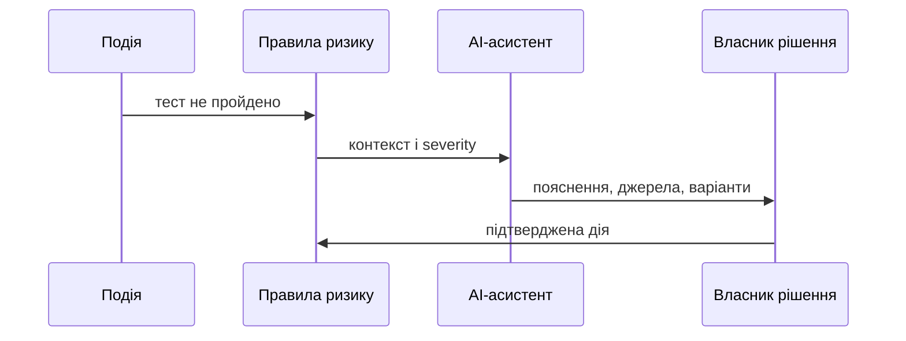

# AI-асистент і подієве управління: від чату про статус до своєчасної дії

Чат-інтерфейс зручний, але сам по собі він не знає, яка затримка загрожує інтеграції, а який дефект — лише локальна незручність. Цінність AI для PM з’являється, коли він працює поруч із контекстом: подіями, вимогами, залежностями, ризиками, версіями та відповідальними ролями.

## Подія — не ще одне сповіщення

Подією може бути зміна вимоги, невдалий тест, затримка supplier-а, перевищення бюджету або конфлікт версій. Перш ніж повідомляти людину, система має зв’язати її з контекстом і оцінити серйозність. Інакше alerting перетворюється на шум. Корисна оцінка може враховувати критичність, терміновість і радіус впливу: $S=C\times U\times B$. Ваги й пороги визначає команда, а не модель.

Асистент може підготувати status, знайти зміни без owner-а, пояснити розбіжність між планом і фактом або запропонувати питання для CCB. Він не має самостійно переносити віхи, закривати ризики чи публікувати статус. Його output — перевірювана чернетка: джерела, час зрізу, припущення, рівень впевненості й чітке «потрібне рішення людини».

Почніть з одного повторюваного сценарію, наприклад реакції на падіння критичного тесту. Якщо він скорочує час від події до зрозумілої дії, а не просто пише приємні підсумки, AI справді стає частиною управління.
