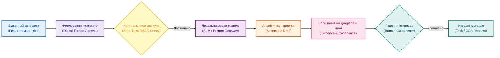

# ШІ-асистент для керівника проєкту: чому одного вікна чату замало

**Автор:** [Микола Федчик (Mykola Fedchyk)](book/about-the-author.md) · [LinkedIn](https://www.linkedin.com/in/nickfedchik/) · [GitHub](https://github.com/nick-fedchik)

---

## Вступ

**Мета статті:** дослідити інженерну архітектуру та користувацькі патерни контекстного ШІ-асистента керівника інженерного проєкту (*Contextual AI Assistant*), який інтегрований безпосередньо у робочі сутності (ризики, віхи, вимоги), замінюючи примітивне діалогове вікно автоматичною генерацією перевірних аналітичних чернеток.

**Технологічна проблема, яка вирішується:** ізольований чат-інтерфейс (чат-бот) вимагає від менеджера щоразу вручну копіювати або довго описувати поточний контекст розробки: назву модуля, ревізію плати, статус тестів та перелік залежностей. У напруженій повсякденній роботі на це немає часу, тому чат швидко зводиться до ролі секретарського інструменту редагування текстів. Стаття показує, як побудувати контекстну бічну панель, яка самостійно зчитує цифрову нитку відкритого артефакту, підсвічує приховані ризики та пропонує готові варіанти дій із посиланнями на першоджерела.

---

## Чому чат-інтерфейс корисний, але принципово недостатній

Головна вада звичайного чат-бота полягає у високому когнітивному навантаженні на користувача для введення контексту.

Коли керівник проєкту відкриває порожнє вікно чату, він змушений виконувати роботу системного аналітика: згадувати, який мікроконтролер використовується, яка ревізія базової лінії зараз діє, які тести провалилися вчора і які вимоги замовника зачеплені. Якщо менеджер забуде вказати хоча б один критичний факт, мовна модель згенерує правдоподібну, але небезпечну відповідь. У результаті чат-боти використовують переважно для другорядних завдань: скласти ввічливий лист замовнику або перефразувати опис завдання.

Контекстний асистент працює принципово інакше. Він функціонує як інтелектуальна бічна панель робочої системи: коли менеджер відкриває картку ризику або календарну віху, асистент уже знає повний граф зв'язків цього артефакту, його історію змін та залежні компоненти.

Користувач не витрачає час на формулювання довгих запитів: система сама пропонує аналітичний коментар до того, що зараз відкрито на екрані.

```mermaid
flowchart LR
    accTitle: Архітектура контекстного ШІ-асистента
    accDescr: Відкритий інженерний артефакт автоматично підтягує права доступу та цифрову нитку для формування перевірної чернетки.

    ART["Відкритий артефакт<br/>(Ризик, вимога, віха)"] --> CTX["Формування контексту<br/>(Digital Thread Context)"]
    CTX --> RBAC{"Контроль прав доступу<br/>(Zero-Trust RBAC Check)"}
    RBAC -->|Дозволено| LLM["Локальна мовна модель<br/>(SLM / Prompt Gateway)"]
    LLM --> DRF["Аналітична чернетка<br/>(Actionable Draft)"]
    DRF --> SRC["Посилання на джерела й межі<br/>(Evidence & Confidence)"]
    SRC --> GATE{"Рішення інженера<br/>(Human Gatekeeper)"}
    GATE -->|Схвалено| ACT["Управлінська дія<br/>(Task / CCB Request)"]

    classDef art fill:#e3f2fd,stroke:#1565c0,stroke-width:2px,color:#0d47a1;
    classDef ctx fill:#ede7f6,stroke:#512da8,stroke-width:2px,color:#311b92;
    classDef rbac fill:#fff9c4,stroke:#fbc02d,stroke-width:2px,color:#f57f17;
    classDef llm fill:#f3e5f5,stroke:#7b1fa2,stroke-width:2px,color:#4a148c;
    classDef drf fill:#fff3e0,stroke:#e65100,stroke-width:2px,color:#bf360c;
    classDef src fill:#fce4ec,stroke:#c2185b,stroke-width:2px,color:#880e4f;
    classDef gate fill:#e0f2f1,stroke:#00796b,stroke-width:2px,color:#004d40;

    class ART art;
    class CTX ctx;
    class RBAC rbac;
    class LLM llm;
    class DRF drf;
    class SRC src;
    class GATE,ACT gate;
```

*Контекстний асистент не вимагає ручного переказу ситуації: він аналізує відкриту сутність із дотриманням суворих прав доступу.*

## Математичне моделювання достовірності контекстної рекомендації

Для безпечного практичного застосування штучного інтелекту будь-яка згенерована порада повинна мати вимірюваний індекс доказової достовірності.

Управлінське рішення не може спиратися на текст без підтверджених джерел. Розглянемо метрику надійності контекстної рекомендації $R_{\text{assist}}$:

$$R_{\text{assist}} = \left(\frac{1}{N} \sum_{i=1}^{N} w_i \cdot \mathbb{I}_{\text{source}}(s_i) \cdot \left(1 - P_{\text{hallucination}, i}\right)\right) \cdot \prod_{j=1}^{K} \mathbb{I}_{\text{access}}(p_j)$$

**Тут:**
- $R_{\text{assist}}$ є інтегральним коефіцієнтом достовірності рекомендації асистента (безрозмірна величина в межах $[0; 1]$).
- $N$ є кількістю фактичних тверджень у згенерованій відповіді (ціле додатне число).
- $w_i$ є вагою важливості $i$-го твердження, де $\sum w_i = 1{,}0$.
- $\mathbb{I}_{\text{source}}(s_i)$ є індикатором прямої прив'язки твердження до первинного артефакту цифрової нитки: $1$, якщо факт підтверджено посиланням на конкретний лог, тест чи вимогу, і $0$, якщо твердження висловлене без посилання.
- $P_{\text{hallucination}, i}$ є розрахованою ймовірністю галюцинації або непідтвердженої інтерполяції для даного фрагмента ($P_{\text{hallucination}} \in [0; 1)$).
- $K$ є кількістю перевірок політик безпеки та розмежування прав доступу (RBAC).
- $\mathbb{I}_{\text{access}}(p_j)$ є бінарним індикатором дотримання конфіденційності: $1$, якщо користувач має право переглядати задіяний артефакт, і $0$, якщо виявлено спробу витоку даних із закритого відсіку проєкту.

**Навчальний числовий приклад:**
Асистент згенерував аналіз ризику зриву віхи з трьох тверджень:
1. Твердження 1 (про затримку постачальника плати): підтверджено офіційним листом ($w_1 = 0{,}4, \mathbb{I}_{\text{source}} = 1, P_{\text{hallucination}} = 0{,}05$).
2. Твердження 2 (про відпустку провідного інженера): підтверджено графіком відпусток ($w_2 = 0{,}3, \mathbb{I}_{\text{source}} = 1, P_{\text{hallucination}} = 0{,}02$).
3. Твердження 3 (припущення, що клієнт погодиться на зміщення строку): нічим не підтверджене міркування моделі ($w_3 = 0{,}3, \mathbb{I}_{\text{source}} = 0, P_{\text{hallucination}} = 0{,}80$).
Усі права доступу перевірені та підтверджені ($\prod \mathbb{I}_{\text{access}} = 1$).

Розрахуємо достовірність рекомендації:

$$R_{\text{assist}} = \left(0{,}4 \cdot 1 \cdot 0{,}95 + 0{,}3 \cdot 1 \cdot 0{,}98 + 0{,}3 \cdot 0 \cdot 0{,}20\right) \cdot 1 = 0{,}380 + 0{,}294 + 0 = 0{,}674 \quad (67{,}4\%)$$

Розрахунок чітко показує: наявність непідтвердженого припущення знизила надійність висновку з 97% до 67%. Система інформує керівника: твердження щодо згоди клієнта є гіпотезою, а не фактом, що захищає менеджера від передчасних заспокійливих заяв.

## Які аналітичні підказки справді допомагають інженерному керівнику

Керівники технічних проєктів щодня бачать десятки числових статусів, проте не завжди мають достатньо часу для швидкої оцінки їхніх прихованих наслідків.

Керівник відкриває перелік відкритих дефектів і бачить число 14. Це число саме по собі ні про що не говорить: чи блокують ці дефекти випробування безпеки, чи зачіпають вони постачальників і скільки тижнів займе виправлення? Контекстний асистент на базі штучного інтелекту закриває саме цю інформаційну прірву, виступаючи уважним технічним консультантом:
- **Аналіз ризику:** «Оцінка загрози зросла з 6 до 15 балів через затримку відвантаження дослідних плат постачальником. У минулому проєкті аналогічна затримка призвела до зриву калібрування сенсорів на півтора місяця».
- **Аналіз віхи:** «Випуск версії блокується трьома критичними задачами. Дві з них призначені на одного провідного розробника, який перебуває у відпустці. Рекомендовано перерозподілити задачі або ініціювати розгляд на раді контролю змін (CCB)».
- **Аудит специфікації:** «Вимога містить розпливчасте слово "бажано", не має кількісного критерію приймання та дублює положення специфікації REQ-104».
- **Діагностика метрик:** «Рівень витоку дефектів зріс на 18% після оновлення версії криптографічної бібліотеки; рекомендовано провести цільову регресію шини зв'язку».

Магії тут немає: працює алгоритмічна агрегація фактів цифрової нитки, яка подається людині в момент ухвалення рішення.

## Асистент як семантичний перекладач між інженерними ролями

Особливою цінністю асистента є здатність забезпечувати взаєморозуміння між фахівцями різного профілю без виснажливих узгоджувальних нарад.

Керівник проєкту не зобов'язаний пам'ятати найменування регістрів мікроконтролера, а системний програміст не повинен заглиблюватися в комерційні умови контрактів. Асистент виконує точний контекстний переклад:
- Пояснює керівнику бізнес-наслідки специфічної помилки переривання шини CAN.
- Роз'яснює розробнику коду, чому певний пункт регуляторного стандарту вимагає збереження логів компілятора.
- Формує вичерпне резюме для замовника зрозумілою діловою мовою, виключаючи незрозумілий внутрішній жаргон команд.

Такий контекстний міст заощаджує години робочого часу, знижуючи рівень стресу на крос-функціональних зустрічах.

## Чого категорично не можна дозволяти штучному інтелекту

Незважаючи на високу аналітичну ефективність, існують непорушні межі допуску алгоритмів до управління проєктом.

Головні правила безпеки:
1. **Людина в контурі рішення (Human-in-the-Loop):** штучний інтелект не має права автоматично змінювати статус проєкту, закривати дефекти, погоджувати тимчасові відхилення (*Waivers*) чи модифікувати базову лінію плану. Асистент готує проєкт резолюції, але підпис ставить виключно уповноважена особа.
2. **Невідмовна верифікація першоджерел:** кожна згенерована теза повинна супроводжуватися клікабельним посиланням на конкретний протокол, коміт або вимогу. Якщо джерело неможливо перевірити, рекомендація відхиляється.
3. **Ізоляція закритого периметра:** у регульованих та оборонних проєктах (MilTech) обробка даних здійснюється виключно локальними моделями (SLM) без виходу в зовнішні хмарні сервіси.

Дотримання цих правил гарантує, що штучний інтелект слугуватиме інструментом підвищення продуктивності, а не джерелом юридичних чи технічних катастроф.

## Практичні критерії вимірювання користі

Оцінювати користь асистента слід не за кількістю згенерованих сторінок тексту, а за скороченням часу реакції організації на технічні кризи.

Дієві індикатори ефективності:
- Скорочення тривалості підготовки досьє для ради контролю змін (CCB) із двох днів до однієї години.
- Зменшення кількості неперевірених вимог, виявлених на стадії пізнього тестування.
- Швидкість пошуку первинного протоколу випробувань під час аудиту замовника (менше 60 секунд).
- Рівень сприйняття інструменту технічними скептиками та провідними архітекторами.

Коли досвідчені інженери добровільно використовують бічну панель асистента для самоперевірки вимог перед комітом, це слугує найвищою оцінкою успішності впровадження.

---

## Висновки

1. Ізольований чат-інтерфейс у проєктному менеджменті є неефективним, оскільки вимагає постійного ручного опису контексту, зводячи роль штучного інтелекту до примітивного редагування текстів.
2. Справжня цінність полягає в інтеграції контекстного асистента безпосередньо в картки ризиків, вимог і віх, де він автоматично зчитує цифрову нитку відкритого артефакту.
3. Достовірність рекомендацій асистента повинна контролюватися математичною метрикою з нульовою толерантністю до бездоказових галюцинацій та порушень прав доступу.
4. Штучний інтелект ефективно усуває міждисциплінарні розриви, здійснюючи точний семантичний переклад між технічними фактами розробників та бізнес-пріоритетами керівництва.
5. Відповідальність за ухвалення рішень завжди залишається виключно людською: асистент готує перевірні чернетки, але затвердження планів і компромісів є прерогативою інженерних лідерів.

---

## Посилання

1. NIST AI 600-1. *Artificial Intelligence Risk Management Framework: Generative Artificial Intelligence Profile*. National Institute of Standards and Technology, Gaithersburg, MD, 2024. [https://doi.org/10.6028/NIST.AI.600-1](https://doi.org/10.6028/NIST.AI.600-1)
2. ISO 21502:2020. *Project, programme and portfolio management — Guidance on project management*. International Organization for Standardization, Geneva, Switzerland. [https://www.iso.org/standard/74947.html](https://www.iso.org/standard/74947.html)
3. OWASP Top 10 for Large Language Model Applications. *OWASP Foundation*, 2025. [https://owasp.org/www-project-top-10-for-large-language-model-applications/](https://owasp.org/www-project-top-10-for-large-language-model-applications/)
4. Russell, S., Norvig, P. *Artificial Intelligence: A Modern Approach*. 4th Edition. Pearson, 2020.
5. Kerzner, H. *Project Management: A Systems Approach to Planning, Scheduling, and Controlling*. 13th Edition. John Wiley & Sons, 2022.

---

## Терміни

- **Галюцинація моделі (Model Hallucination)**: генерація великою мовною моделлю синтаксично правильного, але фактично хибного або не підтвердженого першоджерелами твердження.
- **Заземлення на знання (Grounding)**: технологія прив'язки генерації мовної моделі до верифікованих первинних артефактів цифрової нитки та корпоративної бази знань.
- **Контекстний асистент (Contextual AI Assistant)**: інтелектуальний помічник, що самостійно отримує параметри та зв'язки відкритого на екрані інженерного об'єкта без необхідності ручного введення промпта.
- **Людина в контурі (Human-in-the-Loop, HITL)**: архітектурний принцип проєктування автоматизованих систем, за якого критичні управлінські та технічні рішення ухвалюються виключно людиною.
- **Рольовий контроль доступу (Role-Based Access Control, RBAC)**: політика безпеки, що обмежує доступ користувачів та алгоритмів ШІ лише тими даними, які необхідні для виконання їхніх посадових обов'язків.

---

## Скорочення

- **ADR**: Architecture Decision Record (журнал архітектурних рішень)
- **CAN**: Controller Area Network (бортова мережа контролерів)
- **CCB**: Change Control Board (рада контролю змін)
- **HIL**: Hardware-in-the-Loop (апаратно-програмне моделювання на фізичному стенді)
- **HITL**: Human-in-the-Loop (людина в контурі керування)
- **ISO**: International Organization for Standardization (Міжнародна організація зі стандартизації)
- **NIST**: National Institute of Standards and Technology (Національний інститут стандартів і технологій США)
- **PM**: Project Manager (керівник проєкту)
- **RAG**: Retrieval-Augmented Generation (генерація з пошуком по джерелах)
- **RBAC**: Role-Based Access Control (рольове розмежування доступу)
- **SLM**: Small Language Model (компактна мовна модель)

---

## Про автора

**Микола Федчик (Mykola Fedchyk)**: український інженер, системний архітектор та дослідник у галузі кіберфізичних комплексів, доказового штучного інтелекту та критичних вбудованих систем. Понад двадцять років керує інженерними розробками та проєктуванням складних апаратно-програмних комплексів у сфері мережевої безпеки, телекомунікацій та автомобільної електроніки відповідно до вимог міжнародних стандартів ISO 26262 та ISO/SAE 21434. Досліджує практичне застосування експертних систем, семантичних онтологій та цифрової нитки для управління складними інженерними програмами.

Детальніша інформація: [Про автора](book/about-the-author.md) · [LinkedIn](https://www.linkedin.com/in/nickfedchik/) · [GitHub](https://github.com/nick-fedchik)
