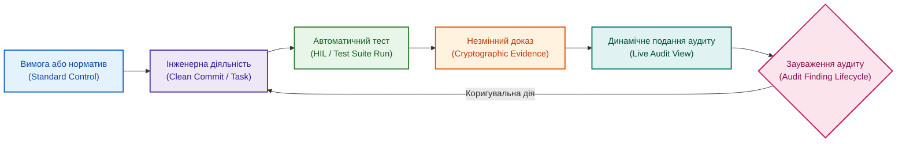

# Готовність до аудиту за замовчуванням: як система збирає докази постійно

**Автор:** [Микола Федчик (Mykola Fedchyk)](book/about-the-author.md) · [LinkedIn](https://www.linkedin.com/in/nickfedchik/) · [GitHub](https://github.com/nick-fedchik)

---

## Вступ

**Мета статті:** обґрунтувати концепцію готовності до аудиту за замовчуванням (*Audit-Ready by Design*), за якої інженерна система безперервно генерує, перевіряє та зберігає незмінні регуляторні докази у процесі щоденної розробки, перетворюючи зовнішній аудит на швидку та передбачувану процедуру.

**Технологічна проблема, яка вирішується:** у більшості інженерних підприємств підготовка до сертифікаційного аудиту перетворюється на виснажливий кількамісячний проєкт із ручного пошуку звітів, узгодження версій та відновлення логіки прийнятих рішень. Така ручна реконструкція відволікає провідних розробників від створення продукту і не гарантує захисту від виявлення критичних невідповідностей. Стаття показує, як замінити передсертифікаційний стрес автоматизованою фіксацією артефактів цифрової нитки.

---

## Чому традиційна підготовка до аудиту стає стресовою кризою

Головна проблема полягає в тому, що регуляторні докази сприймаються як разовий звіт, а не як обов'язковий атрибут кожного робочого продукту.

У типовій організації дані розкидані по ізольованих сховищах: вимоги зафіксовані в одній базі, результати випробувань у другій, звіти про виправлення дефектів у третій, а листи з погодженнями постачальників губляться у поштових скриньках менеджерів. За кілька тижнів до приїзду сертифікаційної комісії оголошується аврал: інженери експортують таблиці, зводять версії файлів вручну та намагаються згадати, чому пів року тому було відхилено певний тест.

Такий підхід формує викривлену культуру: замість забезпечення реальної безпеки виробу команда зосереджується на створенні правдоподібної паперової видимості контролю.

Готовність до аудиту за замовчуванням передбачає, що будь-який інженерний артефакт народжується разом із криптографічно підтвердженим доказом його валідності.

*Пакет для аудиту не створюється з нуля, а є динамічним поданням поточної цифрової нитки проєкту.*

## Математичне моделювання рівня готовності до аудиту

Для об'єктивного вимірювання аудитопридатності процесу необхідно формалізувати індекс готовності на основі повноти доказів та щільності відкритих зауважень.

Нехай сертифікаційний профіль виробу вимагає виконання $N_{\text{ctrl}}$ обов'язкових пунктів стандарту (*Controls*). Загальний індекс готовності до аудиту $A_{\text{ready}}$ обчислюється як зважена сума виконання вимог із урахуванням наявності незакритих коригувальних дій:

$$A_{\text{ready}} = \frac{1}{N_{\text{ctrl}}} \sum_{i=1}^{N_{\text{ctrl}}} \left( \min\left(1{,}0, \; \frac{E_{\text{valid},i}}{E_{\text{req},i}}\right) \cdot \left(1 - \frac{F_{\text{open},i}}{F_{\text{thresh}} + 1}\right) \right)$$

**Тут:**
- $A_{\text{ready}}$ є інтегральним індексом готовності виробу до аудиту (безрозмірна величина в межах $[0; 1]$).
- $N_{\text{ctrl}}$ є загальною кількістю обов'язкових регуляторних пунктів стандарту для даного класу виробу (ціле додатне число).
- $E_{\text{valid},i}$ є кількістю чинних, перевірених і криптографічно підписаних артефактів доказів для пункту $i$ (ціле невід'ємне число).
- $E_{\text{req},i}$ є мінімально необхідною кількістю доказів для повного закриття пункту $i$ відповідно до вимог стандарту (ціле додатне число).
- $F_{\text{open},i}$ є кількістю відкритих незакритих зауважень попередніх аудитів для даного пункту (ціле невід'ємне число).
- $F_{\text{thresh}}$ є критичним порогом допустимих зауважень (у регульованих безпекових доменах $F_{\text{thresh}} = 0$).

**Навчальний числовий приклад:**
Розглянемо процес сертифікації за стандартом ASPICE для процесу розробки архітектури (SWE.2), що містить $N_{\text{ctrl}} = 3$ ключові вимоги:
1. Вимога декомпозиції (потрібно $E_{\text{req},1} = 2$ докази): підготовлено 2 чинних протоколи ($E_{\text{valid},1} = 2, F_{\text{open},1} = 0$).
   $$\text{Внесок}_1 = \min\left(1, \frac{2}{2}\right) \cdot (1 - 0) = 1{,}0$$
2. Вимога простежуваності (потрібно $E_{\text{req},2} = 4$ докази): надано лише 2 верифіковані матриці ($E_{\text{valid},2} = 2, F_{\text{open},2} = 0$).
   $$\text{Внесок}_2 = \min\left(1, \frac{2}{4}\right) \cdot 1 = 0{,}5$$
3. Вимога верифікації безпеки (потрібно $E_{\text{req},3} = 1$ доказ): надано 1 звіт, але залишається 1 відкрите критичне зауваження при нульовому порозі ($E_{\text{valid},3} = 1, F_{\text{open},3} = 1, F_{\text{thresh}} = 0$).
   $$\text{Внесок}_3 = \min\left(1, \frac{1}{1}\right) \cdot \left(1 - \frac{1}{0 + 1}\right) = 1{,}0 \cdot 0 = 0$$

Підсумковий індекс готовності становить:

$$A_{\text{ready}} = \frac{1}{3} (1{,}0 + 0{,}5 + 0) = \frac{1{,}5}{3} = 0{,}50 \quad (50\%)$$

Формула унеможливлює маніпуляції: наявність навіть одного відкритого критичного зауваження повністю обнуляє відповідний безпековий пункт, знижуючи загальну готовність до 50%, що упереджує вихід на офіційну сертифікацію з невиправленими дефектами.

## Життєвий цикл зауважень та коригувальних дій

Управління виявленими невідповідностями вимагає суворого обліку, інакше зауваження аудиторів повторюватимуться з року в рік.

У незрілій організації список зауважень минулого аудиту перетворюється на забутий файл Excel. У зрілій інженерній моделі кожне зауваження (*Audit Finding*) стає повноцінною сутністю в системі з власним життєвим циклом:
1. Реєстрація контексту: формулювання невідповідності, посилання на пункт стандарту, ступінь критичності та джерело (внутрішній огляд, аудит клієнта чи нагляд сертифікаційного органу).
2. Призначення коригувальної дії (*Corrective Action*): відповідальний інженер, планова дата усунення та обов'язковий аналіз першопричини (*Root Cause Analysis*).
3. Доказ закриття: новий верифікований тест, змінена базова версія вимоги чи затверджене архітектурне рішення (ADR).
4. Верифікація ефективності: повторна перевірка незалежним аудитором перед фінальним закриттям запису.

Коли робота із зауваженнями інтегрована у щоденні інженерні задачі, аудитор бачить здатність організації до самонавчання та усунення системних вад.

## Вбудовування стандартів у повсякденні інструменти розробки

Справжня готовність до аудиту досягається тоді, коли вимоги нормативів перетворюються на правила автоматизованого середовища.

Замість зберігання сотень сторінок стандартів на файловому сервері інженерна організація кодує їх у вигляді правил перевірки:
- Система управління вимогами блокує публікацію специфікації, якщо в ній відсутні критерії приймання або посилання на замовницьку потребу.
- Репозиторій коду вимагає обов'язкового зв'язку кожного запиту на злиття з ідентифікатором затвердженої вимоги.
- Конвеєр CI/CD перевіряє наявність звіту про статичний аналіз коду на відповідність правилам MISRA перед запуском збірки.
- Шлюз випуску забороняє перехід на етап виробництва за наявності хоча б одного незакритого зауваження з безпеки.

Інженери виконують вимоги стандартів природно, просто дотримуючись повсякденних правил робочого інструменту.

## Роль штучного інтелекту: оперативний помічник аудитора

Штучний інтелект у контурі аудиту прискорює пошук фактів і формування обов'язкових звітів, спираючись на структуровані дані.

Локальний асистент на базі мовної моделі вирішує комплекс прикладних завдань:
1. Автоматично генерує чернетку сертифікаційного звіту, витягуючи свіжі посилання на тестові протоколи та хеші збірок.
2. Знаходить прогалини у доказах: підсвічує вимоги без тестів або артефакти, що втратили валідність через оновлення базової лінії.
3. Допомагає відповідати на запитання аудиторів: за лічені секунди знаходить повний ланцюг походження конкретного параметра в коді від початкового технічного завдання клієнта.

При цьому штучний інтелект не підміняє сертифікаційного експерта: остаточне підтвердження відповідності завжди залишається виключною прерогативою уповноважених людей.

## Бенчмарк зрілості: час до надання відповіді (Time-to-Answer)

Найбільш об'єктивним індикатором справжньої готовності до аудиту є швидкість надання вичерпного підтвердженого доказу на запит аудитора.

Якщо на прохання «покажіть протокол випробувань для вимоги безпеки 4.2» команді потрібні години, дзвінки колегам або пошук у старих листах, організація не є готовою до перевірки. У системі, побудованій за принципом Audit-Ready by Design, ця операція триває до 60 секунд: відкривається картка вимоги, з якої за один клік здійснюється перехід до підписаного протоколу з міткою часу та хешем Git.

Така прозорість докорінно змінює хід аудиту, зводячи його до спокійної ділової перевірки актуального стану процесів.

---

## Висновки

1. Готовність до аудиту за замовчуванням (Audit-Ready by Design) усуває виснажливу сезонну «штурмівщину», перетворюючи збір доказів на безперервний побічний продукт інженерної праці.
2. Інтегральний індекс аудитопридатності повинен розраховуватися математично з урахуванням обов'язкового закриття всіх критичних зауважень.
3. Робота із зауваженнями аудиту повинна мати повний життєвий цикл з обов'язковим аналізом першопричин та перевіркою ефективності впроваджених коригувальних дій.
4. Нормативні стандарти мають бути вбудовані у повсякденні інструменти розробки як активні перевірочні правила, а не існувати у вигляді ізольованих PDF-документів.
5. Головним критерієм зрілості комплаєнс-процесу є метрика часу до надання відповіді (Time-to-Answer), яка для будь-якого артефакту не повинна перевищувати кількох хвилин.

---

## Посилання

1. ISO 21502:2020. *Project, programme and portfolio management — Guidance on project management*. International Organization for Standardization, Geneva, Switzerland. [https://www.iso.org/standard/74947.html](https://www.iso.org/standard/74947.html)
2. ISO 21505:2017. *Project, programme and portfolio management — Guidance on governance*. International Organization for Standardization, Geneva, Switzerland. [https://www.iso.org/standard/66166.html](https://www.iso.org/standard/66166.html)
3. ISO 26262-8:2018. *Road vehicles — Functional safety — Part 8: Supporting processes (Clause 13: Functional safety assessment)*. International Organization for Standardization, Geneva, Switzerland. [https://www.iso.org/standard/68387.html](https://www.iso.org/standard/68387.html)
4. Automotive SPICE Process Assessment / Reference Model, PAM v4.0. VDA QMC, 2023.
5. NIST SP 800-160, Vol. 1, Rev. 1. *Engineering Trustworthy Secure Systems*. National Institute of Standards and Technology, Gaithersburg, MD, 2022. [https://doi.org/10.6028/NIST.SP.800-160v1r1](https://doi.org/10.6028/NIST.SP.800-160v1r1)

---

## Терміни

- **Аналіз першопричини (Root Cause Analysis, RCA)**: структурована інженерна методологія встановлення глибинної причини дефекту або невідповідності задля запобігання її повторенню в майбутньому.
- **Готовність до аудиту за замовчуванням (Audit-Ready by Design)**: архітектурний і процесний стан інженерної системи, за якого всі необхідні регуляторні докази формуються автоматично під час виконання щоденних операцій.
- **Зауваження аудиту (Audit Finding)**: зафіксований факт відхилення інженерного процесу або артефакту від вимог чинного нормативного стандарту.
- **Коригувальна дія (Corrective Action)**: регламентований інженерний захід, спрямований на усунення виявленого зауваження та ліквідацію його першопричини.
- **Час до надання відповіді (Time-to-Answer)**: часовий інтервал між моментом надходження запиту аудитора на перевірку конкретного факту та наданням підтвердженого машинного доказу.

---

## Скорочення

- **ADR**: Architecture Decision Record (журнал архітектурних рішень)
- **ASPICE**: Automotive Software Process Improvement and Capability Determination (модель оцінки зрілості процесів розробки)
- **CI/CD**: Continuous Integration / Continuous Delivery (неперервна інтеграція та доставка)
- **HIL**: Hardware-in-the-Loop (апаратно-програмне моделювання на фізичному стенді)
- **ISO**: International Organization for Standardization (Міжнародна організація зі стандартизації)
- **MISRA**: Motor Industry Software Reliability Association (стандарти безпечного програмування)
- **NIST**: National Institute of Standards and Technology (Національний інститут стандартів і технологій США)
- **RCA**: Root Cause Analysis (аналіз першопричин)

---

## Про автора

**Микола Федчик (Mykola Fedchyk)**: український інженер, системний архітектор та дослідник у галузі кіберфізичних комплексів, доказового штучного інтелекту та критичних вбудованих систем. Понад двадцять років керує інженерними розробками та проєктуванням складних апаратно-програмних комплексів у сфері мережевої безпеки, телекомунікацій та автомобільної електроніки відповідно до вимог міжнародних стандартів ISO 26262 та ISO/SAE 21434. Досліджує практичне застосування експертних систем, семантичних онтологій та цифрової нитки для управління складними інженерними програмами.

Детальніша інформація: [Про автора](book/about-the-author.md) · [LinkedIn](https://www.linkedin.com/in/nickfedchik/) · [GitHub](https://github.com/nick-fedchik)
