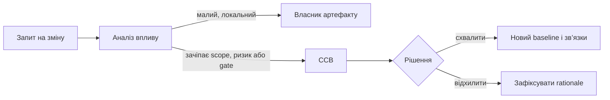

# WBS, baseline і change control: як керувати змінами без ілюзії нерухомого плану

Детальний план дає відчуття контролю, але не робить світ стабільним. У hardware/software програмі змінюються компоненти, прошивка, постачання, результати випробувань і вимоги. Baseline потрібен не для заборони змін, а для чесної відповіді: що саме ми погодили, що відхилилося і чому.

## WBS має розмовляти з інженерією

WBS корисна, коли робота пов’язана з результатом, залежністю, вимогою та критерієм завершення. Вона стає шкідливою, коли дрібні рядки маскують відсутність реального evidence. Замість спроби деталізувати все слід тримати на плані рівень, на якому можна приймати рішення, а технічну деталізацію залишати там, де вона живе: у вимогах, репозиторіях, тестах і конфігураціях.

Вплив зміни — це не лише нова дата. Його можна подати як вектор $\Delta=(\Delta t,\Delta c,\Delta r,\Delta q)$: час, вартість/ресурси, ризик і якість або відповідність. CCB потрібна саме тоді, коли компроміс виходить за межі однієї ролі. Її рішення має містити варіанти, припущення, посилання на зачеплені артефакти й нову базову версію.

Найкращий тест цифрового change control простий: через пів року можна відтворити, що змінилося, хто це дозволив і які тести підтвердили результат. Якщо відповідь залежить від пам’яті одного менеджера, система не контролює зміни — вона лише реєструє їх.
