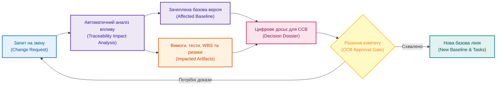

# Базові версії та комітет контролю змін: як не потонути в інженерних модифікаціях

**Автор:** [Микола Федчик (Mykola Fedchyk)](book/about-the-author.md) · [LinkedIn](https://www.linkedin.com/in/nickfedchik/) · [GitHub](https://github.com/nick-fedchik)

---

## Вступ

**Мета статті:** сформувати практичну інженерну модель фіксації базових версій (*Baselines*) та автоматизованого функціонування ради контролю змін (*Change Control Board*, CCB), яка перетворює регуляторний нагляд із бюрократичного гальма на дієвий механізм забезпечення якості.

**Технологічна проблема, яка вирішується:** у більшості технічних організацій базова версія існує суто номінально як статичний PDF-документ або знімок у трекері, склад якого ніхто не може точно відтворити. Засідання комітету змін проводяться на основі суб'єктивних усних доповідей без об'єктивного аналізу впливу на вимоги, тести, сертифікаційні докази та графік. Стаття показує, як побудувати цифровий контур, де пакет на зміну формується автоматично з графа артефактів, а кожне рішення залишає машинно-перевірний слід.

---

## Що саме фіксує базова версія: від статики до живого знімка

Поширена практика вважати базовою версією затверджений файл документації або номер релізу в таск-трекері є джерелом системних помилок.

Справжня базова версія (*Baseline*) є строго відтворюваним станом усього комплексу інженерних артефактів проєкту на визначений момент часу. Вона містить не лише тексти специфікацій, а й точні хеш-суми ревізій вихідного коду, креслення друкованих плат, версії прошивок мікроконтролерів, протоколи проходження верифікаційних випробувань, відкриті ризики та зафіксовані архітектурні рішення. Якщо проєкт заморожує лише PDF-звіт, через пів року розробники не зможуть довести, яка саме версія бібліотеки використовувалася під час сертифікації на електромагнітну сумісність.

Зріла цифрова система дозволяє в будь-яку мить відтворити точний інженерний стан системи: які вимоги вважалися обов'язковими на дату аудиту, які тести підтверджували їхнє виконання та які припущення були закладені в розрахунки надійності.

Базова лінія слугує непорушною точкою відліку, відносно якої вимірюється будь-яке відхилення графіка чи бюджету.

```mermaid
flowchart LR
    accTitle: Процес проходження запиту на зміну через раду контролю змін
    accDescr: Від запиту на зміну через автоматизований аналіз впливу до затвердження нової базової лінії.

    CR["Запит на зміну<br/>(Change Request)"] --> I["Автоматичний аналіз впливу<br/>(Traceability Impact Analysis)"]
    I --> B["Зачеплена базова версія<br/>(Affected Baseline)"]
    I --> T["Вимоги, тести, WBS та ризики<br/>(Impacted Artifacts)"]
    B --> P["Цифрове досьє для CCB<br/>(Decision Dossier)"]
    T --> P
    P --> D{"Рішення комітету<br/>(CCB Approval Gate)"}
    D -->|Схвалено| NB["Нова базова лінія<br/>(New Baseline & Tasks)"]
    D -->|Потрібні докази| CR

    classDef cr fill:#e3f2fd,stroke:#1565c0,stroke-width:2px,color:#0d47a1;
    classDef ana fill:#ede7f6,stroke:#512da8,stroke-width:2px,color:#311b92;
    classDef art fill:#fff3e0,stroke:#e65100,stroke-width:2px,color:#bf360c;
    classDef dos fill:#fce4ec,stroke:#c2185b,stroke-width:2px,color:#880e4f;
    classDef gate fill:#fff9c4,stroke:#fbc02d,stroke-width:2px,color:#f57f17;
    classDef out fill:#e0f2f1,stroke:#00796b,stroke-width:2px,color:#004d40;

    class CR cr;
    class I,B ana;
    class T art;
    class P dos;
    class D gate;
    class NB out;
```

*Рішення ради контролю змін спирається на машинно-згенероване досьє впливу та автоматично створює нову версію базової лінії.*

## Чому зміни треба контролювати: захист від некерованого дрейфу

Відсутність суворого контролю змін неминуче перетворює навіть найкраще спланований проєкт на некерований процес із непередбачуваним результатом.

Головна функція контролю змін (*Change Control*) полягає у розмежуванні усвідомленої модифікації та стихійного дрейфу вимог (*Scope Creep / Architecture Drift*). Усвідомлена зміна означає, що інженерна група розуміє причину модифікації, оцінила її технічні й фінансові наслідки, отримала згоду замовника та призначила ресурси на повторну верифікацію. Натомість дрейф виникає непомітно: розробник додає «зручну» функцію в код, системний інженер тихо змінює формат повідомлення на шині CAN, а постачальник надсилає процесор іншого степінгу без офіційного сповіщення.

У високонадійних галузях (автомобільна електроніка за ISO 26262, авіоніка за DO-178C чи оборонні комплекси) навіть незначний стихійний дрейф здатен повністю зруйнувати обґрунтування безпеки (*Safety Case*).

Формальний контроль захищає організацію від випуску виробів із прихованими дефектами, походження яких неможливо встановити.

## Математична модель індексу впливу зміни на базову лінію

Для об'єктивного визначення рівня повноважень під час схвалення модифікацій доцільно застосовувати кількісну оцінку індексу впливу зміни.

Нехай запит на модифікацію зачіпає $M$ категорій інженерних артефактів. Розрахуємо індекс впливу зміни $S_{\text{impact}}$:

$$S_{\text{impact}} = \left(\sum_{i=1}^{M} w_i \cdot \frac{A_{i,\text{impact}}}{A_{i,\text{total}}}\right) \cdot \left(1 + \kappa_{\text{safety}} \cdot \mathbb{I}_{\text{safety}}\right)$$

**Тут:**
- $S_{\text{impact}}$ є індексом технічного впливу зміни (безрозмірна величина в межах $[0; 1 + \kappa_{\text{safety}}]$).
- $M$ є кількістю категорій інженерних артефактів (системні вимоги, тести, електричні схеми, ревізії прошивок, компоненти BOM).
- $w_i$ є ваговим коефіцієнтом важливості $i$-ї категорії артефактів, причому $\sum_{i=1}^{M} w_i = 1{,}0$.
- $A_{i,\text{impact}}$ є кількістю безпосередньо та опосередковано модифікованих артефактів $i$-ї категорії (ціле невід'ємне число).
- $A_{i,\text{total}}$ є загальною кількістю затверджених артефактів цієї категорії в поточній базовій версії (ціле додатне число).
- $\kappa_{\text{safety}}$ є ваговим коефіцієнтом критичності для функціональної безпеки або кібербезпеки (як правило, $\kappa_{\text{safety}} \ge 1{,}0$).
- $\mathbb{I}_{\text{safety}}$ є бінарним індикатором впливу на вимоги безпеки: $\mathbb{I}_{\text{safety}} = 1$, якщо зміна зачіпає функції безпеки, і $\mathbb{I}_{\text{safety}} = 0$ в іншому випадку.

**Навчальний числовий приклад:**
Припустимо, у блоці керування двигуном пропонується оптимізувати алгоритм обробки сигналу дросельної заслінки.
Задіяні дві категорії: системні вимоги ($w_1 = 0{,}4$) та тестові сценарії ($w_2 = 0{,}6$). Зміна зачіпає 3 з 60 вимог ($A_{1,\text{impact}} = 3, A_{1,\text{total}} = 60$) та 10 зі 100 тестів ($A_{2,\text{impact}} = 10, A_{2,\text{total}} = 100$). Коефіцієнт безпеки $\kappa_{\text{safety}} = 1{,}5$.
Якщо зміна стосується безпекового контуру ($\mathbb{I}_{\text{safety}} = 1$):

$$S_{\text{impact}} = \left(0{,}4 \cdot \frac{3}{60} + 0{,}6 \cdot \frac{10}{100}\right) \cdot (1 + 1{,}5 \cdot 1) = (0{,}4 \cdot 0{,}05 + 0{,}6 \cdot 0{,}10) \cdot 2{,}5 = (0{,}02 + 0{,}06) \cdot 2{,}5 = 0{,}08 \cdot 2{,}5 = 0{,}20$$

Якщо регламент встановлює поріг скликання повного складу CCB на рівні $S_{\text{impact}} \ge 0{,}15$, цей розрахунок однозначно скеровує запит на повноцінне засідання ради, унеможливлюючи його кулуарне затвердження як малозначущої правки.

## Роль штучного інтелекту: синтез досьє без права голосу

Застосування штучного інтелекту в процесі контролю змін виправдане лише як інструмент підготовки аналітичних матеріалів для експертів.

Коли інженер ініціює запит на зміну, мовний асистент допомагає структурувати технічний опис:
1. Формулює стислий виклад суті модифікації простою інженерною мовою для керівників вищої ланки.
2. Знаходить історичні прецеденти аналогічних змін у попередніх проєктах та витягує статистику виниклих тоді дефектів.
3. Перевіряє повноту заповнення форми запиту: чи додано план відкату (*Rollback Plan*), чи зафіксовано технічне обґрунтування та чи вказано оцінку залишкового ризику.
4. Пропонує проєкт резолюції та формулює обов'язкові умови схвалення (наприклад, проведення додаткового стрес-тесту в кліматичній камері).

При цьому алгоритми штучного інтелекту позбавлені права ухвалення рішень. Вони готують аналітику, але відповідальність за схвалення модифікації завжди несуть системні архітектори та функціональні лідери, які входять до складу ради.

## Класифікація змін: як уникнути перевантаження ради

Спроба виносити на розгляд комітету абсолютно всі інженерні правки неминуче блокує роботу розробників і паралізує орган управління.

Зріла організація впроваджує дворівневу або трирівневу градацію модифікацій:
- **Клас 1 (Незначні локальні зміни):** виправлення синтаксичних помилок у коментарях, оновлення внутрішніх тестів компонента без зміни інтерфейсу, стилістичні правки документації. Схвалюються лідером команди без залучення CCB.
- **Клас 2 (Внутрішньосистемні інженерні зміни):** оптимізація внутрішньої структури модулів, що не порушує зовнішні електричні чи програмні інтерфейси і не впливає на метрики безпеки. Потребує погодження системного архітектора та провідного інженера з якості.
- **Клас 3 (Критичні зміни базової версії):** модифікація вимог замовника, зміна апаратних ревізій мікроконтролера, зсув контрактних віх, коригування контурів функціональної безпеки або вихід за межі виділеного бюджету. Розглядаються виключно повним складом ради контролю змін (CCB).

Автоматизована система сама класифікує тип запиту на основі розрахованого індексу впливу, автоматично скеровуючи його за належним маршрутом погодження.

## Порівняння базових ліній як інструмент корпоративного навчання

Автоматичне зіставлення різних базових версій відкриває можливість глибинного аналізу причин зміни початкового задуму виробу.

Інструмент порівняння базових версій (*Baseline Compare*) не повинен обмежуватися текстовим порівнянням файлів. Він зобов'язаний показувати зміну семантичного стану системи: які вимоги додано, модифіковано або вилучено; які протоколи тестування стали недійсними; як змінилася щільність залишкових ризиків; які нові залежності з'явилися між підсистемами.

Ця інформація є неоціненною для аналізу завершених етапів. Якщо аналіз показує, що 80% позапланових змін базової лінії були спричинені затримками постачання мікросхем, керівництво програми робить висновок про необхідність перегляду ланцюга постачання та розширення пулу альтернативних постачальників для наступних поколінь виробів.

## Практичний контрольний список готовності запиту до розгляду

Щоб засідання комітету контролю змін не перетворювалися на багатогодинні безплідні дискусії, кожен пакет має відповідати суворим критеріям вхідного контролю.

Перед включенням запиту до порядку денного система перевіряє обов'язкові інженерні артефакти:
1. **Однозначний опис наміру:** чітке формулювання технічної проблеми, яка вимагає внесення зміни.
2. **Результати аналізу впливу:** машинний список усіх зачеплених вимог, апаратних вузлів та тестових сценаріїв.
3. **Оцінка ресурсів і графіка:** розрахунок додаткових трудовитрат та прогноз зсуву критичного шляху.
4. **Висновок із безпеки:** явне підтвердження інженера з функціональної безпеки про збереження цілісності концепції безпеки.
5. **План відкату:** детальний технічний сценарій повернення до попередньої базової версії у разі невдачі випробувань.

Якщо в пакеті відсутній хоча б один із цих компонентів, система автоматично повертає його автору на доопрацювання, заощаджуючи час вищого інженерного керівництва.

---

## Висновки

1. Базова версія (Baseline) є строго відтворюваним цифровим станом усіх інженерних артефактів, а не формальним статичним документом чи замороженою PDF-сторінкою.
2. Головна мета ради контролю змін полягає у захисті виробу від прихованого інженерного дрейфу та збереженні цілісності концепції безпеки й надійності.
3. Для захисту ради від перевантаження застосовується математичний індекс впливу, який автоматично фільтрує другорядні правки та скеровує на колегіальний розгляд лише критичні зміни.
4. Штучний інтелект у контурі контролю змін виступає аналітичним асистентом для оцінки повноти доказів і пошуку прецедентів, залишаючи право остаточного рішення за людиною.
5. Порівняння базових ліній у часі дозволяє організації виявляти хронічні недоліки проєктування та вдосконалювати процеси на основі об'єктивних цифрових даних.

---

## Посилання

1. ISO 21502:2020. *Project, programme and portfolio management — Guidance on project management*. International Organization for Standardization, Geneva, Switzerland. [https://www.iso.org/standard/74947.html](https://www.iso.org/standard/74947.html)
2. ISO 26262-8:2018. *Road vehicles — Functional safety — Part 8: Supporting processes (Clause 8: Change management)*. International Organization for Standardization, Geneva, Switzerland. [https://www.iso.org/standard/68387.html](https://www.iso.org/standard/68387.html)
3. ISO/IEC/IEEE 15288:2023. *Systems and software engineering — System life cycle processes*. IEEE, Piscataway, NJ, 2023. [https://standards.ieee.org/ieee/15288/7476/](https://standards.ieee.org/ieee/15288/7476/)
4. IEEE Std 828-2012. *IEEE Standard for Configuration Management in Systems and Software Engineering*. IEEE, 2012. [https://doi.org/10.1109/IEEESTD.2012.6170935](https://doi.org/10.1109/IEEESTD.2012.6170935)
5. Kerzner, H. *Project Management: A Systems Approach to Planning, Scheduling, and Controlling*. 13th Edition. John Wiley & Sons, 2022.

---

## Терміни

- **Базова версія (Baseline)**: офіційно затверджений на певний момент часу стан вимог, креслень, вихідного коду чи плану, який слугує основою для подальшої роботи і змінюється лише за формальною процедурою.
- **Дрейф меж проєкту (Scope Creep)**: неконтрольоване розширення функціоналу або вимог без офіційного узгодження термінів, бюджету та наслідків для безпеки.
- **Запит на зміну (Change Request, CR)**: формалізований документ або сутність у системі управління, що містить опис пропонованої модифікації, технічне обґрунтування та оцінку впливу.
- **Обґрунтування безпеки (Safety Case)**: структурований комплекс аргументів і доказів того, що система є безпечною для експлуатації у визначеному робочому середовищі.
- **План відкату (Rollback Plan)**: заздалегідь розроблена інженерна процедура гарантованого повернення системи до попередньої стабільної конфігурації у разі виявлення критичних збоїв після оновлення.
- **Рада контролю змін (Change Control Board, CCB)**: колегіальний орган проєкту, уповноважений розглядати пропозиції щодо змін базових версій і оцінювати їхній технічний і фінансовий вплив.
- **Цифрове досьє рішення (Decision Dossier)**: машинно-перевірний пакет інформації, що містить вихідні факти, результати аналізу впливу, залишкові ризики та проєкт рішення для членів ради.

---

## Скорочення

- **ADR**: Architecture Decision Record (журнал архітектурних рішень)
- **CAN**: Controller Area Network (мережа контролерів для бортової комунікації)
- **CCB**: Change Control Board (рада контролю змін)
- **CR**: Change Request (запит на зміну)
- **HIL**: Hardware-in-the-Loop (апаратно-програмне моделювання на фізичному стенді)
- **ISO**: International Organization for Standardization (Міжнародна організація зі стандартизації)
- **PDF**: Portable Document Format (формат портативних документів)
- **RACI**: Responsible, Accountable, Consulted, Informed (матриця розподілу відповідальності)
- **WBS**: Work Breakdown Structure (ієрархічна структура робіт)

---

## Про автора

**Микола Федчик (Mykola Fedchyk)**: український інженер, системний архітектор та дослідник у галузі кіберфізичних комплексів, доказового штучного інтелекту та критичних вбудованих систем. Понад двадцять років керує інженерними розробками та проєктуванням складних апаратно-програмних комплексів у сфері мережевої безпеки, телекомунікацій та автомобільної електроніки відповідно до вимог міжнародних стандартів ISO 26262 та ISO/SAE 21434. Досліджує практичне застосування експертних систем, семантичних онтологій та цифрової нитки для управління складними інженерними програмами.

Детальніша інформація: [Про автора](book/about-the-author.md) · [LinkedIn](https://www.linkedin.com/in/nickfedchik/) · [GitHub](https://github.com/nick-fedchik)
