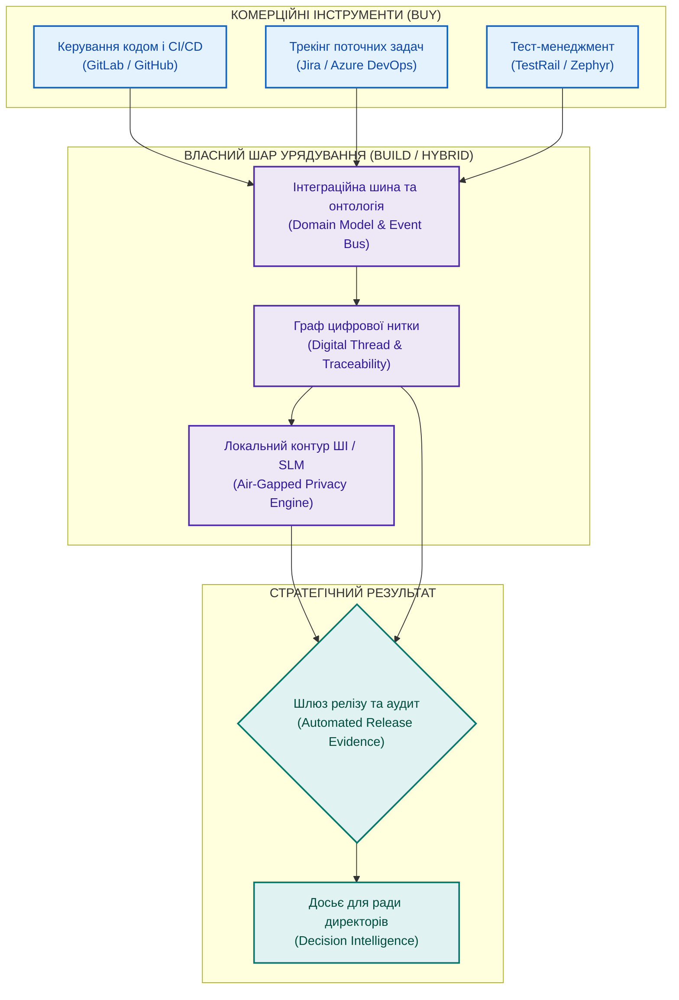

# Створювати чи купувати (Build vs Buy): архітектурний вибір системи управління проєктами

**Автор:** [Микола Федчик (Mykola Fedchyk)](book/about-the-author.md) · [LinkedIn](https://www.linkedin.com/in/nickfedchik/) · [GitHub](https://github.com/nick-fedchik)

---

## Вступ

**Мета статті:** визначити інженерні, економічні та безпекові критерії вибору між придбанням готових комерційних платформ (*Buy*), розробкою власного рішення (*Build*) та побудовою гібридної архітектури (*Hybrid*) для управління складними проєктами й програмами в регульованих галузях.

**Технологічна проблема, яка вирішується:** намагання вирішити проблему управління придбанням дорогого монолітного комплексу (Polarion, DOORS, Jira Align) часто призводить до глухого кута. Через рік з'ясовується, що внутрішні стандарти функціональної безпеки, правила контролю змін та політики конфіденційності даних не вкладаються у стандартні можливості комерційного продукту. Інженери змушені повертатися до небезпечних обхідних шляхів у Excel, зводячи нанівець витрачені на ліцензії кошти. Стаття пропонує практичний метод розрахунку сукупної вартості володіння (TCO) та архітектуру гібридного шару.

---

## Чому дилема «купити чи розробити» складніша за порівняння функціоналу

Спроба обрати платформу виключно за таблицею наявних функцій на маркетинговому сайті виробника є типовою помилкою закупівель.

Рекламні матеріали вендорів виглядають переконливо: облік вимог, управління ризиками, візуалізація критичного шляху, автоматичні діаграми та вбудовані генеративні помічники. Проте функціональний список відображає лише поверхневі можливості для усередненого масового ринку. У складних апаратно-програмних комплексах розробка підпорядковується суворим стандартам безпеки (ISO 26262, DO-178C, IEC 62304), які вимагають специфічної семантики зв'язків та повної ізоляції даних від публічних хмар.

Коли підприємство купує готовий моноліт, воно разом із ліцензіями часто віддає сторонній компанії контроль над власними даними та вимушене спотворювати свої процеси під обмеження чужого продукту.

Справжній вибір лежить не між двома брендами програм, а між збереженням інженерного суверенітету над власною цифровою ниткою та залежністю від чужих пріоритетів розробки.

*Гібридна модель купує стандартні інструменти виконання завдань, але зберігає контроль над моделлю даних та безпекою всередині організації.*

## Математичне порівняння сукупної вартості володіння (TCO)

Для прийняття зваженого фінансового рішення сукупна вартість володіння повинна враховувати приховані накладні витрати на обхідні інженерні процеси.

Пряма купівля ліцензій часто видається дешевшою на старті, проте нездатність комерційного продукту закрити регуляторні вимоги безпеки змушує інженерів витрачати тисячі годин на ведення паралельних таблиць у Excel.

Сукупна вартість варіанта купівлі $\text{TCO}_{\text{buy}}$ та гібридного варіанта $\text{TCO}_{\text{hybrid}}$ на горизонті $T$ років розраховується за формулами:

$$\text{TCO}_{\text{buy}}(T) = C_{\text{lic}} \cdot T + C_{\text{custom}} + T \cdot \left(C_{\text{workaround}} + C_{\text{lockin\_risk}}\right)$$

$$\text{TCO}_{\text{hybrid}}(T) = C_{\text{core\_lic}} \cdot T + C_{\text{dev\_glue}} + T \cdot \left(C_{\text{maint\_glue}} + C_{\text{infra}}\right)$$

**Тут:**
- $C_{\text{lic}}$ є щорічною вартістю вендорських ліцензій на повний комплекс ПЗ (у грошових одиницях).
- $C_{\text{custom}}$ є разовими витратами на кастомізацію та навчання персоналу роботі з монолітом (у грошових одиницях).
- $C_{\text{workaround}}$ є щорічною вартістю прихованих трудовитрат інженерів на ручне ведення тіньових таблиць та зведення звітів (у грошових одиницях).
- $C_{\text{lockin\_risk}}$ є штрафним річним резервом на ризик блокування даних вендором (*Vendor Lock-in Risk*).
- $C_{\text{core\_lic}}$ є витратами на ліцензії простих базових трекерів задач без важких надбудов (у грошових одиницях).
- $C_{\text{dev\_glue}}$ є разовою інвестицією у створення внутрішнього сполучного шару даних та цифрової нитки (у грошових одиницях).
- $C_{\text{maint\_glue}}$ є щорічними витратами на підтримку та еволюцію власного інтеграційного шару (у грошових одиницях).
- $C_{\text{infra}}$ є витратами на локальну серверну інфраструктуру (у грошових одиницях).

**Навчальний числовий приклад:**
Підприємство на 100 інженерів порівнює витрати на 3 роки ($T = 3$ роки):
1. **Варіант Buy (Повна купівля важкого комерційного комбайна):**
   Ліцензії $C_{\text{lic}} = 60\,000$ євро/рік. Впровадження та консалтинг $C_{\text{custom}} = 40\,000$ євро. Через негнучкість системи інженери витрачають 5% робочого часу на паралельні файли ($C_{\text{workaround}} = 50\,000$ євро/рік). Резерв ризику блокування $C_{\text{lockin\_risk}} = 10\,000$ євро/рік.
   $$\text{TCO}_{\text{buy}}(3) = 60\,000 \cdot 3 + 40\,000 + 3 \cdot (50\,000 + 10\,000) = 180\,000 + 40\,000 + 180\,000 = 400\,000 \text{ євро}$$
2. **Варіант Hybrid (Базовий таск-трекер + власний інтеграційний шар цифрової нитки):**
   Базові ліцензії $C_{\text{core\_lic}} = 15\,000$ євро/рік. Розробка власного інтеграційного шару $C_{\text{dev\_glue}} = 90\,000$ євро. Підтримка власного шару $C_{\text{maint\_glue}} = 25\,000$ євро/рік. Локальні сервери $C_{\text{infra}} = 10\,000$ євро/рік. Ручні обхідні шляхи ліквідовані ($C_{\text{workaround}} = 0$).
   $$\text{TCO}_{\text{hybrid}}(3) = 15\,000 \cdot 3 + 90\,000 + 3 \cdot (25\,000 + 10\,000) = 45\,000 + 90\,000 + 105\,000 = 240\,000 \text{ євро}$$

Математичний аналіз доводить: за 3 роки гібридний підхід заощаджує 160 000 євро (400 000 проти 240 000), забезпечуючи повний контроль над конфіденційними даними та абсолютну незалежність від цінової політики постачальника програмного забезпечення.

## Власна платформа (Build): свобода контролю проти ризику вічної розробки

Створення власної системи управління з нуля виправдане лише за наявності унікальної інженерної специфіки, яку неможливо реалізувати комерційними засобами.

Головними перевагами власної розробки є:
1. Повна відповідність доменної моделі реальним внутрішнім процесам підприємства.
2. Абсолютний контроль над розміщенням даних, політиками безпеки та алгоритмами штучного інтелекту.
3. Можливість миттєвої адаптації логіки шлюзів допуску під нові регуляторні вимоги.

Проте небезпеки власної розробки не менш суттєві: проєкт ризикує перетворитися на нескінченну розробку без чіткого продуктового бачення, команда відволікається від створення основного комерційного продукту, а внутрішні інструменти часто страждають від низької якості інтерфейсу та застарілої документації.

Розробляти систему повністю самостійно доцільно лише тоді, коли специфіка бізнесу становить головну конкурентну перевагу компанії або якщо вимоги державної таємниці виключають використання стороннього коду.

## Гібридна архітектура: розумний баланс інженерного суверенітету

Для переважної більшості високотехнологічних підприємств найбільш зваженим вибором є гібридна архітектура (*Hybrid Platform*).

У гібридній схемі відбувається чітке розділення обов'язків:
- **Комерційні стандартні інструменти (Commodity Tools):** підприємство купує перевірені масові рішення для повсякденних операцій, такі як репозиторії вихідного коду (GitLab, GitHub), системи трекінгу завдань невеликих команд (Jira) та спеціалізовані модулі тест-менеджменту.
- **Власний інтеграційний шар урядування (Internal Governance Glue):** організація розробляє та контролює центральну шину повідомлень, граф цифрової нитки, базу онтологій артефактів, правила проходження сертифікаційних шлюзів та локальний контур безпечного виконання мовних моделей.

Такий підхід дозволяє скористатися найкращими напрацюваннями світового ринку програмного забезпечення, зберігаючи стратегічний суверенітет над зв'язками між вимогами, доказами та архітектурними рішеннями.

## Стратегія виходу (Exit Strategy) та захист від блокування вендором

Купівля будь-якої комерційної платформи повинна починатися з детального плану відмови від неї та міграції даних.

Часто компанії потрапляють у технологічну пастку (*Vendor Lock-in*): через три роки виявляється, що вендор підвищив вартість підписки втричі або змінив технологічний стек, проте піти з платформи неможливо, оскільки експорт дозволяє вивантажити лише пласкі таблиці без збереження історії змін, підписів погоджень та ланцюгів простежуваності.

Перед укладанням контракту обов'язково перевіряються технічні умови виходу:
1. Наявність відкритого та документованого API для повного вилучення зв'язків графа артефактів.
2. Можливість вивантаження журналів аудиту та криптографічних доказів у стандартизованих форматах (JSON, XML).
3. Зрозумілість моделі даних поза межами користувацького інтерфейсу вендора.

Якщо постачальник не гарантує безперешкодного вивантаження повної семантики інженерних даних, від придбання такого моноліту слід відмовитися.

---

## Висновки

1. Дилема «створювати чи купувати» є стратегічним архітектурним рішенням про володіння даними та процесами, а не простим вибором між комерційними прайс-листами.
2. Повна закупівля важких комерційних систем створює приховані витрати через виникнення тіньових обхідних процесів у командах та високий ризик блокування вендором (Vendor Lock-in).
3. Розробка повної системи з нуля несе ризик розпорошення інженерного фокусу та появи нестабільного продукту без довгострокової підтримки.
4. Гібридна модель є оптимальним компромісом: вона поєднує використання готових інструментів для стандартних задач із власною цифровою ниткою та локальними алгоритмами штучного інтелекту.
5. Стратегія виходу (Exit Strategy) з можливістю повного збереження семантичних зв'язків графа є обов'язковою умовою будь-якого контракту на закупівлю інструментів управління.

---

## Посилання

1. ISO 21502:2020. *Project, programme and portfolio management — Guidance on project management*. International Organization for Standardization, Geneva, Switzerland. [https://www.iso.org/standard/74947.html](https://www.iso.org/standard/74947.html)
2. ISO 21505:2017. *Project, programme and portfolio management — Guidance on governance*. International Organization for Standardization, Geneva, Switzerland. [https://www.iso.org/standard/66166.html](https://www.iso.org/standard/66166.html)
3. Bass, L., Clements, P., Kazman, R. *Software Architecture in Practice*. 4th Edition. Addison-Wesley, 2021.
4. Newman, S. *Building Microservices: Designing Fine-Grained Systems*. 2nd Edition. O'Reilly Media, 2021.
5. NIST AI 600-1. *Artificial Intelligence Risk Management Framework: Generative Artificial Intelligence Profile*. National Institute of Standards and Technology, Gaithersburg, MD, 2024. [https://doi.org/10.6028/NIST.AI.600-1](https://doi.org/10.6028/NIST.AI.600-1)

---

## Терміни

- **Блокування вендором (Vendor Lock-in)**: ситуація високої залежності замовника від постачальника програмного продукту, за якої перехід на альтернативне рішення пов'язаний із неприйнятно високими фінансовими, технічними чи юридичними витратами.
- **Гібридна платформа (Hybrid Platform)**: інформаційна архітектура, в якій стандартні комерційні інструменти інтегруються з внутрішнім спеціалізованим шаром цифрової нитки та онтології даних.
- **Стратегія виходу (Exit Strategy)**: заздалегідь розроблений інженерно-організаційний план міграції даних і процесів на альтернативну платформу в разі припинення співпраці з постачальником.
- **Сукупна вартість володіння (Total Cost of Ownership, TCO)**: методологія підрахунку всіх прямих і прихованих витрат на придбання, впровадження, підтримку, кастомізацію та обхідні процеси інформаційної системи протягом усього її життєвого циклу.

---

## Скорочення

- **ALM**: Application Lifecycle Management (управління життєвим циклом застосунків)
- **API**: Application Programming Interface (програмний інтерфейс застосунку)
- **CI/CD**: Continuous Integration / Continuous Delivery (неперервна інтеграція та доставка)
- **ISO**: International Organization for Standardization (Міжнародна організація зі стандартизації)
- **ITSM**: Information Technology Service Management (управління ІТ-послугами)
- **NIST**: National Institute of Standards and Technology (Національний інститут стандартів і технологій США)
- **PLM**: Product Lifecycle Management (управління життєвим циклом виробу)
- **PMO**: Project Management Office (проєктний офіс)
- **RFP**: Request for Proposal (запит комерційної пропозиції)
- **SaaS**: Software as a Service (програмне забезпечення як послуга)
- **SLM**: Small Language Model (компактна мовна модель)
- **TCO**: Total Cost of Ownership (сукупна вартість володіння)

---

## Про автора

**Микола Федчик (Mykola Fedchyk)**: український інженер, системний архітектор та дослідник у галузі кіберфізичних комплексів, доказового штучного інтелекту та критичних вбудованих систем. Понад двадцять років керує інженерними розробками та проєктуванням складних апаратно-програмних комплексів у сфері мережевої безпеки, телекомунікацій та автомобільної електроніки відповідно до вимог міжнародних стандартів ISO 26262 та ISO/SAE 21434. Досліджує практичне застосування експертних систем, семантичних онтологій та цифрової нитки для управління складними інженерними програмами.

Детальніша інформація: [Про автора](book/about-the-author.md) · [LinkedIn](https://www.linkedin.com/in/nickfedchik/) · [GitHub](https://github.com/nick-fedchik)
