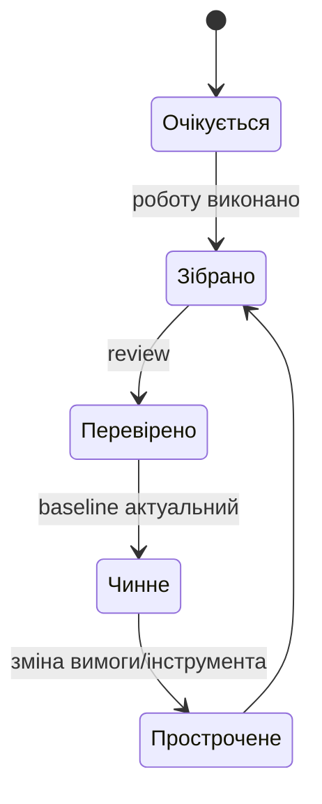

# Комплаєнс без авралу: як перетворити аудит на звичайний зріз стану

Аудит стає дорогим і нервовим не через саму перевірку, а через реконструкцію минулого. Вимоги лежать в одному місці, тести — в іншому, рішення — у листуванні, а постачальницькі документи — у чиїйсь пошті. За кілька тижнів до перевірки команда намагається довести те, що мала б бачити щодня.

Комплаєнс як операційний стан означає інше: доказ виникає разом із роботою, має власника, версію та строк чинності. Audit package тоді не пишуть з нуля — його збирають як view над живими артефактами.

## Не документ, а ланцюг доказів

Для вимоги корисно мати не просто файл, а зв’язок із критерієм приймання, тестом, версією середовища, результатом, review і рішенням. Для ризику — owner-а, mitigation та підтвердження її виконання. Для finding — джерело, серйозність, corrective action і незалежну перевірку закриття. Стандарт лишається джерелом інтерпретації, але його важливі контрольні точки мають працювати як правила процесу, а не як PDF «десь поруч».

Стан готовності можна агрегувати обережно:

$$R = \frac{\sum_i w_i\,v_i\,f_i}{\sum_i w_i},$$

де $v_i\in\{0,1\}$ позначає наявність перевіреного доказу, $f_i$ — його актуальність, а $w_i$ — критичність контрольної точки. Це індикатор для пошуку прогалин, а не дозвіл приховати критичну відсутність високим середнім значенням.

## Роль AI і людей

AI може створити чернетку відповіді аудитору, знайти прострочені reviews чи пояснити gap простими словами. Проте він не сертифікує відповідність: остаточна класифікація, прийняття supplier evidence і рішення про закриття лишаються за відповідальною роллю. Корисна відповідь AI завжди містить посилання на конкретні артефакти й вказує, чого не знає.

Почати можна з одного найбільш болючого контролю: описати очікувані докази, owner-а, правило актуальності й escalation. Потім додати readiness check перед gate. Якщо команда бачить проблему за три тижні до перевірки, це звичайна робота; якщо її вперше бачить аудитор — це finding.
