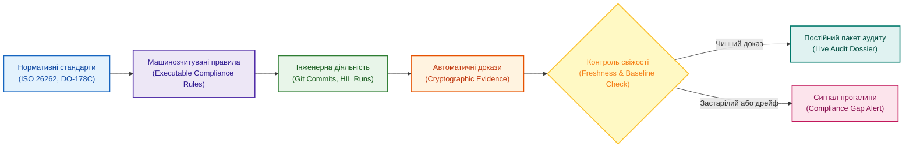

# Комплаєнс як операційний стан, а не авральна підготовка до аудиту

**Автор:** [Микола Федчик (Mykola Fedchyk)](book/about-the-author.md) · [LinkedIn](https://www.linkedin.com/in/nickfedchik/) · [GitHub](https://github.com/nick-fedchik)

---

## Вступ

**Мета статті:** визначити інженерні та процесні засади трансформації комплаєнсу (*Compliance*) із періодичної сезонної кампанії перед приїздом аудиторів на безперервний щоденний операційний стан системи управління розробкою складних виробів.

**Технологічна проблема, яка вирішується:** у регульованих інженерних галузях (автомобільна електроніка, авіоніка, медичне обладнання) відсутність належним чином оформленого доказу випробування трактується аудиторами як повна відсутність виконаної роботи. Команди витрачають місяці на ручне відновлення ланцюгів простежуваності, зведення таблиць та пошук протоколів заднім числом. Стаття демонструє, як інтегрувати нормативні правила стандартів безпосередньо в конвеєри інженерних даних, зробивши систему аудитопридатною за замовчуванням.

---

## Чому про готовність до аудиту згадують запізно

Головна причина передсертифікаційної паніки полягає в розриві між повсякденною розробкою та механізмами фіксації регуляторних свідчень.

Типовий виробничий сценарій виглядає так: організація купує дорогі стандарти, призначає відповідального за якість та завантажує шаблони документів у сховище. Проте щоденна інженерна робота вирує у звичайних інструментах розробки: код пишеться у Git, задачі ведуться у трекері, випробування проводяться на стендах, але ніхто не фіксує зв'язок між конкретним комітом і пунктом стандарту. За три тижні до офіційного аудиту розробка зупиняється, і всі сили кидаються на «штурмівщину»: ручне переписування звітів та спроби згадати, чому пів року тому було змінено алгоритм фільтрації сигналів.

Такий підхід не лише виснажує команду, але й несе колосальні ризики: під час ручної реконструкції обов'язково губляться критичні протоколи, що призводить до негативних висновків аудиторів (*Audit Findings*) та затримки сертифікації виробу на ринок.

Комплаєнс повинен бути не подією у календарі, а побічним продуктом щоденної інженерної діяльності.

```mermaid
flowchart LR
    accTitle: Конвеєр безперервного комплаєнсу
    accDescr: Вимоги стандартів автоматично перевіряються через цифрову нитку з контролем свіжості доказів.

    STD["Нормативні стандарти<br/>(ISO 26262, DO-178C)"] --> CTR["Машинозчитувані правила<br/>(Executable Compliance Rules)"]
    CTR --> ENG["Інженерна діяльність<br/>(Git Commits, HIL Runs)"]
    ENG --> EVD["Автоматичні докази<br/>(Cryptographic Evidence)"]
    EVD --> FRS{"Контроль свіжості<br/>(Freshness & Baseline Check)"}
    FRS -->|Чинний доказ| AUD["Постійний пакет аудиту<br/>(Live Audit Dossier)"]
    FRS -->|Застарілий або дрейф| WAR["Сигнал прогалини<br/>(Compliance Gap Alert)"]

    classDef std fill:#e3f2fd,stroke:#1565c0,stroke-width:2px,color:#0d47a1;
    classDef ctr fill:#ede7f6,stroke:#512da8,stroke-width:2px,color:#311b92;
    classDef eng fill:#e8f5e9,stroke:#2e7d32,stroke-width:2px,color:#1b5e20;
    classDef evd fill:#fff3e0,stroke:#e65100,stroke-width:2px,color:#bf360c;
    classDef frs fill:#fff9c4,stroke:#fbc02d,stroke-width:2px,color:#f57f17;
    classDef aud fill:#e0f2f1,stroke:#00796b,stroke-width:2px,color:#004d40;
    classDef war fill:#fce4ec,stroke:#c2185b,stroke-width:2px,color:#880e4f;

    class STD std;
    class CTR ctr;
    class ENG eng;
    class EVD evd;
    class FRS frs;
    class AUD aud;
    class WAR war;
```

*Контроль комплаєнсу виконується автоматично: система безперервно відстежує актуальність доказів відносно чинної базової версії.*

## Нормативні рамки високотехнологічних галузей

Вимоги міжнародних регламентів стають дедалі суворішими, роблячи ручне управління комплаєнсом практично неможливим.

У сучасному інженерному середовищі ключовими регуляторними орієнтирами є:
- **Автомобільна електроніка:** процесна модель ASPICE, стандарти функціональної безпеки ISO 26262, інженерії кібербезпеки ISO/SAE 21434 та обов'язкові регламенти ООН UNECE R155/R156.
- **Авіаційні комплекси:** настанови з розробки бортового програмного забезпечення DO-178C, електронної апаратури DO-254 та системної безпеки ARP4754A/ARP4761.
- **Медичне приладобудування:** системи управління якістю ISO 13485, життєвий цикл ПЗ IEC 62304, аналіз ризиків ISO 14971 та вимоги до електронних записів FDA 21 CFR Part 11.
- **Оборонні технології (MilTech):** військові стандарти надійності та безпеки систем MIL-STD-882E, випробування на вплив середовища MIL-STD-810, електромагнітна сумісність MIL-STD-461, стандарти НАТО AQAP та вимоги захисту інформації NIST SP 800-171/160.

Усі ці стандарти об'єднує непорушний принцип: відповідність оцінюється не за запевненнями розробників, а за наявністю формальних, об'єктивних та незмінних доказів.

## Математична оцінка аудитопридатності та старіння інженерних доказів

Для об'єктивного моніторингу готовності до зовнішньої перевірки комплаєнс-статус повинен оцінюватися кількісно з урахуванням старіння та знецінення доказів.

Доказ випробування не є вічним: зміна коду, калібрувальних коефіцієнтів або заміна ревізії чипа миттєво знецінює раніше отриманий успішний протокол. Розглянемо інтегральний індекс аудиторської готовності $C_{\text{audit}}$:

$$C_{\text{audit}} = \frac{1}{|K_{\text{req}}|} \sum_{k \in K_{\text{req}}} w_k \cdot \phi(e_k) \cdot \mathbb{I}_{\text{valid}}(e_k)$$

де функція актуальності та свіжості доказу $\phi(e_k)$ описується рівнянням:

$$\phi(e_k) = \exp\left(-\gamma \cdot \frac{\Delta t_k}{\tau_{\text{expire}}}\right) \cdot \left(1 - \mathbb{I}_{\text{drift}}(e_k)\right)$$

**Тут:**
- $C_{\text{audit}}$ є інтегральним індексом аудитопридатності виробу (безрозмірна величина в межах $[0; 1]$).
- $K_{\text{req}}$ є множиною обов'язкових регуляторних вимог для обраного профілю стандарту.
- $w_k$ є ваговим коефіцієнтом важливості вимоги $k$, де $\sum w_k = 1{,}0$.
- $\mathbb{I}_{\text{valid}}(e_k)$ є індикатором наявності формального протоколу випробування з вердиктом $\text{PASS}$ ($\mathbb{I}_{\text{valid}} = 1$ за наявності звіту, інакше $\mathbb{I}_{\text{valid}} = 0$).
- $\phi(e_k)$ є функцією актуальності (свіжості) наданого доказу $e_k$.
- $\Delta t_k$ є віком артефакту випробування від моменту його створення (у днях або календарних тижнях).
- $\tau_{\text{expire}}$ є встановленим періодом валідності доказу (наприклад, 180 днів для періодичних калібрувань стенда).
- $\gamma$ є коефіцієнтом старіння доказу (як правило, $\gamma = 0{,}5$).
- $\mathbb{I}_{\text{drift}}(e_k)$ є індикатором архітектурного дрейфу: $\mathbb{I}_{\text{drift}} = 1$, якщо вихідний код, конфігурація або базова лінія вимоги змінилися після проведення тесту, і $\mathbb{I}_{\text{drift}} = 0$, якщо артефакт залишається синхронним із поточною ревізією.

**Навчальний числовий приклад:**
Розглянемо критичну вимогу автомобільної безпеки ($w_1 = 1{,}0$), для якої три місяці тому ($\Delta t_1 = 90$ днів при $\tau_{\text{expire}} = 180$ днів) було отримано успішний протокол тестування HIL ($\mathbb{I}_{\text{valid}} = 1$).
1. Якщо базова лінія коду залишалася незмінною ($\mathbb{I}_{\text{drift}} = 0$):
   $$\phi(e_1) = \exp\left(-0{,}5 \cdot \frac{90}{180}\right) \cdot (1 - 0) = \exp(-0{,}25) \approx 0{,}779$$
   $$C_{\text{audit}} = 1{,}0 \cdot 0{,}779 \cdot 1 = 0{,}779 \quad (77{,}9\%)$$
2. Проте якщо вчора програміст модифікував файл прошивки без повторного запуску тестового стенда, виникає інженерний дрейф ($\mathbb{I}_{\text{drift}} = 1$):
   $$\phi(e_1) = \exp(-0{,}25) \cdot (1 - 1) = 0{,}779 \cdot 0 = 0$$
   $$C_{\text{audit}} = 0$$

Цей математичний розрахунок наочно демонструє: стара правда перестає бути правдою в момент зміни реальності. Система автоматично знижує індекс до нуля, не дозволяючи звітувати про відповідність на основі застарілих даних.

## Перетворення стандартів на машинозчитувані правила системи

Найбільш результативне інженерне рішення полягає у перетворенні вимог стандартів із пасивних PDF-файлів на виконувані правила валідації.

У зрілій інженерній системі пункти стандартів ISO 26262 чи DO-178C формалізуються як системні обмеження (*Executable Controls*):
1. Кожне положення стандарту пов'язується з очікуваними типами артефактів (наприклад, звіт статичного аналізу коду за правилами MISRA, протокол випробувань на рівні блоку або матриця відмовостійкості FMEA).
2. Автоматизовані шлюзи якості (*Quality Gates*) у CI/CD блокують випуск прошивки, якщо виявлено хоча б одне незакрите зауваження з безпеки.
3. Зміна конфігурації або класу виробу автоматично підключає додаткові набори перевірочних правил без участі людини.

Стандарт перестає бути абстрактним теоретичним документом на полиці: він стає активним фільтром, який щодня оберігає проєкт від порушення нормативних регламентів.

## Пакет для аудиту як постійно діючий цифровий артефакт

Логічним наслідком автоматизації є перетворення пакета сертифікаційних документів на динамічний зріз актуального стану розробки.

Коли приходить зовнішній аудитор або представник замовника, команда не займається екстреним скануванням підписів. Аудитор отримує доступ до інтерактивного робочого місця (*Live Audit Dossier*), де кожен розділ стандарту проілюстрований реальними доказами: криптографічними хешами тестових звітів, протоколами погодження архітектурних рішень у формі ADR та актуальними сертифікатами калібрування обладнання.

Такий підхід кардинально змінює атмосферу перевірки: аудитор бачить живу інженерну дисципліну, а не нашвидкуруч сфабриковані папери, що знімає більшість підозр і суттєво скорочує час сертифікації.

## Антипатерни комплаєнсу та як їх подолати

У процесі побудови комплаєнс-процесів інженерні організації часто потрапляють у типові пастки, які зводять нанівець усі зусилля.

Поширені антипатерни:
- **Аудиторський героїзм (Audit Heroics):** робота без дотримання регламентів протягом року з наступним авральним «подвигом» у вихідні перед аудитом. Долається впровадженням автоматичних блокувань у CI/CD.
- **Декларативна безпека (Green by Assertion):** проставляння зелених статусів у звітах на основі усних запевнень розробників без посилань на файли логів. Долається суворою забороною закриття вимог без підтвердженого протоколу випробувань.
- **Монополія експерта (Single Expert Trap):** ситуація, коли лише один провідний фахівець знає, де лежать справжні докази. Долається централізацією артефактів у єдиній цифровій нитці підприємства.

Подолання цих помилок формує прозору інженерну культуру, де дотримання стандартів є природною частиною щоденної професійної гігієни.

## Покроковий план впровадження безперервної відповідності

Побудову живого комплаєнсу варто розпочинати з пілотного проєкту на одному найбільш критичному компоненті виробу.

Рекомендовані етапи впровадження:
1. **Етап 1:** формалізувати один наскрізний доказовий ланцюг: вимога безпеки $\to$ метод верифікації $\to$ тестовий запуск на стенді $\to$ підписаний протокол випробувань $\to$ шлюз допуску до релізу.
2. **Етап 2:** ввести правила контролю свіжості доказів (*Evidence Freshness*), які автоматично маркують протоколи як недійсні у разі зміни коду або базової лінії.
3. **Етап 3:** закріпити персональну відповідальність інженерів за кожен тип нормативних доказів.
4. **Етап 4:** підключити локальні мовні моделі для автоматичної перевірки повноти заповнення сертифікаційних форм та виявлення прогалин у трасуванні.

Це перетворює комплаєнс із джерела постійного стресу на надійний фундамент високої інженерної якості та ринкової довіри.

---

## Висновки

1. Комплаєнс у високотехнологічних галузях повинен бути щоденним операційним станом системи управління, а не авральною сезонною кампанією перед перевіркою.
2. Відсутність належним чином зафіксованого та верифікованого доказу випробування розглядається аудиторами як відсутність виконаної роботи.
3. Доказова база виробу підпорядковується законам старіння: будь-яка несанкціонована зміна вихідного коду чи схеми миттєво знецінює раніше отримані сертифікаційні протоколи.
4. Перетворення вимог міжнародних стандартів на виконувані машинно-перевірні правила усуває людський фактор та гарантує постійну готовність до аудиту.
5. Застосування цифрової нитки перетворює аудиторський пакет на постійне динамічне подання актуального стану розробки, повністю ліквідуючи потребу в ручному зведенні звітів.

---

## Посилання

1. ISO 21502:2020. *Project, programme and portfolio management — Guidance on project management*. International Organization for Standardization, Geneva, Switzerland. [https://www.iso.org/standard/74947.html](https://www.iso.org/standard/74947.html)
2. ISO 26262-8:2018. *Road vehicles — Functional safety — Part 8: Supporting processes*. International Organization for Standardization, Geneva, Switzerland. [https://www.iso.org/standard/68387.html](https://www.iso.org/standard/68387.html)
3. RTCA DO-178C. *Software Considerations in Airborne Systems and Equipment Certification*. Radio Technical Commission for Aeronautics, Washington, D.C., 2011.
4. IEC 62304:2006+AMD1:2015. *Medical device software — Software life cycle processes*. International Electrotechnical Commission, Geneva, Switzerland. [https://webstore.iec.ch/publication/22794](https://webstore.iec.ch/publication/22794)
5. NIST SP 800-160, Vol. 1, Rev. 1. *Engineering Trustworthy Secure Systems*. National Institute of Standards and Technology, Gaithersburg, MD, 2022. [https://doi.org/10.6028/NIST.SP.800-160v1r1](https://doi.org/10.6028/NIST.SP.800-160v1r1)

---

## Терміни

- **Аудиторський висновок (Audit Finding)**: зафіксований незалежними експертами факт невідповідності інженерного процесу або артефакту вимогам нормативного стандарту.
- **Безперервний комплаєнс (Continuous Compliance)**: операційний режим роботи організації, за якого дотримання вимог регламентів та збір доказів здійснюються автоматично у ході щоденної розробки.
- **Докази верифікації (Verification Evidence)**: об'єктивні машинно-згенеровані файли (протоколи випробувань, звіти статичного аналізу коду, акти калібрування стендів), що мають незмінні мітки часу та криптографічні хеші.
- **Контрольний шлюз якості (Quality Gate)**: автоматизована точка перевірки в конвеєрі розробки, яка забороняє перехід продукту на наступну фазу за наявності неперевірених вимог або відкритих дефектів.
- **Обґрунтування безпеки (Safety Case)**: логічно структурований комплекс аргументів і доказів того, що система є безпечною для експлуатації у визначених граничних умовах.
- **Свіжість доказів (Evidence Freshness)**: характеристика артефакту випробувань, яка підтверджує, що тест був проведений на актуальній версії вихідного коду без подальшого внесення неконтрольованих змін.

---

## Скорочення

- **ADR**: Architecture Decision Record (журнал архітектурних рішень)
- **ASIL**: Automotive Safety Integrity Level (рівень повноти безпеки в автомобільній промисловості)
- **ASPICE**: Automotive Software Process Improvement and Capability Determination (модель оцінки зрілості процесів розробки)
- **BSW**: Basic Software (базове програмне забезпечення мікроконтролера)
- **CAN**: Controller Area Network (бортова мережа контролерів)
- **CI/CD**: Continuous Integration / Continuous Delivery (неперервна інтеграція та доставка)
- **FMEA**: Failure Mode and Effects Analysis (аналіз видів та наслідків відмов)
- **HIL**: Hardware-in-the-Loop (апаратно-програмне моделювання на фізичному стенді)
- **ISO**: International Organization for Standardization (Міжнародна організація зі стандартизації)
- **MISRA**: Motor Industry Software Reliability Association (стандарти безпечного програмування)

---

## Про автора

**Микола Федчик (Mykola Fedchyk)**: український інженер, системний архітектор та дослідник у галузі кіберфізичних комплексів, доказового штучного інтелекту та критичних вбудованих систем. Понад двадцять років керує інженерними розробками та проєктуванням складних апаратно-програмних комплексів у сфері мережевої безпеки, телекомунікацій та автомобільної електроніки відповідно до вимог міжнародних стандартів ISO 26262 та ISO/SAE 21434. Досліджує практичне застосування експертних систем, семантичних онтологій та цифрової нитки для управління складними інженерними програмами.

Детальніша інформація: [Про автора](book/about-the-author.md) · [LinkedIn](https://www.linkedin.com/in/nickfedchik/) · [GitHub](https://github.com/nick-fedchik)
