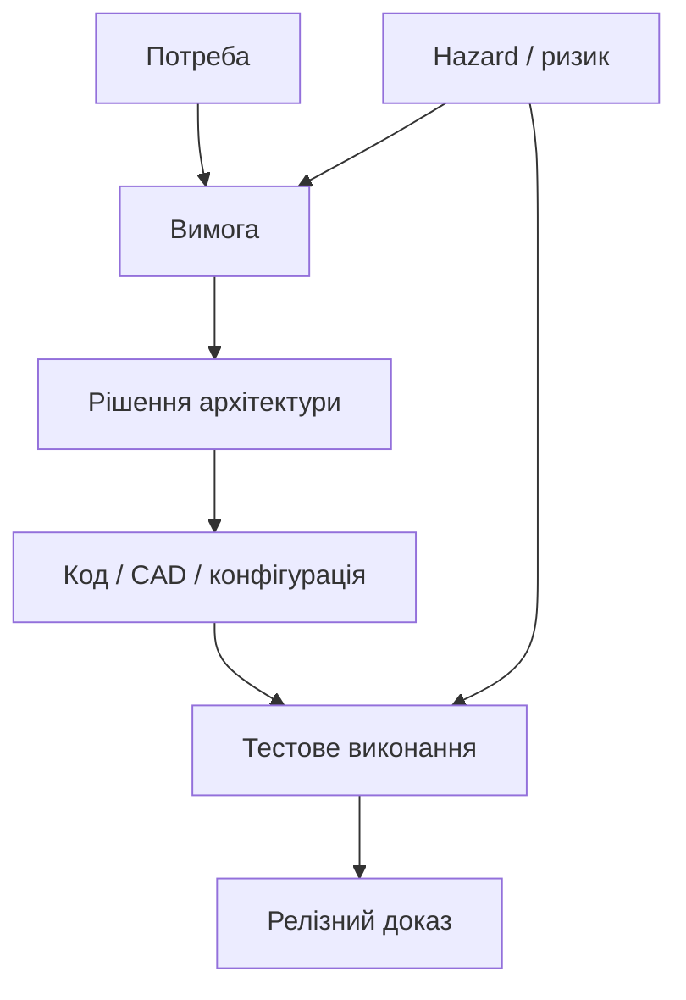
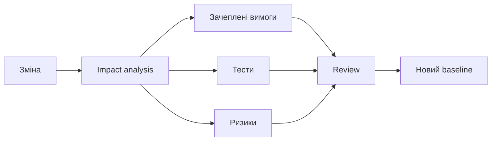

# Digital thread в інженерному проєкті: навіщо зв’язувати вимоги, код, тести й ризики

Traceability matrix часто сприймають як таблицю для аудиту. Це занадто вузько. Digital thread — це жива мережа зв’язків, яка дозволяє щодня відповісти: що саме зміниться, якщо зміниться вимога, компонент або результат тесту.

Нитка корисна лише тоді, коли links мають тип, owner-а, версію і причину. Посилання «related to» не дає змоги зрозуміти, чи артефакт реалізує вимогу, перевіряє її, обмежує чи просто згадується поруч. Мінімальний словник відносин і правила перевірки важливіші за масове ручне проставляння лінків.

Якість покриття можна вимірювати як $Q=L_v/L_e$, де $L_v$ — перевірені чинні зв’язки, а $L_e$ — очікувані. Але $Q=1$ не доводить правильність продукту: формула виявляє відсутні переходи, а не замінює інженерне судження.

Почніть не з «оцифрувати все», а з однієї критичної нитки: вимога → реалізація → перевірка → реліз. Якщо вона допомагає знайти вплив за хвилини, а не дні, команда сама побачить користь. AI може пояснити мережу і зібрати чернетку impact analysis, але самі зв’язки, їхня семантика й затвердження мусять залишатися керованими.
