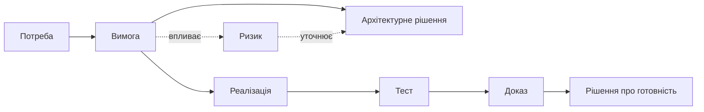

# Цифрова нитка для інженерних проєктів: як пов'язати вимоги, код, тести, ризики й докази

У великому інженерному проекті завжди є один момент, коли все стає очевидним: у нас є багато артефактів, але немає нитки, яка б їх зв'язувала. Вимоги існують. Задачі існують. Код існує. Тести існують. Дефекти, ризики, supplier-документи, evidence для compliance - усе це є. Але коли треба відповісти на питання "що зміниться, якщо ми змінимо ось цю вимогу", відповідь потребує ручного обходу п'яти-семи систем і кількох людей, які пам'ятають подробиці.

Це і є фрагментація. І digital thread - це не модне слово, а пряма відповідь на цю проблему.

## Що таке цифрова нитка простими словами

Digital thread - це наскрізний цифровий зв'язок між усіма артефактами проекту, продукту або програми, що дозволяє у будь-який момент відстежити повний контекст будь-якої сутності.

Тобто кожна вимога знає, від якої замовницької потреби вона походить, з якими нижчими вимогами пов'язана, які задачі її реалізують, який код, які тести верифікують, які дефекти стосуються, які ризики на неї впливають, які evidence-докази підтверджують її статус, які зміни вона зазнала і які рішення стояли за цими змінами.

Те саме для тестів, для ризиків, для evidence-записів, для рішень. Кожен артефакт - вузол у графі, кожен зв'язок - частина цифрової нитки.

*Цифрова нитка — це мережа контрольованих зв'язків, а не один лінійний процес. Її конкретний склад залежить від продукту й вимог до нього.*

## Чому цифрова нитка — це більше, ніж таблиця простежуваності

Traceability matrix - це старший родич digital thread. Зазвичай це таблиця, яка зв'язує вимоги з тестами і, можливо, з компонентами. Її будують вручну, оновлюють епізодично, найчастіше перед аудитом, і вона дуже швидко застаріває.

Digital thread - інший тип сутності:

- він живе у системі, а не у документі;
- він автоматично оновлюється з подій (новий test result, новий defect, change request, baseline update);
- він багаторівневий і охоплює не лише вимоги-тести, а й рішення, evidence, ризики, supplier records;
- він навігаційний: користувач має змогу проходити графом, а не лише дивитися на табличку;
- він підтримує versioning: який вигляд мала нитка у конкретний momento часу.

Якщо traceability matrix - це фотографія, то digital thread - це жива модель.

## Простежуваність має допомагати щодня

Найпоширеніша помилка з трасованістю - сприймати її лише як audit artifact. Це робить її дорогою для підтримки і малоцінною для команди. Її роблять "бо треба".

У зрілій моделі трасованість стає інструментом щоденної роботи:

- impact analysis: змінюємо вимогу - бачимо, що ще зачепить;
- onboarding: новий інженер бачить контекст компонента, з яким працює;
- risk management: ризик прив'язаний до конкретних вимог і компонентів, а не висить у повітрі;
- defect triage: defect одразу показує, які вимоги, тести і компоненти він стосується;
- release readiness: видно, які evidence-докази готові, які - ні;
- supplier management: видно, які зовнішні артефакти прив'язані до яких частин системи;
- compliance status: видно, які пункти стандарту мають evidence, а які ні.

У такій моделі команда сама зацікавлена в підтримці нитки, бо без неї щоденна робота гірша.

## Як зміна апаратної частини впливає на систему

Розглянемо типову ситуацію: змінюється вимога до інтерфейсу між software-компонентом і hardware-модулем.

Без digital thread аналіз виглядає так: PM пише в чат, інженери думають, хтось пригадує supplier зобов'язання, хтось перевіряє тести вручну, безпекова команда питає про cybersecurity impact, окремо обговорюється certification scope. Через кілька днів виникає більш-менш цілісна картина.

З digital thread сценарій інший: вимога відкривається, система показує:

- усі дочірні вимоги і їх статус;
- задачі і код, які її реалізують;
- тести, які її верифікують;
- ризики, на які вона впливає;
- supplier зобов'язання, що з нею пов'язані;
- evidence-докази, які потребують перегляду;
- частину safety case і cybersecurity case, до яких вона належить;
- minimum required reviews при її зміні.

Менеджер бачить картину за хвилини, а не за дні. Це не питання менш зрілих команд - це питання інфраструктури.

## Цифрова нитка дає AI перевірюваний контекст

Тут стає очевидною ще одна перевага. AI без digital thread має слабкий контекст. LLM може підсумувати документ, але не розуміє реальних залежностей між артефактами, бо не бачить їх як граф.

З digital thread AI отримує структурований контекст, з яким може робити справді корисні речі:

- пояснити impact зміни вимоги конкретною мовою для PM, інженера, замовника, аудитора;
- знайти невидимі залежності, які не очевидні людині;
- виявити evidence gaps на основі повноти нитки;
- запропонувати ризики на основі історичних patterns;
- скласти summary release readiness або compliance status із live state;
- пояснити, чому конкретний defect стосується конкретного customer requirement.

Без digital thread AI у проектному середовищі залишається genericним помічником. З digital thread він стає по-справжньому контекстним інструментом.

## Хто отримує користь

Digital thread корисний майже для всіх ролей у проекті:

- PM і PgM - швидкий impact analysis, точніше management of changes;
- QA - повна картина test coverage і defect impact;
- safety і cybersecurity інженери - перевірка цілісності safety/security cases;
- systems engineers - наскрізне розуміння архітектури;
- compliance officer - audit-ready evidence в будь-який момент;
- product manager - зв'язок продукту з реальними інженерними артефактами;
- замовник - впевненість у traceability контрактних вимог.

Кожна з цих ролей отримує не документ, а інструмент.

## Які ризики виникають під час побудови цифрової нитки

Digital thread не безкоштовний. Реальні ризики:

- фальшива трасованість: формально посилання є, але семантично воно неправильне;
- застарілі links: артефакт ще існує, але посилання ведуть на видалену чи переосмислену сутність;
- ручна підтримка: команда втомлюється підтримувати нитку без автоматизації;
- надлишкова деталізація: занадто дрібні вузли роблять граф нечитабельним.

Лікування - це автоматизація з подій у системах, owner-ship для зв'язків, lifecycle management, validation checks і періодичні перевірки якості нитки.

## З яких зв'язків варто починати

Digital thread не треба будувати одразу для всього. Найкраще починати з links, які мають найбільший operational value. Для regulated engineering це часто requirement -> test -> evidence. Для release management - requirement -> task -> defect -> release gate. Для hardware/software - requirement -> interface -> board revision -> firmware -> test bench. Для programme management - milestone -> dependency -> supplier input -> integration event.

Перший thread має бути коротким, але корисним. Якщо команда бачить, що link допомагає швидше відповісти на реальне питання, вона починає підтримувати його. Якщо links потрібні лише для audit matrix, підтримка буде формальною.

## Як оцінити якість зв'язків

Не кожне посилання корисне. Link має мати type і meaning. "Related to" занадто слабке, якщо все related to everything. Краще розрізняти implements, verifies, blocks, supersedes, derived from, mitigates, approved by, impacts. Тоді система може не лише показувати graph, а й робити висновки.

Потрібні validation checks. Requirement without verification link - gap. Test linked to deprecated requirement - warning. Risk without impacted artifact - weak signal. Decision without affected baseline - incomplete record. Саме такі checks роблять digital thread живим, а не декоративним.

## Чому важливо зберігати версії та час

Digital thread має відповідати не лише на питання "що пов'язано зараз", а й "що було пов'язано тоді". Для audit, incident investigation або release postmortem це критично. Якщо сьогодні test linked to new requirement, це не означає, що він був linked під час release decision три місяці тому.

Тому thread має мати versioning або хоча б time-aware snapshots. Baseline, release candidate, gate review, audit package - усе це moments, у яких graph має бути відтворюваним. Без time dimension digital thread швидко стає красивою поточною картиною, але слабким доказом історії.

## Хто відповідає за правила цифрової нитки

Digital thread потребує governance не менше, ніж вимоги або код. Має бути зрозуміло, хто може створювати link, хто може його видаляти, які link types дозволені, які links mandatory для певних artifact types, як перевіряється quality. Інакше graph швидко стане або порожнім, або надто заплутаним.

Корисна практика - link ownership. Якщо test verifies requirement, QA або verification owner відповідає за цей link. Якщо risk impacts component, risk owner відповідає за актуальність. Якщо decision approves baseline change, decision owner або configuration manager відповідає за зв'язок. Без ownership links старіють мовчки.

Ще одна практика - periodic thread audit. Не великий audit у формальному сенсі, а lightweight quality check: orphan requirements, tests without requirements, decisions without impacted artifacts, deprecated links, circular references, missing evidence. Такі checks можна автоматизувати, а AI може пояснювати findings human-readable мовою.

Digital thread не має бути ідеальним з першого дня. Але він має бути довіреним у тій частині, де використовується для decisions.

Тому варто явно маркувати confidence of thread. Частина links може бути system-generated, частина manually reviewed, частина imported з legacy data. Для важливих decisions потрібні reviewed links. Для exploratory analysis можуть бути достатні candidate links. Така прозорість краще, ніж робити вигляд, що весь graph однаково надійний.

Це також допомагає AI: assistant має знати, чи спирається на verified thread, чи лише на candidate links.

Інакше він може звучати однаково впевнено і тоді, коли має доказову нитку, і тоді, коли бачить лише слабку гіпотезу зв'язку.

## Висновок: цифрова нитка повертає інженерам контекст

Digital thread - це не нова панацея, а зріла еволюція traceability у бік живої, автоматизованої моделі. Він замінює фрагментарну роботу за п'ятьма системами і людською пам'яттю на структурований граф, який підтримує щоденну роботу і одночасно є основою для AI і audit readiness. У зрілих інженерних організаціях саме він стає невидимою інфраструктурою, на якій тримається все інше.

## Питання для обговорення

- Де у ваших проектах traceability найчастіше рветься?
- Чи використовуєте ви її як робочий інструмент, чи лише як audit artifact?
- Які зв'язки у вашому контексті варто будувати першими?
- Що зміниться у вашій роботі, якщо impact analysis займе хвилини замість днів?

## Посилання

- [NIST SP 800-160, Vol. 1 — Systems Security Engineering](https://csrc.nist.gov/pubs/sp/800/160/v1/r1/final)
- [ISO 21502:2020 — guidance on project management](https://www.iso.org/standard/74947.html)
