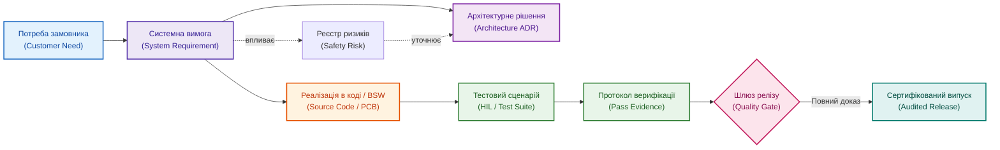

# Цифрова нитка для інженерних проєктів: як пов'язати вимоги, код, тести, ризики й докази

**Автор:** [Микола Федчик (Mykola Fedchyk)](book/about-the-author.md) · [LinkedIn](https://www.linkedin.com/in/nickfedchik/) · [GitHub](https://github.com/nick-fedchik)

---

## Вступ

**Мета статті:** визначити інженерні засади побудови та практичної експлуатації цифрової нитки (*Digital Thread*) як живого графа артефактів, що поєднує вимоги, архітектурні рішення, вихідний код, протоколи випробувань, ризики та докази готовності в єдине інформаційне середовище.

**Технологічна проблема, яка вирішується:** у складних виробах інженерні дані розпорошені між несумісними системами, через що аналіз впливу модифікації навіть одного параметра інтерфейсу перетворюється на багатоденне ручне опитування колег. Традиційні статичні матриці простежуваності створюються перед аудитами заднім числом і миттєво застарівають. Стаття пропонує практичний підхід до організації наскрізної простежуваності, що функціонує в реальному часі та автоматично сигналізує про виникнення прогалин у верифікації.

---

## Що таке цифрова нитка: від статичних таблиць до живого графа

Проблема традиційного управління полягає в тому, що зв'язки між артефактами існують лише в головах інженерів або у застарілих звітах.

Цифрова нитка (*Digital Thread*) є наскрізним семантичним ланцюгом машинозчитуваних зв'язків між усіма елементами життєвого циклу продукту: від початкової потреби клієнта через системні вимоги, схемотехніку, код мікроконтролера та тестові прогони до сертифікаційних свідоцтв і польових журналів експлуатації. Кожен об'єкт у такій системі розглядається як вузол орієнтованого графа знань, а зв'язки між ними мають сувору типізацію: «реалізує» (*implements*), «верифікує» (*verifies*), «походить від» (*derived_from*), «пом'якшує ризик» (*mitigates*) або «блокує випуск» (*blocks*).

Якщо статична матриця простежуваності (*Traceability Matrix*) є лише «фотографією» стану системи на момент підписання документа, то цифрова нитка є динамічною моделлю, яка реагує на кожну подію в конвеєрі розробки: оновлення прошивки, зміну ревізії плати чи фіксацію дефекту.

Цифрова нитка перетворює розрізнені файли на єдину інженерну пам'ять підприємства, доступну для автоматичного аудиту в будь-який момент часу.

```mermaid
flowchart LR
    accTitle: Семантична структура цифрової нитки
    accDescr: Наскрізний ланцюг від потреби клієнта до сертифікованого релізу через типізовані зв'язки.

    N["Потреба замовника<br/>(Customer Need)"] --> R["Системна вимога<br/>(System Requirement)"]
    R --> A["Архітектурне рішення<br/>(Architecture ADR)"]
    R --> I["Реалізація в коді / BSW<br/>(Source Code / PCB)"]
    I --> T["Тестовий сценарій<br/>(HIL / Test Suite)"]
    T --> E["Протокол верифікації<br/>(Pass Evidence)"]
    R -.впливає.-> K["Реєстр ризиків<br/>(Safety Risk)"]
    K -.уточнює.-> A
    E --> G{"Шлюз релізу<br/>(Quality Gate)"}
    G -->|Повний доказ| REL["Сертифікований випуск<br/>(Audited Release)"]

    classDef need fill:#e3f2fd,stroke:#1565c0,stroke-width:2px,color:#0d47a1;
    classDef req fill:#ede7f6,stroke:#512da8,stroke-width:2px,color:#311b92;
    classDef arch fill:#f3e5f5,stroke:#7b1fa2,stroke-width:2px,color:#4a148c;
    classDef impl fill:#fff3e0,stroke:#e65100,stroke-width:2px,color:#bf360c;
    classDef test fill:#e8f5e9,stroke:#2e7d32,stroke-width:2px,color:#1b5e20;
    classDef gate fill:#fce4ec,stroke:#c2185b,stroke-width:2px,color:#880e4f;
    classDef rel fill:#e0f2f1,stroke:#00796b,stroke-width:2px,color:#004d40;

    class N need;
    class R req;
    class A arch;
    class I impl;
    class T,E test;
    class G gate;
    class REL rel;
```

*Цифрова нитка забезпечує безперервну простежуваність: кожна зміна коду чи вимоги автоматично перевіряється на наявність підтверджувального протоколу випробувань.*

## Чому таблиця в Excel не рятує складний інженерний проєкт

Спроба підтримувати матрицю простежуваності за допомогою офісних електронних таблиць неминуче призводить до розриву контексту та накопичення прихованих дефектів.

У проєкті на десятки тисяч вимог і сотні тисяч рядків коду ручне оновлення таблиць стає непідйомним завданням. Інженер змінив протокол передачі даних по шині CAN, вніс правку в мікропрограму та оновив скрипт збирання, але забув внести позначку в загальну таблицю. У результаті тестувальники продовжують запускати застарілі сценарії верифікації, які повертають хибно-позитивний результат, а натурні випробування виявляють апаратне зависання контролера під час демонстрації замовнику.

Цифрова нитка відрізняється від документа трьома ключовими властивостями: вона формується автоматично на основі метаданих систем керування версіями та трекерів тестування, зберігає часовий зріз зв'язків для кожної базової лінії та надає інструменти автоматизованого обходу графа (*Graph Traversal*).

Завдяки цьому простежуваність перестає бути паперовим звітом для контролерів і стає щоденним робочим інструментом інженера.

## Математична модель повноти покриття цифрової нитки

Для формального контролю якості та сертифікаційної готовності виробу простежуваність має вимірюватися через топологічну досяжність у графі артефактів.

Нехай множина затверджених системних вимог позначається як $R_{\text{sys}}$, а загальна їхня кількість становить $N_R = |R_{\text{sys}}|$. Кожна вимога $r_i \in R_{\text{sys}}$ вважається повністю доказово підтвердженою, якщо в орієнтованому графі цифрової нитки існує безперервний шлях $p$, який сполучає її з успішним протоколом випробувань:

$$r_i \xrightarrow{\text{implements}} c_j \xrightarrow{\text{verifies}} t_k \xrightarrow{\text{produces}} e_m \quad \land \quad \text{Status}(e_m) = \text{PASS}$$

Тоді інтегральний індекс доказового покриття цифрової нитки $T_{\text{cov}}$ розраховується за формулою:

$$T_{\text{cov}} = \frac{1}{N_R} \sum_{i=1}^{N_R} \mathbb{I}_{\text{valid}}(r_i) \cdot \left(1 - \mathbb{I}_{\text{orphan}}(r_i)\right)$$

**Тут:**
- $T_{\text{cov}}$ є коефіцієнтом доказового покриття цифрової нитки (безрозмірна величина в межах $[0; 1]$).
- $N_R$ є загальною кількістю системних вимог у базовій лінії (ціле додатне число).
- $\mathbb{I}_{\text{valid}}(r_i)$ є індикаторною функцією наявності хоча б одного валідного наскрізного шляху від вимоги $r_i$ через компонент реалізації $c_j$ та тест $t_k$ до успішного звіту $e_m$ із вердиктом $\text{PASS}$ ($\mathbb{I}_{\text{valid}} = 1$ за наявності підтвердженого доказу, інакше $\mathbb{I}_{\text{valid}} = 0$).
- $\mathbb{I}_{\text{orphan}}(r_i)$ є індикатором «осиротілої» вимоги: $\mathbb{I}_{\text{orphan}} = 1$, якщо вимога не має зв'язку з вищою потребою замовника або якщо попередній зв'язок був розірваний через зміну базової версії.

**Навчальний числовий приклад:**
Нехай у модулі керування акумуляторною батареєю (BMS) затверджено $N_R = 80$ системних вимог.
Автоматичний обхід графа показав:
- Для 72 вимог знайдено повні ланцюги до успішних тестів HIL із вердиктом $\text{PASS}$ ($\mathbb{I}_{\text{valid}} = 1, \mathbb{I}_{\text{orphan}} = 0$).
- Для 5 вимог тести ще не проводилися або завершилися помилкою ($\mathbb{I}_{\text{valid}} = 0$).
- 3 вимоги мають успішні тести, але внаслідок зміни специфікації клієнта виявилися відрізаними від батьківських вимог ($\mathbb{I}_{\text{orphan}} = 1$).

Розрахуємо підсумковий індекс:

$$T_{\text{cov}} = \frac{1}{80} \left( 72 \cdot (1 \cdot (1 - 0)) + 5 \cdot (0 \cdot 1) + 3 \cdot (1 \cdot (1 - 1)) \right) = \frac{72}{80} = 0{,}90 \quad (90\%)$$

Хоча формально тести пройдено для $72 + 3 = 75$ вимог ($93{,}75\%$), наявність осиротілих вузлів знижує доказове покриття до $90\%$. Це унеможливлює ситуацію, коли команда витрачає ресурси на верифікацію застарілих або неузгоджених функцій.

## Практичний сценарій: як цифрова нитка локалізує наслідки апаратної зміни

Розглянемо типовий виробничий випадок, коли виникає потреба замінити інтерфейсну мікросхему шини CAN у блоці керування.

Без цифрової нитки аналіз впливу такої зміни виглядає як затяжний детектив. Керівник проєкту пише в робочі чати, схемотехнік шукає аналоги в каталогах, розробник прошивки намагається згадати, які саме регістри задіяні у драйвері, фахівець із функціональної безпеки перевіряє статус сертифікації, а інженер із якості з'ясовує, чи не зміститься дата початку кліматичних випробувань. Таке узгодження триває кілька днів, спираючись здебільшого на особисті спогади працівників.

У середовищі з цифровою ниткою інженер відкриває сутність компонента, і система миттєво візуалізує весь граф залежностей:
1. Усі системні та апаратні вимоги, які спираються на характеристики даного чипа.
2. Файли вихідного коду драйвера та низькорівневого програмного забезпечення (BSW).
3. Перелік тестових сценаріїв HIL, які підлягають повторному прогону для верифікації часових параметрів шини.
4. Розділи обґрунтування безпеки (Safety Case), де компонент зазначений як критичний для відмовостійкості.
5. Договори з постачальниками та замовлені слоти у випробувальних лабораторіях.

Керівник отримує вичерпну аналітику за кілька хвилин: він точно знає перелік робіт, необхідних для затвердження заміни на комітеті контролю змін.

## Заземлення штучного інтелекту на граф цифрової нитки

Застосування мовних моделей без зв'язку з цифровою ниткою породжує правдоподібні, але небезпечні інженерні галюцинації.

Велика мовна модель сама по собі не розуміє топології системи: вона здатна узагальнити окремий текст, але не бачить реальних міжсистемних обмежень. Коли ж модель підключена до графа цифрової нитки через механізм вилучення знань (RAG, *Retrieval-Augmented Generation*), якість її відповідей принципово змінюється. Асистент аналізує не випадковий набір корпоративних документів, а верифіковану онтологію із зафіксованими зв'язками.

У такому контурі штучний інтелект здатний вирішувати складні аналітичні задачі:
- Формулювати зрозумілий опис наслідків інженерної зміни для керівництва замовника.
- Виявляти приховані циклічні залежності між апаратними модулями, які складно помітити людині.
- Перевіряти відповідність вимог правилам нормативних стандартів (ASPICE, ISO 26262, DO-178C).
- Знаходити прогалини в доказах перед контрольними пунктами випуску версії.

При цьому кожен висновок моделі супроводжується посиланням на конкретні ревізії файлів і протоколів у графі, що робить рекомендації придатними для строгого інженерного рецензування.

## Правила побудови та гігієна інженерного графа

Успішна реалізація цифрової нитки вимагає суворого дотримання правил інформаційної гігієни та розмежування відповідальності.

Головна небезпека полягає у створенні «декоративних» посилань: формально зв'язок існує, але він має загальний тип «пов'язаний із» (*related_to*), що заважає автоматизованому логічному виведенню. Інженерні зв'язки повинні мати чітку семантику: «вимогу реалізовано в модулі коду», «модуль верифіковано тестом», «тест підтверджено протоколом».

Для запобігання деградації графа рекомендується закріпити відповідальність за типи зв'язків (*Link Ownership*):
- Інженер із вимог відповідає за актуальність зв'язків між запитами замовника та системними специфікаціями.
- Провідний розробник контролює прив'язку коду до архітектурних рішень.
- Інженер із якості відповідає за повноту покриття коду й вимог тестовими сценаріями.
- Менеджер конфігурацій стежить за фіксацією базових ліній графа.

Регулярний автоматичний аудит цифрової нитки виявляє «осиротілі» вимоги без тестів, застарілі посилання та замкнені цикли, підтримуючи високу надійність інженерної інформації.

## Покроковий план створення цифрової нитки

Побудову цифрової нитки варто розпочинати не з глобальної індексації всіх архівів, а з наскрізного з'єднання найважливіших операційних даних.

Практичні етапи впровадження:
1. **Перший крок:** зв'язати найбільш критичний контур регуляторних доказів: вимога безпеки → тестовий сценарій → автоматичний звіт випробувань.
2. **Другий крок:** підключити репозиторії вихідного коду та системи керування змінами (GitLab/GitHub/Jira), забезпечивши обов'язкову фіксацію ідентифікаторів вимог у повідомленнях комітів.
3. **Третій крок:** інтегрувати відомість матеріалів (BOM) та ревізії фізичних плат для контролю апаратних залежностей.
4. **Четвертий крок:** впровадити автоматизовані шлюзи випуску версій, які блокують передачу прошивки клієнту за наявності розривів у ланцюгу доказів.

Цей підхід дозволяє команді швидко переконатися у практичній користі цифрової нитки, отримуючи вигоду від автоматизації вже на перших ітераціях розробки.

---

## Висновки

1. Цифрова нитка (Digital Thread) є живим, машинно-перевірним семантичним графом артефактів підприємства, що докорінно відрізняє її від статичних таблиць простежуваності.
2. Автоматичний аналіз топології цифрової нитки скорочує тривалість оцінки впливу технічних змін із кількох днів до лічених хвилин.
3. Повнота доказової бази виробу повинна контролюватися математичним індексом топологічної досяжності з обов'язковою відсутністю осиротілих вимог.
4. Штучний інтелект у системі управління стає надійним аналітичним помічником лише за умови заземлення на типізовані зв'язки цифрової нитки.
5. Для збереження життєздатності графа артефактів необхідні сувора типізація зв'язків, закріплення персональної відповідальності за лінками та автоматизований регулярний аудит цілісності даних.

---

## Посилання

1. NIST SP 800-160, Vol. 1, Rev. 1. *Engineering Trustworthy Secure Systems*. National Institute of Standards and Technology, Gaithersburg, MD, 2022. [https://csrc.nist.gov/pubs/sp/800/160/v1/r1/final](https://csrc.nist.gov/pubs/sp/800/160/v1/r1/final)
2. ISO 21502:2020. *Project, programme and portfolio management — Guidance on project management*. International Organization for Standardization, Geneva, Switzerland. [https://www.iso.org/standard/74947.html](https://www.iso.org/standard/74947.html)
3. ISO 26262-8:2018. *Road vehicles — Functional safety — Part 8: Supporting processes (Clause 6: Requirements management and traceability)*. International Organization for Standardization, Geneva, Switzerland. [https://www.iso.org/standard/68387.html](https://www.iso.org/standard/68387.html)
4. INCOSE Systems Engineering Handbook: *A Guide for System Life Cycle Processes and Activities*. 5th Edition. John Wiley & Sons, 2023.
5. Singh, V., Willcox, K. E. *Engineering Design with Digital Thread*. AIAA Journal, 56(11), 4515–4528, 2018. [https://doi.org/10.2514/1.J057255](https://doi.org/10.2514/1.J057255)

---

## Терміни

- **Граф артефактів (Artifact Knowledge Graph)**: математична модель інженерних даних, де вершинами виступають документи, вимоги, коміти, схеми й тести, а ребрами слугують типізовані семантичні зв'язки між ними.
- **Матриця простежуваності (Traceability Matrix)**: таблична структура, що зіставляє вимоги системи з відповідними проєктними рішеннями, кодом або верифікаційними тестами.
- **Осиротіла вимога (Orphan Requirement)**: вимога, яка не має підтвердженого зв'язку з вищою системною потребою або замовницькою метою.
- **Протокол верифікації (Verification Evidence)**: об'єктивний машинно-згенерований артефакт (лог тесту, звіт статичного аналізатора, підписаний протокол випробувань), що підтверджує відповідність системи вимозі.
- **Типізований зв'язок (Typed Link)**: відношення між артефактами цифрової нитки, що має суворо визначений семантичний зміст (наприклад, реалізує, верифікує, пом'якшує ризик).
- **Цифрова нитка (Digital Thread)**: наскрізний ланцюг взаємопов'язаних інженерних даних і артефактів упродовж усього життєвого циклу розробки виробу.

---

## Скорочення

- **ADR**: Architecture Decision Record (журнал архітектурних рішень)
- **ASPICE**: Automotive Software Process Improvement and Capability Determination (модель оцінки зрілості процесів розробки в автомобілебудуванні)
- **BMS**: Battery Management System (система керування акумуляторною батареєю)
- **BOM**: Bill of Materials (відомість матеріалів)
- **BSW**: Basic Software (базове програмне забезпечення)
- **CAN**: Controller Area Network (бортова мережа контролерів)
- **CCB**: Change Control Board (рада контролю змін)
- **HIL**: Hardware-in-the-Loop (апаратно-програмне моделювання на фізичному стенді)
- **ISO**: International Organization for Standardization (Міжнародна організація зі стандартизації)
- **RAG**: Retrieval-Augmented Generation (генерація відповідей із залученням верифікованих джерел)

---

## Про автора

**Микола Федчик (Mykola Fedchyk)**: український інженер, системний архітектор та дослідник у галузі кіберфізичних комплексів, доказового штучного інтелекту та критичних вбудованих систем. Понад двадцять років керує інженерними розробками та проєктуванням складних апаратно-програмних комплексів у сфері мережевої безпеки, телекомунікацій та автомобільної електроніки відповідно до вимог міжнародних стандартів ISO 26262 та ISO/SAE 21434. Досліджує практичне застосування експертних систем, семантичних онтологій та цифрової нитки для управління складними інженерними програмами.

Детальніша інформація: [Про автора](book/about-the-author.md) · [LinkedIn](https://www.linkedin.com/in/nickfedchik/) · [GitHub](https://github.com/nick-fedchik)
