# Управління подіями в проєкті: чому не можна чекати щотижневого звіту

**Автор:** [Микола Федчик (Mykola Fedchyk)](book/about-the-author.md) · [LinkedIn](https://www.linkedin.com/in/nickfedchik/) · [GitHub](https://github.com/nick-fedchik)

---

## Вступ

**Мета статті:** обґрунтувати перехід від застарілого календарного обліку статусів до подійно-орієнтованого проєктного менеджменту (*Event-Driven Project Management*), у якому система автоматично виявляє критичні технічні відхилення та формує цільові управлінські реакції в реальному часі.

**Технологічна проблема, яка вирішується:** у більшості організацій управління розробкою спирається на щотижневі зустрічі та статичні звіти, тоді як інженерні збої виникають раптово. Невдалий нічний тест, затримка відвантаження мікросхеми чи блокуючий дефект у прошивці з'являються серед тижня, але стають предметом аналізу лише через кілька днів. Така інформаційна затримка призводить до каскадного накопичення ризиків. Стаття пропонує архітектуру телеметрії подій, яка скорочує час реакції з тижнів до хвилин.

---

## Чому календарний статусний цикл запізнюється

Управління за розкладом базується на хибному припущенні про рівномірність накопичення технічних проблем протягом тижня.

Традиційна модель передбачає щотижневу зустріч зі статусу в понеділок, місячний комітет управління та щоквартальний огляд портфеля. Проте в інженерній реальності збої не узгоджуються з календарем: тест регресії падає у вівторок увечері, постачальник повідомляє про перенесення партії чипів у середу вранці, а дефект шини CAN блокує інтеграційний стенд у четвер. Якщо керівник проєкту дізнається про це лише під час підготовки недільного звіту, команда втрачає кілька діб робочого часу на роботу із завідомо некоректними даними.

Календарний менеджмент придатний для стратегічного огляду динаміки розробки, проте він є абсолютно непридатним для оперативного контролю складних апаратно-програмних комплексів.

Подійно-орієнтоване управління усуває інформаційний розрив, перетворюючи інженерні факти на негайні управлінські сигнали.

```mermaid
flowchart LR
    accTitle: Архітектура подійно-орієнтованого управління проєктом
    accDescr: Від реєстрації події через аналіз впливу цифровою ниткою та фільтрацію шуму до рішення людини.

    EVT["Інженерна подія<br/>(CI Fail / Supplier Delay)"] --> ING["Шлюз реєстрації та фільтрації<br/>(Event Ingestion & Deduplication)"]
    ING --> ANA["Аналіз впливу на цифрову нитку<br/>(Digital Thread Impact Engine)"]
    ANA --> SUP{"Фільтр шуму<br/>(Alert Suppression)"}
    SUP -->|Низька критичність| DIG["Періодичний дайджест<br/>(Weekly Digest)"]
    SUP -->|Критичний вплив| AI["Контекстний ШІ-асистент<br/>(Actionable Dossier)"]
    AI --> OWN{"Власник рішення<br/>(Role-Based Action)"}
    OWN --> ACT["Реєстрація рішення / CCB<br/>(Mitigation Task / Audit Trail)"]

    classDef evt fill:#fff3e0,stroke:#e65100,stroke-width:2px,color:#bf360c;
    classDef ing fill:#e3f2fd,stroke:#1565c0,stroke-width:2px,color:#0d47a1;
    classDef ana fill:#ede7f6,stroke:#512da8,stroke-width:2px,color:#311b92;
    classDef sup fill:#fff9c4,stroke:#fbc02d,stroke-width:2px,color:#f57f17;
    classDef ai fill:#f3e5f5,stroke:#7b1fa2,stroke-width:2px,color:#4a148c;
    classDef own fill:#fce4ec,stroke:#c2185b,stroke-width:2px,color:#880e4f;
    classDef act fill:#e0f2f1,stroke:#00796b,stroke-width:2px,color:#004d40;

    class EVT evt;
    class ING ing;
    class ANA ana;
    class SUP sup;
    class DIG,ACT act;
    class AI ai;
    class OWN own;
```

*Подія проходить через фільтр шуму та аналіз впливу цифрової нитки: керівник отримує структуровану пропозицію дії замість спаму повідомлень.*

## Які події в проєкті вимагають негайної реакції

Спроба реагувати на абсолютно всі системні логи перевантажує команду та паралізує аналітичну роботу.

Подійно-орієнтована система повинна виділяти лише значущі класи інженерних подій:
1. **Збої верифікації:** падіння критичного набору регресійних тестів або зупинка нічного збирання релізного кандидата.
2. **Ескалація дефектів:** поява бага безпеки найвищого пріоритету (*Blocker / Critical*).
3. **Зміни базової лінії:** модифікація затверджених вимог або розрив зв'язку простежуваності.
4. **Порушення критичного шляху:** прострочення завдання, яке безпосередньо впливає на дату відвантаження зразків.
5. **Події постачальників:** офіційне повідомлення про зміну термінів постачання компонентів (*lead time*) або випуск документа про апаратні обмеження (*errata*).
6. **Ризики безпеки:** виявлення вразливостей під час статичного аналізу коду чи сканування сторонніх бібліотек.

Усі ці інциденти не повинні чекати чергової щотижневої наради: вони мають автоматично ініціювати аналіз технічного впливу.

## Математична модель вартості інформаційної затримки

Для демонстрації небезпеки зволікання реакцію на технічні відхилення можна описати експоненційною функцією зростання вартості виправлення дефекту в часі.

Нехай технічна проблема виникла в момент $t_0$, а управлінське рішення щодо її усунення ухвалюється через проміжок часу $\Delta t$ (вимірюється в робочих днях). Вартість усунення наслідків інциденту $C_{\text{fix}}(\Delta t)$ описується рівнянням:

$$C_{\text{fix}}(\Delta t) = C_0 \cdot \exp(\lambda \cdot \Delta t) \cdot \left(1 + \mu \cdot \mathbb{I}_{\text{CP}}\right)$$

**Тут:**
- $C_{\text{fix}}(\Delta t)$ є сумарною вартістю усунення наслідків відхилення з урахуванням затримки реакції (у грошових одиницях або трудовитратах інженерів).
- $C_0$ є базовою вартістю виправлення дефекту в момент його первинного виникнення (додатне число).
- $\lambda$ є коефіцієнтом міжсистемної зв'язності та щільності інтеграції компонентів (характеризує швидкість поширення помилки на сусідні модулі, де $\lambda > 0$).
- $\Delta t$ є часом інформаційної затримки між подією та управлінською реакцією (у днях).
- $\mu$ є ваговим штрафним коефіцієнтом критичного шляху (як правило, $\mu \ge 1{,}0$, якщо помилка блокує календарну віху випуску).
- $\mathbb{I}_{\text{CP}}$ є індикатором знаходження зачепленої задачі на критичному шляху: $\mathbb{I}_{\text{CP}} = 1$ для робіт критичного шляху, і $\mathbb{I}_{\text{CP}} = 0$ в іншому випадку.

**Навчальний числовий приклад:**
Припустимо, у середу вранці виявлено невідповідність розпіновки мікроконтролера в схемі блоку керування.
Базова вартість виправлення схеми становить $C_0 = 1000$ євро. Коефіцієнт зв'язності для даного виробу $\lambda = 0{,}3 \text{ день}^{-1}$. Задача знаходиться на критичному шляху перед заморожуванням топології плати ($\mathbb{I}_{\text{CP}} = 1, \mu = 1{,}0$).
1. Якщо система працює за подійною моделлю і реакція настає за пів дня ($\Delta t = 0{,}5$ дня):
   $$C_{\text{fix}}(0{,}5) = 1000 \cdot \exp(0{,}3 \cdot 0{,}5) \cdot (1 + 1{,}0) = 1000 \cdot 1{,}162 \cdot 2 = 2324 \text{ євро}$$
2. Якщо організація чекає щотижневого статусу в наступний понеділок ($\Delta t = 5$ днів), плата вже пішла у виробництво тестової партії:
   $$C_{\text{fix}}(5) = 1000 \cdot \exp(0{,}3 \cdot 5) \cdot 2 = 1000 \cdot \exp(1{,}5) \cdot 2 \approx 1000 \cdot 4{,}482 \cdot 2 = 8964 \text{ євро}$$

Затримка всього на чотири дні збільшила витрати підприємства майже в чотири рази через необхідність утилізації забракованих зразків та екстреного перевиготовлення плат. Експоненційний характер функції наочно доводить неприпустимість тижневого очікування статусних звітів.

## Три фази обробки сигналу: подія, аналіз впливу та дія

Проста фіксація події у журналі не має практичної користі, якщо вона не запускає регламентований процес ухвалення інженерного рішення.

Ефективна подійно-орієнтована архітектура передбачає три послідовні фази:
1. **Реєстрація події:** формування машинозчитуваного запису із фіксацією типу інциденту, мітки часу, джерела та посилань на первинні артефакти цифрової нитки.
2. **Автоматизований аналіз впливу:** система обходить граф залежностей і визначає, які віхи опинилися під загрозою, які тести втратили валідність, як змінився індекс ризику та хто є відповідальним власником вузла.
3. **Генерація варіантів дії:** формування цифрового досьє з пропозицією конкретних кроків: проведення позачергового засідання комітету змін (CCB), відкриття задачі з пом'якшення ризику, перебронювання лабораторного обладнання або ескалація на рівень керівника програми.

Без цього ланцюга потік технічних сповіщень швидко перетворюється на інформаційний шум. Із ним кожен інцидент стає точкою усвідомленого управлінського вибору.

## Як подолати втому від сповіщень: фільтрація та маршрутизація

Головна небезпека подійної моделі полягає у виникненні втоми від сповіщень (*Alert Fatigue*), коли через лавину другорядних листів інженери перестають помічати справді критичні тривоги.

Для захисту команди впроваджується багаторівнева фільтрація:
- **Селекція за критичністю (Severity Filtering):** події низького пріоритету (наприклад, незначне форматування коментарів у коді) взагалі не генерують миттєвих повідомлень і лише зберігаються в системному журналі.
- **Рольова адресація (Role-Based Routing):** керівник проєкту отримує повідомлення про завдання своєї команди, керівник програми бачить лише міжпроєктні блокери, а інженер із функціональної безпеки сповіщається виключно про загрози цілісності концепції безпеки.
- **Пригнічення дублікатів (Suppression Logic):** якщо інцидент уже зафіксований і перебуває в роботі, повторні однотипні збої не генерують нових тривог, а агрегуються в єдиний лічильник.
- **Агрегація за часом:** дрібні споріднені події групуються в щоденний підсумковий дайджест.

Практичне правило інженерного лідера: кожне миттєве сповіщення повинно вимагати від одержувача конкретної дії або усвідомленого вибору. Якщо подія не потребує втручання людини, вона не має права переривати її роботу.

## Роль штучного інтелекту: від сирого логу до зрозумілого контексту

Алгоритми штучного інтелекту виступають контекстним інтерпретатором технічних логів для керівників різного рівня спеціалізації.

Сирий запис про падіння збирання у конвеєрі містить сотні рядків компіляторних помилок, у яких важко швидко зорієнтуватися менеджеру без глибоких знань конкретного мікроконтролера. Мовний асистент виконує первинний аналіз інциденту:
1. Перекладає технічний збій на мову впливу на проєкт: «Тест перевірки таймінгів шини CAN не пройдено через конфлікт пріоритетів переривань у новому драйвері».
2. Визначає ступінь загрози: «Збій блокує проведення запланованих на завтра випробувань у кліматичній камері».
3. Пропонує рішення на основі історичних даних: «Аналогічний дефект у проєкті блоку живлення було усунуто коригуванням таблиці векторів переривань».

Штучний інтелект скорочує час з'ясування технічного контексту з годин до секунд, дозволяючи команді негайно перейти до ліквідації проблеми.

## Життєвий цикл події та операційна черга

Подія не повинна безслідно зникати після відправлення сповіщення: вона має проходити чітко регламентований життєвий цикл.

У системі управління інцидент отримує статуси: «Виявлено» $\to$ «Класифіковано» $\to$ «Прийнято в роботу» $\to$ «Запропоновано план дій» $\to$ «Вирішено» $\to$ «Закрито». Кожен перехід супроводжується зазначенням автора, часу реакції та посиланням на артефакти виправлення.

Для керівника формується операційна черга подій (*Operational Event Queue*), яка відображає відкриті високопріоритетні інциденти, нерозв'язані конфлікти та прострочені завдання пом'якшення ризиків. Це створює об'єктивний журнал аудиту, дозволяючи організації системно навчатися на власних помилках.

---

## Висновки

1. Календарний статусний менеджмент створює небезпечну інформаційну затримку, оскільки інженерні інциденти виникають спонтанно та вимагають негайної реакції.
2. Вартість усунення технічних дефектів зростає експоненційно з часом зволікання, що робить очікування щотижневих нарад прямою причиною перевитрати бюджетів.
3. Ефективна подійна система спирається на триєдність: реєстрація факту, автоматичний аналіз впливу через цифрову нитку та формування проєкту управлінської дії.
4. Для запобігання втомі від сповіщень критично необхідні рольова маршрутизація, пригнічення дублікатів та обов'язкова вимога наявності очікуваної дії для кожного термінового сповіщення.
5. Штучний інтелект у подійній моделі забезпечує автоматичний переклад сирих системних логів у зрозумілий контекст інженерного та фінансового впливу.

---

## Посилання

1. ISO 21502:2020. *Project, programme and portfolio management — Guidance on project management*. International Organization for Standardization, Geneva, Switzerland. [https://www.iso.org/standard/74947.html](https://www.iso.org/standard/74947.html)
2. NIST SP 800-160, Vol. 1, Rev. 1. *Engineering Trustworthy Secure Systems*. National Institute of Standards and Technology, Gaithersburg, MD, 2022. [https://csrc.nist.gov/pubs/sp/800/160/v1/r1/final](https://csrc.nist.gov/pubs/sp/800/160/v1/r1/final)
3. Fowler, M. *Event-Driven Architecture*. ThoughtWorks Insights, 2017. [https://martinfowler.com/articles/201701-event-driven.html](https://martinfowler.com/articles/201701-event-driven.html)
4. Boehm, B. W. *Software Engineering Economics*. Prentice-Hall, Englewood Cliffs, NJ, 1981.
5. Kerzner, H. *Project Management: A Systems Approach to Planning, Scheduling, and Controlling*. 13th Edition. John Wiley & Sons, 2022.

---

## Терміни

- **Аналіз впливу (Impact Analysis)**: процедура виявлення всіх вимог, компонентів, тестів та календарних віх, стан яких змінюється внаслідок виникнення інциденту чи внесення правки.
- **Втома від сповіщень (Alert Fatigue)**: стан зниження уваги та чутливості команди, спричинений надмірною кількістю нерелевантних або малозначущих автоматичних сповіщень.
- **Інженерна подія (Engineering Event)**: зафіксований машиною або людиною факт суттєвої зміни стану артефакту (збій збирання коду, затримка постачальника, перевищення порогу ризику).
- **Операційна черга (Operational Queue)**: динамічний структурований список нерозв'язаних критичних подій, які потребують ухвалення інженерного чи управлінського рішення.
- **Подійно-орієнтоване управління (Event-Driven Management)**: управлінська парадигма, в якій дії та рішення ініціюються фактичними системними подіями в режимі реального часу, а не за розкладом зустрічей.
- **Пригнічення сповіщень (Alert Suppression)**: алгоритмічне блокування повторних або дублюючих повідомлень про інцидент, який уже зафіксований і взятий у роботу.

---

## Скорочення

- **CAN**: Controller Area Network (бортова мережа контролерів)
- **CCB**: Change Control Board (рада контролю змін)
- **CI/CD**: Continuous Integration / Continuous Delivery (неперервна інтеграція та доставка)
- **HIL**: Hardware-in-the-Loop (апаратно-програмне моделювання на фізичному стенді)
- **ISO**: International Organization for Standardization (Міжнародна організація зі стандартизації)
- **NIST**: National Institute of Standards and Technology (Національний інститут стандартів і технологій США)
- **SLA**: Service Level Agreement (угода про рівень обслуговування за термінами реакції)

---

## Про автора

**Микола Федчик (Mykola Fedchyk)**: український інженер, системний архітектор та дослідник у галузі кіберфізичних комплексів, доказового штучного інтелекту та критичних вбудованих систем. Понад двадцять років керує інженерними розробками та проєктуванням складних апаратно-програмних комплексів у сфері мережевої безпеки, телекомунікацій та автомобільної електроніки відповідно до вимог міжнародних стандартів ISO 26262 та ISO/SAE 21434. Досліджує практичне застосування експертних систем, семантичних онтологій та цифрової нитки для управління складними інженерними програмами.

Детальніша інформація: [Про автора](book/about-the-author.md) · [LinkedIn](https://www.linkedin.com/in/nickfedchik/) · [GitHub](https://github.com/nick-fedchik)
