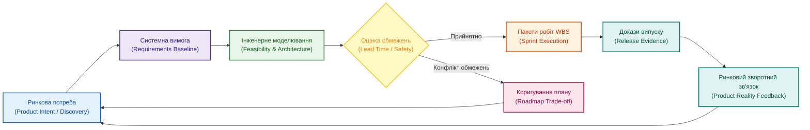

# Інтегрована система проєктного і продуктового менеджменту: як зв'язати задум продукту з інженерною реальністю

**Автор:** [Микола Федчик (Mykola Fedchyk)](book/about-the-author.md) · [LinkedIn](https://www.linkedin.com/in/nickfedchik/) · [GitHub](https://github.com/nick-fedchik)

---

## Вступ

**Мета статті:** визначити архітектурні засади та практичні механізми інтеграції продуктового менеджменту (*Product Management*) із проєктним та інженерним виконанням (*Project Delivery*), забезпечивши безперервний двосторонній зв'язок між ринковим задумом, технічними обмеженнями та доказами випуску.

**Технологічна проблема, яка вирішується:** у багатьох організаціях продуктовий та проєктний менеджери працюють в ізольованих інформаційних світах. Продуктовий лідер оперує дорожніми картами, ринковими можливостями та гіпотезами цінності у спеціалізованих інструментах (Productboard, Aha!), тоді як інженерна команда бачить лише розрізнені задачі у трекері (Jira, GitLab). У результаті проста функція з дорожньої карти несподівано вимагає зміни апаратної схемотехніки, повторної сертифікації безпеки та зриває терміни виходу на ринок. Стаття демонструє, як побудувати спільний контур ухвалення рішень на основі ієрархії вимог.

---

## Дві сторони одного рішення: ринкова цінність проти технічних обмежень

Розрив між продуктовим задумом та інженерними реаліями виникає тоді, коли бізнес-рішення ухвалюються без урахування залежностей фізичного світу.

Продуктовий менеджер відповідає за питання «що саме розробляти і навіщо»: яку проблему клієнта вирішує продукт, яка очікувана ринкова цінність (*Business Value*) та які пріоритети формування дорожньої карти. Керівник проєкту відповідає за питання «як, коли, ким і якою ціною»: який обсяг робіт затверджено, де проходить критичний шлях, які фізичні обмеження постачальників компонентів і які сертифікаційні докази необхідні для виходу на ринок.

Якщо продуктове бачення не враховує інженерних обмежень, дорожня карта перетворюється на оптимістичну презентацію, яка розбивається об перший виробничий цикл. Якщо проєктний план відірваний від ринкового контексту, команда перетворюється на конвеєр механічного закриття карток без розуміння кінцевої цінності.

Успішна розробка потребує єдиного замкненого циклу: продуктовий задум транслюється в технічні вимоги, а інженерні обмеження своєчасно коригують продуктовий графік.

*Інтеграція забезпечує двосторонній зв'язок: інженерні обмеження впливають на пріоритети дорожньої карти до ухвалення зобов'язань перед ринком.*

## Вимоги як головний міст між бізнесом та інженерією

Головним сполучним елементом між продуктовою ідеєю та кодом є формалізована вимога, а не задача в беклозі чи слайд презентації.

Продуктовий задум повинен проходити послідовний ланцюг декомпозиції: ринкова можливість $\to$ вимога зацікавленої сторони (*Stakeholder Requirement*) $\to$ системна вимога (*System Requirement*) $\to$ програмна або апаратна специфікація $\to$ робочий пакет у WBS $\to$ реалізація $\to$ тестовий прогін $\to$ доказ релізу. Спроба перескочити цей ланцюг у складних виробах призводить до того, що інженери реалізують власне розуміння зручності, яке не відповідає очікуванням ринку або порушує нормативи безпеки.

Вимога дозволяє відокремити намір від реалізації. Замовник формулює потребу: «система має виявляти перешкоду швидше». Продуктовий менеджер фіксує бізнес-цінність: «скорочення дистанції гальмування». Системний інженер транслює це у технічні параметри: затримка обробки кадру сенсора менше 15 мілісекунд, поріг достовірності розпізнавання 99,8% та протокол верифікації на стенді HIL.

Така структуризація усуває розбіжності та забезпечує взаємне розуміння між бізнесом та розробкою.

## Математична оцінка пріоритетів з урахуванням інженерних та безпекових витрат (WSJF)

Для об'єктивного ранжування функцій у дорожній карті суб'єктивні відчуття мають бути замінені модифікованим алгоритмом оцінки з урахуванням інженерних обмежень.

Класична методика WSJF (*Weighted Shortest Job First*) розраховує пріоритет як відношення вартості затримки (*Cost of Delay*, CoD) до тривалості розробки. Проте в апаратно-програмних комплексах тривалість суттєво залежить від необхідності пересертифікації та апаратних переробок. Модифікований показник інженерного пріоритету $\text{WSJF}_{\text{eng}}$ визначається формулою:

$$\text{WSJF}_{\text{eng}} = \frac{V_{\text{user}} + T_{\text{crit}} + R_{\text{mit}}}{\sum_{i=1}^{M} d_i \cdot \left(1 + \kappa_{\text{safety}} \cdot \mathbb{I}_{\text{safety}}\right) + T_{\text{lead}}}$$

**Тут:**
- $\text{WSJF}_{\text{eng}}$ є інтегральним коефіцієнтом пріоритету функції для включення в найближчий випуск (додатне дійсне число).
- $V_{\text{user}}$ є користувацькою та бізнес-цінністю функції за стандартною відносною шкалою (наприклад, від 1 до 20).
- $T_{\text{crit}}$ є фактором критичності до часу виходу на ринок (*Time Criticality*, від 1 до 20).
- $R_{\text{mit}}$ є величиною зниження ризику або створення нової технічної спроможності (*Risk Reduction / Opportunity Enablement*, від 1 до 20).
- $d_i$ є базовою тривалістю виконання $i$-го робочого пакета розробки коду (у робочих тижнях).
- $\kappa_{\text{safety}}$ є штрафним коефіцієнтом витрат на сертифікацію та верифікацію безпеки за ISO 26262 чи DO-178C (як правило, $\kappa_{\text{safety}} \in [0{,}5; 1{,}5]$).
- $\mathbb{I}_{\text{safety}}$ є індикатором впливу на функції безпеки: $\mathbb{I}_{\text{safety}} = 1$, якщо функція зачіпає критичні контури, і $\mathbb{I}_{\text{safety}} = 0$ в іншому випадку.
- $T_{\text{lead}}$ є часом фізичного постачання нових апаратних зразків або броні лабораторій (у тижнях).

**Навчальний числовий приклад:**
Порівняємо дві функції для автомобільного бортового комп'ютера:
- **Функція А (Оновлення графічного інтерфейсу мультимедіа):** висока бізнес-цінність ($V_{\text{user}} = 15, T_{\text{crit}} = 5, R_{\text{mit}} = 2$, сума $\text{CoD} = 22$). Робота вимагає $d = 4$ тижні суто програмної розробки без зачіпання безпеки ($\mathbb{I}_{\text{safety}} = 0, T_{\text{lead}} = 0$).
  $$\text{WSJF}_{\text{eng, A}} = \frac{22}{4 \cdot 1 + 0} = \frac{22}{4} = 5{,}5$$
- **Функція Б (Додатковий режим екстреного гальмування):** дуже висока цінність ($V_{\text{user}} = 20, T_{\text{crit}} = 10, R_{\text{mit}} = 15$, сума $\text{CoD} = 45$). Програмна розробка триває $d = 3$ тижні, але функція зачіпає безпековий контур ASIL D ($\kappa_{\text{safety}} = 1{,}5, \mathbb{I}_{\text{safety}} = 1$) і вимагає постачання датчика ($T_{\text{lead}} = 6$ тижнів):
  $$\text{WSJF}_{\text{eng, B}} = \frac{45}{3 \cdot (1 + 1{,}5 \cdot 1) + 6} = \frac{45}{3 \cdot 2{,}5 + 6} = \frac{45}{7{,}5 + 6} = \frac{45}{13{,}5} \approx 3{,}33$$

Розрахунок демонструє важливий парадокс: хоча функція Б має значно вищу абсолютну цінність (45 проти 22), врахування фізичного постачання та сертифікаційного навантаження показує, що її пріоритет ($\text{WSJF} = 3{,}33$) нижчий за функцію А ($\text{WSJF} = 5{,}5$). Продуктовий менеджер отримує математичний доказ: функцію А вигідніше випустити в найближчому релізі, паралельно запустивши замовлення датчиків для функції Б на дальній горизонт.

## Інформаційна мережа артефактів: що саме має бути пов'язано

Інтеграція продуктового та проєктного контурів вимагає зв'язування розрізнених баз даних у єдину семантичну мережу.

Мінімальний інженерний ланцюг охоплює сутності: відгук клієнта (*Customer Feedback*) $\to$ продуктова можливість $\to$ системна вимога $\to$ архітектурне рішення (ADR) $\to$ робочий пакет WBS $\to$ відкритий ризик $\to$ протокол випробувань $\to$ статус відповідності стандартам. Якщо ці дані не зв'язані, продуктовий лідер бачить статус «у розробці», не підозрюючи, що два обов'язкові тести безпеки провалилися, а реліз заблоковано.

Коли об'єкти об'єднані в цифровий граф, зміна пріоритету функції в дорожній карті автоматично перераховує критичний шлях у графіку робіт, показуючи, які ресурси необхідно перерозподілити.

## Двосторонній цикл зворотного зв'язку

Справжня інтеграція не завершується передачею вимог в інженерну команду: вона вимагає регулярного повернення фактів розробки до продуктового аналізу.

Після завершення ітерації продуктовий менеджер повинен отримувати не формальне сповіщення про закриття завдання, а структурований звіт про фактичний стан системи:
1. Які саме технічні характеристики досягнуто (наприклад, реальна швидкість опитування датчика становить 20 мс замість планових 10 мс через апаратні обмеження шини).
2. Які залишкові ризики та інженерні допущення залишаються відкритими.
3. Скільки тимчасових технічних відхилень (*Waivers*) було погоджено для забезпечення випуску.

Отримавши ці об'єктивні факти, продуктовий менеджер приймає зважене рішення: чи виходити на ринок із поточними обмеженнями, чи виділити додатковий бюджет на оптимізацію схемотехніки.

## Роль штучного інтелекту як технічного перекладача

Штучний інтелект у системі інтегрованого менеджменту допомагає подолати мовний бар'єр між продуктовими та технічними лідерами.

Мовний асистент виконує взаємний переклад інженерного та бізнесового контекстів:
- Для продуктового менеджера асистент транслює складні звіти про падіння тестів пам'яті у зрозумілий опис загрози для бізнесу: «Збій у драйвері пам'яті може призвести до перезавантаження панелі приладів під час руху, що суперечить вимогам безпеки ISO 26262 і блокує відвантаження партії автомобілів замовнику».
- Для інженерної команди асистент перетворює маркетингові описи потреб користувача на чіткі інженерні обмеження та перевірочні критерії.

При цьому штучний інтелект не ухвалює рішень щодо пріоритетів чи компромісів, надаючи лише структуровані аргументи з точними посиланнями на першоджерела.

## Практичний контрольний список інтеграції

Для оцінки реального рівня зрілості взаємодії між продуктовим та проєктним менеджментом у вашій організації варто перевірити такі критерії:
1. **Простежуваність:** чи можете ви за 60 секунд перейти від пункту дорожньої карти до повного списку задіяних компонентів коду та протоколів випробувань?
2. **Врахування регуляторних витрат:** чи включає продуктова дорожня карта час та бюджет на сертифікацію безпеки й кліматичні тести?
3. **Зворотний зв'язок:** чи повертаються технічні обмеження виробу (затримки, енергоспоживання, пам'ять) у продуктовий беклог як явні фактори пріоритезації?
4. **Прозорість компромісів:** чи зафіксовані причини спрощення функцій в офіційних журналах рішень (ADR)?

Якщо ці умови виконуються, організація переходить від взаємних звинувачень до спільного управління успіхом продукту на ринку.

---

## Висновки

1. Продуктовий та проєктний менеджмент є двома взаємодоповнюючими сторонами єдиного процесу розробки, які мають бути зв'язані через спільну онтологічну модель даних.
2. Вимога є головним сполучним мостом між ринковим наміром продуктового лідера та фізичною реалізацією в апаратурі й коді.
3. Модифікований алгоритм WSJF дозволяє об'єктивно ранжувати пріоритети завдань з обов'язковим урахуванням тривалості постачання компонентів та витрат на сертифікацію безпеки.
4. Зворотний зв'язок від інженерного виконання до продуктової дорожньої карти гарантує прийняття бізнес-рішень на основі об'єктивних технічних фактів.
5. Штучний інтелект у контурі інтегрованого менеджменту забезпечує ефективний семантичний переклад між маркетинговими очікуваннями та інженерними обмеженнями.

---

## Посилання

1. ISO 21502:2020. *Project, programme and portfolio management — Guidance on project management*. International Organization for Standardization, Geneva, Switzerland. [https://www.iso.org/standard/74947.html](https://www.iso.org/standard/74947.html)
2. ISO 21503:2022. *Project, programme and portfolio management — Guidance on programme management*. International Organization for Standardization, Geneva, Switzerland. [https://www.iso.org/standard/78644.html](https://www.iso.org/standard/78644.html)
3. Reinertsen, D. G. *The Principles of Product Development Flow: Second Generation Lean Product Development*. Celeritas Publishing, 2009.
4. Cagan, M. *Inspired: How to Create Tech Products Customers Love*. 2nd Edition. John Wiley & Sons, 2017.
5. Bass, L., Clements, P., Kazman, R. *Software Architecture in Practice*. 4th Edition. Addison-Wesley, 2021.

---

## Терміни

- **Вартість затримки (Cost of Delay, CoD)**: грошове та конкурентне вираження втрат, яких зазнає організація внаслідок відкладення виходу функції чи продукту на ринок.
- **Вимога зацікавленої сторони (Stakeholder Requirement)**: формалізоване твердження про потреби та очікування користувачів, клієнтів чи регуляторів, виражене мовою бізнес-цілей.
- **Дорожня карта продукту (Product Roadmap)**: стратегічний документ, що відображає бачення розвитку виробу, основні пріоритети функціоналу та очікувані часові горизонти випуску.
- **Задум продукту (Product Intent)**: первинна концепція та бізнес-мета створення або модифікації виробу, спрямована на закриття виявленої проблеми користувача.
- **Принцип WSJF (Weighted Shortest Job First)**: метод пріоритезації завдань, що максимізує економічну віддачу шляхом ділення вартості затримки на тривалість виконання роботи.
- **Тимчасове відхилення (Waiver)**: офіційно затверджений дозвіл на випуск виробу з відомим локальним невиправленим відхиленням від специфікації за умови відсутності загроз безпеці.

---

## Скорочення

- **ADR**: Architecture Decision Record (журнал архітектурних рішень)
- **ASIL**: Automotive Safety Integrity Level (рівень повноти безпеки в автомобілебудуванні)
- **CAN**: Controller Area Network (бортова мережа контролерів)
- **CoD**: Cost of Delay (вартість затримки)
- **HIL**: Hardware-in-the-Loop (апаратно-програмне моделювання на фізичному стенді)
- **ISO**: International Organization for Standardization (Міжнародна організація зі стандартизації)
- **WBS**: Work Breakdown Structure (ієрархічна структура робіт)
- **WSJF**: Weighted Shortest Job First (найкоротша зважена робота виконується першою)

---

## Про автора

**Микола Федчик (Mykola Fedchyk)**: український інженер, системний архітектор та дослідник у галузі кіберфізичних комплексів, доказового штучного інтелекту та критичних вбудованих систем. Понад двадцять років керує інженерними розробками та проєктуванням складних апаратно-програмних комплексів у сфері мережевої безпеки, телекомунікацій та автомобільної електроніки відповідно до вимог міжнародних стандартів ISO 26262 та ISO/SAE 21434. Досліджує практичне застосування експертних систем, семантичних онтологій та цифрової нитки для управління складними інженерними програмами.

Детальніша інформація: [Про автора](book/about-the-author.md) · [LinkedIn](https://www.linkedin.com/in/nickfedchik/) · [GitHub](https://github.com/nick-fedchik)
