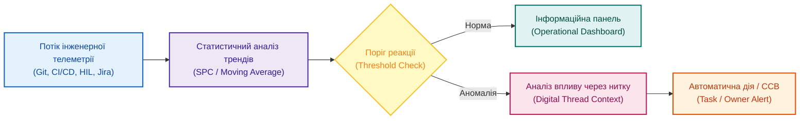

# Метрики не для звіту: як помічати відхилення вчасно

**Автор:** [Микола Федчик (Mykola Fedchyk)](book/about-the-author.md) · [LinkedIn](https://www.linkedin.com/in/nickfedchik/) · [GitHub](https://github.com/nick-fedchik)

---

## Вступ

**Мета статті:** визначити інженерні принципи переходу від статичних звітних метрик до дієвих операційних індикаторів раннього попередження, які автоматично сигналізують про технічні відхилення в день їх виникнення та запускають регламентовані управлінські реакції.

**Технологічна проблема, яка вирішується:** у більшості технічних проєктів метрики збираються вручну раз на тиждень або раз на місяць спеціально для презентацій керівництву. У результаті дані констатують минуле, коли зрив термінів чи деградація якості вже сталися. Затримка нічних регресійних тестів, зростання нестабільності вимог та дефіцит пропускної спроможності команд залишаються непоміченими у щоденній метушні. Стаття демонструє, як інтегрувати метрики в конвеєри інженерних даних та пов'язати їх із законами теорії масового обслуговування.

---

## Метрики для минулого проти сигналів для дії

Головна вада традиційної проєктної звітності полягає в тому, що вона фіксує наслідки кризи замість її випередження.

Звітні метрики (*Reporting Metrics*) орієнтовані на ретроспективу: вони демонструють вищому керівництву, скільки годин витрачено за минулий місяць, скільки завдань формально закрито і який відсоток бюджету освоєно. Це створює ілюзію повного контролю, проте не дає інженерному лідеру жодної підказки щодо того, де саме рветься процес сьогодні. Натомість операційні індикатори (*Operational Leading Indicators*) працюють як панель приладів автомобіля: вони реагують на динаміку змін у реальному часі.

Якщо середня тривалість проходження коду через рев'ю раптово подвоїлася, а кількість дефектів у новому модулі підскочила після чергового злиття гілок, система зобов'язана згенерувати попередження негайно, а не чекати кінця звітного періоду.

Дієва метрика завжди веде до конкретної інженерної дії, інакше вона перетворюється на беззмістовну цифру для презентацій.

*Операційні метрики аналізують потік інженерних подій та автоматично створюють коригувальні завдання у разі перетину порогових значень.*

## Розрізнені інструменти створюють сліпі зони

Неможливість своєчасно виявити проблему часто зумовлена тим, що первинні дані розпорошені між несумісними системами обліку.

Трекер завдань оптимістично показує, що 90% карток поточного етапу закриті. Водночас система тестування фіксує, що обов'язкові сценарії регресії для трьох вимог безпеки ще навіть не запускалися через відсутність апаратного стенда. Репозиторій мікропрограм показує накопичення непереглянутих запитів на злиття коду, а в таблиці логістики зазначено, що партія дослідних зразків процесора затримується на митниці. Кожен окремий керівник бачить свій сектор зеленим, але в точці інтеграції виникає колапс.

Цінність мають лише інтегровані метрики, що поєднують різні виміри розробки: «кількість відкритих критичних дефектів у модулях, які блокують випробування на контрольному пункті релізу».

Коли показник спирається на наскрізний семантичний зв'язок між артефактами, він стає надійним сигналом для ухвалення рішень.

## Математичне моделювання затримок розробки за законом Літтла

Для розуміння причин деградації термінів розробки інженерний потік завдань підпорядковується фундаментальним законам теорії масового обслуговування.

Часто керівники намагаються прискорити відстаючий проєкт шляхом одночасного запуску великої кількості нових завдань. Проте закон Літтла (*Little's Law*) доводить, що за сталої продуктивності команди збільшення обсягу незавершеного виробництва призводить до прямо пропорційного зростання тривалості циклу виконання.

Середній час виробничого циклу виконання завдання $\bar{T}_{\text{cycle}}$ розраховується за формулою:

$$\bar{T}_{\text{cycle}} = \frac{\text{WIP}}{\text{TH}}$$

**Тут:**
- $\bar{T}_{\text{cycle}}$ є середнім часом виконання завдання від моменту взяття в роботу до передачі на верифікацію (вимірюється в робочих днях).
- $\text{WIP}$ (*Work in Progress*) є кількістю завдань, що одночасно перебувають у незавершеному стані в роботі інженерів (ціле додатне число).
- $\text{TH}$ (*Throughput*) є пропускною спроможністю команди, тобто середньою кількістю повністю перевірених і прийнятих завдань за одиницю часу (у задачах за день).

**Навчальний числовий приклад:**
Інженерна група з розробки прошивок має стабільну пропускну спроможність $\text{TH} = 2{,}5$ завдання на день.
1. У нормальному режимі команда тримає в одночасній роботі $\text{WIP}_1 = 10$ завдань.
   Середній час проходження однієї задачі через цикл становить:
   $$\bar{T}_{\text{cycle},1} = \frac{10}{2{,}5} = 4 \text{ дні}$$
2. Під тиском дедлайну керівник наказує команді одночасно взятися за всі накопичені задачі, збільшуючи незавершене виробництво до $\text{WIP}_2 = 35$ завдань. Оскільки пропускна спроможність обмежена кількістю спеціалістів та стендів, вона не зростає:
   $$\bar{T}_{\text{cycle},2} = \frac{35}{2{,}5} = 14 \text{ днів}$$

Закон Літтла наочно демонструє парадокс: намагання робити все одночасно призвело до зростання середнього часу виконання кожної задачі з 4 до 14 днів через постійне перемикання контексту, блокування на спільних стендах та очікування рев'ю. Замість прискорення проєкт отримав триразове уповільнення.

Контроль та обмеження незавершеного виробництва (WIP Limits) є найпершою дієвою операційною метрикою інженерного менеджера.

## Джерела даних та встановлення порогів реакції

Операційні метрики повинні спиратися на об'єктивні сигнали інструментів розробки, а не на самозвіти працівників.

У складній інженерній програмі ключові джерела даних охоплюють:
1. **Системи версійності та збирання (Git / CI/CD):** частота падіння нічних збірок, середня тривалість рецензування коду (*pull request turnaround*), кількість конфліктів при злитті гілок.
2. **Стенди тестування та верифікації (HIL / SIL):** відсоток проходження обов'язкових сценаріїв безпеки, стабільність роботи шини передачі даних, час повернення стенда до працездатного стану після збою.
3. **Системи управління вимогами:** швидкість модифікації вимог після фіксації базової версії (*Requirements Volatility*), частка специфікацій без призначених перевірочних тестів.
4. **Реєстр ризиків і дефектів:** динаміка накопичення блокуючих дефектів (*Defect Arrival Rate*), кількість прострочених дій з пом'якшення ризиків.

Кожен показник повинен мати визначений числовий поріг спрацьовування (*Threshold*) та закріпленого інженерного власника. Без чіткого порогу метрики перетворюються на інформаційний шум: коли всі графіки миготять жовтим, команда перестає звертати увагу на небезпеку.

## Роль штучного інтелекту: від чисел до причинно-наслідкового пояснення

Штучний інтелект у системі моніторингу метрик має виконувати функцію діагностичного асистента, а не просто переказувати графіки іншими словами.

Замість банальної фрази «кількість дефектів зросла на 15%» зрілий асистент на базі мовної моделі формулює структурований технічний висновок:
- «За останні 3 дні зареєстровано 8 дефектів у підсистемі керування приводом; 5 із них пов'язані з нещодавньою зміною протоколу SPI; 2 дефекти блокують виконання обов'язкових тестів готовності релізу R-04».
- «Рекомендована дія: призначити позачергове рецензування змін у конфігурації драйвера SPI, повторно прогнати тести регресії та сповістити керівника програми про загрозу зміщення віхи випуску».

Така аналітика спирається на первинні артефакти цифрової нитки, виключаючи маніпуляції та суб'єктивні виправдання.

## Автоматизація реакцій: зв'язок метрики з робочим процесом

Найвища зрілість інженерного управління досягається тоді, коли перетин критичного порогу метрики автоматично ініціює регламентовану системну дію.

Якщо покриття коду тестами опускається нижче затвердженого стандартом рівня (наприклад, MC/DC менше 100% для систем безпеки ASIL D за ISO 26262), конвеєр автоматично блокує можливість злиття гілки у релізний репозиторій. Якщо постачальник зміщує дату відвантаження зразків мікросхем, система автоматично перераховує дату початку стендових тестів і генерує запит на позачергове засідання ради контролю змін (CCB).

Автоматизація прибирає інформаційну затримку між появою технічного симптому та управлінською реакцією, гарантуючи розгляд проблем у момент їхньої мінімальної вартості.

## Покроковий план налаштування операційних метрик

Перехід на дієві метрики не вимагає глобального перегляду всіх процесів підприємства: достатньо почати з кількох найболючіших точок.

Рекомендований план дій:
1. **Крок 1:** вибрати три ключові показники, які безпосередньо впливають на успішність найближчого релізу (наприклад: кількість незавершених завдань у роботі WIP, частка падіння нічних тестів та кількість відкритих блокуючих дефектів).
2. **Крок 2:** встановити суворі числові межі для зеленого, жовтого та червоного станів.
3. **Крок 3:** закріпити персональну відповідальність: визначити конкретного інженера, зобов'язаного зреагувати протягом 4 годин у разі переходу метрики в червону зону.
4. **Крок 4:** автоматизувати збір даних безпосередньо з робочих інструментів (GitLab, Jira, TestRail), повністю виключивши ручне заповнення таблиць перед звітами.

Такий підхід повертає команді відчуття реального пульсу розробки і перетворює метрики на щоденний робочий інструмент успішної доставки продукту.

---

## Висновки

1. Проєктні метрики повинні функціонувати як оперативні сигнали раннього попередження в режимі реального часу, а не як ретроспективні звіти для презентацій керівництву.
2. Закон Літтла математично доводить, що штучне збільшення обсягу незавершеного виробництва (WIP) за сталої продуктивності команди неминуче призводить до багатократного зростання тривалості виробничого циклу.
3. Ефективна метрика завжди спирається на наскрізні семантичні зв'язки між артефактами цифрової нитки, поєднуючи технічні збої з бізнес-наслідками та датами релізу.
4. Кожен операційний показник повинен мати однозначно визначений числовий поріг спрацьовування та закріпленого інженерного власника, відповідального за реакцію.
5. Штучний інтелект у контурі метрик забезпечує автоматичний причинно-наслідковий аналіз аномалій, пропонуючи перевірні варіанти інженерних дій на основі об'єктивних фактів.

---

## Посилання

1. ISO 21502:2020. *Project, programme and portfolio management — Guidance on project management*. International Organization for Standardization, Geneva, Switzerland. [https://www.iso.org/standard/74947.html](https://www.iso.org/standard/74947.html)
2. ISO 26262-8:2018. *Road vehicles — Functional safety — Part 8: Supporting processes*. International Organization for Standardization, Geneva, Switzerland. [https://www.iso.org/standard/68387.html](https://www.iso.org/standard/68387.html)
3. Little, J. D. C. *A Proof for the Queuing Formula: $L = \lambda W$*. Operations Research, 9(3), 383–387, 1961. [https://doi.org/10.1287/opre.9.3.383](https://doi.org/10.1287/opre.9.3.383)
4. Montgomery, D. C. *Introduction to Statistical Quality Control*. 8th Edition. John Wiley & Sons, 2019.
5. Kerzner, H. *Project Management Metrics, KPIs, and Dashboards: A Guide to Measuring and Monitoring Project Performance*. 4th Edition. John Wiley & Sons, 2022.

---

## Терміни

- **Дієва метрика (Actionable Metric)**: показник процесу, зміна значення якого однозначно вказує на конкретну технічну причину та ініціює регламентовану коригувальну дію.
- **Закон Літтла (Little's Law)**: фундаментальна теорема теорії масового обслуговування, яка стверджує, що середня кількість елементів у стаціонарній системі дорівнює добутку середньої швидкості надходження на середній час перебування елемента в системі.
- **Незавершене виробництво (Work in Progress, WIP)**: кількість завдань, вимог або деталей, які вже взяті в розробку, але ще не пройшли повну верифікацію та фінальне приймання.
- **Показник марнославства (Vanity Metric)**: цифра або графік у звіті, що виглядає привабливо, але не дає практичної інформації для прийняття інженерних чи управлінських рішень.
- **Поріг спрацьовування (Action Threshold)**: заздалегідь встановлене критичне значення метрики, досягнення якого автоматично вимагає втручання відповідального інженера чи скликання комісії.
- **Пропускна спроможність (Throughput)**: середня кількість успішно виконаних та перевірених робочих одиниць за фіксований проміжок часу.
- **Час виробничого циклу (Cycle Time)**: тривалість проходження завдання через усі технологічні етапи від моменту початку активної роботи до отримання підтвердженого результату.

---

## Скорочення

- **ASIL**: Automotive Safety Integrity Level (рівень повноти безпеки в автомобільній промисловості)
- **CAN**: Controller Area Network (бортова мережа контролерів)
- **CCB**: Change Control Board (рада контролю змін)
- **CI/CD**: Continuous Integration / Continuous Delivery (неперервна інтеграція та доставка)
- **HIL**: Hardware-in-the-Loop (апаратно-програмне моделювання на фізичному стенді)
- **MC/DC**: Modified Condition / Decision Coverage (модифіковане покриття умов та рішень)
- **SIL**: Software-in-the-Loop (програмне моделювання систем)
- **SPI**: Serial Peripheral Interface (послідовний синхронний інтерфейс зв'язку)
- **WIP**: Work in Progress (незавершене виробництво)

---

## Про автора

**Микола Федчик (Mykola Fedchyk)**: український інженер, системний архітектор та дослідник у галузі кіберфізичних комплексів, доказового штучного інтелекту та критичних вбудованих систем. Понад двадцять років керує інженерними розробками та проєктуванням складних апаратно-програмних комплексів у сфері мережевої безпеки, телекомунікацій та автомобільної електроніки відповідно до вимог міжнародних стандартів ISO 26262 та ISO/SAE 21434. Досліджує практичне застосування експертних систем, семантичних онтологій та цифрової нитки для управління складними інженерними програмами.

Детальніша інформація: [Про автора](book/about-the-author.md) · [LinkedIn](https://www.linkedin.com/in/nickfedchik/) · [GitHub](https://github.com/nick-fedchik)
