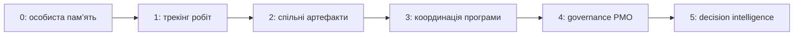

# PMO після AI: зрілість, платформа і право сказати «ні»

Автоматизація здатна зібрати статус швидше, але не здатна сама визначити, чи варта ініціатива дефіцитного ресурсу. Тому PMO після AI — не конвеєр презентацій, а власник моделі управління: як організація порівнює ініціативи, веде залежності, зберігає рішення і вчиться на них.

Зрілість не є рейтингом «кращий/гірший». Це відповідь на питання, який рівень дисципліни реально підтримується даними. AI на рівні 0 лише пришвидшує хаос; на рівні 3–4 він може пояснювати вплив, готувати сценарії та знаходити розриви в evidence.

## Купити, збудувати чи поєднати

Готовий продукт доречний для стандартних функцій: планування, задачі, документи, базова звітність. Внутрішня платформа виправдана там, де міститься унікальна модель продукту, залежностей, правил доступу або доказів. Найчастіше чесна відповідь — гібрид: купити commodity-функції, а власними лишити дані, інтеграційні контракти та governance.

Повну вартість рішення не можна зводити до ліцензії:

$$TCO=C_{license}+C_{integration}+C_{migration}+C_{operation}+C_{exit}.$$

PMO має вміти оцінити також ціну помилки: vendor lock-in, непрозорого алгоритму чи втрати історії рішень. Його найскладніша функція — робити trade-off видимим і зупиняти роботу, яка не має достатньої цінності, доказів або спроможності.
