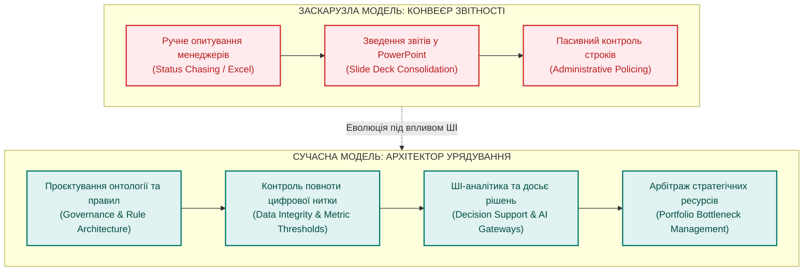

# Проєктний офіс (PMO) після впровадження ШІ: архітектор системного урядування замість конвеєра звітності

**Автор:** [Микола Федчик (Mykola Fedchyk)](book/about-the-author.md) · [LinkedIn](https://www.linkedin.com/in/nickfedchik/) · [GitHub](https://github.com/nick-fedchik)

---

## Вступ

**Мета статті:** визначити нову стратегічну роль офісу управління проєктами та програмами (*Project Management Office*, PMO) в епоху штучного інтелекту, показавши трансформацію підрозділу від ручного збору статусних презентацій до проєктування правил системного урядування, контролю якості інженерних даних та підтримки прийняття рішень.

**Технологічна проблема, яка вирішується:** класичний проєктний офіс у багатьох компаніях функціонує як адміністративний конвеєр: співробітники витрачають більшу частину тижня на нагадування менеджерам про оновлення таблиць, зведення статусів у слайди та малювання графіків для наглядових комітетів. З появою мовних моделей та автоматизованих конвеєрів збору артефактів ця діяльність миттєво знецінюється: алгоритми здатні сформувати звіт за кілька секунд. Якщо PMO не змінює фокус, він стає зайвою бюрократичною ланкою. Стаття демонструє, як перетворити PMO на архітектора правил корпоративного управління.

---

## Класичний PMO та криза ручного збору статусів

Традиційна модель проєктного офісу, побудована навколо ручного переписування звітів, втрачає сенс за наявності інтегрованих цифрових даних.

Історично PMO створювався для подолання управлінського хаосу: він стандартизував шаблони планів, впроваджував графіки звітних нарад та встановлював єдину шкалу кольорів світлофора для статусів. Проте поступово офіс перетворився на «поліцію слайдів»: менеджери проєктів малюють презентації для PMO, співробітники офісу консолідують їх у гігантські портфельні колоди, а вище керівництво все одно змушене проводити індивідуальні дзвінки, щоб дізнатися правду.

Головна вада такої системи полягає в тому, що офіс контролює форму документа, але не має можливості перевірити істинність закладених у нього технічних фактів. Проєкт може позначатися зеленим, тоді як критичні тести провалені, а затримка постачальника вже зруйнувала інтеграційний план.

Впровадження штучного інтелекту ліквідує потребу в «людях-інтерфейсах», які просто переносять текст між програмами.

```mermaid
flowchart TD
    accTitle: Трансформація ролі PMO в епоху штучного інтелекту
    accDescr: Від пасивного конвеєра збору звітів до активного рушія правил урядування та контролю якості даних.

    subgraph LegacyPMO["ЗАСКАРУЗЛА МОДЕЛЬ: КОНВЕЄР ЗВІТНОСТІ"]
        M1["Ручне опитування менеджерів<br/>(Status Chasing / Excel)"] --> M2["Зведення звітів у PowerPoint<br/>(Slide Deck Consolidation)"]
        M2 --> M3["Пасивний контроль строків<br/>(Administrative Policing)"]
    end

    subgraph ModernPMO["СУЧАСНА МОДЕЛЬ: АРХІТЕКТОР УРЯДУВАННЯ"]
        G1["Проєктування онтології та правил<br/>(Governance & Rule Architecture)"] --> G2["Контроль повноти цифрової нитки<br/>(Data Integrity & Metric Thresholds)"]
        G2 --> G3["ШІ-аналітика та досьє рішень<br/>(Decision Support & AI Gateways)"]
        G3 --> G4["Арбітраж стратегічних ресурсів<br/>(Portfolio Bottleneck Management)"]
    end

    LegacyPMO -.Еволюція під впливом ШІ.-> ModernPMO

    classDef leg fill:#ffebee,stroke:#d32f2f,stroke-width:2px,color:#b71c1c;
    classDef mod fill:#e0f2f1,stroke:#00796b,stroke-width:2px,color:#004d40;

    class M1,M2,M3 leg;
    class G1,G2,G3,G4 mod;
```

*Проєктний офіс переходить від ручного переслідування за статусами до інженерного проєктування правил і метрик управління.*

## Що автоматизує штучний інтелект: ліквідація рутинного конвеєра

Здатність сучасних систем автоматично зчитувати стан розробки з інструментів звільняє фахівців від щотижневої рутини.

Інтегрована система управління без участі людини відстежує стан задач у Jira, результати збирання у GitLab, динаміку дефектів у баг-трекері та проходження верифікаційних сценаріїв у TestRail. Мовна модель за лічені секунди синтезує ці дані у зв'язний наративний опис: що змінилося за останні сім днів, де виникли затримки, які вимоги стандарту опинилися під загрозою та які контракти постачальників вимагають перегляду.

Роль PMO кардинально зміщується на рівень вище: замість складання звітів офіс проєктує правила валідації даних, за якими працює аналітичний рушій:
1. Визначає точну семантику статусів: що саме означає жовтий статус у числовому вимірі затримки.
2. Встановлює обов'язкові порогові значення для автоматичного блокування релізу.
3. Формулює вимоги до свіжості регуляторних доказів (*Evidence Freshness*).
4. Налаштовує політики інформаційної безпеки для локальних мовних моделей.

PMO стає конструкторським бюро управлінських процесів, забезпечуючи довіру до вихідної інформації.

## Математична модель коефіцієнта корисності проєктного офісу

Для оцінки успішності трансформації PMO доцільно розраховувати коефіцієнт стратегічної віддачі офісу відносно адміністративних витрат часу.

Нехай штат офісу становить $N_{\text{staff}}$ фахівців із сумарним тижневим фондом робочого часу $T_{\text{total}}$. Розподілимо діяльність офісу на дві категорії: адміністративне обслуговування звітів $T_{\text{manual}}$ (опитування менеджерів, копіювання таблиць, верстка презентацій) та стратегічне урядування $T_{\text{strategic}}$ (проєктування правил, аналіз вузьких місць портфеля, підготовка досьє для CCB, оптимізація цифрової нитки). Коефіцієнт цінності офісу $V_{\text{pmo}}$ визначається формулою:

$$V_{\text{pmo}} = \frac{T_{\text{strategic}}}{T_{\text{manual}} + \epsilon} = \frac{T_{\text{total}} - T_{\text{manual}}}{T_{\text{manual}} + \epsilon}$$

де $\epsilon > 0$ є малим збуренням для запобігання діленню на нуль при повній автоматизації рутини.

**Навчальний числовий приклад:**
Розглянемо проєктний офіс із 5 спеціалістів ($T_{\text{total}} = 5 \times 40 = 200$ людино-годин на тиждень):
1. **Традиційний режим (до автоматизації):** співробітники витрачають 160 годин на тиждень на рутинні звіти та нагадування ($T_{\text{manual}} = 160$ год), залишаючи на стратегічну роботу лише 40 годин ($T_{\text{strategic}} = 40$ год):
   $$V_{\text{pmo}, 1} = \frac{40}{160} = 0{,}25$$
   Офіс генерує у 4 рази більше паперового тертя, ніж реальної користі для рішень.
2. **Трансформований режим (після впровадження цифрової нитки та ШІ):** статусний звіт збирається автоматично, а час на ручне перенесення даних скоротився до 15 годин на тиждень ($T_{\text{manual}} = 15$ год). Вивільнені 185 годин спрямовані на аналіз міжпроєктних залежностей, моделювання черг у лабораторіях та підготовку компромісних сценаріїв:
   $$V_{\text{pmo}, 2} = \frac{185}{15} \approx 12{,}33$$

Розрахунок демонструє колосальне зростання коефіцієнта корисності PMO: майже у 50 разів! Офіс припиняє бути адміністративним тягарем для інженерів і стає потужним аналітичним центром, що безпосередньо впливає на швидкість та якість доставки складних систем.

## Проєктний офіс як архітектор правил системного урядування

В епоху штучного інтелекту PMO стає власником архітектури правил (*Governance Architecture*), що забезпечують єдине розуміння фактів усіма учасниками процесу.

Хтось у компанії зобов'язаний формалізувати правила: які артефакти є канонічними, які метрики запускають ескалацію, як функціонує комітет контролю змін (CCB) та які критерії блокують релізний шлюз. Якщо PMO не визначив точну семантику понять, інформаційні панелі стають інструментом маніпуляцій. Наприклад, для однієї команди жовтий статус означає «є незначні затримки, але контроль збережено», а для іншої вказує на те, що «ми вже зірвали графік на місяць, але боїмося сповістити керівництво».

Офіс перетворює правила управління на машинозчитувані обмеження. Якщо регламент стверджує, що наявність відкритого дефекту безпеки блокує передачу прошивки клієнту, система автоматично забороняє формування релізного пакета до отримання офіційного тимчасового відхилення (*Waiver*).

## PMO як продуктовий власник внутрішньої платформи управління

Проєктний офіс повинен ставитися до корпоративної інфраструктури управління як до внутрішнього цифрового продукту.

Користувачами цього внутрішнього продукту є інженери, архітектори, тестувальники, керівники проєктів та вище керівництво підприємства. Цінність продукту вимірюється не кількістю створених форм і звітів, а скороченням адміністративного тертя та підвищенням швидкості прийняття обґрунтованих рішень.

PMO формує дорожню карту розвитку інструментів:
1. Визначає пріоритетні інтеграції між системами вимог, репозиторіями та лабораторними стендами.
2. Ліквідує дублювання полів і форм, які дратують команди розробників.
3. Впроваджує локальні мовні асистенти для автоматичної генерації чернеток сертифікаційних документів.
4. Проводить регулярний аудит зручності системи: якщо інженери ведуть паралельні таблиці в Excel, отже, офіційна платформа вимагає доопрацювання.

Такий підхід будує партнерські відносини між PMO та технічними підрозділами.

## Ризики трансформації: як уникнути нової бюрократії

Автоматизація управління несе прихований ризик перетворення на «цифрову бюрократію», якщо офіс втратить почуття міри.

Поширені загрози та шляхи їхньої нейтралізації:
- **Надмірна уніфікація:** спроба змусити науково-дослідні прототипи (R&D) працювати за тими самими важкими регламентами, що й серійні автомобільні блоки керування. Лікування: впровадження адаптивних рівнів контролю залежно від класу виробу.
- **Метричний фасад:** автоматизація збору показників без аналізу їхнього змісту (наприклад, підрахунок кількості закритих задач без оцінки тестового покриття). Лікування: використання виключно дієвих метрик, прив'язаних до цілей безпеки.
- **Вимога надлишкових метаданих:** примушування інженерів вручну заповнювати десятки класифікаційних полів. Лікування: максимальне автоматичне вилучення контексту з Git, CI/CD та специфікацій.

PMO повинен пам'ятати: мета управління полягає в успішному випуску надійного продукту, а не в бездоганності заповнення форм.

## Покроковий план переходу до інтелектуального PMO

Трансформація проєктного офісу не вимагає одномоментної революції: її варто здійснювати еволюційно через один проблемний процес.

Рекомендовані етапи змін:
1. **Крок 1:** ліквідувати ручний щотижневий збір статус-звітів, налаштувавши автоматичну генерацію коротких зведень із трекера завдань та репозиторіїв.
2. **Крок 2:** розробити та затвердити єдину таксономію інженерних ризиків і правил проходження контрольних пунктів (*Gate Review*).
3. **Крок 3:** підключити локальні мовні моделі для автоматичної підготовки аналітичних матеріалів до засідань ради контролю змін (CCB).
4. **Крок 4:** переорієнтувати звільнений робочий час фахівців PMO на системний аналіз міжпроєктних залежностей та усунення черг за дефіцитні ресурси.

Це виводить проєктний офіс на рівень стратегічного партнера вищого інженерного керівництва підприємства.

---

## Висновки

1. Штучний інтелект ліквідує потребу в PMO як адміністративному конвеєрі копіювання звітів, вивільняючи ресурси для проєктування системного урядування.
2. Нова роль проєктного офісу полягає у створенні та підтримці архітектури правил, доменної моделі та контролі якості інженерних даних цифрової нитки.
3. Коефіцієнт цінності офісу (Governance Value Ratio) різко зростає при скороченні рутинних трудозатрат на користь стратегічного аналізу міжпроєктних залежностей.
4. Проєктний офіс повинен діяти як продуктовий власник внутрішньої платформи управління, оптимізуючи інструменти для зручності розробників та аудитопридатності процесів.
5. Автоматизація управління повинна супроводжуватися гнучкістю регламентів, запобігаючи переродженню контролю у цифрову бюрократію.

---

## Посилання

1. ISO 21502:2020. *Project, programme and portfolio management — Guidance on project management*. International Organization for Standardization, Geneva, Switzerland. [https://www.iso.org/standard/74947.html](https://www.iso.org/standard/74947.html)
2. ISO 21505:2017. *Project, programme and portfolio management — Guidance on governance*. International Organization for Standardization, Geneva, Switzerland. [https://www.iso.org/standard/66166.html](https://www.iso.org/standard/66166.html)
3. Project Management Institute. *PMI's Pulse of the Profession: Driving Success in the Era of Technology and AI*. PMI, 2024.
4. Kerzner, H. *Project Management: A Systems Approach to Planning, Scheduling, and Controlling*. 13th Edition. John Wiley & Sons, 2022.
5. NIST AI 600-1. *Artificial Intelligence Risk Management Framework: Generative Artificial Intelligence Profile*. National Institute of Standards and Technology, Gaithersburg, MD, 2024. [https://doi.org/10.6028/NIST.AI.600-1](https://doi.org/10.6028/NIST.AI.600-1)

---

## Терміни

- **Архітектура урядування (Governance Architecture)**: формалізована система правил, порогів, повноважень та контрольних шлюзів, що регулює процеси розробки та затвердження рішень.
- **Внутрішня платформа управління (Internal Management Platform)**: інтегроване програмне середовище, що об'єднує інструменти планування, розробки, верифікації та доказової бази підприємства.
- **Проєктний офіс (Project Management Office, PMO)**: підрозділ організації, який визначає стандарти управління, розробляє методики та координує виконання проєктів і програм.
- **Тимчасове відхилення (Waiver)**: офіційний дозвіл на випуск продукту з відомим локальним невиправленим дефектом, затверджений уповноваженою радою безпеки.
- **Шлюз контрольного пункту (Stage Gate / Quality Gate)**: обов'язкова точка перевірки зрілості виробу, яка блокує фінансування наступного етапу без наявності повного комплексу верифікаційних доказів.

---

## Скорочення

- **ADR**: Architecture Decision Record (журнал архітектурних рішень)
- **ASPICE**: Automotive Software Process Improvement and Capability Determination (модель оцінки зрілості процесів розробки)
- **CCB**: Change Control Board (рада контролю змін)
- **CI/CD**: Continuous Integration / Continuous Delivery (неперервна інтеграція та доставка)
- **HIL**: Hardware-in-the-Loop (апаратно-програмне моделювання на фізичному стенді)
- **ISO**: International Organization for Standardization (Міжнародна організація зі стандартизації)
- **NIST**: National Institute of Standards and Technology (Національний інститут стандартів і технологій США)
- **PM**: Project Manager (керівник проєкту)
- **PMO**: Project Management Office (проєктний офіс)
- **R&D**: Research and Development (дослідно-конструкторські роботи)
- **WBS**: Work Breakdown Structure (ієрархічна структура робіт)

---

## Про автора

**Микола Федчик (Mykola Fedchyk)**: український інженер, системний архітектор та дослідник у галузі кіберфізичних комплексів, доказового штучного інтелекту та критичних вбудованих систем. Понад двадцять років керує інженерними розробками та проєктуванням складних апаратно-програмних комплексів у сфері мережевої безпеки, телекомунікацій та автомобільної електроніки відповідно до вимог міжнародних стандартів ISO 26262 та ISO/SAE 21434. Досліджує практичне застосування експертних систем, семантичних онтологій та цифрової нитки для управління складними інженерними програмами.

Детальніша інформація: [Про автора](book/about-the-author.md) · [LinkedIn](https://www.linkedin.com/in/nickfedchik/) · [GitHub](https://github.com/nick-fedchik)
