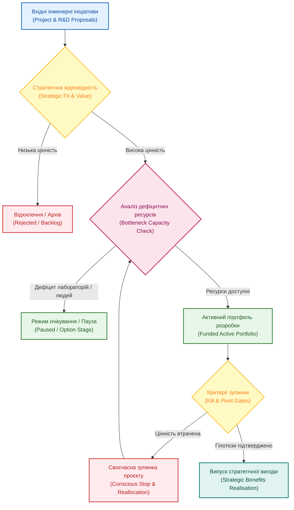

# Управління інженерним портфелем (Portfolio Management): дисципліна складного вибору

**Автор:** [Микола Федчик (Mykola Fedchyk)](book/about-the-author.md) · [LinkedIn](https://www.linkedin.com/in/nickfedchik/) · [GitHub](https://github.com/nick-fedchik)

---

## Вступ

**Мета статті:** визначити принципи та математичні інструменти стратегічного управління інженерним портфелем (*Engineering Portfolio Management*), які дозволяють організації свідомо обирати, фінансувати, перерозподіляти ресурси та вчасно зупиняти безперспективні ініціативи в умовах жорстких технічних і кадрових обмежень.

**Технологічна проблема, яка вирішується:** у більшості інноваційних компаній усі проєкти оголошуються однаково важливими. Кожен бізнес-напрямок вимагає розробників, у результаті чого ресурси розпорошуються, провідні системні архітектори та експерти з безпеки виявляються перевантаженими, а швидкість розробки катастрофічно падає. Керівництво боїться закривати проблемні проєкти через пастку безповоротних витрат (*Sunk Cost Fallacy*). Стаття пропонує модель портфельного арбітражу, засновану на продуктивності вузьких місць та явних критеріях зупинки робіт.

---

## Чим управління портфелем відрізняється від управління програмою

Плутанина між програмним координаційним рівнем та портфельним інвестиційним вибором призводить до паралічу стратегічного планування.

Керівник програми фокусується на координації: його мета полягає в тому, щоб забезпечити злагоджену взаємодію пов'язаних проєктів задля досягнення затвердженої вигоди. Натомість керівник портфеля (*Portfolio Manager*) вирішує інвестиційне завдання: чи варта дана ініціатива вкладених ресурсів порівняно з іншими альтернативами? Портфельний менеджмент аналізує не окремі задачі, а розподіл капіталу підприємства між різними стратегічними темами: підтримка поточного виробництва, модернізація платформи, експансія на нові ринки та наукові дослідження.

В інженерному середовищі головним обмежувальним фактором виступають не стільки фінансові кошти, скільки критичні неподільні ресурси: провідні архітектори, інженери з функціональної безпеки, випробувальні лабораторії та доступність дослідних зразків мікросхем.

Додавання бюджету не збільшує автоматично пропускну спроможність організації: портфельний менеджмент покликаний спрямувати дефіцитний інженерний талант на найважливіші точки росту.

*Портфельний контур постійно фільтрує ініціативи через призму пропускної спроможності вузьких місць та явних критеріїв зупинки робіт.*

## Пастка безповоротних витрат: чому почати легше, ніж зупинити

У корпоративній культурі запуск нового проєкту завжди сприймається як свято інновацій, тоді як рішення про його зупинку трактується як особиста поразка керівника.

Коли інженерний проєкт стикається з нездоланними труднощами (наприклад, собівартість апаратної плати виявилася вдвічі вищою за ринкову або ключовий компонент знято з виробництва), спонсори продовжують вимагати фінансування. Головний аргумент звучить так: «ми вже витратили пів мільйона євро і два роки праці, ми не можемо просто так усе кинути». Це класична психологічна пастка безповоротних витрат (*Sunk Cost Fallacy*).

У зрілому портфельному менеджменті витрачені в минулому гроші вважаються нульовими: рішення про продовження робіт спирається виключно на співвідношення залишкових витрат до майбутньої очікуваної вигоди.

Здатність вчасно зупинити безнадійну розробку є найвищим проявом професійної зрілості організації, який вивільняє ключових інженерів для перспективних напрямків.

## Математична оптимізація портфеля за продуктивністю вузького місця

Для отримання максимальної віддачі від інженерного капіталу проєкти в портфелі повинні ранжуватися не за абсолютним доходом, а за ефективністю використання найбільш дефіцитного ресурсу підприємства.

Нехай підприємство має перелік із $N$ потенційних проєктів, а головним критичним вузьким місцем (*Bottleneck Resource*) є робочий час сертифікованих інженерів із функціональної безпеки або доступність безлунної камери випробувань. Показник віддачі від дефіцитного ресурсу для проєкту $k$ визначається як граничний індекс ефективності $M_{\text{portfolio}, k}$:

$$M_{\text{portfolio}, k} = \frac{V_{\text{remain}, k} - C_{\text{to\_complete}, k}}{\sum_{b \in B} \omega_b \cdot U_{k,b} \cdot \left(1 + \lambda_{\text{risk}} \cdot R_k\right)}$$

**Тут:**
- $M_{\text{portfolio}, k}$ є індексом маржинальної ефективності проєкту $k$ на одиницю дефіцитного ресурсу (додатне число; проєкти з вищим індексом отримують пріоритетне фінансування).
- $V_{\text{remain}, k}$ є майбутньою прогнозованою дисконтованою цінністю проєкту з урахуванням актуальних ринкових змін (без урахування минулих витрат, у грошових одиницях).
- $C_{\text{to\_complete}, k}$ є залишком витрат, необхідних для повного завершення розробки, верифікації та запуску у виробництво (у грошових одиницях).
- $B$ є множиною критичних вузьких місць підприємства (дефіцитні фахівці або лабораторне обладнання).
- $\omega_b$ є нормативною вартістю одиниці часу використання вузького місця $b$.
- $U_{k,b}$ є кількістю годин або змін роботи дефіцитного ресурсу $b$, необхідною для завершення проєкту $k$.
- $\lambda_{\text{risk}}$ є штрафним коефіцієнтом технічної невизначеності (як правило, $\lambda_{\text{risk}} = 1{,}0$).
- $R_k$ є інтегральною оцінкою залишкового технічного ризику проєкту ($R_k \in [0; 1]$).

**Навчальний числовий приклад:**
Підприємство обирає між продовженням затягнутого проєкту А та стартом нової ініціативи Б. Критичним ресурсом є фахівці з безпеки ASIL D ($\omega_1 = 1{,}0$):
- **Проєкт А:** у нього вже вкладено 500 000 євро (безповоротні витрати, ігноруються!). Залишок витрат до завершення $C_{\text{to\_complete}} = 100\,000$ євро. Прогнозований дохід впав до $V_{\text{remain}} = 160\,000$ євро. Проєкт вимагає $U_1 = 300$ годин роботи експерта з безпеки при високому ризику відмови $R_A = 0{,}5$:
  $$M_{\text{portfolio}, A} = \frac{160\,000 - 100\,000}{1{,}0 \cdot 300 \cdot (1 + 1{,}0 \cdot 0{,}5)} = \frac{60\,000}{300 \cdot 1{,}5} = \frac{60\,000}{450} \approx 133{,}3 \text{ євро/год}$$
- **Проєкт Б:** новий проєкт, витрати до завершення $C_{\text{to\_complete}} = 80\,000$ євро, прогнозований ринковий дохід $V_{\text{remain}} = 320\,000$ євро. Вимагає лише $U_1 = 150$ годин експерта при низькому ризику $R_B = 0{,}2$:
  $$M_{\text{portfolio}, B} = \frac{320\,000 - 80\,000}{1{,}0 \cdot 150 \cdot (1 + 1{,}0 \cdot 0{,}2)} = \frac{240\,000}{150 \cdot 1{,}2} = \frac{240\,000}{180} \approx 1333{,}3 \text{ євро/год}$$

Математика дає однозначну відповідь: проєкт Б генерує у десять разів вищу віддачу на кожну годину дефіцитного експерта (1333 євро проти 133 євро). Продуктовий комітет ухвалює єдино правильне рішення: зупинити проєкт А, списати минулі витрати та перекинути інженерів на проєкт Б, що подвоює фінансовий результат компанії.

## Сценарне планування та оцінка альтернатив

Управління портфелем без моделювання альтернативних сценаріїв швидко вироджується у статичний список побажань.

Реальні стратегічні рішення завжди є умовними та вимагають аналізу компромісів:
- Що відбудеться, якщо перекинути розробників із проєкту модернізації на проєкт клієнтської доставки?
- Якими будуть наслідки, якщо відкласти реліз на один квартал заради глибшого тестування надійності?
- Як вплине затримка постачальника мікроконтролера на інші три паралельні програми?

Зріла портфельна система моделює ці варіанти як динамічні сценарії (*Scenario Planning*), оцінюючи вплив на виручку, критичний шлях та ризики. Керівництво бачить не просто два кольорових стовпчики, а точний фінансовий та технічний вимір кожного варіанта вибору.

## Сесії перевірки реальної спроможності (Capacity Truth Sessions)

Традиційне планування штатної чисельності за загальною кількістю людей приховує справжні інженерні вузькі місця.

Фраза керівника «у нас є 50 розробників, отже, ми можемо взяти ще два проєкти» є небезпечною ілюзією. У складному виробі обмеження визначаються не загальною масою працівників, а наявністю конкретних дефіцитних компетенцій: скільки є експертів із безпеки ISO 26262, чи вільні інженери з розведення високочастотних друкованих плат, чи доступні слоти кліматичної камери.

Проведення регулярних сесій вирівнювання спроможності (*Capacity Truth Sessions*) дозволяє вищому керівництву побачити реальні обмеження підприємства. Якщо виявляється, що всі пріоритетні проєкти одночасно залежать від двох провідних архітекторів, портфельний комітет зобов'язаний скоригувати чергу ініціатив, запобігаючи вигоранню ключових фахівців.

## Критерії ліквідації проєктів (Kill Criteria)

Для своєчасної зупинки нежиттєздатних розробок кожен проєкт на старті повинен мати явні, заздалегідь визначені критерії закриття.

Критерії зупинки (*Kill Criteria*) визначаються до початку витрачання бюджету, коли емоції та амбіції ще не заважають раціональному аналізу:
1. Якщо після трьох ітерацій собівартість апаратного датчика перевищує 150 євро, проєкт закривається.
2. Якщо затримка постачальника ключового компонента перевищує 90 днів, ініціатива переводиться в режим консервації.
3. Якщо кліматичні випробування показують деградацію характеристик за температур вище 85 °C, архітектура підлягає радикальному перегляду.

Наявність таких формальних правил знімає психологічний тягар із команди: закриття проєкту сприймається не як провал інженерів, а як запланована раціональна реакція на нові виявлені факти.

## Роль штучного інтелекту в портфельному арбітражі

Штучний інтелект у портфельному менеджменті виконує функцію незалежного аналітичного аудитора, що виявляє приховані конфлікти ресурсів.

Мовний асистент допомагає керівництву проводити об'єктивну оцінку:
- Знаходить приховану конкуренцію: підсвічує, що чотири різні проєкти одночасно запланували сертифікаційні випробування в одній і тій самій лабораторії на червень.
- Аналізує історію оцінок: порівнює початкові обіцянки спонсорів із фактичними темпами виконання та попереджає про хронічний оптимізм окремих лідерів.
- Перевіряє повноту досьє: сигналізує про ініціативи, які претендують на значний бюджет, але не мають розрахованих критеріїв зупинки.

Штучний інтелект виступає об'єктивним дзеркалом, усуваючи корпоративну політику та допомагаючи сконцентрувати капітал на напрямках максимального впливу.

---

## Висновки

1. Управління інженерним портфелем є стратегічною дисципліною вибору та арбітражу обмежених ресурсів, яка вирішує, у що саме підприємству варто інвестувати капітал і час.
2. Пастка безповоротних витрат (Sunk Cost Fallacy) спонукає продовжувати безнадійні розробки; зріле управління спирається виключно на співвідношення залишкових витрат до майбутньої вигоди.
3. Оптимізація портфеля має проводитися за показником маржинальної віддачі на одиницю найбільш дефіцитного вузького місця організації (унікальні експерти, лабораторії).
4. Кожна масштабна ініціатива повинна мати заздалегідь затверджені критерії зупинки (Kill Criteria), що забезпечують закриття неефективних проєктів без втрати репутації команди.
5. Штучний інтелект у портфельному контурі забезпечує незалежний моніторинг конфліктів за спільні ресурси та перевіряє реалістичність планів виконання.

---

## Посилання

1. ISO 21504:2022. *Project, programme and portfolio management — Guidance on portfolio management*. International Organization for Standardization, Geneva, Switzerland. [https://www.iso.org/standard/78645.html](https://www.iso.org/standard/78645.html)
2. ISO 21505:2017. *Project, programme and portfolio management — Guidance on governance*. International Organization for Standardization, Geneva, Switzerland. [https://www.iso.org/standard/66166.html](https://www.iso.org/standard/66166.html)
3. Cooper, R. G., Edgett, S. J., Kleinschmidt, E. J. *Portfolio Management for New Products*. 2nd Edition. Basic Books, 2001.
4. Goldratt, E. M. *Critical Chain*. The North River Press, 1997.
5. Kerzner, H. *Project Management: A Systems Approach to Planning, Scheduling, and Controlling*. 13th Edition. John Wiley & Sons, 2022.

---

## Терміни

- **Безповоротні витрати (Sunk Costs)**: кошти та ресурси, які вже були витрачені в минулому і не можуть бути повернуті незалежно від майбутніх рішень.
- **Вузьке місце (Bottleneck Resource)**: виробнича ланка, обладнання або категорія фахівців, чия обмежена пропускна спроможність лімітує швидкість виконання всієї сукупності робіт організації.
- **Критерії закриття проєкту (Kill Criteria)**: заздалегідь узгоджені числові або якісні умови, настання яких автоматично веде до припинення фінансування та закриття ініціативи.
- **Портфель проєктів (Project Portfolio)**: сукупність проєктів, програм та інших робіт, об'єднаних задля ефективного управління для досягнення стратегічних бізнес-цілей.
- **Сценарне планування (Scenario Planning)**: методологія моделювання кількох альтернативних варіантів розподілу ресурсів та оцінки їхніх наслідків в умовах невизначеності.

---

## Скорочення

- **ADR**: Architecture Decision Record (журнал архітектурних рішень)
- **ASIL**: Automotive Safety Integrity Level (рівень повноти безпеки в автомобілебудуванні)
- **HIL**: Hardware-in-the-Loop (апаратно-програмне моделювання на фізичному стенді)
- **ISO**: International Organization for Standardization (Міжнародна організація зі стандартизації)
- **KPI**: Key Performance Indicator (ключовий показник ефективності)
- **NPV**: Net Present Value (чиста приведена вартість)
- **PMO**: Project Management Office (проєктний офіс)
- **ROI**: Return on Investment (рентабельність інвестицій)
- **WIP**: Work in Progress (незавершене виробництво)

---

## Про автора

**Микола Федчик (Mykola Fedchyk)**: український інженер, системний архітектор та дослідник у галузі кіберфізичних комплексів, доказового штучного інтелекту та критичних вбудованих систем. Понад двадцять років керує інженерними розробками та проєктуванням складних апаратно-програмних комплексів у сфері мережевої безпеки, телекомунікацій та автомобільної електроніки відповідно до вимог міжнародних стандартів ISO 26262 та ISO/SAE 21434. Досліджує практичне застосування експертних систем, семантичних онтологій та цифрової нитки для управління складними інженерними програмами.

Детальніша інформація: [Про автора](book/about-the-author.md) · [LinkedIn](https://www.linkedin.com/in/nickfedchik/) · [GitHub](https://github.com/nick-fedchik)
