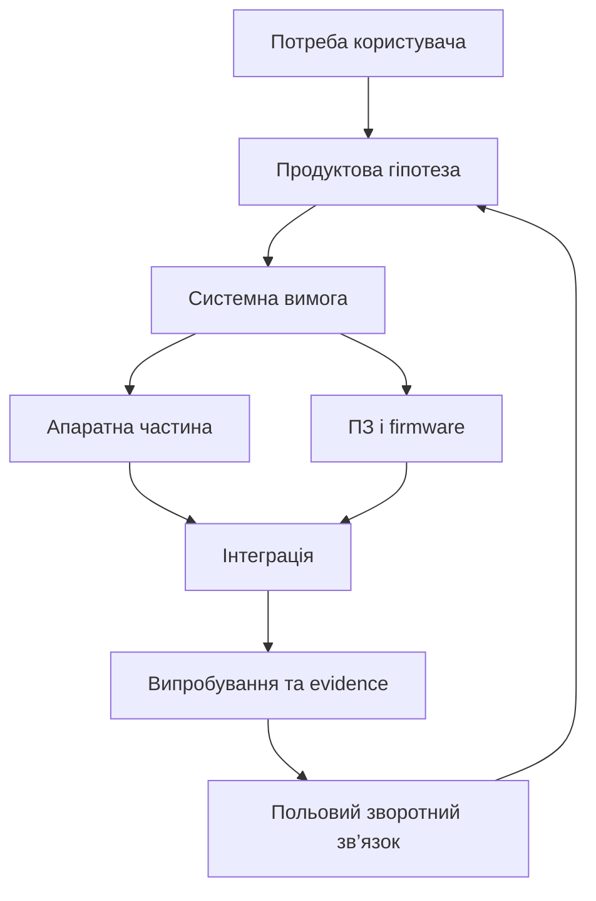
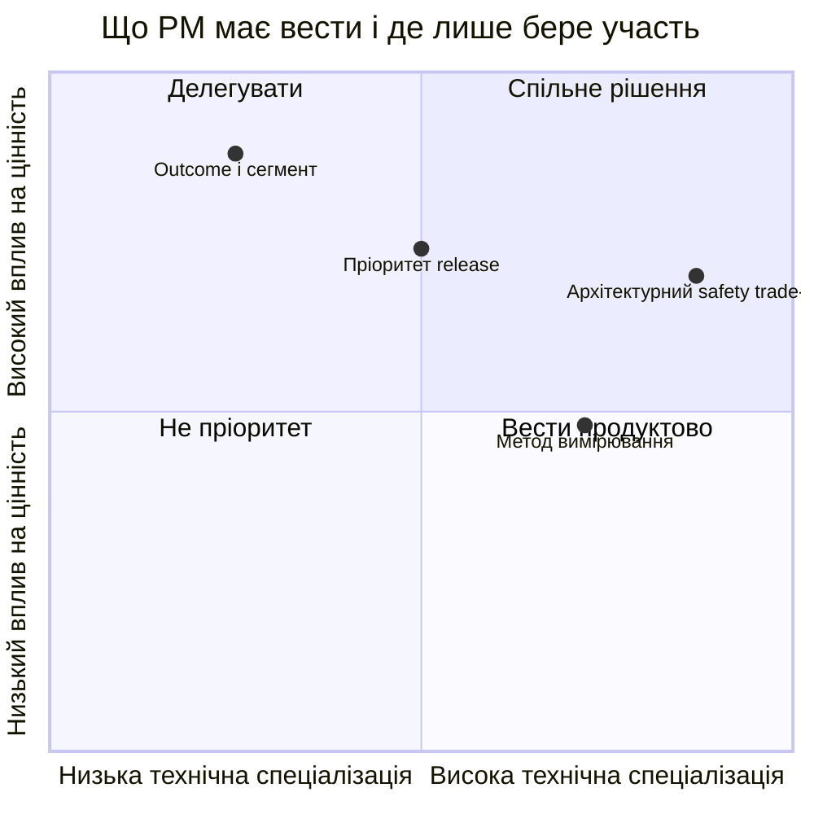

# Продуктовий менеджмент у R&D: як намір ринку проходить через інженерну реальність

У звичайному цифровому продукті гіпотезу можна перевірити за тиждень. У R&D, де є апаратура, вбудоване ПЗ, виробництво, безпека або регуляторні вимоги, між ідеєю та результатом стоять фізика, постачання й верифікація. Тому product manager тут не «власник беклогу», а перекладач між цінністю для користувача й обмеженнями системи.

Його головний результат — не список красивих функцій, а зрозумілий ланцюг: для кого потрібна зміна, яку проблему вона розв’язує, у якій вимозі це зафіксовано, як команда перевірить успіх і які компроміси прийняла.

## Не «передати вимоги», а зберегти сенс

Product intent губиться, коли формулу «користувачеві треба швидше» одразу перетворюють на завдання. Між ними потрібні вимірюваний outcome, системна вимога, критерій приймання й спосіб перевірки. Тоді інженер бачить не тільки *що* будувати, а й *навіщо*; product manager отримує зворотний зв’язок не у вигляді абстрактного «складно», а як вплив на ризик, термін, ціну чи сертифікацію.

Для пріоритизації корисна явна, але не автоматична модель:

$$P = \frac{V \times C \times K}{E \times (1+R)},$$

де $V$ — очікувана цінність, $C$ — впевненість у даних, $K$ — стратегічна відповідність, $E$ — інженерні зусилля, $R$ — технічний або регуляторний ризик. Числа не замінюють дискусію, зате роблять її припущення видимими.

## Межа відповідальності

Product manager має бачити вимоги, ризики, залежності, докази верифікації та причини змін — інакше він ухвалює рішення навмання. Водночас він не повинен самостійно затверджувати safety case, архітектурний компроміс або результат кваліфікаційного тесту. Це сфера відповідальних інженерних і quality-ролей.

У regulated engineering ця межа особливо важлива: продуктова обіцянка не може обходити вимогу, а зміна вимоги не може губити обґрунтування. Здоровий процес має двосторонній loop: намір формує вимоги, а результати тестів, виробництва й поля коригують намір.

## Різні ритми, один продукт

Маркетинг може змінити позиціонування завтра, software — випустити виправлення за тижні, а нова ревізія hardware потребуватиме місяців і лабораторного вікна. План, який робить вигляд, що всі ці ритми однакові, виробляє хибні обіцянки. Product manager повинен показувати ці межі мовою варіантів: що отримає користувач у найближчому release, що потребує наступної апаратної ревізії, а що слід відкласти через неприйнятний ризик.

AI може прискорити цю роботу: звести feedback, знайти пов’язані вимоги, підготувати порівняння сценаріїв. Але він не має вигадувати джерела або «закривати» інженерне рішення. Корисний результат AI — чернетка з посиланнями на артефакти та позначеними припущеннями.

Найкраща ознака зрілості — коли команда може простежити шлях від скарги або можливості до перевіреного результату й назад. Тоді R&D не перетворюється на фабрику фіч, а продуктова стратегія лишається чесною щодо інженерної реальності.
