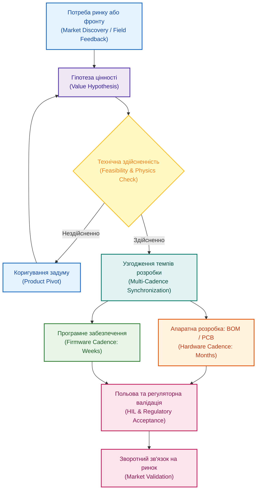

# Продуктовий менеджмент в R&D: де ринок зустрічається з інженерною реальністю

**Автор:** [Микола Федчик (Mykola Fedchyk)](book/about-the-author.md) · [LinkedIn](https://www.linkedin.com/in/nickfedchik/) · [GitHub](https://github.com/nick-fedchik)

---

## Вступ

**Мета статті:** визначити специфіку та інженерні інструменти продуктового менеджменту в науково-дослідних і дослідно-конструкторських розробках (R&D), де ринкові гіпотези підпорядковуються законам фізики, тривалим циклам виготовлення мікроелектроніки та нормативним вимогам безпеки.

**Технологічна проблема, яка вирішується:** класичні методики продуктового управління, запозичені з веброзробки, зосереджені на швидких експериментах у беклозі. Проте в R&D нова функція на дорожній карті нерідко означає зміну топології кристала, переробку схемотехніки друкованої плати чи необхідність проходження тривалих випробувань на електромагнітну сумісність. Якщо продуктовий менеджер орієнтується виключно на побажання користувача, команда дізнається про нездійсненність задуму занадто пізно. Стаття показує, як узгодити продуктову стратегію з інженерною спроможністю.

---

## Беклог з'являється пізніше: чому дослідження передують розробці

Спроба розпочати продуктовий менеджмент у сфері досліджень і розробок зі складання списку задач у Jira є типовою методологічною помилкою.

Беклог є лише наслідком глибокого попереднього аналізу. До появи першої інженерної задачі мають бути сформульовані та перевірені: конкретна проблема користувача, аналіз сегментів ринку, оцінка технологічної здійсненності (*Feasibility Study*), бізнес-обґрунтування та аналіз регуляторних обмежень. В інженерних підрозділах розробники часто здатні реалізувати надзвичайно складні технічні рішення, проте здатність створити пристрій не означає, що ринок готовий його купувати.

Завдання продуктового менеджера полягає в тому, щоб поставити команді незручні запитання на ранньому етапі: чи є ця функція життєво необхідною, яку саме проблему клієнта вона вирішує та якими фізичними обмеженнями обмежене її виробництво.

Маркетинг у R&D є першоджерелом продуктового задуму: він задає вектор інженерних досліджень задовго до створення робочих креслень.

```mermaid
flowchart TD
    accTitle: Процес продуктового аналізу в наукових та інженерних розробках
    accDescr: Від виявлення потреби через технічну фільтрацію та оцінку допуску до паралельної розробки заліза і софту.

    MKT["Потреба ринку або фронту<br/>(Market Discovery / Field Feedback)"] --> HYP["Гіпотеза цінності<br/>(Value Hypothesis)"]
    HYP --> FEAS{"Технічна здійсненність<br/>(Feasibility & Physics Check)"}
    FEAS -->|Нездійсненно| PIV["Коригування задуму<br/>(Product Pivot)"]
    PIV --> HYP
    FEAS -->|Здійсненно| CAD["Узгодження темпів розробки<br/>(Multi-Cadence Synchronization)"]
    CAD --> HW["Апаратна розробка: BOM / PCB<br/>(Hardware Cadence: Months)"]
    CAD --> SW["Програмне забезпечення<br/>(Firmware Cadence: Weeks)"]
    HW --> VAL["Польова та регуляторна валідація<br/>(HIL & Regulatory Acceptance)"]
    SW --> VAL
    VAL --> RET["Зворотний зв'язок на ринок<br/>(Market Validation)"]

    classDef mkt fill:#e3f2fd,stroke:#1565c0,stroke-width:2px,color:#0d47a1;
    classDef hyp fill:#ede7f6,stroke:#512da8,stroke-width:2px,color:#311b92;
    classDef feas fill:#fff9c4,stroke:#fbc02d,stroke-width:2px,color:#f57f17;
    classDef cad fill:#e0f2f1,stroke:#00796b,stroke-width:2px,color:#004d40;
    classDef hw fill:#fff3e0,stroke:#e65100,stroke-width:2px,color:#bf360c;
    classDef sw fill:#e8f5e9,stroke:#2e7d32,stroke-width:2px,color:#1b5e20;
    classDef val fill:#fce4ec,stroke:#c2185b,stroke-width:2px,color:#880e4f;

    class MKT,PIV mkt;
    class HYP hyp;
    class FEAS feas;
    class CAD cad;
    class HW hw;
    class SW sw;
    class VAL,RET val;
```

*Продуктовий аналіз в R&D узгоджує ринкові потреби з різними ритмами фізичного виробництва та написання коду.*

## Маркетинговий та технічний продуктовий менеджер: тандем компетенцій

У складних наукомістких продуктах виникає об'єктивна потреба у розділенні функцій стратегічного позиціонування та системної реалізації.

Маркетинговий продуктовий менеджер (*Marketing Product Manager*) зосереджений на клієнтських сегментах, бізнес-моделі, ціноутворенні, конкурентному середовищі та каналах продажів. Його базові питання: хто є покупцем, яку цінність він отримує та чому обере наше рішення. Натомість технічний продуктовий менеджер (*Technical Product Manager*) занурений в інженерну архітектуру, системні специфікації, оцінку здійсненності та міжсистемні обмеження. Він з'ясовує: які вимоги це накладає на мікроконтролер, скільки енергії споживатиме плата та які лабораторні стенди необхідні для верифікації.

Поєднання обох ролей в одній особі несе високий ризик: надмірний нахил у бік маркетингу веде до появи нереалізовних планів, а надмірна технічна концентрація перетворює виріб на дорогий академічний експеримент без ринкового попиту.

Успішні R&D організації вибудовують конструктивний тандем між ринковим баченням та інженерною дисципліною.

## Математична оцінка доцільності інвестицій у дослідження

Для ухвалення зваженого рішення про фінансування нової R&D розробки суб'єктивний оптимізм має бути замінений розрахунком коефіцієнта здійсненності інвестицій.

Розглянемо показник здійсненності інженерного проєкту $R_{\text{feasibility}}$, який враховує ймовірності технічного та комерційного успіху разом із накладними регуляторними витратами:

$$R_{\text{feasibility}} = \frac{V_{\text{market}} \cdot P_{\text{tech}} \cdot P_{\text{commercial}}}{C_{\text{R\&D}} \cdot \left(1 + \kappa_{\text{reg}} \cdot \mathbb{I}_{\text{reg}}\right) + C_{\text{tooling}}}$$

**Тут:**
- $R_{\text{feasibility}}$ є коефіцієнтом економічної та технічної доцільності проєкту (додатне безрозмірне число; проєкт вважається перспективним, якщо $R_{\text{feasibility}} \ge 1{,}5$).
- $V_{\text{market}}$ є очікуваним валовим доходом від впровадження розробки на цільовому ринку (у грошових одиницях).
- $P_{\text{tech}}$ є ймовірністю успішного подолання науково-технічних ризиків і досягнення параметрів специфікації ($P_{\text{tech}} \in (0; 1]$).
- $P_{\text{commercial}}$ є ймовірністю успішного ринкового продажу та своєчасного виходу на ринок ($P_{\text{commercial}} \in (0; 1]$).
- $C_{\text{R\&D}}$ є базовими витратами на оплату праці інженерів та розробку прототипу (у грошових одиницях).
- $\kappa_{\text{reg}}$ є коефіцієнтом додаткових витрат на відповідність стандартам і сертифікацію (для автопрому та медицини $\kappa_{\text{reg}} \approx 0{,}8$).
- $\mathbb{I}_{\text{reg}}$ є бінарним індикатором регульованої галузі ($\mathbb{I}_{\text{reg}} = 1$ для ринків із обов'язковою сертифікацією за ISO 26262/DO-178C, і $\mathbb{I}_{\text{reg}} = 0$ для відкритих споживчих ринків).
- $C_{\text{tooling}}$ є капітальними витратами на оснастку, прес-форми, замовлення дослідних партій друкованих плат та оренду безлунних камер (у грошових одиницях).

**Навчальний числовий приклад:**
Підприємство розглядає створення нового радіолокаційного сенсора для безпілотного транспорту:
Очікуваний дохід $V_{\text{market}} = 5\,000\,000$ євро. Технічна ймовірність успіху висока ($P_{\text{tech}} = 0{,}8$), а ринкова прийнятність становить $P_{\text{commercial}} = 0{,}7$.
Базові витрати на розробку $C_{\text{R\&D}} = 1\,200\,000$ євро. Проєкт належить до регульованої автомобільної сфери ($\mathbb{I}_{\text{reg}} = 1, \kappa_{\text{reg}} = 0{,}8$). Капітальні витрати на лабораторні випробування та дослідні зразки $C_{\text{tooling}} = 400\,000$ євро.

$$R_{\text{feasibility}} = \frac{5\,000\,000 \cdot 0{,}8 \cdot 0{,}7}{1\,200\,000 \cdot (1 + 0{,}8 \cdot 1) + 400\,000} = \frac{2\,800\,000}{1\,200\,000 \cdot 1{,}8 + 400\,000} = \frac{2\,800\,000}{2\,160\,000 + 400\,000} = \frac{2\,800\,000}{2\,560\,000} \approx 1{,}09$$

Оскільки отриманий показник $1{,}09$ суттєво нижчий за безпечний поріг $1{,}5$, цей розрахунок сигналізує продуктовому менеджеру: поточний бізнес-кейс є вразливим. Проєкт не можна брати в розробку у поточному вигляді без оптимізації витрат на верифікацію або розширення ринку збуту.

## Синхронізація різних темпів: залізо, прошивка, хмара та сертифікація

Головна складність R&D продукту полягає в одночасному співіснуванні компонентів із принципово різною швидкістю модифікації.

У чистому програмному сервісі зміни вносяться безперервно: релізи відбуваються щотижня, а зворотний зв'язок від користувачів надходить через телеметрію за лічені хвилини. Натомість апаратна частина вимагає місяців: виготовлення друкованої плати, замовлення прес-форм для корпусів, постачання мікросхем та випробування на механічну міцність і термостійкість.

Складний системний виріб поєднує чотири різні ритми розробки:
1. **Хмарні сервіси та інтерфейси оператора:** оновлюються за гнучкими спринтами (тижні).
2. **Вбудовані мікропрограми (Firmware):** оновлюються ітераційно, але вимагають регресії на стендах HIL (місяці).
3. **Електронні вузли та друковані плати (Hardware):** підпорядковуються виробничим партіям та наявності компонентів у постачальників (квартали).
4. **Сертифікаційні аудити:** мають жорстко фіксовані календарні вікна наглядових органів (півріччя або роки).

Продуктовий менеджер зобов'язаний виступати диригентом цих темпів: дорожня карта має бути сформована так, щоб апаратна база розроблялася з урахуванням запасу за обчислювальною потужністю на кілька наступних програмних релізів.

## Уроки українського MilTech: короткий цикл зворотного зв'язку та дисципліна

Досвід сучасних українських оборонних технологій демонструє найвищу швидкість адаптації продукту до умов бойового застосування.

На відміну від мирного цивільного ринку, де збір відгуків займає місяці маркетингових опитувань, у MilTech зворотний зв'язок надходить миттєво з лінії бойового зіткнення. Поява нової ворожої станції РЕБ або зміна тактики застосування безпілотників вимагає модернізації алгоритмів радіозв'язку та оптичного наведення за лічені дні.

Проте висока швидкість несе прихований ризик переходу до хаотичного «героїчного» менеджменту. Якщо виправлення вносяться безконтрольно в польових умовах без фіксації ревізій схем і коду, виріб стає надзвичайно вразливим. Через кілька ітерацій ніхто не здатний повторити успішну конфігурацію в серійному виробництві.

Продуктовий лідер у MilTech має бути жорстким фільтром: оперативно транслювати бойовий досвід у формалізовані інженерні вимоги, захищати розробників від хаосу та зберігати сувору дисципліну версійності й безпеки.

## Роль штучного інтелекту в продуктових дослідженнях

Штучний інтелект у R&D слугує інструментом семантичного аналізу та первинної класифікації великих масивів технічних даних.

Мовний асистент суттєво полегшує аналітичну роботу продуктового менеджера:
- Узагальнює технічні звіти про польові випробування, виділяючи типові закономірності відмов.
- Знаходить суперечності між вимогами замовника та чинними нормативними регламентами.
- Допомагає проводити попереднє патентне дослідження та конкурентний аналіз за відкритими технічними специфікаціями.
- Формує чернетки описів функцій для інженерної специфікації з вихідних нотаток інтерв'ю з користувачами.

При цьому штучний інтелект не формує продуктового бачення та не несе фінансової відповідальності за комерційний провал, тому остаточне визначення пріоритетів завжди залишається за людиною.

## Практичний контрольний список для продуктового менеджера в R&D

Перед включенням нової функції до дорожньої карти рекомендується перевірити такі обов'язкові критерії:
1. **Зрозумілість проблеми:** чи сформульована біль користувача мовою фактів, а не у вигляді готового технічного рішення?
2. **Оцінка фізичних обмежень:** чи підтвердили інженери наявність достатньої пам'яті, швидкодії процесора та енергоживлення без повної переробки плати?
3. **Регуляторні витрати:** чи пораховані додаткові витрати на сертифікаційні випробування у разі внесення змін у функції безпеки?
4. **Ланцюг постачання:** чи доступні необхідні електронні компоненти на ринку у промислових обсягах із прийнятним терміном доставки?
5. **Критерії успіху:** чи зафіксовані об'єктивні вимірювані показники (KPI), за якими оцінюватиметься ефективність рішення після випуску?

Якщо хоча б один із цих пунктів залишається невизначеним, функцію не можна передавати в активну розробку.

---

## Висновки

1. Продуктовий менеджмент в R&D вимагає обов'язкового узгодження ринкових гіпотез із фізичними обмеженнями електроніки, матеріалознавства та виробничих циклів.
2. Беклог завдань є завершальним етапом аналізу: йому мають передувати дослідження ринку, оцінка технологічної здійсненності та розрахунок економічної доцільності.
3. Ефективна модель управління спирається на тандем маркетингового та технічного продуктових менеджерів, які врівноважують комерційні цілі та інженерні обмеження.
4. Управління апаратно-програмними комплексами вимагає одночасної синхронізації різнорідних темпів розробки: хмари, мікропрограм, друкованих плат та сертифікації.
5. У критичних сферах (MilTech, MedTech, автопром) швидкість зворотного зв'язку має обов'язково поєднуватися з суворою дисципліною фіксації версій, простежуваністю вимог та збереженням архітектурного контролю.

---

## Посилання

1. ISO 21502:2020. *Project, programme and portfolio management — Guidance on project management*. International Organization for Standardization, Geneva, Switzerland. [https://www.iso.org/standard/74947.html](https://www.iso.org/standard/74947.html)
2. ISO 26262-8:2018. *Road vehicles — Functional safety — Part 8: Supporting processes*. International Organization for Standardization, Geneva, Switzerland. [https://www.iso.org/standard/68387.html](https://www.iso.org/standard/68387.html)
3. Cooper, R. G. *Winning at New Products: Creating Value Through Innovation*. 5th Edition. Basic Books, 2017.
4. Blank, S. *The Four Steps to the Epiphany: Successful Strategies for Products that Win*. K&S Ranch Publishing, 2020.
5. Ulrich, K. T., Eppinger, S. D., Yang, M. C. *Product Design and Development*. 7th Edition. McGraw-Hill Education, 2020.

---

## Терміни

- **Беклог продукту (Product Backlog)**: впорядкований за пріоритетом список функцій, покращень та дефектів, які очікують на інженерну реалізацію.
- **Дослідження технологічної здійсненності (Feasibility Study)**: інженерний аналіз технічної, фізичної та економічної можливості реалізації задуманого пристрою в заданих часових і бюджетних межах.
- **Маркетинговий продуктовий менеджер (Marketing Product Manager)**: фахівець, зосереджений на аналізі ринку, позиціонуванні, бізнес-моделі, продажах та взаємодії з клієнтами.
- **Рівень технологічної готовності (Technology Readiness Level, TRL)**: стандартизована шкала оцінки зрілості технології від базових наукових принципів (TRL 1) до успішної експлуатації у реальних умовах (TRL 9).
- **Технічний продуктовий менеджер (Technical Product Manager)**: фахівець, зосереджений на інженерній архітектурі, системних вимогах, взаємодії з розробниками та міжмодульних компромісах.

---

## Скорочення

- **ADR**: Architecture Decision Record (журнал архітектурних рішень)
- **BOM**: Bill of Materials (відомість матеріалів)
- **HIL**: Hardware-in-the-Loop (апаратно-програмне моделювання на фізичному стенді)
- **ISO**: International Organization for Standardization (Міжнародна організація зі стандартизації)
- **MilTech**: Military Technology (військові оборонні технології)
- **PCB**: Printed Circuit Board (друкована плата)
- **R&D**: Research and Development (науково-дослідні та дослідно-конструкторські роботи)
- **TRL**: Technology Readiness Level (рівень технологічної готовності)
- **WBS**: Work Breakdown Structure (ієрархічна структура робіт)

---

## Про автора

**Микола Федчик (Mykola Fedchyk)**: український інженер, системний архітектор та дослідник у галузі кіберфізичних комплексів, доказового штучного інтелекту та критичних вбудованих систем. Понад двадцять років керує інженерними розробками та проєктуванням складних апаратно-програмних комплексів у сфері мережевої безпеки, телекомунікацій та автомобільної електроніки відповідно до вимог міжнародних стандартів ISO 26262 та ISO/SAE 21434. Досліджує практичне застосування експертних систем, семантичних онтологій та цифрової нитки для управління складними інженерними програмами.

Детальніша інформація: [Про автора](book/about-the-author.md) · [LinkedIn](https://www.linkedin.com/in/nickfedchik/) · [GitHub](https://github.com/nick-fedchik)
