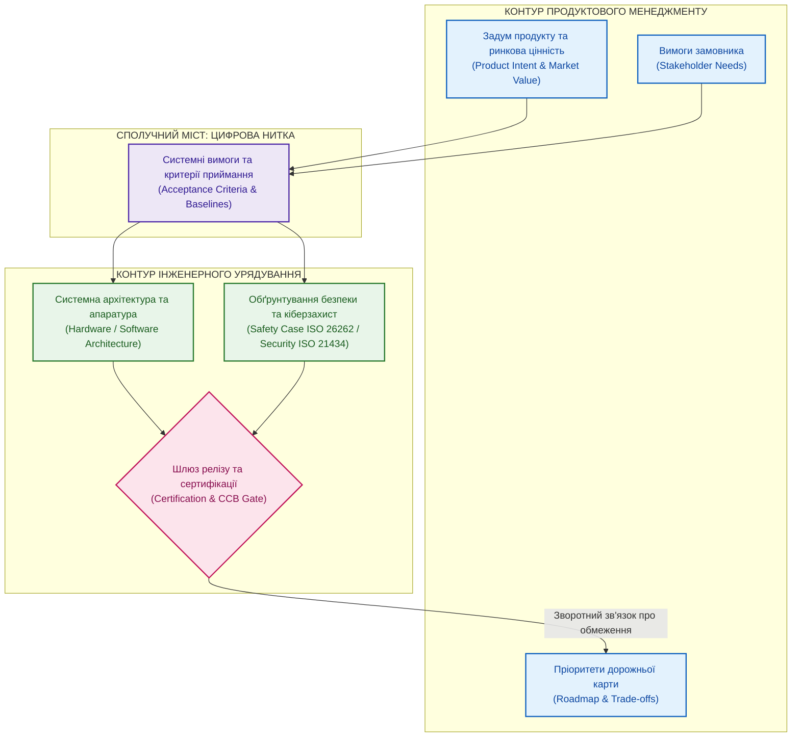

# Product Manager у регульованій інженерії: де проходить межа відповідальності

**Автор:** [Микола Федчик (Mykola Fedchyk)](book/about-the-author.md) · [LinkedIn](https://www.linkedin.com/in/nickfedchik/) · [GitHub](https://github.com/nick-fedchik)

---

## Вступ

**Мета статті:** визначити чіткі інженерні та процесні межі відповідальності продуктового менеджера (*Product Manager*) у регульованих інженерних галузях (автомобільна електроніка, авіоніка, медичні системи), де кожне бізнес-рішення тягне за собою обов'язкові наслідки для функціональної безпеки, кібербезпеки та сертифікації.

**Технологічна проблема, яка вирішується:** у нерегульованому цифровому бізнесі продуктовий лідер звик оперативно змінювати функціонал та запускати швидкі експерименти. Проте у високорегульованому середовищі просте бажання «додати зручну кнопку» або «прискорити опитування датчика» може зруйнувати затверджене обґрунтування безпеки (*Safety Case*), вимагати переробки апаратних інтерфейсів та коштувати сотні тисяч євро на повторну сертифікацію. Якщо продуктовий менеджер не усвідомлює цих наслідків, він мимоволі втягує організацію в регуляторну кризу. Стаття розкриває баланс між ринковим задумом та інженерним урядуванням.

---

## Роль продуктового менеджера: цінність проти технічного урядування

Спроба перенести практики розробки споживчих мобільних додатків у сертифіковану інженерію створює небезпечну ілюзію вседозволеності.

У звичайному програмному продукті продуктовий менеджер одноосібно визначає склад мінімально життєздатного продукту (MVP), переставляє задачі в беклозі та вирішує, якими дефектами можна знехтувати заради швидкого виходу на ринок. У регульованій інженерії (*Regulated Engineering*) діє принципово інший розподіл обов'язків:
- **Продуктовий менеджер володіє задумом і цінністю:** він визначає потреби клієнта, аналізує конкурентні переваги, формує дорожню карту та обґрунтовує комерційну доцільність.
- **Інженерне керівництво володіє архітектурою та безпекою:** системні архітектори, інженери з функціональної безпеки та спеціалісти з якості одноосібно вирішують, чи відповідає рішення стандартам ISO 26262 чи DO-178C, і несуть за це юридичну відповідальність.

Коли продуктовий менеджер намагається одноосібно скасувати проведення тестів або оголосити дефект безпеки «несуттєвим», він виходить за межі свого мандата і ставить під загрозу легальність експлуатації виробу.

Зріла організація вибудовує прозору межу: продуктовий лідер ставить бізнес-цілі, але технічні обмеження та стандарти безпеки диктують правила їхньої реалізації.

*Межа відповідальності непорушна: продуктовий менеджер формує намір і пріоритети, а інженерні ролі визначають межі безпеки та сертифікаційний допуск.*

## Що змінюється в регульованій інженерії: ціна неявних припущень

Головною відмінністю регульованого сектору є надзвичайно висока вартість внесення змін на пізніх стадіях життєвого циклу продукту.

Якщо у веб-сервісі невдале дизайнерське рішення можна відкотити за хвилину новим випуском у хмарі, то в автомобільній електроніці модифікація логіки роботи приводу вимагає повного циклу повторних стендових випробувань (HIL), кліматичних тестів, оновлення аналізу загроз (TARA) та повторної експертизи органу сертифікації. Загальні витрати на перевірку та узгодження часто перевищують вартість написання самого коду в 5–10 разів.

Продуктовий менеджер у цьому середовищі не може дозволити собі розпливчастих вимог на кшталт «система має реагувати плавніше». Будь-яка вимога повинна мати точні фізичні одиниці вимірювання, умови середовища, перелік відмовних станів (*failure modes*) та визначений метод верифікації.

Точність формулювання початкового наміру безпосередньо захищає бюджет проєкту від неконтрольованого перевитрачання коштів.

## Математичне моделювання регуляторного обтяження змін

Для запобігання внесенню економічно збиткових змін продуктовий лідер зобов'язаний розраховувати індекс доцільності модифікації з урахуванням регуляторних витрат.

Нехай пропонується додати нову функцію, яка приносить приріст користувацької цінності $\Delta V_{\text{user}}$. Показник доцільності модифікації $Q_{\text{scope}}$ визначається як відношення додаткової цінності до суми прямих інженерних витрат та вартості повторної сертифікації:

$$Q_{\text{scope}} = \frac{\Delta V_{\text{user}}}{\sum_{k=1}^{P} C_{\text{dev},k} \cdot \left(1 + \kappa_{\text{ASIL}} \cdot \mathbb{I}_{\text{safety}}\right) + \Delta T_{\text{recert}} \cdot L_{\text{delay}}}$$

**Тут:**
- $Q_{\text{scope}}$ є коефіцієнтом виправданості додавання функції (безрозмірна величина; функція вважається економічно доцільною для поточного релізу, якщо $Q_{\text{scope}} \ge 2{,}0$).
- $\Delta V_{\text{user}}$ є очікуваною монетизованою цінністю нової функції для замовника або ринку (у грошових одиницях).
- $P$ є кількістю інженерних робочих пакетів, необхідних для реалізації зміни (програмування, схемотехніка, верифікація).
- $C_{\text{dev},k}$ є прямою собівартістю виконання $k$-го робочого пакета розробки (у грошових одиницях).
- $\kappa_{\text{ASIL}}$ є коефіцієнтом накладних витрат на відповідність рівню повноти безпеки (для базових функцій $\kappa_{\text{ASIL}} = 0$; для систем високої критичності ASIL D або DO-178C Level A коефіцієнт досягає $\kappa_{\text{ASIL}} = 2{,}5$).
- $\mathbb{I}_{\text{safety}}$ є бінарним індикатором впливу на сертифіковані контури безпеки: $\mathbb{I}_{\text{safety}} = 1$, якщо функція зачіпає критичні модулі, і $\mathbb{I}_{\text{safety}} = 0$ в іншому випадку.
- $\Delta T_{\text{recert}}$ є тривалістю затримки релізу через необхідність проведення повторних випробувань у сертифікаційній лабораторії (у робочих днях або тижнях).
- $L_{\text{delay}}$ є вартістю одного дня затримки виходу виробу на ринок (*Cost of Delay per day*, у грошових одиницях на день).

**Навчальний числовий приклад:**
Клієнт просить додати анімацію переходу та зміну підсвічування на панелі приладів автомобіля, оцінюючи цю зручність у $\Delta V_{\text{user}} = 40\,000$ євро.
Пряма розробка коду проста: 2 інженери працюють 2 тижні, собівартість $C_{\text{dev}} = 8\,000$ євро.
1. Якщо функція реалізована в ізольованому мультимедійному контурі без впливу на безпеку ($\mathbb{I}_{\text{safety}} = 0, \Delta T_{\text{recert}} = 0$):
   $$Q_{\text{scope}} = \frac{40\,000}{8\,000 \cdot 1 + 0} = \frac{40\,000}{8\,000} = 5{,}0$$
   Показник $5{,}0 \ge 2{,}0$, зміна безумовно вигідна.
2. Проте через невдалу архітектуру шини живлення виявилося, що контролер підсвічування розміщений на одній платі з процесором контролю гальм (рівень ASIL D, $\kappa_{\text{ASIL}} = 2{,}5, \mathbb{I}_{\text{safety}} = 1$). Будь-яка зміна вимагає повторної електромагнітної та функціональної атестації блоку, що затримує випуск на $\Delta T_{\text{recert}} = 10$ днів при вартості дня простою проєкту $L_{\text{delay}} = 3\,000$ євро на день:
   $$Q_{\text{scope}} = \frac{40\,000}{8\,000 \cdot (1 + 2{,}5 \cdot 1) + 10 \cdot 3\,000} = \frac{40\,000}{8\,000 \cdot 3{,}5 + 30\,000} = \frac{40\,000}{28\,000 + 30\,000} = \frac{40\,000}{58\,000} \approx 0{,}69$$

Математичний розрахунок миттєво розкриває правду: у регульованому контексті другорядна функція генерує 58 000 євро сукупних витрат проти 40 000 євро користі ($Q_{\text{scope}} = 0{,}69 < 2{,}0$). Продуктовий менеджер отримує залізобетонний аргумент для аргументованої відмови замовнику або перенесення функції у наступну ревізію апаратури.

## Що продуктовий менеджер повинен бачити, а чим не має права керувати

Для ефективної роботи продуктовому лідеру потрібен чіткий інформаційний зріз стану розробки без занурення у мікроменеджмент схем і коду.

Продуктовий менеджер зобов'язаний бачити:
1. Зв'язок функцій дорожньої карти із системними специфікаціями та базовими лініями.
2. Статус виконання верифікаційних випробувань: які критичні тести провалені та які сертифікаційні докази відсутні.
3. Перелік відкритих технічних відхилень (*Waivers*) та дефектів, що блокують випуск версії.
4. Обмеження фізичних постачальників компонентів та розклад зайнятості випробувальних лабораторій.

Проте існують зони, втручання в які для продуктового менеджера суворо заборонене:
- **Підтвердження безпеки (Safety Acceptance):** продуктовий лідер не може оголосити ризик відмови гальм чи рульового керування прийнятним заради збереження дати релізу.
- **Зміна технічної базової версії:** базова лінія схемотехніки чи коду змінюється виключно за рішенням ради контролю змін (CCB) на основі інженерного аналізу.
- **Підміна доказів оптимізмом:** відсутність обов'язкового протоколу випробувань не можна компенсувати запевненням «ми перевіримо це пізніше у клієнта».

Ці обмеження захищають самого продуктового менеджера від персональної відповідальності за можливі аварії та катастрофи під час експлуатації виробу.

## Червоні прапорці для продуктового лідера

У повсякденній роботі продуктовий менеджер повинен уміти своєчасно розпізнавати небезпечні симптоми втрати керованості:
1. **Функція названа «маленькою», але аналіз впливу не проводився:** будь-яка правка коду в системі ASIL D може зажадати повної регресії тисяч тестів.
2. **Дату релізу узгоджено із замовником до затвердження плану верифікації:** календарне зобов'язання без урахування графіка кліматичних випробувань гарантує зрив термінів.
3. **Усні домовленості про пом'якшення вимог:** якщо замовник на словах дозволив спростити протокол, але зміна не зафіксована у базовій лінії, аудитори кваліфікують це як порушення стандарту.
4. **Залучення фахівців із безпеки в останній день перед релізом:** якщо інженер із функціональної безпеки бачить архітектуру лише перед підписанням акту, це призведе до блокування випуску.

Справжній професіоналізм полягає у відмові від небезпечних спрощень та захисті команди від тиску поспіху.

## Роль штучного інтелекту як аналітичного перекладача

Штучний інтелект у регульованій інженерії виступає об'єктивним посередником між комерційними прагненнями та інженерними обмеженнями.

Мовний асистент допомагає продуктовому менеджеру проводити глибинний аналіз на основі цифрової нитки:
- Перевіряє пропоновані формулювання вимог на однозначність та верифікованість згідно з рекомендаціями INCOSE.
- Знаходить історичні прецеденти та попереджає: «Аналогічна оптимізація в проєкті 2024 року призвела до перевищення теплового бюджету на 12% та вимагала заміни радіатора».
- Формує об'єктивну оцінку ризику: замість узагальненого «ризик низький» асистент виводить повний перелік зачеплених стандартів та необхідних лабораторних тестів.

Це робить дискусії між продуктовими та технічними лідерами конструктивними та обґрунтованими.

---

## Висновки

1. У регульованій інженерії продуктовий менеджер формує стратегічний намір і ринкову цінність, але не має права одноосібно керувати комплаєнсом і приймати ризики безпеки.
2. Кожна зміна в дорожній карті повинна обов'язково оцінюватися з урахуванням вартості повторної сертифікації та апаратних обмежень фізичного світу.
3. Математичний індекс виправданості модифікації дозволяє аргументовано відсікати економічно збиткові побажання клієнтів ще на етапі ініціації.
4. Намагання обійти інженерні регламенти заради терміновості бізнесу неминуче породжує критичний технічний борг, який призводить до зриву сертифікації або відкликання виробу з ринку.
5. Застосування цифрової нитки та штучного інтелекту забезпечує прозорий аналіз впливу змін, захищаючи організацію від управлінських ілюзій.

---

## Посилання

1. ISO 21502:2020. *Project, programme and portfolio management — Guidance on project management*. International Organization for Standardization, Geneva, Switzerland. [https://www.iso.org/standard/74947.html](https://www.iso.org/standard/74947.html)
2. ISO 26262-8:2018. *Road vehicles — Functional safety — Part 8: Supporting processes*. International Organization for Standardization, Geneva, Switzerland. [https://www.iso.org/standard/68387.html](https://www.iso.org/standard/68387.html)
3. ISO/SAE 21434:2021. *Road vehicles — Cybersecurity engineering*. International Organization for Standardization, Geneva, Switzerland. [https://www.iso.org/standard/70918.html](https://www.iso.org/standard/70918.html)
4. RTCA DO-178C. *Software Considerations in Airborne Systems and Equipment Certification*. Radio Technical Commission for Aeronautics, Washington, D.C., 2011.
5. Cagan, M. *Empowered: Ordinary People, Extraordinary Products*. John Wiley & Sons, 2020.

---

## Терміни

- **Аналіз загроз та оцінка ризиків (Threat Analysis and Risk Assessment, TARA)**: системна інженерна методологія виявлення кіберзагроз, оцінки їхньої критичності та визначення необхідних заходів захисту за стандартом ISO/SAE 21434.
- **Обґрунтування безпеки (Safety Case)**: аргументоване документальне підтвердження того, що складна технічна система задовольняє всі вимоги безпеки для заданого робочого середовища.
- **Регульована інженерія (Regulated Engineering)**: галузь створення технічних комплексів, у якій процеси проєктування, виробництва та верифікації суворо регламентуються обов'язковими міжнародними або державними стандартами безпеки.
- **Рівень повноти безпеки (Automotive Safety Integrity Level, ASIL)**: класифікаційна категорія небезпеки в автомобілебудуванні від A (найнижчий) до D (найвищий), що визначає строгість вимог до розробки та тестування.
- **Технічне урядування (Technical Governance)**: система правил, повноважень та контрольних шлюзів, яка забезпечує дотримання архітектурних вимог, стандартів безпеки та регуляторних нормативів незалежно від ринкового тиску.

---

## Скорочення

- **ADR**: Architecture Decision Record (журнал архітектурних рішень)
- **ASIL**: Automotive Safety Integrity Level (рівень повноти безпеки в автомобілебудуванні)
- **CAN**: Controller Area Network (бортова мережа контролерів)
- **CCB**: Change Control Board (рада контролю змін)
- **HIL**: Hardware-in-the-Loop (апаратно-програмне моделювання на фізичному стенді)
- **ISO**: International Organization for Standardization (Міжнародна організація зі стандартизації)
- **MVP**: Minimum Viable Product (мінімально життєздатний продукт)
- **TARA**: Threat Analysis and Risk Assessment (аналіз загроз і оцінка ризиків)

---

## Про автора

**Микола Федчик (Mykola Fedchyk)**: український інженер, системний архітектор та дослідник у галузі кіберфізичних комплексів, доказового штучного інтелекту та критичних вбудованих систем. Понад двадцять років керує інженерними розробками та проєктуванням складних апаратно-програмних комплексів у сфері мережевої безпеки, телекомунікацій та автомобільної електроніки відповідно до вимог міжнародних стандартів ISO 26262 та ISO/SAE 21434. Досліджує практичне застосування експертних систем, семантичних онтологій та цифрової нитки для управління складними інженерними програмами.

Детальніша інформація: [Про автора](book/about-the-author.md) · [LinkedIn](https://www.linkedin.com/in/nickfedchik/) · [GitHub](https://github.com/nick-fedchik)
