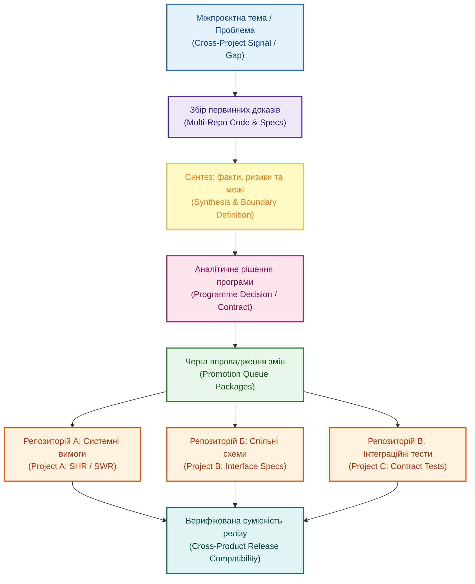

# Програмна аналітика: дисципліна між проєктним менеджментом, архітектурою та штучним інтелектом

**Автор:** [Микола Федчик (Mykola Fedchyk)](book/about-the-author.md) · [LinkedIn](https://www.linkedin.com/in/nickfedchik/) · [GitHub](https://github.com/nick-fedchik)

---

## Вступ

**Мета статті:** визначити дисципліну програмної аналітики (*Programme Analysis*) як системний інженерний процес координації міжпроєктних залежностей, протокольних контрактів, меж володіння та доказів сумісності в багатокомпонентних продуктових сімействах.

**Технологічна проблема, яка вирішується:** у розподілених розробках кожна окрема команда ефективно веде власний беклог і репозиторій. Проте під час інтеграції виявляється, що одна підсистема змінила константи протоколу, друга перейшла на резервний алгоритм, а третя по-своєму трактує критерії готовності. Локально ніхто не припустився помилки, але на рівні програми виникає затримка та ризик несумісного випуску. Стаття демонструє, як побудувати середній аналітичний шар, що забезпечує узгодження рішень до їхньої реалізації в коді.

---

## Проблема: рішення губляться на стиках між репозиторіями

Управління складною системою розпадається тоді, коли системні архітектурні рішення делегуються виключно в локальні беклоги команд.

Уявімо продуктову сім'ю: один сервіс відповідає за простежуваність артефактів, другий реалізує детерміновані правила виведення, третій керує сховищем онтологій знань, а четвертий автоматизує публікацію звітів. Окремо функціонує спільний брокер повідомлень (наприклад, шина NATS). Кожен репозиторій має власних розробників, тести та графік випусків. Проте найбільш болючі технічні питання живуть у «сірій зоні» між ними:
- Хто є єдиним власником формату спільного ідентифікатора?
- Який компонент бере на себе обробку за умови деградації обчислювальних ресурсів?
- Як докази успішного тестування одного сервісу підтверджують сумісність усієї програми?
- Чи синхронізовані схеми даних між різними мікросервісами?

Якщо кожна команда вирішує ці питання самостійно, єдиний задум системи втрачається. Через пів року інженери не можуть пояснити, чому міжсервісний інтерфейс було спроєктовано саме так, і змушені щоразу відновлювати дискусії з пам'яті.

Програмна аналітика створює стійкий каркас аргументації, який поєднує інженерні дослідження із системним урядуванням.

*Програмна аналітика транслює системні компроміси у структуровані пакети змін для окремих репозиторіїв.*

## Що таке програмна аналітика та її відмінність від архітектури

Програмна аналітика виступає операційним містком між абстрактними архітектурними концепціями та конкретними завданнями розробників.

Архітектурний огляд (*Architecture Review*) відповідає на запитання «як має бути влаштована система концептуально». Натомість програмна аналітика (*Programme Analysis*) доводить це бачення до практичного впровадження:
1. Визначає конкретні проєкти, які зачіпає зміна.
2. Проводить межі персональної відповідальності за дані та функціональні вузли.
3. Формулює точні вимоги до змін протоколів та форматів повідомлень.
4. Розробляє критерії обов'язкових контрактних тестів (*Contract Tests*).
5. Визначає необхідні поля у маніфестах доказів випуску (*Release Evidence*).

Наприклад, якщо команда досліджує використання локальних компактних моделей штучного інтелекту, архітектура порівнює рушії виконання (ONNX, llama.cpp). Програмна аналітика вирішує прикладні системні питання: який мікросервіс бере на себе розрахунок, як довести відсутність галюцинацій та який компонент зобов'язаний зафіксувати мітку деградованого режиму в журналі телеметрії.

## Математичне моделювання узгодженості міжпроєктних інтерфейсів

Для забезпечення надійності кроспродуктової системи цілісність інтерфейсів між сервісами повинна вимірюватися через індекс узгодженості контрактів.

Нехай програма містить множину міжкомпонентних інтерфейсів $E_{\text{iface}}$ (наприклад, теми шини NATS, виклики gRPC чи формати кадрів CAN). Інтегральний індекс інтерфейсної узгодженості програми $I_{\text{consistency}}$ розраховується за формулою:

$$I_{\text{consistency}} = \frac{1}{|E_{\text{iface}}|} \sum_{(u,v) \in E_{\text{iface}}} \mathbb{I}\left(\text{Schema}_u \equiv \text{Schema}_v\right) \cdot \left(1 - \frac{|\Delta \text{Major}_{uv}|}{\text{MaxVer} + 1}\right) \cdot \mathbb{I}_{\text{tested}}(u,v)$$

**Тут:**
- $I_{\text{consistency}}$ є інтегральним індексом узгодженості міжпроєктних інтерфейсів (безрозмірна величина в межах $[0; 1]$).
- $E_{\text{iface}}$ є множиною всіх активних комунікаційних каналів між компонентами $u$ та $v$ у програмі.
- $\text{Schema}_u$ та $\text{Schema}_v$ є формальними схемами даних (JSON Schema, Protobuf чи ASN.1), які використовуються сторонами взаємодії.
- $\mathbb{I}(\text{Schema}_u \equiv \text{Schema}_v)$ є індикатором тотожності схем даних: $1$ за повної побайтової або семантичної сумісності, і $0$ у разі розбіжності типів полів чи обов'язкових атрибутів.
- $|\Delta \text{Major}_{uv}|$ є абсолютною різницею мажорних версій протоколу за шкалою SemVer між взаємодіючими модулями (ціле невід'ємне число).
- $\text{MaxVer}$ є максимально допустимим розходженням мажорних версій (як правило, $\text{MaxVer} = 1$).
- $\mathbb{I}_{\text{tested}}(u,v)$ є індикатором наявності успішного контрактного тесту: $1$, якщо сумісність підтверджена автоматичним тестом у CI/CD, і $0$ за відсутності перевірки.

**Навчальний числовий приклад:**
У системі автопілота виділено два критичних інтерфейси ($|E_{\text{iface}}| = 2$):
1. Канал передачі координат перешкод від радара до контролера гальм: схеми повністю ідентичні ($\mathbb{I} = 1$), версії однакові ($|\Delta \text{Major}| = 0$), автоматичний контрактний тест пройдено ($\mathbb{I}_{\text{tested}} = 1$). Внесок становить $1 \cdot (1 - 0) \cdot 1 = 1{,}0$.
2. Канал діагностики між контролером та сервером телеметрії: схеми сумісні ($\mathbb{I} = 1$), версії однакові ($|\Delta \text{Major}| = 0$), але контрактний тест для нового формату ще не запускався ($\mathbb{I}_{\text{tested}} = 0$). Внесок становить $1 \cdot 1 \cdot 0 = 0$.

Розрахуємо загальний індекс узгодженості:

$$I_{\text{consistency}} = \frac{1}{2} (1{,}0 + 0) = 0{,}50 \quad (50\%)$$

Відсутність автоматичного контрактного тесту хоча б для одного інтерфейсу обвалює системну узгодженість програми до 50%. Це слугує детермінованим сигналом для програмного менеджера: реліз не готовий до випуску, доки не буде підтверджено сумісність обох каналів.

## Життєвий цикл та структура аналітичного дослідження

Дисциплінований підхід до аналізу вимагає чіткої послідовності кроків, що запобігає перетворенню дослідження на нескінченну полеміку.

Процес програмного аналізу охоплює шість фаз:
1. **Ініціація (Intake):** чітке формулювання системної проблеми (наприклад: розподіл функцій між бортовим контролером та наземним пунктом управління).
2. **Збір первинних фактів (Evidence Collection):** аналіз чинного коду, ревізій специфікацій, поведінки інтерфейсів CLI та звітів CI/CD. Жодні суб'єктивні думки не розглядаються без посилання на артефакти.
3. **Синтез і детекція прогалин (Synthesis):** суворе відділення об'єктивних фактів від інженерних припущень та виявлених ризиків.
4. **Ухвалення рішення (Decision):** фіксація меж володіння даними та затвердження еталонного формату контракту взаємодії.
5. **Впровадження у проєкти (Promotion):** трансляція загального рішення у конкретні системні вимоги (SHR), архітектурні записи (ADR) та задачі беклогів окремих команд.
6. **Валідація сумісності (Validation):** проведення наскрізних контрактних тестів та перевірка маніфестів доказів релізу.

Ця послідовність гарантує, що жодне системне рішення не зависне в повітрі, а буде доведено до перевіреного коду.

## Черга впровадження змін (Promotion Queue) як практичний інструмент

Найважливішим робочим механізмом програмної аналітики є черга впровадження (*Promotion Queue*), яка транслює міжпроєктні висновки в роботу окремих репозиторіїв.

Черга впровадження не є звичайним беклогом задач: вона містить типізовані пакети змін:
- Оновлення спільних бібліотек та схем повідомлень (NATS/Protobuf).
- Узгодження схем доказів релізу (*Release Evidence Schema*).
- Стандартизація форматів телеметрії та діагностичних кодів деградованого режиму.
- Коригування політик безпеки та цензурування інформації.

Кожен пакет змін має призначеного власника, посилання на вихідний аналітичний документ, пріоритет та очікувані критерії приймання в кожному репозиторії. Це виключає ситуацію, коли про важливе архітектурне рішення знає лише автор ідеї.

## Роль штучного інтелекту: семантичний контроль несуперечливості

Штучний інтелект у програмній аналітиці слугує потужним інструментом виявлення суперечностей між різними репозиторіями та документами.

Мовний асистент виконує рутинний порівняльний аналіз:
- Виявляє термінологічний дрейф: помічає, коли в одному сервісі режим називають «апаратним прискоренням на NPU», а в документації іншого він описаний як звичайний програмний резерв на процесорі.
- Перевіряє актуальність посилань на стандарти: підсвічує випадки, коли різні команди використовують несумісні версії тієї самої специфікації.
- Синтезує первинні чернетки міжсервісних угод, витягуючи структури даних із коду різних мов програмування (Go, C++, Rust).

При цьому остаточні рішення щодо зміни контрактів завжди затверджуються системними архітекторами та технічними лідерами програми.

## Ризики дисципліни: як не перетворити аналітику на бюрократію

Як і будь-який управлінський процес, програмна аналітика несе ризик переродження у надмірну бюрократизацію, якщо не встановити чіткі межі її застосування.

Типові небезпеки та заходи протидії:
- **Надмірний аналіз (Over-Analysis):** спроба описувати кожну дрібну правку коду окремим системним документом. Лікування: аналітичні дослідження ініціюються виключно для міжпроєктних інтерфейсів, зміни базових ліній або невизначеності меж відповідальності.
- **Застарівання аналітики:** документ без зафіксованої дати перегляду та списку впроваджених змін вводить команду в оману. Лікування: кожен аналітичний документ має чіткий життєвий цикл із переведенням у стан «Архів» після реалізації.
- **Відсутність результату:** дослідження, які не закінчилися змінами у коді чи вимогах окремих проєктів, є марнуванням інженерного часу.

Здорова дисципліна тримається на балансі: мінімум необхідних документів, строга перевірка фактів та обов'язковий вихід у працюючий код.

---

## Висновки

1. Програмна аналітика є обов'язковим проміжним шаром інженерного урядування між абстрактною архітектурою та локальними беклогами окремих команд.
2. Головне завдання дисципліни полягає в захисті кроспродуктової системи від втрати контексту рішень, що виникають на стиках між автономними репозиторіями.
3. Узгодженість міжпроєктних інтерфейсів повинна підтверджуватися математичним індексом відповідності схем та обов'язковими автоматизованими контрактними тестами.
4. Черга впровадження (Promotion Queue) забезпечує контрольовану трансляцію загальносистемних висновків у конкретні пакети завдань для окремих проєктів.
5. Штучний інтелект у контурі програмної аналітики виступає ефективним інструментом детекції термінологічного та смислового дрейфу між різними репозиторіями.

---

## Посилання

1. ISO 21503:2022. *Project, programme and portfolio management — Guidance on programme management*. International Organization for Standardization, Geneva, Switzerland. [https://www.iso.org/standard/78644.html](https://www.iso.org/standard/78644.html)
2. ISO 21505:2017. *Project, programme and portfolio management — Guidance on governance*. International Organization for Standardization, Geneva, Switzerland. [https://www.iso.org/standard/66166.html](https://www.iso.org/standard/66166.html)
3. Bass, L., Clements, P., Kazman, R. *Software Architecture in Practice*. 4th Edition. Addison-Wesley, 2021.
4. Newman, S. *Building Microservices: Designing Fine-Grained Systems*. 2nd Edition. O'Reilly Media, 2021.
5. NIST AI 600-1. *Artificial Intelligence Risk Management Framework: Generative Artificial Intelligence Profile*. National Institute of Standards and Technology, Gaithersburg, MD, 2024. [https://doi.org/10.6028/NIST.AI.600-1](https://doi.org/10.6028/NIST.AI.600-1)

---

## Терміни

- **Дрейф інтерфейсу (Interface Drift)**: несанкціонована або несинхронізована модифікація структури даних чи семантики повідомлень в одній підсистемі, що порушує сумісність із суміжними модулями.
- **Контрактний тест (Contract Test)**: автоматизований тест верифікації сумісності двох незалежних сервісів на основі погодженої формальної схеми повідомлень без необхідності повного системного розгортання.
- **Програмна аналітика (Programme Analysis)**: системна дисципліна координації та обґрунтування міжпроєктних рішень, контрактів взаємодії, меж відповідальності та доказів сумісності в багатокомпонентних продуктових програмах.
- **Черга впровадження (Promotion Queue)**: структурований реєстр перевірених системних рішень, які очікують на декомпозицію та реалізацію у вигляді конкретних задач у локальних репозиторіях команд.

---

## Скорочення

- **ADR**: Architecture Decision Record (журнал архітектурних рішень)
- **ASN.1**: Abstract Syntax Notation One (мова опису структур даних)
- **CI/CD**: Continuous Integration / Continuous Delivery (неперервна інтеграція та доставка)
- **CLI**: Command Line Interface (командний інтерфейс користувача)
- **gRPC**: Google Remote Procedure Call (фреймворк віддаленого виклику процедур)
- **JSON**: JavaScript Object Notation (текстовий формат обміну даними)
- **NATS**: Neural Autonomic Transport System (високопродуктивна шина повідомлень)
- **NPU**: Neural Processing Unit (нейронний процесорний блок)
- **ONNX**: Open Neural Network Exchange (відкритий формат нейромережевих моделей)
- **SemVer**: Semantic Versioning (семантичне версіонування)
- **SHR**: System Hardware Requirement (системна апаратна вимога)
- **SWR**: System Software Requirement (системна програмна вимога)

---

## Про автора

**Микола Федчик (Mykola Fedchyk)**: український інженер, системний архітектор та дослідник у галузі кіберфізичних комплексів, доказового штучного інтелекту та критичних вбудованих систем. Понад двадцять років керує інженерними розробками та проєктуванням складних апаратно-програмних комплексів у сфері мережевої безпеки, телекомунікацій та автомобільної електроніки відповідно до вимог міжнародних стандартів ISO 26262 та ISO/SAE 21434. Досліджує практичне застосування експертних систем, семантичних онтологій та цифрової нитки для управління складними інженерними програмами.

Детальніша інформація: [Про автора](book/about-the-author.md) · [LinkedIn](https://www.linkedin.com/in/nickfedchik/) · [GitHub](https://github.com/nick-fedchik)
