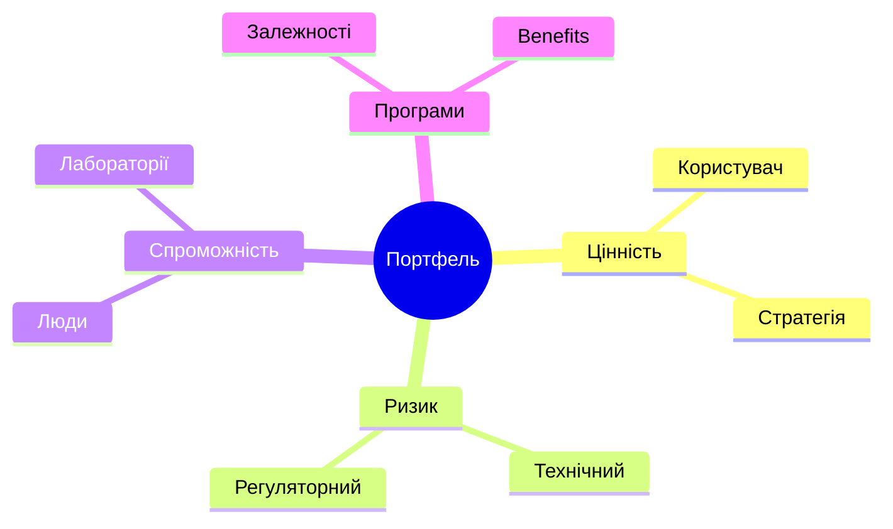

# Управління програмою і портфелем: мистецтво не починати все одночасно

Проєкт доставляє результат; програма узгоджує кілька результатів заради спільної користі; портфель розподіляє обмежені ресурси між різними ставками. Їх не можна керувати сумою зелених статусів: локально здорова робота може блокувати головну інтеграцію або витісняти важливішу ініціативу.

## Рішення, а не список запусків

Портфельна оцінка має допомогти порівняти альтернативи, а не створити фальшиву точність. Один із варіантів — показувати очікувану цінність із ризиком: $EV=\sum p_iV_i-C$. Важливо явно записати сценарії та ймовірності, бо невідоме не стає відомим від того, що потрапило в таблицю.

Програмний review повинен дивитися на міжпроєктні залежності, спільні ресурси, інтеграційні ризики й фактичну реалізацію користі. Портфельний review додає питання: що треба відкласти або зупинити, щоб не розмазати спроможність. Саме здатність завершити або припинити слабку ініціативу — ознака дисципліни, а не поразка.

AI може швидше зібрати варіанти й залежності, але не визначає цінність замість leadership. Рішення має залишати слід: доступні дані, припущення, обраний варіант, власника й дату повторного перегляду.
