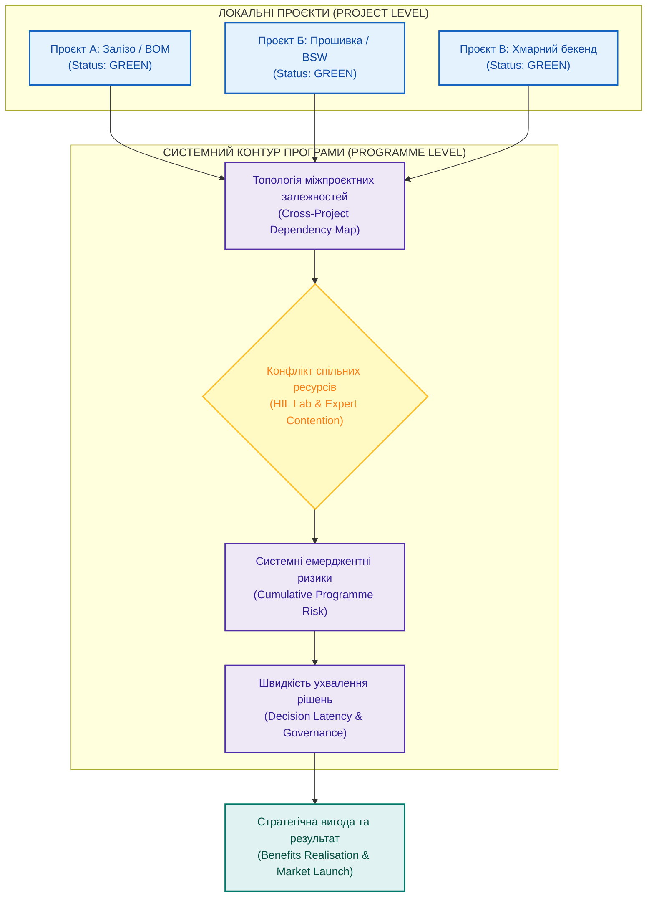

# Управління програмами (Programme Management): чому «зелені» проєкти не гарантують успіху програми

**Автор:** [Микола Федчик (Mykola Fedchyk)](book/about-the-author.md) · [LinkedIn](https://www.linkedin.com/in/nickfedchik/) · [GitHub](https://github.com/nick-fedchik)

---

## Вступ

**Мета статті:** розкрити системну відмінність між управлінням окремими проєктами та управлінням програмою (*Programme Management*), показавши, чому механічне агрегування локальних статусних звітів маскує критичні міжпроєктні ризики та призводить до зриву стратегічних результатів.

**Технологічна проблема, яка вирішується:** керівництво організацій часто зводить програмний менеджмент до збору щотижневих статус-звітів від лідерів команд. Якщо всі три підпроєкти (розробка друкованої плати, створення прошивки та стендові тести) звітують про стовідсотковий зелений статус, програма в цілому може зазнавати краху через несинхронізовані інтерфейси або конкуренцію за спільну кліматичну камеру. Стаття демонструє, як побудувати аналітичну модель програми на основі карти міжпроєктних залежностей, аналізу черг спільних ресурсів та контролю швидкості ухвалення рішень.

---

## Проєктний та програмний менеджмент: різниця цілей і масштабу

Спроба керувати програмою як великим проєктом є фундаментальною системною помилкою, що веде до втрати стратегічного фокусу.

Керівник проєкту (*Project Manager*, PM) спрямовує зусилля на своєчасну здачу конкретного обсягу робіт (*deliverables*): його горизонт обмежений бюджетом, календарним планом, локальним складом команди та виконанням технічного завдання. Керівник програми (*Programme Manager*, PgM) відповідає за досягнення довгострокової стратегічної спроможності або комерційної вигоди (*Strategic Outcomes / Benefits*). Його головна увага зосереджена на топології міжпроєктних зв'язків (*Cross-Project Dependencies*), спільних інтеграційних вікнах (*Integration Windows*) та системних ризиках.

Поки проєктний менеджер контролює написання алгоритму, програмний лідер вирішує: чи не виникне конфлікту за доступ до тестової лабораторії між автомобільною та оборонною гілками підприємства в наступному кварталі.

Програмний менеджмент не є сумою проєктів: це управління емерджентними властивостями складної системи, які виникають виключно на стиках між її автономними частинами.

```mermaid
flowchart TD
    accTitle: Програмний контур системного урядування
    accDescr: Від локальних статусів проєктів через аналіз зв'язків та черг ресурсів до досягнення стратегічної вигоди.

    subgraph Projects["ЛОКАЛЬНІ ПРОЄКТИ (PROJECT LEVEL)"]
        PA["Проєкт А: Залізо / BOM<br/>(Status: GREEN)"]
        PB["Проєкт Б: Прошивка / BSW<br/>(Status: GREEN)"]
        PC["Проєкт В: Хмарний бекенд<br/>(Status: GREEN)"]
    end

    subgraph Programme["СИСТЕМНИЙ КОНТУР ПРОГРАМИ (PROGRAMME LEVEL)"]
        DEP["Топологія міжпроєктних залежностей<br/>(Cross-Project Dependency Map)"]
        RES{"Конфлікт спільних ресурсів<br/>(HIL Lab & Expert Contention)"}
        RISK["Системні емерджентні ризики<br/>(Cumulative Programme Risk)"]
        DEC["Швидкість ухвалення рішень<br/>(Decision Latency & Governance)"]
    end

    BEN["Стратегічна вигода та результат<br/>(Benefits Realisation & Market Launch)"]

    PA --> DEP
    PB --> DEP
    PC --> DEP
    DEP --> RES
    RES --> RISK
    RISK --> DEC
    DEC --> BEN

    classDef proj fill:#e3f2fd,stroke:#1565c0,stroke-width:2px,color:#0d47a1;
    classDef prog fill:#ede7f6,stroke:#512da8,stroke-width:2px,color:#311b92;
    classDef res fill:#fff9c4,stroke:#fbc02d,stroke-width:2px,color:#f57f17;
    classDef ben fill:#e0f2f1,stroke:#00796b,stroke-width:2px,color:#004d40;

    class PA,PB,PC proj;
    class DEP,RISK,DEC prog;
    class RES res;
    class BEN ben;
```

*Програмний рівень аналізує системні конфлікти ресурсів та приховані залежності, які залишаються непомітними для окремих проєктних команд.*

## Чому проста сума локальних статусів веде до кризи

Локальний оптимізм окремих проєктних звітів створює небезпечну ілюзію стабільності, маскуючи інтеграційні розриви.

Розглянемо класичний приклад з автомобільної розробки. Команда схемотехніків встигає підготувати ревізію плати до кінця місяця. Команда розробників прошивки завершує базові модулі вчасно. Команда випробувачів підтверджує готовність тест-плану. На зведеному дашборді всі три сектори світяться зеленим. Проте розробники плати затримують передачу зразків усього на три дні через логістику. Прошивка не встигає збігтися з відкритим двотижневим вікном кліматичної лабораторії, а наступний вільний слот призначений лише через півтора місяця.

Жоден із проєктів не винен у зриві, якщо оцінювати їх ізольовано: кожен виконав понад 95% свого плану. Проте програма загалом втратила критичну віху випуску продукту.

Програмний ризик є емерджентним: він народжується не всередині окремих робіт, а у часових проміжках між ними.

## Математичне моделювання ймовірності успіху програми

Для демонстрації системної крихкості розрахуємо ймовірність інтеграційного успіху програми, що складається з кількох взаємопов'язаних проєктів.

Нехай програма охоплює $K$ взаємозалежних проєктів. Навіть якщо кожен проєкт $i$ має високу номінальну ймовірність успішного вчасного завершення $P_i$, сумарна ймовірність успіху всієї програми $P_{\text{program}}$ підпорядковується правилу добутку ймовірностей із додатковим штрафом за зв'язність інтерфейсів:

$$P_{\text{program}} = \left(\prod_{i=1}^{K} P_i\right) \cdot \prod_{(u,v) \in E_{\text{dep}}} \left(1 - \rho_{uv} \cdot \max\left(0, \; 1 - \frac{B_{uv}}{\sigma_{u}}\right)\right)$$

**Тут:**
- $P_{\text{program}}$ є інтегральною ймовірністю своєчасного досягнення стратегічної мети програми (безрозмірна величина в межах $[0; 1]$).
- $K$ є загальною кількістю проєктів у складі програми (ціле додатне число).
- $P_i$ є локальною ймовірністю виконання зобов'язань $i$-м проєктом у базовий строк ($P_i \in (0; 1]$).
- $E_{\text{dep}}$ є множиною критичних міжпроєктних залежностей між результатами проєктів $u$ та $v$.
- $\rho_{uv}$ є коефіцієнтом чутливості та жорсткості зв'язку між проєктами ($\rho_{uv} \in (0; 1]$; наприклад, $\rho_{uv} = 1{,}0$ за повної неможливості тестування без фізичної плати).
- $B_{uv}$ є запланованим часовим буфером між здачею результату проєктом $u$ та його використанням у проєкті $v$ (у календарних днях).
- $\sigma_u$ є стандартним відхиленням тривалості виконання задачі-попередника в проєкті $u$ за методом PERT (у днях).

**Навчальний числовий приклад:**
Розглянемо програму створення електронного модуля, що складається з трьох проєктів із локальним зеленим статусом: виготовлення плати ($P_1 = 0{,}95$), написання базового ПЗ ($P_2 = 0{,}95$) та інтеграційних випробувань ($P_3 = 0{,}95$).
Між платою та прошивкою існує критична залежність ($\rho_{12} = 1{,}0$). Буфер становить $B_{12} = 2$ дні, тоді як невизначеність виробництва плати складає $\sigma_1 = 4$ дні:
Штраф за залежність становить:
$$1 - 1{,}0 \cdot \max\left(0, \; 1 - \frac{2}{4}\right) = 1 - 0{,}5 = 0{,}5$$

Розрахуємо підсумкову ймовірність успіху програми:

$$P_{\text{program}} = (0{,}95 \cdot 0{,}95 \cdot 0{,}95) \cdot 0{,}5 = 0{,}857 \cdot 0{,}5 \approx 0{,}428 \quad (42{,}8\%)$$

Математика доводить жорстку істину: попри те, що всі три керівники проєктів докладають про зелений статус із надійністю 95%, реальна ймовірність вчасної інтеграції програми складає менше 43%! Недооцінка дефіциту буферів між залежними командами гарантує зрив термінів у більш ніж половині випадків.

## Об'єкти програмного рівня: що має бачити керівник програми

Програма потребує власного набору системних сутностей, які неможливо звести до атрибутів окремих проєктів.

Повноцінна модель програми повинна явно оперувати такими артефактами:
1. **Міжпроєктна залежність (Cross-Project Dependency):** формалізований двосторонній контракт між двома командами, що містить призначених власників з обох сторін, чіткі критерії приймання (*Acceptance Criteria*), дату передачі та оцінку наслідків у разі затримки.
2. **Інтеграційна подія (Integration Event):** контрольна точка зведення підсистем (наприклад, сумісний запуск плати та прошивки на випробувальному стенді), яка має строгі вхідні критерії допуску (*Entry Criteria*).
3. **Спільні ресурси та вузькі місця (Shared Contention):** унікальні спеціалісти (експерти з безпеки), дороге обладнання (кліматичні та безлунні камери), доступ до яких вимагає арбітражу на рівні всієї програми.
4. **Стратегічна вигода (Benefits Realisation):** кінцевий бізнес-результат або оборонна спроможність, заради яких ініційовано програму, із затвердженим планом вимірювання після завершення інженерних робіт.

Якщо ці сутності не зафіксовані в системі, керівник програми перетворюється на пасивного збирача чужих звітів замість реального координатора системної доставки.

## Управління спільними ресурсами та чергами очікування

Найбільш руйнівні кризи в програмах виникають через некеровану конкуренцію за спільні неподільні ресурси.

Коли три паралельні підпроєкти одночасно виходять на фінальну стадію, їм усім потрібен один і той самий експерт із функціональної безпеки для проведення аудиту та той самий стенд HIL для сертифікаційного прогону. Окремо кожен керівник вважає, що його графік реалістичний. Проте в точці сходження виникає черга: два проєкти з трьох неминуче простоюють, а їхні високооплачувані інженери чекають на звільнення стенда.

Програмний офіс повинен завчасно складати карту доступності спільних потужностей та виділяти пріоритетні слоти відповідно до стратегічної важливості підсистем, усуваючи конфлікти задовго до їхнього виникнення.

## Реалізація стратегічних вигід проти механічної здачі завдань

Успіх програми визначається не кількістю закритих завдань у трекері, а фактичним досягненням запланованої комерційної або безпекової мети.

Часто виникає ситуація, коли всі підпроєкти формально виконали свої зобов'язання: плата виготовлена, код скомпільований, інструкція користувача написана. Проте клієнт не може запустити виріб в експлуатацію, оскільки сервісна служба не навчена, ланцюг постачання запчастин не налаштований, а хмарний сервер не витримує пікового навантаження. Проєктні менеджери вважають свою місію завершеною, але програма в цілому зазнала поразки.

Керівник програми зобов'язаний тримати наскрізний зв'язок між технічними результатами (*Outputs*) та кінцевими бізнес-вигодами (*Outcomes*), супроводжуючи виріб до моменту отримання стійкого ефекту.

## Роль штучного інтелекту в системному аналізі програми

Штучний інтелект у програмному управлінні допомагає виявляти приховані міжпроєктні закономірності, які губляться у великих масивах статусів.

Мовний асистент вирішує задачі кореляції даних із різних команд:
- Виявляє непрямі залежності: помічає, що затримка одного постачальника в проєкті датчиків неминуче вдарить по графіку випробувань проєкту автопілота.
- Нормалізує лексику звітів: зіставляє формулювання різних менеджерів («невелика заминка з чипом» та «очікуємо поставку компонентів»), ідентифікуючи спільну проблему в логістиці.
- Відстежує час очікування рішень (*Decision Latency*): сигналізує вищому керівництву про те, що нерозв'язаний технічний компроміс блокує роботу трьох команд уже другий тиждень.

Це дозволяє команді програми діяти на випередження, спираючись на об'єктивну картину міжсистемних взаємодій.

---

## Висновки

1. Управління програмою принципово відрізняється від управління проєктом фокусом на міжпроєктних залежностях, системних ризиках та досягненні кінцевих стратегічних вигід.
2. Проста сума «зелених» локальних статусів окремих команд не гарантує успіху програми через наявність нелінійних затримок у точках передачі результатів та на стиках інтерфейсів.
3. Ймовірність успіху програми підпорядковується правилу добутку ймовірностей, що за наявності дефіциту часових буферів між залежними роботами призводить до високої ймовірності зриву термінів.
4. Конфлікти за спільні ресурси (лабораторії, унікальні експерти) мають розв'язуватися на рівні програмного офісу шляхом побудови динамічних розкладів завантаження.
5. Штучний інтелект у програмному контурі забезпечує раннє виявлення системних ризиків та моніторинг швидкості ухвалення рішень керівними органами.

---

## Посилання

1. ISO 21503:2022. *Project, programme and portfolio management — Guidance on programme management*. International Organization for Standardization, Geneva, Switzerland. [https://www.iso.org/standard/78644.html](https://www.iso.org/standard/78644.html)
2. ISO 21505:2017. *Project, programme and portfolio management — Guidance on governance*. International Organization for Standardization, Geneva, Switzerland. [https://www.iso.org/standard/66166.html](https://www.iso.org/standard/66166.html)
3. Project Management Institute. *The Standard for Program Management*. 5th Edition. PMI, Newtown Square, PA, 2024.
4. Thiry, M. *Program Management*. 2nd Edition. Routledge, 2015.
5. Kerzner, H. *Project Management: A Systems Approach to Planning, Scheduling, and Controlling*. 13th Edition. John Wiley & Sons, 2022.

---

## Терміни

- **Емерджентний ризик (Emergent Risk)**: загроза успіху системи, яка не простежується всередині окремих підсистем, а виникає виключно внаслідок їхньої взаємодії, конфлікту ресурсів або розриву часових інтервалів.
- **Інтеграційне вікно (Integration Window)**: узгоджений часовий інтервал у розкладі програми, протягом якого результати кількох проєктів мають бути фізично об'єднані та верифіковані на спільному стенді.
- **Керівник програми (Programme Manager, PgM)**: лідер, уповноважений координувати групу взаємопов'язаних проєктів для досягнення спільних стратегічних цілей та вигід організації.
- **Міжпроєктна залежність (Cross-Project Dependency)**: технічне, логістичне або ресурсне відношення, за якого початок або завершення робіт в одному проєкті прямо обумовлюється результатом іншого проєкту.
- **Стратегічна вигода (Benefit)**: вимірюване покращення, цінність або спроможність, отримана зацікавленими сторонами внаслідок успішного завершення всієї програми.
- **Час ухвалення рішення (Decision Latency)**: тривалість періоду від моменту виявлення потреби в управлінському рішенні до його офіційного затвердження наглядовим органом.

---

## Скорочення

- **ADR**: Architecture Decision Record (журнал архітектурних рішень)
- **BOM**: Bill of Materials (відомість матеріалів)
- **BSW**: Basic Software (базове програмне забезпечення)
- **CCB**: Change Control Board (рада контролю змін)
- **HIL**: Hardware-in-the-Loop (апаратно-програмне моделювання на фізичному стенді)
- **ISO**: International Organization for Standardization (Міжнародна організація зі стандартизації)
- **PERT**: Program Evaluation and Review Technique (метод оцінки та перегляду програм)
- **PgM**: Programme Manager (керівник програми)
- **PM**: Project Manager (керівник проєкту)
- **PMO**: Project Management Office (проєктний офіс)
- **WBS**: Work Breakdown Structure (ієрархічна структура робіт)

---

## Про автора

**Микола Федчик (Mykola Fedchyk)**: український інженер, системний архітектор та дослідник у галузі кіберфізичних комплексів, доказового штучного інтелекту та критичних вбудованих систем. Понад двадцять років керує інженерними розробками та проєктуванням складних апаратно-програмних комплексів у сфері мережевої безпеки, телекомунікацій та автомобільної електроніки відповідно до вимог міжнародних стандартів ISO 26262 та ISO/SAE 21434. Досліджує практичне застосування експертних систем, семантичних онтологій та цифрової нитки для управління складними інженерними програмами.

Детальніша інформація: [Про автора](book/about-the-author.md) · [LinkedIn](https://www.linkedin.com/in/nickfedchik/) · [GitHub](https://github.com/nick-fedchik)
