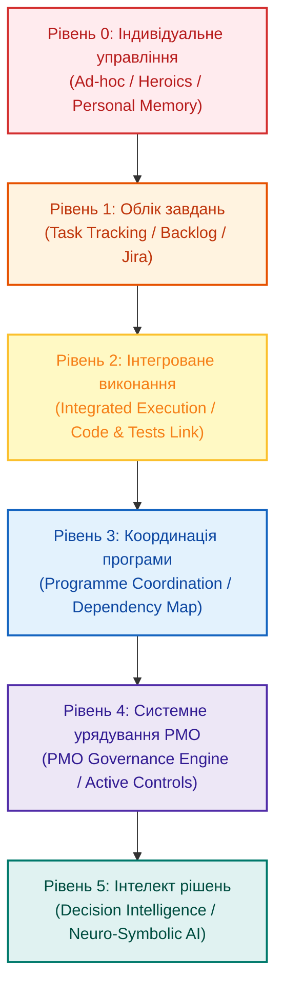

# Модель зрілості систем управління проєктами: як з'являється інженерна пам'ять підприємства

**Автор:** [Микола Федчик (Mykola Fedchyk)](book/about-the-author.md) · [LinkedIn](https://www.linkedin.com/in/nickfedchik/) · [GitHub](https://github.com/nick-fedchik)

---

## Вступ

**Мета статті:** визначити 6-рівневу модель технологічної зрілості інформаційних систем управління проєктами та програмами, продемонструвавши шлях трансформації від хаотичного ручного обліку до інтелектуальної платформи підтримки інженерних рішень із вбудованою довготривалою пам'яттю організації.

**Технологічна проблема, яка вирішується:** багато підприємств мають високу процесну зрілість на папері (сертифікати CMMI чи ISO 9001), проте в реальності управління спирається на розрізнені таблиці Excel та приватне листування в чатах. Коли ключовий фахівець звільняється або наближається зовнішній аудит, організація виявляє повну відсутність цифрової пам'яті: ніхто не може швидко пояснити, чому було прийнято конкретне технічне рішення і які тести підтверджують безпеку релізу. Стаття пропонує практичний діагностичний інструмент для оцінки та модернізації системного ландшафту управління.

---

## Процесна зрілість проти зрілості інформаційної системи

Головна причина бюрократичного перевантаження полягає у дисбалансі між формально описаними регламентами та рівнем їхньої автоматизації в реальних інструментах.

Класичні моделі зрілості (CMMI, Automotive SPICE, OPM3) фокусуються на описі процесів: чи задокументовані процедури, чи визначені ролі та чи проводяться регулярні наради. Проте навіть найкраще регламентований процес управління ризиками не працює, якщо реєстр небезпек ведеться у статичній таблиці, задачі розробників перебувають у Jira, метрики збираються у PowerPoint, а аргументи комітету змін губляться в пошті.

Керівник проєкту змушений витрачати до 40% робочого часу не на вирішення інженерних задач, а на механічну ручну синхронізацію даних між несумісними системами.

Зрілість системи управління вимірюється її здатністю підтримувати інженерний процес автоматично, виключаючи ручну реконструкцію контексту перед кожним звітом чи аудитом.

*Шлях зрілості веде від суб'єктивної пам'яті окремих співробітників до корпоративної операційної пам'яті з підтримкою ухвалення рішень.*

## Математична оцінка дисбалансу процесів та автоматизації

Для запобігання перевантаженню команди доцільно математично вимірювати коефіцієнт гармонійності процесів та інструментальної підтримки.

Якщо рівень процесної бюрократії істотно випереджає можливості інформаційної системи, співробітники неминуче створюють тіньові обхідні шляхи (*Shadow IT*). Розглянемо індекс дисбалансу системи $H_{\text{maturity}}$:

$$H_{\text{maturity}} = \frac{\sum_{i=1}^{D} w_i \cdot S_{\text{auto}, i}}{\sum_{i=1}^{D} w_i \cdot P_{\text{doc}, i}}$$

**Тут:**
- $H_{\text{maturity}}$ є коефіцієнтом відповідності інструментарію регламентам (безрозмірна величина; система вважається збалансованою, якщо $H_{\text{maturity}} \in [0{,}85; 1{,}15]$).
- $D$ є кількістю обов'язкових інженерних практик підприємства (управління вимогами, конфігураціями, ризиками, змінами, тестами).
- $w_i$ є ваговим коефіцієнтом важливості $i$-ї практики, де $\sum w_i = 1{,}0$.
- $P_{\text{doc}, i}$ є рівнем вимог стандарту згідно з регламентами за шкалою від 1 до 5 (паперова зрілість).
- $S_{\text{auto}, i}$ є фактичним рівнем автоматизації даної практики в інформаційній системі за шкалою від 1 до 5 (системна зрілість).

**Навчальний числовий приклад:**
Підприємство задекларувало відповідність рівню CMMI Level 4 для трьох ключових практик:
1. Управління змінами ($w_1 = 0{,}3, P_{\text{doc}, 1} = 4$): на практиці зміни узгоджуються в електронній пошті, а в трекері лише пересуваються дати ($S_{\text{auto}, 1} = 1{,}5$).
2. Простежуваність вимог ($w_2 = 0{,}4, P_{\text{doc}, 2} = 4$): матриця ведеться вручну в Excel перед аудитами ($S_{\text{auto}, 2} = 1{,}0$).
3. Регресійне тестування ($w_3 = 0{,}3, P_{\text{doc}, 3} = 4$): конвеєр CI частково автоматизований ($S_{\text{auto}, 3} = 3{,}0$).

Розрахуємо чисельник і знаменник:
$$P_{\text{total}} = 0{,}3 \cdot 4 + 0{,}4 \cdot 4 + 0{,}3 \cdot 4 = 4{,}0$$
$$S_{\text{total}} = 0{,}3 \cdot 1{,}5 + 0{,}4 \cdot 1{,}0 + 0{,}3 \cdot 3{,}0 = 0{,}45 + 0{,}40 + 0{,}90 = 1{,}75$$
$$H_{\text{maturity}} = \frac{1{,}75}{4{,}0} \approx 0{,}44$$

Коефіцієнт $0{,}44$ вказує на глибоку системну кризу: процесні вимоги більш ніж удвічі перевищують можливості системи! Це математично пояснює хронічне вигорання інженерів: команда змушена вручну компенсувати слабкість інструментів, що гарантовано веде до приховування проблем та зриву строків.

## Рівень 0: індивідуальне управління

На нульовому рівні проект тримається на особистій дисципліні PM, engineering lead-а і кількох сильних людей. Плани живуть у таблицях, рішення у чатах, ризики в голові, статуси в усних домовленостях. Це може працювати для маленької команди, де всі поруч і контекст спільний.

Проблема проявляється після першого масштабу: хтось іде у відпустку, змінюється команда, з'являється audit question, приходить новий PM. Раптом виявляється, що організація не має пам'яті. Вона має людей, які пам'ятають. Це різні речі.

## Рівень 1: task tracking

На першому рівні з'являється backlog: задачі, assignees, statuses, labels, deadlines, milestones. Це великий крок уперед. Команда бачить поточну роботу, може координувати execution, контролювати basic flow.

Але task tracking не відповідає на багато engineering questions. Чи закрита вимога, якщо закрита задача? Чи пройдені потрібні тести? Чи змінився risk після failed regression? Чи вплинув defect на release gate? Чи є approval для waiver? Task tracker сам по собі не тримає повну модель проекту.

Тому перший рівень часто створює ілюзію контролю. Задачі рухаються, dashboard оновлюється, але evidence chain живе десь поруч.

## Рівень 2: integrated project execution

На другому рівні задачі починають зв'язуватися з реальними engineering artifacts: repositories, merge requests, CI/CD, requirements, tests, defects, documentation, release artifacts. Система бачить work item разом із частиною доказів виконання.

Це момент, коли status report можна частково збирати з джерел, а не з пам'яті PM. Наприклад, задача закрита, але пов'язаний test failed. Requirement implemented, але verification не завершена. Merge request merged, але security scan має finding. Такі сигнали мають з'являтися автоматично.

Integrated execution наближає project management до engineering reality. Але programme-level dependencies, governance, portfolio choices і PMO rules ще лишаються окремою роботою. Це сильна основа, після якої починається наступний рівень зрілості.

## Шість рівнів зрілості інформаційної системи управління

Еволюція інженерного управління проходить через шість послідовних технологічних стадій:

### Рівень 0. Індивідуальне управління (Ad-hoc / Heroics)
Управління тримається виключно на особистій пам'яті та енергії окремих керівників. Плани ведуться в локальних таблицях, комунікація відбувається в чатах, а статус завдань оцінюється суб'єктивно. За відпустки або звільнення ключового інженера проєкт опиняється в стані амнезії: організація втрачає контекст ухвалених рішень.

### Рівень 1. Облік завдань (Task Tracking)
З'являється перший централізований інструмент (Jira, GitLab Issues, Azure DevOps). Команда отримує спільний беклог, статуси карток, призначення виконавців та дедлайни. Проте система бачить лише факт активності: вона не знає, чи закрита вимога стандарту, чи підтверджено код тестом і чи не порушує зміна ліцензійну політику.

### Рівень 2. Інтегроване виконання (Integrated Execution)
Завдання в трекері зв'язуються з інженерними артефактами: репозиторіями вихідного коду, запитами на злиття (*merge requests*), конвеєрами CI/CD, матрицями верифікації та дефектами. Статус виконання починає спиратися на перевірні факти: завдання не можна закрити без проходження тестів, а коміт коду автоматично оновлює стан вимоги.

### Рівень 3. Координація програми (Programme Coordination)
Система піднімається над рівнем окремого проєкту, формуючи спільну карту міжпроєктних залежностей (*Cross-Project Dependencies*), розклад використання спільних лабораторій та облік емерджентних ризиків. Інтеграційні вікна моделюються заздалегідь, що усуває несподівані блокування на стиках підсистем.

### Рівень 4. Системне урядування PMO (PMO Governance Engine)
Проєктний офіс трансформується з органу контролю звітності у функціональний рушій системи. Регламенти стандартів (ASPICE, ISO 26262, DO-178C) вбудовані у конвеєри у вигляді активних правил перевірки (*Quality Gates*). Будь-яке відхилення від базової лінії автоматично вимагає проходження ради контролю змін (CCB).

### Рівень 5. Інтелект рішень (Decision Intelligence)
Найвищий рівень автоматизації, що поєднує граф інженерних знань (*Knowledge Graph*), детерміновані правила експертної системи та локальні моделі штучного інтелекту. Система автоматично проводить аналіз впливу будь-якої зміни, формує цифрове досьє рішень (*Decision Dossier*) та пропонує перевірні варіанти усунення ризиків із точними посиланнями на джерела.

## Тіньовий облік (Shadow IT) як головний індикатор незрілості системи

Найбільш надійним способом оцінки реального стану системи управління є виявлення неофіційних інструментів, якими інженери користуються потай від керівництва.

Якщо розробники ведуть окрему приватну таблицю ризиків, обговорюють технічні компроміси в закритих чатах або копіюють вимоги в особисті нотатки, це не свідчить про їхнє небажання дотримуватися дисципліни. Навпаки, це є прямим доказом того, що офіційна корпоративна система занадто громіздка, повільна або не надає потрібного контексту.

Завдання проєктного офісу полягає не в адміністративній забороні тіньових інструментів, а в інтеграції їхнього функціоналу в офіційний конвеєр даних.

## Штучний інтелект: підсилювач порядку, а не маскування хаосу

Впровадження алгоритмів штучного інтелекту приносить користь лише після досягнення базової дисципліни структуризації артефактів.

Якщо компанія перебуває на рівні 1 (простий трекінг завдань), підключення мовної моделі призведе лише до швидкої генерації переконливих, але бездоказових текстів. Модель підсумує хаос, не створивши керованості. Лише за наявності цифрової нитки та зв'язків між кодом, тестами й вимогами (рівні 3–5) асистент стає дієвим інструментом аналізу впливу, діагностики прогалин безпеки та перевірки свіжості доказів.

Штучний інтелект є каталізатором зрілості: він багаторазово прискорює аналіз верифікованих даних, але не здатен замінити собою відсутні інженерні факти.

---

## Висновки

1. Зрілість системи управління проєктами вимірюється здатністю платформи підтримувати інженерний процес автоматично без потреби у ручній реконструкції звітів перед аудитами.
2. Процесна зрілість на папері повинна підтверджуватися відповідним рівнем автоматизації інструментів; дисбаланс між регламентами та системами неминуче веде до вигорання команд.
3. Еволюція управління проходить 6 рівнів: від індивідуального героїзму через інтегроване виконання до активного урядування PMO та інтелекту рішень.
4. Наявність тіньового обліку (Shadow IT) слугує об'єктивним індикатором розриву між потребами інженерів та можливостями корпоративних платформ.
5. Штучний інтелект у системі управління розкриває потенціал лише на високих рівнях зрілості даних, забезпечуючи автоматизовану підготовку досьє для ухвалення рішень людьми.

---

## Посилання

1. ISO 21502:2020. *Project, programme and portfolio management — Guidance on project management*. International Organization for Standardization, Geneva, Switzerland. [https://www.iso.org/standard/74947.html](https://www.iso.org/standard/74947.html)
2. ISO 21505:2017. *Project, programme and portfolio management — Guidance on governance*. International Organization for Standardization, Geneva, Switzerland. [https://www.iso.org/standard/66166.html](https://www.iso.org/standard/66166.html)
3. CMMI Institute. *CMMI for Development, Version 2.0*. Information Systems Audit and Control Association (ISACA), 2018.
4. Crawford, J. K. *Project Management Maturity Model*. 4th Edition. Auerbach Publications, 2021.
5. Kostalova, J., McGrath, J. *Available Project Management Maturity Models Worldwide and its Comparison*. In: 13th IPMA Research Conference Proceedings, 2025.

---

## Терміни

- **Досьє рішення (Decision Dossier)**: машинно-згенерований пакет інформації, що містить вихідні факти, результати аналізу впливу, альтернативи та оцінку ризиків для розгляду людиною.
- **Зрілість системи управління (Management System Maturity)**: ступінь повноти, інтегрованості та автоматизації цифрових інструментів підтримки інженерних процесів підприємства.
- **Інженерна пам'ять підприємства (Organizational Memory)**: сукупність верифікованих цифрових артефактів, зв'язків цифрової нитки, рішень та уроків попередніх проєктів, доступна для повторного використання.
- **Тіньовий облік (Shadow IT)**: несанкціоноване використання інженерами неофіційних інструментів (особистих таблиць, чатів, локальних баз) в обхід корпоративних систем.
- **Шлюз якості (Quality Gate)**: точка формальної або автоматичної перевірки готовності артефакту чи системи до переходу на наступну технологічну фазу.

---

## Скорочення

- **ADR**: Architecture Decision Record (журнал архітектурних рішень)
- **ASPICE**: Automotive Software Process Improvement and Capability Determination (модель оцінки зрілості процесів розробки)
- **CCB**: Change Control Board (рада контролю змін)
- **CI/CD**: Continuous Integration / Continuous Delivery (неперервна інтеграція та доставка)
- **CMMI**: Capability Maturity Model Integration (модель інтеграції зрілості спроможностей)
- **HIL**: Hardware-in-the-Loop (апаратно-програмне моделювання на фізичному стенді)
- **ISO**: International Organization for Standardization (Міжнародна організація зі стандартизації)
- **PM**: Project Manager (керівник проєкту)
- **PMMM**: Project Management Maturity Model (модель зрілості управління проєктами)
- **PMO**: Project Management Office (проєктний офіс)
- **SHR**: System Hardware Requirement (системна апаратна вимога)
- **SWR**: System Software Requirement (системна програмна вимога)
- **WBS**: Work Breakdown Structure (ієрархічна структура робіт)

---

## Про автора

**Микола Федчик (Mykola Fedchyk)**: український інженер, системний архітектор та дослідник у галузі кіберфізичних комплексів, доказового штучного інтелекту та критичних вбудованих систем. Понад двадцять років керує інженерними розробками та проєктуванням складних апаратно-програмних комплексів у сфері мережевої безпеки, телекомунікацій та автомобільної електроніки відповідно до вимог міжнародних стандартів ISO 26262 та ISO/SAE 21434. Досліджує практичне застосування експертних систем, семантичних онтологій та цифрової нитки для управління складними інженерними програмами.

Детальніша інформація: [Про автора](book/about-the-author.md) · [LinkedIn](https://www.linkedin.com/in/nickfedchik/) · [GitHub](https://github.com/nick-fedchik)
