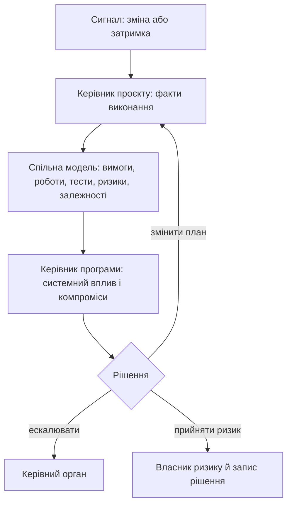

# Системи проєктного і програмного менеджменту: де губиться реальний стан проєкту

Перед важливою віхою команда часто бачить десятки «зелених» карток, але не може швидко відповісти на просте запитання: що саме зірветься, якщо постачальник запізниться на тиждень? Відповідь розкидана між беклогом, кодом, вимогами, тестами, планом, журналом ризиків і листуванням. Кожен інструмент може бути добрим у своїй ролі, але реальний стан проєкту губиться між ними.

У складних інженерних проєктах управління рідко живе в одному місці. Беклог може бути в Jira або Azure DevOps, код — у GitLab чи GitHub, вимоги — у Polarion або DOORS, тести — в окремій системі, WBS — у MS Project, ризики — у таблиці, а рішення й частина контексту — у пошті або чатах. Проблема не в самих інструментах, а у відсутності надійних зв'язків між їхніми фактами.

Ця стаття - перша частина розмови про біль сьогоднішнього проєктного і програмного управління. Особливо в апаратно-програмних продуктах, де є вбудована розробка, тестові лабораторії, постачальники, сертифікація, аудит, функціональна безпека, кібербезпека і багаторічні плани.

Трекер задач показує, хто що робить. Але складніші питання звучать інакше: чи закрита вимога? Чи є докази перевірки? Чи змінився ризик після невдалих тестів? Чи готовий релізний контрольний пункт? Чи впливає перенесення віхи на бронювання лабораторії? Чи всі зацікавлені сторони знають про зміну базової версії? Саме тут звичайний набір інструментів тріщить.

Це не абстрактна критика інструментів. Я бачив цю проблему з різних ролей: розробника, системного інженера, керівника розробки, менеджера доставки, продуктового менеджера, керівника проєкту і керівника інженерних команд. У веб-платформах, фінансових системах, медіапродуктах, логістиці, електронній комерції й автомобільній розробці вбудованих систем проблема повторюється по-різному, але суть одна: реальний стан складного проєкту часто живе між інструментами, людьми й неформальною пам'яттю організації.

## Керівник проєкту і керівник програми

Керівник проєкту дивиться на конкретний проєкт: обсяг робіт, команда, строки, бюджет або доступна спроможність, задачі, ризики, блокери, якість, постачання результату. Його базове питання: чи можемо ми доставити цей результат у прийнятний спосіб?

Керівник програми дивиться ширше. Програма може містити кілька проєктів, які разом дають бізнес-результат, можливість продукту або стратегічну перевагу. Тут важливі міжпроєктні залежності, інтеграційні події, спільні ризики, релізні потоки, очікувана користь, ресурси і рішення на рівні всієї програми.

В автомобільній розробці це може бути програма нової ECU або функції автомобіля: один проєкт веде ревізію апаратної плати, другий - embedded-прошивку і BSW, третій - хмарну або серверну інтеграцію, четвертий - HIL/SIL-перевірку, докази функціональної безпеки і кібербезпеки. У MilTech це може бути програма складного апаратно-програмного комплексу: окремо йдуть електроніка, embedded-ПЗ, наземний застосунок, захищений зв'язок, польові випробування, ланцюг постачання і кваліфікація. Кожен проєкт має свій план, але цінність з'являється тільки тоді, коли все інтегрується в одну працездатну спроможність.

Програмне управління не складається з пачки статусних звітів. Якщо три проєкти локально зелені, програма все одно може бути червоною. Один результат залежить від ревізії плати, другий від складання прошивки, третій від доступності лабораторії. Кожна команда окремо може бути майже права, але інтеграційне вікно усе одно буде втрачено.

## Як керівники проєктів і програм взаємодіють на практиці

У здоровій моделі керівник проєкту приносить у контур програми факти: що зроблено, що заблоковано, де ризик, які ресурси потрібні, що змінилося у вимогах, тестах, дефектах або релізному плані. Керівник програми повертає контекст: які пріоритети програми, які залежності від інших проєктів, де потрібна ескалація, які рішення прийняв керівний комітет, що змінилося в плані розвитку.

На практиці ця взаємодія часто тримається на зустрічах і ручних звітах. PM оновлює дошку задач. Потім окремо журнал ризиків. Потім презентацію зі статусом. Потім ще раз пояснює це на огляді програми. PgM консолідує, уточнює, шукає пропущені залежності. Усі працюють багато, але система все одно не має єдиної робочої пам'яті.

Я неодноразово стикався з тим, що одного статусного звіту майже ніколи не вистачає, щоб зрозуміти реальний стан складного проєкту. Доводиться йти в задачі, вимоги, merge request-и, тести, дефекти, коментарі, рішення і людей. Тільки після цього з'являється відчуття, що ти бачиш картину. І спіткався з протилежними випадками, коли детальний багатосторінковий статусний звіт регулярно публікувався, але його ніхто уважно не читав.

*Цикл не замінює розмову людей: він робить її предметною, бо кожне рішення повертається до видимих фактів і відповідального власника.*

## Апаратно-програмні продукти болять сильніше

У суто програмному проєкті ще можна швидко змінити беклог, перенести спринт, випустити патч, відкотити зміни або зробити термінове виправлення. В апаратно-програмній програмі все важче. Тут є строки постачання компонентів, нова ревізія плати, партія прототипів, доступність лабораторії, тестове обладнання, поставка від постачальника, залежності прошивки, EMC-тести, кліматичні та механічні випробування, огляд функціональної безпеки, оцінка кібербезпеки і готовність до виробництва.

Такий проєкт розмазаний по значно ширшій картині: BOM, схемах, ревізіях PCB, механічних обмеженнях, гілках прошивки, калібрувальних даних, тестових стендах, повідомленнях постачальника, лабораторних вимірюваннях і відгуках із поля. Якщо система управління бачить тільки задачі, вона бачить тінь проєкту, а не проєкт.

Найболючіше це проявляється у залежностях. Задача може йти за планом, але апаратний зразок не приїхав. Гілка прошивки може бути готовою, але ревізія плати має errata. Лабораторію може бути заброньовано, але тестове оснащення не готове. Це не дрібні деталі. Це реальний графік і реальний ризик.

## Коли WBS допомагає, а коли відривається від реальності

Структура декомпозиції робіт (WBS) на старті великого проєкту виглядає привабливо. Можна розкласти роботу на сотні або тисячі рядків, поставити залежності, ресурси, дати, віхи і передачі між командами. Для керівництва це дає відчуття контролю.

Потім приходить інженерна реальність. Змінюється компонент. Постачальник переносить дату. Архітектура уточнюється. Тестова стратегія змінюється. Лабораторія доступна не тоді, коли планувалося. Замовник уточнює вимогу. З'являється новий вплив на функціональну безпеку або кібербезпеку.

WBS сам по собі не ворог. Небезпека з'являється тоді, коли він відривається від вимог, ризиків, тестів, постачальників, віх і інженерних подій. Якщо WBS живе окремо, PM постійно обслуговує план замість того, щоб керувати проєктом. А якщо WBS уже став базовою версією плану, кожна зміна потребує аналізу впливу, комітету з керування змінами (CCB), перегляду ресурсів і комунікації із зацікавленими сторонами.

У великих планах із 500+ рядками навіть сильні інструменти стають важкими: навігація, залежності, вирівнювання завантаження ресурсів, фільтри, власні поля, оновлення базової версії. План перетворюється на окрему систему, яку треба синхронізувати з реальністю вручну.

## Віха тягне за собою більше, ніж дату

У складній програмі зміна віхи може зачепити поставку від постачальника, бронювання лабораторії, інтеграційну подію, оцінку функціональної безпеки, огляд кібербезпеки, складання прототипу, готовність виробництва або демонстрацію для замовника. Але в багатьох командах така зміна усе ще виглядає як правка дати в одному місці і серія ручних оновлень в інших.

Нормальна система має одразу показувати зачеплені пакети робіт, вимоги, тести, ризики, залежності, ресурси і зацікавлені сторони. Якщо зміна потребує CCB, система має допомогти сформувати пакет зміни: що змінюється, чому, які альтернативи, який вплив, хто має погодити.

Коли цього немає, частина залежностей оновлюється, частина забувається, а частина стає видимою тільки тоді, коли вже пізно.

## Метрики збираються пізно

Багато стандартів і внутрішніх правил вимагають контролювати метрики: графік, завершення задач, динаміку дефектів, покриття тестами, відкриті ризики, дії з пом'якшення ризиків, зміни базової версії, зауваження з оглядів, завантаження ресурсів, готовність контрольних пунктів і готовність до релізу. Це корисно, якщо метрики працюють як ранній сигнал.

Але у фрагментованих системах метрики живуть у різних джерелах. Частина в трекері задач, частина в системі керування тестами, частина в інструменті вимог, частина в CI/CD, частина в Excel, частина в статусних нотатках. PM збирає їх вручну перед тижневим або місячним звітом.

Ручний процес має погану властивість: він запізнюється. Система тестування може знати, що регресія падає вже три дні. Трекер задач може знати, що задачі прострочені. Інструмент вимог може знати, що є непереглянуті зміни. Але якщо ці сигнали не зібрані в управлінський контекст, PM дізнається про проблему тоді, коли вона вже стала серйозною.

Метрики, які збираються тільки для звіту, показують історію. Вони не допомагають діяти вчасно.

## Інструменти сильні у своїх зонах

Важливо не зводити все до "наш інструмент поганий". Jira, YouTrack, Azure DevOps, GitLab Issues, GitHub Issues добре працюють як трекери задач. GitLab і GitHub сильні там, де управління близьке до коду, merge request-ів, CI/CD і релізів. Confluence, SharePoint, Notion і wiki добре зберігають тексти. Polarion, DOORS Next, Jama Connect, codeBeamer сильніші у вимогах, базових версіях і трасуванні. TestRail, Zephyr, Xray закривають тестування. MS Project, Smartsheet, Planview, Planisware, Clarity сильніші у плануванні, портфелі та звітності.

Більшість інструментів не провалюються у своїй зоні. Вони провалюються на межах між зонами. Вимога тут, код там, тест в іншому місці, ризик у таблиці, рішення в листі, пояснення в чаті. А саме межі й визначають реальний стан проєкту.

## Спільна мова для проєкту, програми й портфеля

Коли говоримо про системи управління проєктами, програмами і портфелем, корисно згадати актуальну серію ISO 21500. ISO 21500:2021 дає загальний контекст, ISO 21502:2020 — настанови з проєктного управління, ISO 21503:2022 — з програмного, ISO 21504:2022 — з портфельного, а ISO 21505:2017 — з урядування.

Я не кажу, що кожна система має бути "під ISO". Але ця мова допомагає перевірити, чи система розрізняє проєкт, програму, портфель, урядування, зацікавлені сторони, користь, ризики, ресурси і рішення. Якщо інструмент бачить тільки дошку задач, він не зможе підтримати повну управлінську модель.

## Відповідність вимогам робить біль видимим

У веб-проєкті багато слабких місць можна довго компенсувати комунікацією. У регульованих галузях це складніше. Автомобільна галузь, авіація, MedTech, оборонні розробки та інші середовища з жорсткими вимогами відповідності питають значно більше, ніж "чи зроблено". Їм потрібна відповідь: яка вимога, який тест, який доказ, хто погодив, яка версія, який ризик, що змінилося після базової версії.

Вхід у такий проєкт сам по собі важкий. Треба вивчити процесні документи, плани функціональної безпеки, плани кібербезпеки, контрольні пункти якості, шаблони, очікування до доказів. Потім ці знання треба підтримувати, бо контекст змінюється. PM або PgM не може тримати все це в голові щодня. Для цього потрібні експерти з функціональної безпеки, кібербезпеки, якості, вимог і перевірки. Але система управління має збирати їхні частини картини.

Перед аудитом часто наростає нервування не тому, що команда нічого не робила. А тому, що важко швидко довести, що все зроблено правильно, докази актуальні, зауваження закриті, зміни контрольовані. Якщо ці відповіді збираються вручну, команда витрачає сили на реконструкцію історії.

## Що можна перевірити вже зараз

Є простий тест для будь-якої організації. Виберіть одну важливу віху і спробуйте за годину відповісти: які вимоги вона зачіпає, які тести обов'язкові, які дефекти блокують готовність, які ризики відкриті, які погодження очікуються, які вхідні дані від постачальника потрібні. Якщо відповідь потребує серії дзвінків і ручного пошуку, система не тримає стан проєкту як цілісну модель.

Другий тест - трасування залежності. Візьміть критичну залежність і подивіться, чи має вона відповідальних з обох сторін, дату виконання, критерії приймання, шлях ескалації і наслідки запізнення. Якщо залежність існує лише як фраза у статусному звіті, програмний ризик уже недооцінений.

## Висновок

Сучасна система проєктного і програмного управління має працювати як робоча пам'ять для менеджерів, інженерів, якості, функціональної безпеки, кібербезпеки, тестування і зацікавлених сторін. Її завдання - зв'язати план, вимоги, ризики, тести, докази і рішення. Дошка задач або календар тут лише один із багатьох поглядів на реальний стан.

Поточний біль не в тому, що всі інструменти погані. Біль у тому, що складний продукт живе між ними, а простір між інструментами часто заповнений ручною роботою PM, PgM і досвідчених інженерів.

У наступному матеріалі логічне питання таке: якою має бути система, що підтримує рішення, метрики, AI-допомогу, експертні правила, докази відповідності й інженерну реальність, а не зводить усе до чергового статусу?

## Посилання

- [ISO 21500 series — контекст і стандарти проєктного, програмного та портфельного управління](https://committee.iso.org/sites/tc258/home/projects/published/iso-21503.html)
- [ISO 21502:2020 — guidance on project management](https://www.iso.org/standard/74947.html)

Питання до читачів: де у ваших командах найчастіше губиться реальний стан проєкту - у WBS, статусних звітах, залежностях, метриках, ризиках, доказах відповідності, віхах чи інтеграції між інструментами?
