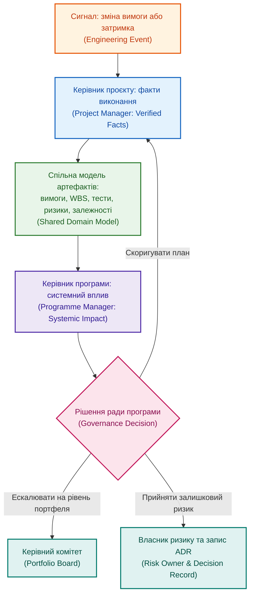

# Системи проєктного і програмного менеджменту: де губиться реальний стан проєкту

**Автор:** [Микола Федчик (Mykola Fedchyk)](book/about-the-author.md) · [LinkedIn](https://www.linkedin.com/in/nickfedchik/) · [GitHub](https://github.com/nick-fedchik)

---

## Вступ

**Мета статті:** дослідити системні причини втрати операційного контексту в складних інженерних програмах та визначити механізми зв'язування розрізнених артефактів для отримання об'єктивної картини реального стану розробки.

**Технологічна проблема, яка вирішується:** у багатокомпонентних апаратно-програмних комплексах статус виконання завдань у трекерах не відображає готовності виробу. Відсутність зв'язку між графіком робіт, ревізіями друкованих плат, версіями прошивок і доступністю лабораторій призводить до того, що затримка одного постачальника руйнує інтеграційні плани всієї програми. Стаття розкриває межі застосування класичних інструментів обліку та обґрунтовує необхідність переходу до єдиної моделі артефактів.

---

## Де губиться реальний стан проєкту

Головна проблема сучасного інженерного менеджменту полягає в розриві між формальними статусами завдань та фізичною готовністю апаратно-програмного комплексу.

Перед контрольною віхою команда часто бачить десятки «зелених» карток, але не може швидко відповісти на просте запитання: що саме зірветься, якщо постачальник запізниться з доставкою зразків на один тиждень? Відповідь розпорошена між журналом невиконаних завдань (*backlog*, беклог), репозиторієм вихідного коду, специфікацією вимог, звітами про випробування, графіком робіт, таблицею ризиків та листуванням. У складних інженерних проєктах управління рідко живе в одному місці: беклог ведеться в Jira або Azure DevOps, код зберігається в GitLab чи GitHub, вимоги адмініструються в Polarion або DOORS, протоколи тестів у спеціалізованій базі, структура робіт (WBS) у MS Project, а ключові технічні компроміси зафіксовані в пошті чи чатах.

Проблема полягає не у функціональності окремих інструментів, а у відсутності семантичних зв'язків між зафіксованими в них фактами. Трекер завдань показує поточну зайнятість людей, але не дає відповіді на питання: чи перевірена змінена вимога, чи актуальні сертифікаційні докази, чи впливає перенесення віхи на бронь вимірювальної лабораторії та чи враховані апаратні обмеження нової ревізії кристала.

Реальний стан складного проєкту губиться в інтервалах між автономними інформаційними системами, людською комунікацією та неформальною пам'яттю організації.

## Керівник проєкту і керівник програми: розмежування зон відповідальності

Управління складною технічною розробкою вимагає чіткого розмежування тактичного рівня постачання конкретного результату та стратегічного рівня координації взаємозалежних напрямків.

Керівник проєкту (*Project Manager*, PM) фокусується на визначеному проєкті: погоджений обсяг робіт (*scope*), склад команди, календарні терміни (*schedule*), виділений бюджет, задачі, локальні ризики, блокери та якість кінцевого вузла. Його базове запитання: чи спроможна команда доставити затверджений результат у визначені часові рамки? Натомість керівник програми (*Programme Manager*, PgM) керує комплексом проєктів, які лише в сукупності забезпечують кінцеву ринкову або оборонну спроможність. У фокусі його уваги перебувають міжпроєктні залежності (*cross-project dependencies*), спільні інтеграційні вікна, системні ризики, релізні графіки (*release trains*) та стратегічні ресурси.

В автомобільній індустрії це проявляється під час створення нового електронного блоку керування (ECU, *Electronic Control Unit*): один проєкт розробляє друковану плату, другий створює базове програмне забезпечення мікроконтролера (BSW, *Basic Software*) та алгоритми, третій відповідає за хмарну телематику, а четвертий організовує верифікацію на стендах моделювання на фізичному рівні (HIL, *Hardware-in-the-Loop*) та збирає докази функціональної безпеки за стандартом ISO 26262. У сфері оборонних технологій (MilTech) аналогічний комплекс охоплює мікроелектроніку, вбудовані програми реального часу, захищений радіозв'язок, наземні пункти управління та полігонні випробування.

Програмне управління не є простою сумою статусних звітів. Якщо три підпроєкти мають локальний зелений статус, уся програма може перебувати в критичному стані, якщо затримка виготовлення плати робить неможливим запуск прошивки до закриття вікна доступу до випробувального полігону.

## Механізм взаємодії керівників на основі спільної моделі

Практична взаємодія між рівнями проєкту та програми стає ефективною лише за умови переходу від усних пояснень до спільної моделі артефактів.

У конструктивній схемі керівник проєкту передає в контур програми верифіковані факти: фактично виконані пакети робіт, критичні блокери, оцінені ризики, зміни специфікацій, виявлені дефекти та протоколи тестування. Керівник програми повертає стратегічний контекст: глобальні пріоритети, рішення наглядової ради, коригування дорожньої карти та міжмодульні технічні компроміси. Якщо ця комунікація побудована лише на щотижневих презентаціях, інформація неминуче спотворюється або запізнюється.

```mermaid
flowchart TB
    accTitle: Цикл взаємодії між проєктним і програмним рівнями
    accDescr: Передача фактів виконання від керівника проєкту до керівника програми через спільну модель артефактів.

    S["Сигнал: зміна вимоги або затримка<br/>(Engineering Event)"] --> P["Керівник проєкту: факти виконання<br/>(Project Manager: Verified Facts)"]
    P --> M["Спільна модель артефактів:<br/>вимоги, WBS, тести, ризики, залежності<br/>(Shared Domain Model)"]
    M --> G["Керівник програми: системний вплив<br/>(Programme Manager: Systemic Impact)"]
    G --> D{"Рішення ради програми<br/>(Governance Decision)"}
    D -->|Скоригувати план| P
    D -->|Ескалювати на рівень портфеля| E["Керівний комітет<br/>(Portfolio Board)"]
    D -->|Прийняти залишковий ризик| R["Власник ризику та запис ADR<br/>(Risk Owner & Decision Record)"]

    classDef evt fill:#fff3e0,stroke:#e65100,stroke-width:2px,color:#bf360c;
    classDef pm fill:#e3f2fd,stroke:#1565c0,stroke-width:2px,color:#0d47a1;
    classDef model fill:#e8f5e9,stroke:#2e7d32,stroke-width:2px,color:#1b5e20;
    classDef pgm fill:#ede7f6,stroke:#512da8,stroke-width:2px,color:#311b92;
    classDef dec fill:#fce4ec,stroke:#c2185b,stroke-width:2px,color:#880e4f;
    classDef out fill:#e0f2f1,stroke:#00796b,stroke-width:2px,color:#004d40;

    class S evt;
    class P pm;
    class M model;
    class G pgm;
    class D dec;
    class E,R out;
```

*Цикл взаємодії не усуває особисте спілкування інженерів, а робить його предметним: кожне управлінське рішення спирається на зафіксовані артефакти та призначеного відповідального власника.*

## Апаратно-програмні комплекси: матеріальні обмеження розробки

На відміну від суто програмних сервісів, розробка апаратно-програмних комплексів стикається з фізичною незворотністю виробничих і тестових процесів.

У чистому програмному забезпеченні помилку архітектури можна оперативно виправити новим комітом, перенесенням спринту чи екстреним випуском патча. В апаратно-програмній програмі діють матеріальні фактори: тривалий час виконання замовлення на постачання мікросхем (*lead time*), виготовлення нової ревізії друкованої плати (*board spin*), монтаж дослідної партії блоків, доступність спеціалізованого обладнання, випробування на електромагнітну сумісність (EMC), кліматичні тести та експертиза функціональної безпеки.

Такий виріб існує одночасно у багатьох вимірах: відомості матеріалів (*Bill of Materials*, BOM), електричних принципових схемах, ревізіях друкованих плат (PCB), механічних допусках корпусів, гілках мікропрограм, калібрувальних матрицях та переліках апаратних обмежень процесора (*errata*).

Коли управлінська система фіксує лише абстрактні картки завдань, вона втрачає матеріальну складову розробки. Задача розробки драйвера може виконуватися за розкладом, але затримка постачання фізичного чипа або виявлена помилка в розведенні шини живлення плати зупиняє роботу всієї інтеграційної групи.

## Коли ієрархічна структура робіт (WBS) допомагає, а коли відривається від реальності

Спроба керувати складною багаторічною розробкою за допомогою статичного графіка робіт створює ілюзію повного контролю, яка швидко руйнується при зіткненні з інженерною практикою.

На старті проєкту детальна ієрархічна структура робіт (WBS, *Work Breakdown Structure*) виглядає переконливо: керівники розписують сотні завдань, поєднують їх стрілками залежностей, призначають ресурси та фіксують календарні віхи (*milestones*). Проте через кілька місяців змінюється схемотехніка, постачальник відкладає відвантаження зразків процесора, замовник уточнює профіль вимог, а сертифікаційна лабораторія переносить вільний слот. Якщо WBS ведеться як ізольований файл, керівник проєкту витрачає більшу частину робочого часу на механічне пересування термінів у діаграмі Ганта, замість вирішення інженерних проблем.

WBS перетворюється на дієвий інструмент лише тоді, коли елементи графіка безпосередньо прив'язані до артефактів: вимог, схем, комітів, тестових прогонів та рішень комітету контролю змін (CCB, *Change Control Board*). Зміна одного вузла повинна автоматично висвітлювати всі залежні елементи, показуючи, які саме тести та сертифікаційні протоколи втратили актуальність.

Практичне правило досвідченого інженера: декомпозиція робіт має фіксувати інтерфейси передачі результатів між командами, а не диктувати погодинний розклад щоденної діяльності інженерів.

## Математична модель каскадної затримки та вичерпання часових буферів

Для захисту програми від непередбачуваних зривів строків інженерний розклад має моделюватися як спрямований ациклічний граф із явними буферами сполучення між разнотемповими процесами.

Нехай операція $k$ на критичному шляху залежить від набору попередніх робіт $\text{Pred}(k)$. Якщо постачальник або підрядна команда затримує виконання попередньої задачі $j$ на величину $\Delta t_j$, а між задачами закладено захисний часовий буфер $B_j$, то ефективна затримка початку наступної операції $\Delta S_k$ визначається формулою:

$$\Delta S_k = \max_{j \in \text{Pred}(k)} \left(0, \; \Delta t_j - B_j\right)$$

Якщо операція $k$ пов'язана з жорстким календарним вікном фіксованої дискретності $W$ (наприклад, доступність випробувальної лабораторії, яка бронюється лише двотижневими квантами), то підсумкова затримка завершення етапу $\Delta T_k$ стає нелінійною:

$$\Delta T_k = \left\lceil \frac{\Delta S_k}{W} \right\rceil \cdot W + d_k$$

**Тут:**
- $\Delta S_k$ є величиною зсуву старту операції $k$ після поглинання затримок попередників буферами (у календарних днях).
- $\text{Pred}(k)$ є множиною безпосередніх задач-попередників для операції $k$.
- $\Delta t_j$ є фактичним відхиленням тривалості задачі $j$ від базового плану (у днях).
- $B_j$ є величиною запланованого часового буфера між задачею $j$ та задачею $k$ (у днях).
- $W$ є розміром кванту доступності зовнішнього неподільного ресурсу або інтеграційного вікна (у днях).
- $d_k$ є власним відхиленням тривалості виконання задачі $k$ (у днях).
- $\lceil x \rceil$ є операцією взяття найменшого цілого числа, не меншого за $x$ (округлення вгору).

**Навчальний інженерний приклад:**
Розглянемо інтеграцію нового автомобільного радара. Постачальник затримав відвантаження виправленої ревізії чипа на $\Delta t_1 = 5$ днів. Інженерний буфер складав $B_1 = 3$ дні. Зсув старту тесту становить:

$$\Delta S_k = \max(0, \; 5 - 3) = 2 \text{ дні}$$

Проте кліматична та безлунна камери для радіочастотних тестів бронюються квантами по два тижні ($W = 14$ днів). Запізнення всього на 2 дні призводить до втрати призначеного слота:

$$\Delta T_k = \left\lceil \frac{2}{14} \right\rceil \cdot 14 + 0 = 1 \cdot 14 = 14 \text{ днів}$$

Цей розрахунок наочно пояснює класичну трагедію розробки: затримка постачальника мікросхеми всього на 5 днів по ланцюжку спричиняє зрив випуску комплексу на два повних тижні. Розуміння цієї математики змушує проектних лідерів свідомо закладати буфери саме перед квантованими зовнішніми ресурсами.

## Віха у розкладі тягне за собою більше, ніж просто зміну дати

Перенесення віхи в апаратно-програмному комплексі запускає ланцюгову реакцію змін у матеріальному та правовому просторі розробки.

Коли в календарі пересувається віха «Готовність прототипу В», це означає не просто перенесення дедлайну в тасці. Це тягне за собою перегляд контрактних зобов'язань із постачальниками друкованих плат, анулювання броні спеціалізованих випробувальних стендів, зміну графіка роботи інженерів у кліматичних лабораторіях, продовження оренди вимірювальних приладів та коригування дат зовнішнього регуляторного аудиту. Якщо система управління не відображає ці зв'язки, проектний менеджер змушений тримати всю сітку контактів у голові або з'ясовувати наслідки постфактум, коли рахунки за простій обладнання вже виставлені.

Інтегроване середовище управління повинно автоматично генерувати цифровий пакет впливу (*Impact Package*): перелік уражених вимог, зачеплених договорів, критичних ресурсів і ризиків. Це дозволяє приймати рішення про зміну графіка не інтуїтивно, а на основі точного підрахунку додаткових фінансових і технічних витрат.

## Метрики як ранні інженерні сигнали, а не прикраса для презентацій

Поширена практика збору метрик раз на місяць перед візитом керівництва позбавляє управлінську команду можливості своєчасно запобігати кризам.

Традиційні звіти фіксують минуле: кількість закритих завдань за минулий спринт, спалені людино-години та відсоток виконання бюджету. Проте для інженерного керівництва значно важливіші випереджальні індикатори (*leading indicators*): динаміка співвідношення відкритих і закритих дефектів під час регресійного тестування, швидкість проходження рецензування коду, кількість непереглянутих змін у специфікаціях та відхилення параметрів живлення на перших стендових випробуваннях.

Якщо ці дані збираються автоматично з конвеєрів збирання та систем тестування, вони спрацьовують як сигналізація на панелі приладів літака. Зростання тривалості збирання прошивки на 20% або часті збої в тестах зв'язку повинні сигналізувати про системну проблему за тижні до того, як розробники офіційно зірвуть дедлайн здачі версії.

## Інструменти: сильні у власних нішах, але безпорадні на стиках

Спроба знайти одну універсальну програму, яка закриє всі потреби проектування складного виробу, завжди закінчується розчаруванням.

Кожен спеціалізований інструмент оптимізований під конкретну діяльність:
1. **Трекери задач і беклогів** (Jira, Azure DevOps, GitLab Issues, GitHub Issues) ефективно організовують щоденну активність інженерних команд та спринти.
2. **Системи керування вихідним кодом і CI/CD** (GitLab, GitHub) забезпечують контроль версій, рецензування коду, автоматизоване тестування та випуск програмних релізів.
3. **Платформи управління вимогами** (Polarion, DOORS Next, Jama Connect, codeBeamer) дають надійний контроль базових ліній та відповідність нормативним стандартам.
4. **Системи управління тестуванням** (TestRail, Zephyr, Xray) фіксують матриці покриття тест-кейсами та результати прогонів.
5. **Інструменти портфельного планування** (MS Project, Planview, Planisware, Clarity) моделюють критичний шлях та розподіл фінансових ресурсів.

Провал трапляється не всередині цих інструментів, а у «сірій зоні» між ними. Інженер змінив константу у коді мікроконтролера, але система вимог про це не знає. Тестувальник зафіксував збій шини CAN, але у WBS це ніяк не вплинуло на дату відвантаження зразка замовнику. Завдання сучасної інфраструктури полягає не в заміні цих систем, а у створенні надійного сполучного шару даних на основі цифрової нитки.

## Практичний тест зрілості: як оцінити керованість проєкту за 60 хвилин

Для діагностики реального стану системи управління у вашій організації не потрібні дорогі зовнішні консультанти: достатньо провести простий експрес-аудит на реальних даних.

Оберіть одну критичну віху випуску продукту, заплановану на найближчі два місяці, і спробуйте отримати відповіді на чотири контрольних запитання протягом однієї години:
1. **Перевірка походження вимог:** чи можете ви за три кліки перейти від затвердженої віхи до повного переліку вимог замовника, які мають бути в ній реалізовані, та переконатися, що до них не вносилися несанкціоновані зміни?
2. **Перевірка доказової бази:** чи є пряме посилання на успішний протокол випробувань (із зазначенням версії прошивки та серійного номера плати) для кожної закритої вимоги безпеки?
3. **Перевірка блокуючих залежностей:** чи існує формальний список компонентів від зовнішніх постачальників із підтвердженими датами відвантаження та розрахованими буферами затримки?
4. **Перевірка критичного шляху:** якщо ключовий постачальник сьогодні оголосить про затримку відвантаження на 7 днів, чи знаєте ви точно, які саме роботи та на скільки днів змістяться у фінальному графіку?

Якщо для відповіді на ці запитання команді потрібно збирати екстрену нараду, писати листи у чати або вручну зводити докупи кілька таблиць Excel, це свідчить про те, що реальний стан проєкту залишається прихованим, а організація живе в режимі постійного ризику раптової кризи.

---

## Висновки

1. Реальний стан складної інженерної розробки неможливо оцінити за формальними зеленими статусами карток у таск-трекері, оскільки він розпорошений між вимогами, кодом, фізичними зразками плат та протоколами випробувань.
2. Програмний менеджмент принципово відрізняється від управління проектом необхідністю синхронізації різнотемпових процесів, контролю міжпроєктних залежностей та управління системними ризиками програми.
3. Фізичні обмеження виробництва електроніки та механіки вимагають обліку матеріальних факторів: тривалості постачання компонентів, виготовлення дослідних партій друкованих плат та доступності випробувального обладнання.
4. Наявність неподільних зовнішніх ресурсів із фіксованими квантами доступності призводить до нелінійного каскадного зростання затримок, коли зсув на кілька днів відкидає реліз на тижні.
5. Надійна система управління повинна виконувати функцію оперативної інженерної пам'яті, пов'язуючи спеціалізовані інструменти в єдину цифрову нитку простежуваності артефактів.

---

## Посилання

1. ISO 21500:2021. *Project, programme and portfolio management — Context and concepts*. International Organization for Standardization, Geneva, Switzerland. [https://www.iso.org/standard/74704.html](https://www.iso.org/standard/74704.html)
2. ISO 21502:2020. *Project, programme and portfolio management — Guidance on project management*. International Organization for Standardization, Geneva, Switzerland. [https://www.iso.org/standard/74947.html](https://www.iso.org/standard/74947.html)
3. ISO 21503:2022. *Project, programme and portfolio management — Guidance on programme management*. International Organization for Standardization, Geneva, Switzerland. [https://www.iso.org/standard/78644.html](https://www.iso.org/standard/78644.html)
4. Goldratt, E. M. *Critical Chain*. The North River Press, 1997.
5. Kerzner, H. *Project Management: A Systems Approach to Planning, Scheduling, and Controlling*. 13th Edition. John Wiley & Sons, 2022.

---

## Терміни

- **Базова версія (Baseline)**: офіційно узгоджений і затверджений стан вимог, плану, креслень чи вихідного коду, який використовується як точка відліку для подальшої розробки і може змінюватися лише за встановленою процедурою.
- **Відомість матеріалів (Bill of Materials, BOM)**: повний структурований перелік компонентів, мікросхем, кріплень та матеріалів, необхідних для виготовлення одного фізичного виробу.
- **Випереджальні індикатори (Leading Indicators)**: метрики процесу, які змінюються до настання підсумкового результату і дозволяють завчасно передбачити відхилення від графіка або проблеми з якістю.
- **Електронний блок керування (Electronic Control Unit, ECU)**: спеціалізований вбудований комп'ютер, що керує роботою одного або кількох вузлів сучасного автомобіля чи роботизованого комплексу.
- **Ієрархічна структура робіт (Work Breakdown Structure, WBS)**: орієнтована на результат ієрархічна декомпозиція загального обсягу робіт проєкту на менші та більш керовані складові.
- **Комітет контролю змін (Change Control Board, CCB)**: колегіальний орган проєкту, який розглядає пропозиції щодо внесення змін до базових ліній і затверджує рішення на основі аналізу технічного та календарного впливу.
- **Наскрізна простежуваність (Traceability)**: властивість інженерних даних, яка дозволяє встановити двосторонній зв'язок між вимогами, кодом, тестами, дефектами та релізами.
- **Часовий буфер (Time Buffer)**: запланований часовий резерв між взаємозалежними завданнями, призначений для поглинання випадкових затримок без зриву фінальної дати етапу.

---

## Скорочення

- **ADR**: Architecture Decision Record (журнал архітектурних рішень)
- **BOM**: Bill of Materials (відомість матеріалів)
- **BSW**: Basic Software (базове програмне забезпечення вбудованих систем)
- **CAN**: Controller Area Network (мережа контролерів для бортової комунікації)
- **CCB**: Change Control Board (комітет контролю змін)
- **ECU**: Electronic Control Unit (електронний блок керування)
- **EMC**: Electromagnetic Compatibility (електромагнітна сумісність)
- **HIL**: Hardware-in-the-Loop (апаратно-програмне моделювання на фізичному стенді)
- **MilTech**: Military Technology (оборонні військові технології)
- **PCB**: Printed Circuit Board (друкована плата)
- **PgM**: Programme Manager (керівник програми)
- **PM**: Project Manager (керівник проєкту)
- **SIL**: Software-in-the-Loop (програмне моделювання поведінки систем)
- **WBS**: Work Breakdown Structure (ієрархічна структура робіт)

---

## Про автора

**Микола Федчик (Mykola Fedchyk)**: український інженер, системний архітектор та дослідник у галузі кіберфізичних комплексів, доказового штучного інтелекту та критичних вбудованих систем. Понад двадцять років керує інженерними розробками та проєктуванням складних апаратно-програмних комплексів у сфері мережевої безпеки, телекомунікацій та автомобільної електроніки відповідно до вимог міжнародних стандартів ISO 26262 та ISO/SAE 21434. Досліджує практичне застосування експертних систем, семантичних онтологій та цифрової нитки для управління складними інженерними програмами.

Детальніша інформація: [Про автора](book/about-the-author.md) · [LinkedIn](https://www.linkedin.com/in/nickfedchik/) · [GitHub](https://github.com/nick-fedchik)
