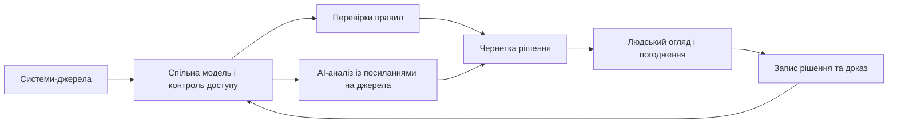

# Системи проєктного і програмного менеджменту: що має бути після дошки задач

Дошка задач може чесно показувати виконання, але не відповість сама по собі, чи готовий реліз: чи є докази тестування, відкриті ризики, потрібні погодження та вплив недавньої зміни вимог. Для цього потрібна інтегрована система, у якій AI-асистент, локальні мовні моделі та експертні правила допомагають роботі, а не прикрашають дорожню карту красивою AI-обіцянкою.

Цей текст самодостатньо пояснює, якою має бути така система. Перша частина серії докладніше розбирає причини фрагментації: багато інструментів, ручну синхронізацію, апаратно-програмні залежності, WBS, віхи, комітет з керування змінами (CCB) і розрив між планом та реальною інженерною роботою.

Перший крок тут доволі нудний: модель проєкту. Якщо система не розуміє, що таке вимога, ризик, залежність, віха, базова версія, доказ перевірки, релізний контрольний пункт і рішення, AI лише швидко напише красивий текст поверх хаосу.

Сучасна система управління для складних інженерних продуктів має працювати як робоча модель. Дошка задач тут лише один з екранів. Усередині мають жити проєкт, програма, портфель, задум продукту, вимога зацікавленої сторони, системна вимога, пакет робіт, елемент WBS, ризик, залежність, віха, рішення, базова версія, доказ перевірки, реліз, роль, погодження і слід аудиту. Без зв'язків між цими об'єктами це знов буде набір красивих таблиць.

Для мене це питання практичне, бо в різних компаніях і доменах доводилося будувати або перебудовувати саме такі робочі системи: від командної доставки і звітності до керування вимогами, ризиками, базовими версіями, GitLab-процесами, аудитом, відповідністю і ШІ-підтримкою інженерної роботи. Тому друга частина статті говорить не про "додати ШІ до дошки задач", а про те, як зробити систему управління машинозчитуваною, доказовою і придатною до прийняття рішень.

*AI і правила працюють над тим самим контрольованим контекстом, але лише людина затверджує рішення. Збережений запис рішення знову стає частиною моделі.*

## Починати з моделі реальності

Багато систем починаються з задачі: назва, виконавець, статус, пріоритет, строк. Це корисно, але для складного продукту замало. Вимога має вести до задач, архітектурних рішень, тестів, ризиків і доказів. Віха має бути пов'язана з пакетами робіт, поставками від постачальників, тестовими кампаніями, погодженнями і готовністю до релізу. Ризик має мати вплив, відповідального, дію з пом'якшення, тригер, рішення і комунікацію із зацікавленими сторонами.

Якщо ці зв'язки є, система може відповідати на складні питання: що зміниться, якщо перенести віху? Які вимоги без тестів? Які ризики блокують реліз? Які рішення втратили актуальність після зміни базової версії? Якщо зв'язків немає, відповідь шукатимуть люди вручну.

Предметна модель тут працює як практична основа для автоматизації, метрик, AI і придатності до аудиту. Без неї далі лишається ворожіння по текстах і статусах.

## Артефакти мають бути машинозчитуваними

Багато проєктних артефактів історично створювалися як документи для читання: план проєкту, план якості, журнал ризиків, запит на зміну, статусний звіт, пакет для огляду контрольного пункту. Це зрозуміло. Люди читали, погоджували, підписували, архівували.

Але документи, готові до друку, погано працюють як живий робочий стан. У них багато оповідного тексту, дублювання контексту і ручних таблиць. Машині важко зрозуміти, що є джерелом істини, що є похідним поданням, а що вже застаріло.

У перспективній системі план проєкту має бути конфігурацією: пакети робіт, залежності, календарі, ролі, ресурси, правила змін, контрольні пункти, метрики, ризики, посилання на базові версії і трасування. Людина все одно отримує сторінку, дашборд або PDF. Просто це згенероване подання над структурованим джерелом, а не основний носій істини.

Те саме з журналом ризиків, пакетом CCB, контрольним списком готовності до релізу і пакетом для аудиту. Якщо вони спершу дані, а вже потім документ, система може їх перевіряти, оновлювати, пов'язувати і пояснювати.

## Різні рівні управління, спільна модель

Проєктний погляд допомагає доставити конкретний результат: обсяг робіт, план, команда, задачі, ризики, тести, виконання. Програмний погляд показує координацію: залежності, інтеграційні події, спільні ризики, контрольні пункти, користь, релізні потоки. Портфельний погляд тримає стратегію: що фінансувати, що зупинити, де спроможність, де цінність, де ризик. Продуктовий погляд приносить задум продукту: відгуки замовника, план розвитку, цінність, очікування зацікавлених сторін.

Проблеми з'являються, коли ці рівні змішані. Дошка проєкту перетворюється на портфельний дашборд. Огляд портфеля лізе в дрібні задачі. Продуктовий план не бачить інженерних обмежень. Керівник програми отримує суму статусів проєктів замість карти залежностей.

Добра система дає різні робочі поверхні над спільною моделлю. PM бачить виконання. PgM бачить залежності. Продуктовий менеджер бачить зв'язок між задумом продукту і інженерною реальністю. Керівництво бачить рішення, ризики, цінність і спроможність.

## Що варто автоматизувати

Автоматизація не означає, що система керує людьми. Вона прибирає ручне перенесення фактів. Наприклад, зміна віхи показує зачеплені залежності, ресурси, тести, постачальників і погодження. Оцінка ризику оновлюється з фактичних даних: прострочені задачі, невдалі тести, відкриті дефекти, заблоковані залежності, прогалини в ресурсах. Якщо ризик переходить поріг, система повідомляє відповідального або створює задачу з пом'якшення ризику. Якщо зміна зачіпає базову версію, формується чернетка пакета CCB.

Статусний звіт має збиратися з джерел, замість того щоб писатися з пам'яті. Готовність до релізу має враховувати закриті задачі разом із відсутніми доказами, відкритими ризиками, невдалими тестами, очікуваними погодженнями і непереглянутими вимогами. Метрика має працювати як сигнал для дії, а не як картинка для звіту.

Це звільняє PM і PgM для справжньої роботи: рішень, переговорів, компромісів, роботи із зацікавленими сторонами, реакції на ризики.

## AI-асистент має працювати з контрольованим контекстом

AI-асистент цінний тоді, коли працює всередині конкретного робочого процесу. Для PM він може підготувати короткий статус, знайти задачі без відповідального, показати розбіжності між планом і виконанням, підсвітити ризики, запропонувати сценарії для зміни обсягу робіт або віхи.

Для керівника програми він може знайти міжпроєктні залежності, підготувати підсумок огляду контрольного пункту, пояснити системний ризик, порівняти релізні сценарії. Для інженерів - пояснити історію вимоги, знайти пов'язані дефекти, рішення і тести, допомогти з аналізом впливу, чернеткою ADR, тестовою нотаткою або нотаткою до релізу.

AI може бути активним другим поглядом. Якщо менеджер відкрив ризик, віху, вимогу, пакет CCB або дашборд програми, асистент може поруч пояснити терміни, показати фактори за оцінкою ризику, знайти відсутні критерії приймання, вказати зачеплені зацікавлені сторони, підготувати нотатку для ескалації.

Але принцип має залишатися: AI не є тим, хто погоджує рішення. Він прискорює аналіз, показує джерела, припущення і рівень впевненості. Відповідальність за рішення лишається за людьми.

## Мовна модель потребує контрольованого контексту

Велика мовна модель добре працює з текстом, підсумками і поясненнями. Але якщо дати їй хаотичну базу документів, вона швидше підсумує хаос, ніж створить порядок. Тому потрібні пошук по джерелах, посилання на джерела, контроль доступу, журнали запитів, версіонування моделей, розділення фактів, припущень і рекомендацій, а також людське погодження перед змінами.

У середовищі з жорсткими вимогами відповідності фраза «AI так сказав» не є доказом. Потрібні джерела, версії, зафіксовані припущення та відповідальний власник. Не варто вимагати від моделі прихованого «ланцюга міркувань»; для перевірки достатньо показати вихідні артефакти, коротке обґрунтування й межі висновку. AI-вивід може бути кандидатом у доказ, але не заміною результату тесту, погодження, запису огляду або підписаного рішення.

Добра відповідь має звучати не "ризик релізу прийнятний", а "на основі тестів T-17 і T-22, дефектів D-4 і D-9, вимог R-11/R-14, очікуваного waiver W-3; впевненість середня, бо бракує звіту постачальника". Тоді її можна переглядати.

## Конфіденційні дані і локальні LLM

У MilTech/DefTech, автомобільних, авіаційних, MedTech або semiconductor-проєктах не все можна відправити у зовнішній AI-сервіс. Вимоги, вихідний код, звіти постачальників, аналіз функціональної безпеки, аналіз загроз, вразливості, оборонні проєктні дані або документи конкретного замовника можуть бути конфіденційними, обмеженими або контрольованими контрактом.

Тому сучасна система має підтримувати різні режими AI: хмарну LLM для задач із низьким ризиком, приватне розгортання для корпоративного середовища, локальні моделі для чутливих даних, ізольоване виконання для обмежених програм. До цього додаються класифікація даних, мітки чутливості, проєктні відсіки, шифрування у сховищі, журнали аудиту, правила зберігання, гарантії невикористання для навчання, контроль векторних індексів і можливість повністю відключити зовнішні точки доступу.

Архітектура AI для конфіденційної інженерії має починатися з класифікації даних, контролю доступу й моделі загроз, а не з демо. Профіль NIST AI RMF для генеративного AI пропонує саме життєвий підхід до таких ризиків: їх потрібно виявляти, оцінювати й контролювати в процесі використання системи.

## Де потрібні експертні правила

LLM може написати хороший підсумок. Але іноді тексту недостатньо: потрібна перевірка за правилами. Чи всі вимоги функціональної безпеки мають докази перевірки? Чи всі кіберризики мають рішення щодо обробки? Чи не порушене трасування після зміни базової версії? Чи є критерії контрольного пункту? Чи нове рішення не суперечить погодженому рішенню?

Тут потрібні елементи експертної системи: факти, правила, предметна модель, виведення, пояснення, пошук конфліктів, уроки з минулого, міркування за схожими випадками. Найцікавіший підхід - гібридний. LLM працює з мовою і неструктурованими джерелами. Експертна система тримає правила і формальний контекст.

У результаті з'являється досьє рішення: що сталося, які джерела, які правила спрацювали, які альтернативи, які ризики, який рівень впевненості, хто має прийняти рішення. Це вже матеріал для рішення, а не красива відповідь на екрані.

## Відповідність вимогам має виникати з роботи

У регульованих галузях найбільша цінність з'являється тоді, коли докази формуються в процесі роботи. Вимоги, погодження, тестові запуски, записи оглядів, рішення щодо ризиків, базові версії і коригувальні дії мають не збиратися перед аудитом, а жити в системі постійно.

Система може показувати готовність до аудиту в реальному часі: які стандартні вимоги покриті, де прогалини, які зауваження закриті, які коригувальні дії прострочені, які зміни базової версії потребують огляду, які ризики впливають на аудиторський пакет. AI може пояснювати, чому пункт непокритий, який доказ потрібен, що змінилося після базової версії.

Мета тут проста: не реконструювати історію вручну перед кожним аудитом. Якщо ланцюг доказів живе в системі постійно, аудиторський стрес падає не через магію, а через дисципліну.

## Що отримують інженери

Програмні інженери бачать, яка вимога стоїть за зміною і які тести перевірити. Системні інженери бачать дублікати, прогалини, конфлікти і слабкі критерії приймання. QA отримує тестування на основі ризиків. Функціональна безпека бачить зв'язок між небезпеками, цілями безпеки, вимогами і доказами. Кібербезпека бачить активи, загрози, вразливості, заходи пом'якшення і релізні рішення. Hardware- і embedded-інженери бачать ревізії плат, прошивку, карти регістрів, errata, лабораторні вимірювання і інтеграційні ризики.

У такій моделі інженери перестають бути людьми, які просто "здають статус" у систему. Вони отримують назад корисний контекст для власної роботи.

## Мінімальний план впровадження

Починати варто не з великої перебудови всіх інструментів, а з одного цінного робочого процесу. Наприклад, готовність до релізу або аналіз впливу зміни. Для нього треба описати об'єкти, джерела, відповідальних, правила і очікуваний результат. Потім інтегрувати мінімальні джерела: вимоги, задачі, тести, дефекти, ризики, погодження. Лише після цього додавати AI-підсумок.

Другий крок - зробити відповіді трасованими. Кожен AI- або системно згенерований підсумок має вести до джерел. Третій - додати правила для очевидних прогалин: відсутній тест, відсутній відповідальний, очікуване погодження, розірване трасування. Четвертий - ввести процес огляду, щоб люди могли приймати або відхиляти згенеровані рекомендації.

Такий шлях менш видовищний, ніж демо з чат-асистентом, але набагато корисніший. Він будує довіру поступово і показує, де дані справді готові до автоматизації.

## Висновок: спочатку контрольована модель, потім AI

Майбутнє проєктного і програмного управління я бачу в інтегрованому шарі, який пов'язує вимоги, задачі, WBS, віхи, метрики, ризики, рішення, тести, докази, задум продукту і інженерну реальність. Універсальний мегаінструмент або чат-вікно над беклогом самі по собі цього не дадуть.

Роль AI у такій системі доволі конкретна: аналітик, пояснювач, шукач контексту, генератор чернеток. Там, де потрібні формальні перевірки, поруч мають працювати експертні правила. А люди мають залишатися власниками рішень.

Найкраща система не замінює PM, PgM, інженерів або ролі якості. Вона зменшує ручне збирання контексту і допомагає приймати кращі рішення швидше.

Тепер можна сформулювати послідовність без магії: спочатку визначити об'єкти, зв'язки, джерела та відповідальних; потім автоматизувати прості перевірки; і лише тоді додавати AI як пояснювача та генератора перевірюваних чернеток. Такий порядок зберігає людську відповідальність і робить автоматизацію корисною навіть у разі помилки моделі.

## Посилання

- [NIST AI 600-1: Generative AI Profile](https://doi.org/10.6028/NIST.AI.600-1)
- [NIST AI Risk Management Framework — офіційні ресурси](https://www.nist.gov/itl/ai-risk-management-framework/ai-risk-management-framework-resources)
- [ISO/DIS 21520 — AI in project, programme and portfolio management](https://www.iso.org/obp/ui?_escaped_fragment_=iso%3Astd%3Aiso%3A21520%3Adis%3Aed-1%3Av1%3Aen)

Питання до читачів: які AI-функції в проєктному або програмному управлінні були б для вас справді корисними, а які виглядали б лише як красива ілюзія контролю?
