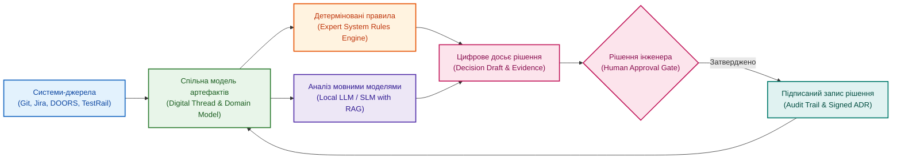

# Системи проєктного і програмного менеджменту: що має бути після дошки задач

**Автор:** [Микола Федчик (Mykola Fedchyk)](book/about-the-author.md) · [LinkedIn](https://www.linkedin.com/in/nickfedchik/) · [GitHub](https://github.com/nick-fedchik)

---

## Вступ

**Мета статті:** визначити принципи побудови зрілої інформаційної системи інженерного менеджменту, яка інтегрує цифрову модель виробу, асистенти на базі штучного інтелекту, локальні мовні моделі та детерміновані експертні правила для автоматизованої підтримки управлінських рішень.

**Технологічна проблема, яка вирішується:** традиційна дошка завдань фіксує лише статус виконання карток, але не здатна оцінити готовність виробу до сертифікаційного релізу: чи покриті змінені вимоги тестами, чи узгоджені апаратні ревізії та чи не суперечать відкриті технічні ризики цілям безпеки. Стаття пропонує практичну інженерну архітектуру, в якій статистичні висновки мовних моделей перевіряються формальними правилами на базі цифрової нитки артефактів.

---

## Проблема обмеженості дошки завдань: чому потрібна предметна модель

Традиційний трекер завдань оптимізований під облік активності людей, але не здатний моделювати стан фізичного чи програмного продукту.

Дошка завдань відображає картки в колонках «у роботі» або «виконано», проте вона безсила відповісти на системні інженерні питання: чи підтверджена зміна специфікації протоколом випробувань, які ліцензійні зобов'язання зачеплені оновленням бібліотеки, чи готова документація до сертифікаційного аудиту за стандартом ISO 26262. Якщо розробники намагаються вирішити цю проблему шляхом додавання незліченних користувацьких полів у Jira чи Azure DevOps, система швидко перетворюється на некерований набір невзаємопов'язаних таблиць.

Основою сучасної платформи має бути онтологічна модель предметної області (*Domain Model*). Усередині цієї моделі взаємопов'язані: проєкт, програма, портфель, задум продукту (*product intent*), вимоги зацікавлених сторін, системні вимоги, елементи ієрархічної структури робіт (WBS), ризики, залежності, ревізії друкованих плат, версії мікропрограм, протоколи випробувань та журнали архітектурних рішень (ADR).

Коли взаємозв'язки між артефактами формалізовані, з'являється можливість замінити суб'єктивні оцінки автоматичною перевіркою повноти інженерного доказу.

```mermaid
flowchart LR
    accTitle: Архітектура гібридної системи підтримки інженерних рішень
    accDescr: Джерела даних проходять через цифрову нитку, правила експертної системи та аналіз штучного інтелекту до людини.

    SRC["Системи-джерела<br/>(Git, Jira, DOORS, TestRail)"] --> B["Спільна модель артефактів<br/>(Digital Thread & Domain Model)"]
    B --> C["Детерміновані правила<br/>(Expert System Rules Engine)"]
    B --> D["Аналіз мовними моделями<br/>(Local LLM / SLM with RAG)"]
    C --> E["Цифрове досьє рішення<br/>(Decision Draft & Evidence)"]
    D --> E
    E --> H{"Рішення інженера<br/>(Human Approval Gate)"}
    H -->|Затверджено| F["Підписаний запис рішення<br/>(Audit Trail & Signed ADR)"]
    F --> B

    classDef src fill:#e3f2fd,stroke:#1565c0,stroke-width:2px,color:#0d47a1;
    classDef model fill:#e8f5e9,stroke:#2e7d32,stroke-width:2px,color:#1b5e20;
    classDef rule fill:#fff3e0,stroke:#e65100,stroke-width:2px,color:#bf360c;
    classDef llm fill:#ede7f6,stroke:#512da8,stroke-width:2px,color:#311b92;
    classDef dec fill:#fce4ec,stroke:#c2185b,stroke-width:2px,color:#880e4f;
    classDef out fill:#e0f2f1,stroke:#00796b,stroke-width:2px,color:#004d40;

    class SRC src;
    class B model;
    class C rule;
    class D llm;
    class E,H dec;
    class F out;
```

*Штучний інтелект та експертні правила працюють над єдиним верифікованим контекстом, але остаточне рішення ухвалює виключно людина. Затверджене рішення повертається в модель як новий незмінний артефакт.*

## Перетворення проєктних документів на машинозчитувані конфігурації

Традиційна практика ведення інженерної документації у вигляді статичних текстових файлів створює високий бар'єр для автоматизованого контролю.

Історично плани проєктів, реєстри ризиків, плани забезпечення якості та протоколи змін оформлювалися як текстові документи у форматах Word або PDF. Вони містять значний обсяг описового тексту, дублювання контексту та неструктурованих таблиць. Комп'ютерній системі вкрай важко витягти з такого документа актуальний стан справ: незрозуміло, яка частина тексту є першоджерелом, яка застаріла, а яка суперечить сусідньому розділу.

У передовій системі управління план проєкту розглядається як декларативна конфігурація (*Configuration as Data*): дерево робіт, граф залежностей, матриці розподілу відповідальності (RACI), часові буфери, критерії проходження контрольних пунктів та посилання на базові версії вимог. Звичні для людини подання (сторінки у браузері, інтерактивні панелі чи друковані звіти для регулятора) генеруються динамічно на основі структурованих первинних даних.

Коли реєстр ризиків і протокол контролю змін стають структурованими даними, система отримує здатність автоматично перевіряти їхню узгодженість при кожній модифікації коду чи схем.

Добра система надає різні робочі поверхні над єдиною моделлю: керівник проєкту бачить оперативний прогрес, керівник програми контролює міжпроєктні залежності, продуктовий менеджер співвідносить задум із технічними обмеженнями, а технічний директор оцінює портфельні ризики та завантаження команд.

## Що варто автоматизувати: прибираємо ручну рутину

Справжня мета автоматизації полягає не в заміні управлінців роботами, а в усуненні ручного перенесення даних між таблицями та звітами.

Коли інженер переносить дату готовності вузла, система повинна миттєво підсвічувати уражені міжпроєктні зв'язки, задіяне тестове обладнання, графіки субпідрядників та необхідні регуляторні погодження. Оцінка ризиків має динамічно коригуватися на базі поточних інженерних фактів: кількості прострочених завдань, результатів щонічних автоматичних збірок, частки невдалих регресійних тестів та дефіциту дефіцитних компонентів на складі. Якщо розрахований рівень загрози перевищує допустимий поріг, система самостійно створює чернетку картки пом'якшення ризику та призначає відповідального.

Статусний звіт має збиратися автоматично з первинних джерел інформації, а не складатися вручну з суб'єктивних спогадів у п'ятницю ввечері. Це повертає керівникам час для реальної інженерної роботи: аналізу архітектурних компромісів, перемовин із партнерами та запобігання технічним кризам.

## Математична оцінка достовірності автоматизованих рекомендацій

Для безпечного використання штучного інтелекту в інженерному менеджменті будь-яка згенерована рекомендація повинна проходити через формальний фільтр оцінки достовірності.

Управлінське рішення не може базуватися на ймовірнісній галюцинації великої мовної моделі. Розглянемо метрику епістемічної достовірності аналітичного висновку $C_{\text{decision}}$:

$$C_{\text{decision}} = \left(\sum_{i=1}^{N} w_i \cdot V(a_i)\right) \cdot \prod_{j=1}^{K} \mathbb{I}(R_j)$$

**Тут:**
- $C_{\text{decision}}$ є інтегральним коефіцієнтом достовірності згенерованого висновку або чернетки рішення (безрозмірна величина в межах $[0; 1]$).
- $N$ є кількістю первинних артефактів цифрової нитки, використаних мовною моделлю під час формулювання відповіді.
- $w_i$ є нормованим ваговим коефіцієнтом достовірності джерела $i$-го артефакту, де $\sum_{i=1}^{N} w_i = 1{,}0$.
- $V(a_i)$ є мірою верифікованості $i$-го артефакту ($V(a_i) = 1{,}0$, якщо артефакт має криптографічний підпис і підтверджений статус у репозиторії; $V(a_i) \in [0; 1)$ за наявності неперевірених припущень).
- $K$ є кількістю детермінованих інженерних та безпекових правил, які обов'язково контролюються експертною підсистемою.
- $\mathbb{I}(R_j)$ є індикаторною функцією дотримання $j$-го правила: $\mathbb{I}(R_j) = 1$, якщо формальне правило повністю задоволене, та $\mathbb{I}(R_j) = 0$, якщо виявлено логічну суперечність або порушення нормативу.

**Практичний приклад розрахунку:**
Припустимо, мовна модель сформувала рекомендацію: «Дозволити випуск версії мікропрограми 2.1, оскільки регресійні тести пройдено». Для формулювання використано три артефакти: звіт тестів ($w_1 = 0{,}5, V(a_1) = 1{,}0$), протокол огляду коду ($w_2 = 0{,}3, V(a_2) = 1{,}0$) та усне твердження розробника про сумісність ($w_3 = 0{,}2, V(a_3) = 0{,}2$). Одночасно експертна система перевіряє два критичних правила ($K = 2$): відсутність відкритих дефектів рівня Blocker ($R_1$) та актуальність підпису безпеки ($R_2$).
Якщо дефектів немає ($\mathbb{I}(R_1) = 1$), але підпис відсутній ($\mathbb{I}(R_2) = 0$):

$$C_{\text{decision}} = (0{,}5 \cdot 1{,}0 + 0{,}3 \cdot 1{,}0 + 0{,}2 \cdot 0{,}2) \cdot (1 \cdot 0) = (0{,}5 + 0{,}3 + 0{,}04) \cdot 0 = 0$$

Якщо ж обидва правила задоволені ($\mathbb{I}(R_1) = 1, \mathbb{I}(R_2) = 1$):

$$C_{\text{decision}} = 0{,}84 \cdot 1 = 0{,}84$$

Множник $\prod \mathbb{I}(R_j)$ гарантує абсолютний захист: навіть якщо мовна модель згенерувала дуже переконливий текст, порушення хоча б одного критичного правила безпеки миттєво зводить довіру до рекомендації до нуля, блокуючи автоматичне схвалення.

## Локальні моделі та захист конфіденційних інженерних даних

Використання хмарних сервісів штучного інтелекту є неприпустимим під час розробки критичних виробів через ризик витоку інтелектуальної власності.

У проєктах оборонного сектору (MilTech), автомобільної електроніки, авіабудування та медичних технологій вихідні коди, карти регістрів мікроконтролерів, звіти про виявлені вразливості та архітектурні схеми становлять комерційну або державну таємницю. Їхня передача через публічні хмарні API сторонніх компаній створює пряму загрозу безпеці.

Надійна інженерна інфраструктура розгортає компактні мовні моделі (SLM) безпосередньо всередині корпоративного периметра (*On-Premise*) або на локальних робочих станціях інженерів. Сучасні відкриті архітектури з 7–14 мільярдами параметрів демонструють відмінні результати у видобуванні вимог, пошуку дублікатів і перевірці відповідності стилю, працюючи повністю в ізольованому від зовнішньої мережі контурі (*air-gapped*).

Це поєднується з рольовим контролем доступу: система обмежує контекст моделі виключно тими артефактами, до яких має офіційний допуск конкретний інженер.

## Симбіоз мовних моделей та експертних правил

Найбільшу ефективність демонструє гібридна нейро-символьна архітектура, де мовна модель відповідає за гнучкість, а експертна система забезпечує строгу логічну точність.

Мовна модель є чудовим перекладачем між неструктурованим текстом і формальними структурами даних: вона здатна виділити з протоколу зустрічі список доручень, знайти нечіткі формулювання у технічному завданні або згенерувати чернетку опису дефекту. Проте вона не вміє гарантувати логічну строгість. Навпаки, символьна експертна система на основі правил (*Rule Engine*) оперує суворою логікою предикатів: вона миттєво виявляє цикли у графі робіт, контролює непорушність часових буферів та перевіряє повноту матриці простежуваності.

У результаті їхньої взаємодії формується цифрове досьє інженерного рішення (*Decision Dossier*): мовна модель синтезує зрозумілий опис проблеми з посиланнями на джерела, а експертне ядро підтверджує відповідність правилам стандартів ISO 26262 чи DO-178C. Керівник отримує не бездоказовий прогноз, а структурований документ із прозорою аргументацією.

## Покроковий план впровадження: від простого ланцюга до інтелектуальної системи

Побудову сучасної системи управління варто розпочинати не з придбання дорогих монолітних комбайнів, а з поступового зв'язування чинних інструментів.

Рекомендований порядок інженерного впровадження:
1. **Етап 1. Стабілізація ядра цифрової нитки:** забезпечити наскрізний зв'язок між чотирма базовими сутностями: вимога замовника → інженерна задача у трекері → коміт коду у репозиторії → результат автоматизованого тесту.
2. **Етап 2. Автоматизація контрольних шлюзів:** впровадити детерміноване правило заборони випуску версії за наявності неперевірених вимог або відкритих критичних дефектів.
3. **Етап 3. Підключення локальної аналітики:** налаштувати внутрішню мовну модель для автоматичного аналізу змін у специфікаціях та пошуку розірваних зв'язків.
4. **Етап 4. Формування операційної пам'яті:** впровадити обов'язкову фіксацію аргументів прийнятих компромісів у журналах рішень (ADR) для навчання майбутніх поколінь інженерів.

Такий еволюційний шлях створює реальну користь уже на першому місяці впровадження, формуючи довіру інженерної команди без ломки усталених звичок розробки.

---

## Висновки

1. Дошка задач є корисним інструментом оперативного обліку завдань, проте вона не відображає готовності виробу та не замінює повноцінної онтологічної моделі інженерних артефактів.
2. Проєктна документація повинна зберігатися у вигляді машинозчитуваних конфігураційних даних, що дозволяє автоматизувати перевірку узгодженості планів, вимог та випробувань.
3. Використання штучного інтелекту в інженерному менеджменті вимагає математичної верифікації достовірності згенерованих висновків із нульовою толерантністю до порушення правил безпеки.
4. Для захисту інтелектуальної власності та конфіденційних інженерних даних критично необхідне використання локальних мовних моделей всередині ізольованого контуру підприємства.
5. Найвища надійність управління досягається в гібридній системі, де гнучкість обробки мови моделями штучного інтелекту поєднується зі строгою логікою детермінованих експертних правил.

---

## Посилання

1. NIST AI 600-1. *Artificial Intelligence Risk Management Framework: Generative Artificial Intelligence Profile*. National Institute of Standards and Technology, Gaithersburg, MD, 2024. [https://doi.org/10.6028/NIST.AI.600-1](https://doi.org/10.6028/NIST.AI.600-1)
2. ISO/IEC 22989:2022. *Information technology — Artificial intelligence — Concepts and terminology*. International Organization for Standardization, Geneva, Switzerland. [https://www.iso.org/standard/74296.html](https://www.iso.org/standard/74296.html)
3. ISO 26262-8:2018. *Road vehicles — Functional safety — Part 8: Supporting processes*. International Organization for Standardization, Geneva, Switzerland. [https://www.iso.org/standard/68387.html](https://www.iso.org/standard/68387.html)
4. Russell, S., Norvig, P. *Artificial Intelligence: A Modern Approach*. 4th Edition. Pearson, 2020.
5. Bass, L., Clements, P., Kazman, R. *Software Architecture in Practice*. 4th Edition. Addison-Wesley, 2021.

---

## Терміни

- **Архітектурне рішення (Architecture Decision Record, ADR)**: структурований документ, що фіксує прийняте технічне рішення, розглянуті альтернативи, контекст та очікувані наслідки.
- **Велика мовна модель (Large Language Model, LLM)**: нейромережева модель глибокого навчання, оптимізована для генерації та аналізу природної мови.
- **Гібридна система (Neuro-Symbolic System)**: архітектура штучного інтелекту, що поєднує статистичні нейромережеві моделі з детермінованими символьними правилами логічного виведення.
- **Експертні правила (Expert Rules)**: формалізовані логічні конструкції («якщо — то»), що кодують знання предметної області та регламенти стандартів для автоматичної перевірки фактів.
- **Ізольований контур (Air-Gapped Environment)**: режим функціонування комп'ютерної мережі, фізично відрізаної від зовнішнього інтернету задля запобігання витоку інформації.
- **Компактна мовна модель (Small Language Model, SLM)**: оптимізована мовна модель зменшеного розміру (до 15 мільярдів параметрів), придатна для автономної роботи на локальному обладнанні.
- **Онтологічна модель (Domain Model)**: формалізований опис сутностей інженерної галузі та семантичних зв'язків між ними, доступний для машинної обробки.
- **Цифрове досьє рішення (Decision Dossier)**: машинно-перевірний пакет інформації, що містить вихідні факти, застосовані правила, оцінку ризиків та аргументацію для ухвалення рішення людиною.

---

## Скорочення

- **ADR**: Architecture Decision Record (журнал архітектурних рішень)
- **API**: Application Programming Interface (програмний інтерфейс застосунку)
- **CI/CD**: Continuous Integration / Continuous Delivery (неперервна інтеграція та доставка)
- **DOORS**: Dynamic Object-Oriented Requirements System (програмний комплекс управління вимогами)
- **LLM**: Large Language Model (велика мовна модель)
- **MilTech**: Military Technology (військові оборонні технології)
- **NIST**: National Institute of Standards and Technology (Національний інститут стандартів і технологій США)
- **RACI**: Responsible, Accountable, Consulted, Informed (матриця розподілу відповідальності)
- **RAG**: Retrieval-Augmented Generation (генерація відповідей із залученням пошуку по верифікованих джерелах)
- **SLM**: Small Language Model (компактна мовна модель)
- **WBS**: Work Breakdown Structure (ієрархічна структура робіт)

---

## Про автора

**Микола Федчик (Mykola Fedchyk)**: український інженер, системний архітектор та дослідник у галузі кіберфізичних комплексів, доказового штучного інтелекту та критичних вбудованих систем. Понад двадцять років керує інженерними розробками та проєктуванням складних апаратно-програмних комплексів у сфері мережевої безпеки, телекомунікацій та автомобільної електроніки відповідно до вимог міжнародних стандартів ISO 26262 та ISO/SAE 21434. Досліджує практичне застосування експертних систем, семантичних онтологій та цифрової нитки для управління складними інженерними програмами.

Детальніша інформація: [Про автора](book/about-the-author.md) · [LinkedIn](https://www.linkedin.com/in/nickfedchik/) · [GitHub](https://github.com/nick-fedchik)
