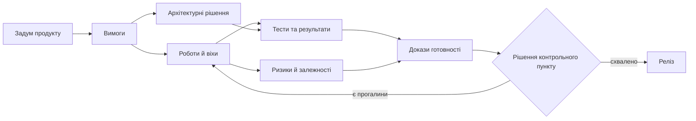

# Сучасні системи проєктного й програмного менеджменту: від статусів до рішень

Уявімо типову ситуацію перед релізом: команда бачить «зелений» план, але не може за пів години відповісти, чи зміна вимоги зачепила тести, постачання, ризики й потрібні погодження. Дані існують, проте розкладені між трекером задач, репозиторієм коду, системою вимог, таблицями та чатами. Це вже не проблема одного звіту — це втрата керованого контексту.

Системи управління проєктами давно перестали бути лише дошками задач і календарями. Для складних інженерних продуктів, особливо апаратно-програмних програм, вони мають поєднувати планування, вимоги, архітектурні рішення, ризики, залежності, докази виконання, відповідність вимогам, AI-асистентів і формальні правила. Інакше проєктний менеджмент лишається набором інструментів, а не системою прийняття рішень.

У багатьох компаніях ситуація знайома: backlog в одному інструменті, code в іншому, requirements у третьому, tests у четвертому, risks у таблиці, status у презентації, а частина decisions у chat history. Коли команда невелика, це ще працює. Коли продукт має кілька підсистем, supplier-ів, safety/security вимоги, regulatory audits і багаторічний lifecycle, звичайний task tracker перестає відповідати на головні питання.

Чи достатньо evidence для release? Які requirements зачеплені зміною? Які dependencies блокують інші teams? Чи зростає programme risk? Чому саме було прийнято technical decision? Як product priority вплине на architecture, testing, schedule і compliance scope? Якщо відповідь на кожне питання треба збирати вручну, система ще не зріла.

## Проєкт і програма мають різні горизонти

Project manager відповідає за delivery конкретного result. Його фокус - scope, team, plan, schedule, capacity, tasks, risks, changes, quality, communication. Programme manager працює з кількома проектами, які разом мають дати strategic outcome. Його фокус - cross-project dependencies, integration, shared risks, benefits, programme gates, release trains, resource conflicts і decisions на вищому рівні.

Це різні ролі. Project manager питає: чи ця команда доставить затверджений scope? Programme manager питає: чи всі частини разом дадуть потрібний результат? Саме тому programme management не можна замінити агрегацією project status reports.

Кілька проєктів можуть виглядати «зеленими» окремо, але разом створити критичний ризик для програми. Апаратний результат затримався на два дні, збірка прошивки не потрапила в інтеграційне вікно, втрачено слот лабораторії, не надійшов документ постачальника. Жоден окремий статус не пояснює системний ризик повністю.

Для термінології корисно орієнтуватися на серію ISO 21500: ISO 21502:2020 описує практики управління проєктом, а ISO 21503:2022 — поняття, передумови й практики управління програмою. Це не рецепти конкретного інструменту, а спільна мова для ролей і рішень.

## Спільні артефакти замість нескінченних статус-зустрічей

Здорова взаємодія PM і PgM будується не на тому, що всі частіше зустрічаються. Вона будується на shared artifacts: dependency map, programme risk register, gate criteria, decision records, RACI, traceability, escalation path.

Керівник проєкту приносить факти: стан виконання, блокери, ризики, потреби в ресурсах, зміни вимог, тести, дефекти й докази. Керівник програми повертає контекст: пріоритети програми, міжпроєктні залежності, рішення керівного органу, зміни дорожньої карти та стратегічні компроміси.

Якщо ця взаємодія тримається тільки на meetings, організація платить часом. Якщо вона тримається на operational memory системи, meetings стають коротшими і змістовнішими.

*Діаграма показує не послідовність «раз і назавжди», а зв'язки, які система має вміти пояснити під час зміни або контрольного пункту.*

## Чому апаратно-програмний продукт складніший

Software-only project може швидше змінювати scope, release cadence і implementation plan. Hardware/software programme має фізичні constraints: component lead time, board spin, prototype batch, lab availability, supplier delivery, firmware dependency, certification window, test equipment booking, environmental tests, EMC tests, safety reviews, cybersecurity assessment, production readiness.

Такий продукт живе не тільки в tasks. Він живе в BOM, schematics, PCB revisions, mechanical constraints, firmware branches, calibration data, test benches, lab measurements, supplier notices, manufacturing feedback, field returns і safety/security evidence.

Якщо system of management бачить тільки tasks, вона втрачає половину реальності. Наприклад, task може бути on track, але потрібний hardware sample не приїхав. Test campaign може бути запланована, але fixture не ready. Firmware готовий, але register map змінився. Це не "деталі", це schedule і risk.

## Як керувати планом і змінами без ручної реконструкції

Детальний WBS для багаторічного проекту корисний, але небезпечний, якщо живе окремо від engineering reality. На старті програми сотні rows, dependencies, durations і milestones дають відчуття control. Через кілька місяців змінюються components, architecture, supplier dates, lab schedule, requirements або cybersecurity impact. План починає вимагати постійного ручного обслуговування.

Якщо WBS уже став baseline, його не можна тихо поправити. Зміна має пройти Change Control Board, impact analysis, resource review, stakeholder communication. Це правильно, але тільки якщо система допомагає. Якщо PM мусить вручну збирати affected requirements, tests, suppliers і risks, governance стає важкою ношею.

Інтегрована система має пов'язувати WBS, milestones, dependencies, risks, requirements, tests, suppliers і evidence. Зміна milestone має одразу показати impacted objects і підготувати draft change package.

## Інструменти: сильні, але фрагментовані

Ринок інструментів великий. Jira, YouTrack, Azure DevOps, GitLab Issues і GitHub Issues сильні як task/backlog trackers. GitLab і GitHub дають близький до code контур: repositories, code review, CI/CD, security scanning, releases. Confluence, SharePoint, Notion і wiki зберігають documents. Polarion, DOORS Next, Jama Connect, codeBeamer сильні у requirements, baselines і traceability. TestRail, Zephyr, Xray закривають testing. Aha!, Productboard, Jira Product Discovery допомагають product management. MS Project, Smartsheet, Planview, Planisware, Clarity дивляться на planning, portfolio і reporting.

Проблема не в тому, що ці systems погані. Проблема в межах. Requirement тут, code там, test в іншому місці, risk у таблиці, decision у листуванні, explanation у голові людини. Складний product живе між системами, а саме там найменше automation.

## Починати потрібно з моделі предметної області

Сучасна project/programme system має починатися з domain model. Вона має розуміти project, programme, portfolio, product requirement, stakeholder requirement, system requirement, work product, risk, dependency, decision, baseline, test evidence, release, role, approval, audit trail.

Ключова вимога — простежуваність. Бізнес-ціль або продуктова вимога має вести до вимог зацікавлених сторін, системних, програмних та апаратних вимог, архітектурних рішень, задач, запитів на злиття, тестів, дефектів, ризиків, погоджень і доказів готовності до релізу. Не кожному проєкту потрібні всі ці ланки, але для обраного контуру вони мають бути явними. Інакше аудит і перевірка готовності до релізу перетворюються на ручну реконструкцію.

Потрібні baselines і versioning. Стан проекту на момент gate review або release candidate має бути відтворюваним. Якщо requirement змінився через два місяці, система має показати, що було approved тоді.

Потрібна integration architecture: APIs, webhooks, event streams, schema versioning, idempotency, audit logs, access control. Нова система не замінить усі tools. Вона має зв'язати їх.

## Decision support замість reporting

Reporting відповідає на питання "що сталося". Decision support допомагає з питаннями "що буде, якщо", "які alternatives", "які trade-offs", "які assumptions", "який confidence". Для programme management це критично: зміна одного milestone може зачепити supplier delivery, compliance gates, lab booking, release train і customer commitment.

Metrics теж мають бути signals for action, а не картинки для report. Якщо defect trend погіршився, coverage впав, critical resource перевантажений, supplier затримує delivery або requirements накопичуються без review, система має не чекати кінця тижня. Вона має показати impact, owner-а і possible actions.

## AI-асистент корисний лише в керованому контексті

AI Assistant у такій системі не має бути просто chat поруч із backlog. Найбільша цінність з'являється, коли AI працює в context конкретного artifact, role і workflow.

Для PM він може підсумувати status із tasks, merge requests, tests і risks; знайти tasks без owner; виявити discrepancies між roadmap і execution; підготувати draft status report with sources. Для PgM - знайти cross-project dependencies, systemic risks, release scenarios, gate review gaps. Для engineers - пояснити requirement history, знайти related defects and tests, підготувати impact analysis або draft ADR.

Але рекомендації AI мають бути придатними до перевірки: з джерелами, версіями, припущеннями, рівнем упевненості й обмеженнями. «AI так сказав» не є доказом. Добрий результат AI — це структурована чернетка для людського рішення, а не саме рішення. Такий підхід узгоджується з профілем NIST для генеративного AI: ризики треба керувати протягом життєвого циклу, а не оцінювати лише після появи помилки.

## Мовні моделі, локальне розгортання й експертні правила

LLM добре працює з language, summary, explanation. Але вона потребує керованого context: retrieval, access control, prompt logs, model version, source links, separation of facts and assumptions, human approval.

Для confidential engineering потрібні різні modes: cloud LLM для low-risk tasks, private deployment, local models, air-gapped inference, hybrid routing, data redaction, sensitivity labels, project compartments. Для defense-related, automotive, aviation, MedTech або semiconductor дані не завжди можуть покидати controlled perimeter.

Там, де потрібні formal checks, LLM недостатньо. Expert systems можуть тримати rules, facts, domain model, inference, explanations, conflict detection, case-based reasoning. Hybrid approach виглядає найперспективніше: LLM працює з текстом і неструктурованими sources, expert rules перевіряють traceability, gates, missing evidence і conflicts.

## Докази мають виникати в процесі роботи

У regulated domains compliance має виникати з роботи, а не збиратися після. Review records, approvals, test runs, trace updates, risk decisions, release notes, security scan results і change history мають формувати evidence chain у процесі.

Тоді audit package не збирається в останній момент. Release readiness не залежить від ручного optimism. Safety, cybersecurity, QA, requirements і systems engineering бачать свої gaps у реальному context.

Engineers теж отримують користь. Software engineer бачить, яка requirement стоїть за change. QA отримує risk-based testing. Systems engineer бачить duplicates і conflicts. Safety бачить link між hazards і evidence. Cybersecurity бачить assets, threats, mitigations і release decisions. Hardware/embedded бачать board revisions, firmware, errata, lab measurements і integration risks.

Система перестає бути місцем, куди люди здають status. Вона починає повертати їм context.

## Перші кроки без великого переписування

Не обов'язково одразу будувати нову платформу. Можна почати з integration layer для кількох критичних links: requirement -> task -> test -> defect -> release gate. Потім додати dependency map для programme level. Потім зробити release readiness view, який не дозволяє сховати missing evidence за green status.

Важливо вибирати workflow, де користь відчують і managers, і engineers. Якщо система лише додає поля для PMO, її обходитимуть. Якщо вона допомагає швидше знайти impacted tests, пояснити delay, підготувати gate package або уникнути повторної помилки, adoption буде природнішим.

## Висновок: система має повертати контекст

Сучасна система project і programme management - це не один mega-tool і не ще один dashboard. Це інтегрований operational layer між product intent, engineering reality, evidence, risks, dependencies і decisions.

Її цінність у тому, що вона зменшує ручну реконструкцію context. PM і PgM отримують більше часу на decisions. Engineers отримують кращий context. PMO отримує governance, вбудовану в workflow. Leadership отримує не traffic lights, а trade-offs and evidence.

AI має бути частиною цієї системи, але не її заміною. Там, де потрібна мова, AI пояснює. Там, де потрібні rules, працюють expert systems. Там, де потрібне decision, відповідальність лишається за людьми.

Тепер можна чіткіше сформулювати мінімальний результат: керівник та інженер мають бачити не лише статус, а й підстави для нього, вплив зміни та наступне відповідальне рішення. Це не означає побудувати «мегаінструмент». Часто достатньо почати з одного ланцюга — вимога → робота → тест → доказ → рішення контрольного пункту — і зробити його надійним.

## Посилання

- [ISO 21502:2020 — guidance on project management](https://www.iso.org/standard/74947.html)
- [ISO 21503:2022 — guidance on programme management](https://committee.iso.org/sites/tc258/home/projects/published/iso-21503.html)
- [NIST AI 600-1: Generative AI Profile](https://doi.org/10.6028/NIST.AI.600-1)

Питання до читачів: що для вас було б мінімальним стандартом сучасної системи управління складними апаратно-програмними програмами: простежуваність, підсумок від AI з посиланнями на джерела, готовність до релізу, карта залежностей, ланцюг доказів чи підтримка рішень на рівні програми?
