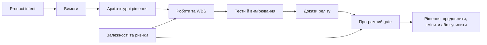
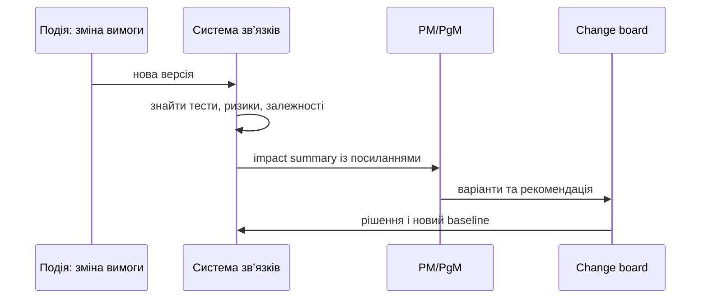

# Система управління складною програмою: від розрізнених трекерів до рішень із доказами

У складному інженерному продукті стан роботи майже ніколи не міститься в одному інструменті. Беклог живе у трекері, код — у репозиторії, вимоги — у спеціалізованій системі, результати тестів — ще десь, а причини важливих рішень — у чатах і пам’яті кількох людей. Кожна частина може бути якісною; проблема виникає на стиках. Саме там губиться відповідь на просте запитання: **чи готові ми робити наступний крок і чим це доведено?**

Для hardware/software розробки це не академічна тонкість. Від зміни мікросхеми може залежати прошивка, стенд, протокол випробувань, сертифікаційний пакет і дата інтеграції. Дошка задач показує рух окремих робіт, але не весь причинно-наслідковий ланцюг.

## Проєкт, програма і спільна модель реальності

Керівник проєкту відповідає за доставку конкретного результату: обсяг, команду, строки, ризики й якість. Керівник програми дивиться на спільний результат кількох проєктів: залежності, інтеграційні вікна, конфлікти ресурсів, користь і рішення між командами. Тому «всі проєкти зелені» не означає, що програма здорова: один пропущений лабораторний слот може зупинити кілька формально не пов’язаних робіт.

Така схема не закликає замінити всі наявні інструменти «мегаплатформою». Вона описує мінімальну спільну модель: вимога, зміна, ризик, залежність, рішення, тест, доказ, baseline і відповідальна роль мають бути зв’язаними та мати версію. Інтеграційний шар через API, події й посилання часто цінніший за ще одну базу даних.

## Чому план сам по собі не є станом системи

WBS і календар потрібні, але в інженерній програмі вони є гіпотезою про майбутнє. Плата може не пройти випробування, постачальник — змінити дату, а нова загроза безпеці — розширити тестовий обсяг. Baseline не забороняє змін; він робить їх видимими й порівнюваними.

Практичний change package має відповідати на чотири питання: що саме змінюється, чому, які артефакти зачеплено і яке рішення пропонується. Корисна груба оцінка пріоритету зміни може виглядати так:

$$I_c = w_rR + w_sS + w_cC + w_dD,$$

де $R$ — вплив на вимоги, $S$ — безпеку або кібербезпеку, $C$ — вартість чи ресурси, $D$ — затримка; ваги $w$ команда погоджує заздалегідь. Це не «математика, що вирішує замість людей», а спосіб не приховати критичний вимір за одним усередненим світлофором.

## Від звіту до підтримки рішення

Звіт пояснює, що вже сталося. Система підтримки рішень показує, що зміниться за різних сценаріїв і які припущення за цим стоять. Для цього потрібні не сотні метрик, а сигнали з власником, порогом і наступною дією.

У такому циклі метрика має сенс лише тоді, коли запускає розмову або workflow. Наприклад, ризик від затримки не є числом «для звіту»: він має власника, горизонт, пов’язані віхи та варіанти пом’якшення.

## Де доречні AI та правила

AI корисний там, де потрібні пошук, пояснення, зіставлення і чернетка: звести статус з задач, коду й тестів; підготувати impact analysis; пояснити, чому gate не готовий; знайти суперечність між roadmap і виконанням. Але відповідь асистента має містити джерела, версії, припущення і невизначеність. Інакше це переконливий текст, а не доказ.

Для формальних обмежень на кшталт «критична вимога не може бути закрита без незалежної верифікації» краще працюють явні правила. Найстійкіша комбінація проста: мовна модель пояснює й готує варіанти, правила перевіряють повноту та заборони, людина приймає рішення. Для конфіденційних даних до цього додаються контроль доступу, журналювання запитів, версія моделі й розмежування проєктних контекстів.

## З чого почати

Не починайте з закупівлі платформи. Візьміть один болючий маршрут, наприклад `вимога → зміна → тест → релізний gate`, і зробіть його відтворюваним. Далі додайте карту міжпроєктних залежностей, а потім — огляд готовності до релізу. Якість системи легко перевірити питанням: чи може нова людина за кілька хвилин пояснити стан важливої вимоги, не шукаючи автора в чаті?

Сучасне управління програмою — це не виробництво звітів. Це операційна пам’ять, яка з’єднує продуктовий намір, інженерну реальність і докази. Вона скорочує не лише кількість слайдів, а й час на пошук контексту перед відповідальним рішенням.
