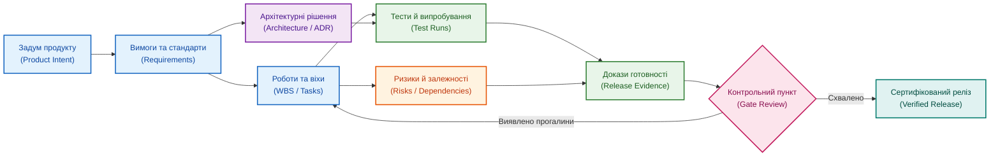

# Сучасні системи проєктного й програмного менеджменту: від статусів до рішень

**Автор:** [Микола Федчик (Mykola Fedchyk)](book/about-the-author.md) · [LinkedIn](https://www.linkedin.com/in/nickfedchik/) · [GitHub](https://github.com/nick-fedchik)

---

## Вступ

**Мета статті:** визначити інженерні та архітектурні засади сучасних систем управління проєктами й програмами, здатних перейти від ручного обліку статусів задач до детермінованої підтримки технічних та управлінських рішень на основі перевірних артефактів.

**Технологічна проблема, яка вирішується:** у складних виробах, де поєднуються електроніка, друковані плати, механіка, вбудовані мікропрограми та прикладне програмне забезпечення, класичні трекери задач втрачають контекст взаємозв'язків. Коли план формально позначений зеленим кольором, локальна зміна специфікації інтерфейсу може зруйнувати калібрування сенсорів або зірвати терміни сертифікації. Стаття демонструє, як подолати фрагментацію даних за допомогою єдиної моделі артефактів із наскрізною простежуваністю.

---

## Проблема розриву контексту в інженерних програмах

Головна перешкода ефективного управління полягає в тому, що проєктні артефакти розпорошені між ізольованими інструментами без збереження причинно-наслідкових зв'язків.

Перед контрольним пунктом або випуском версії команда часто бачить оманливо спокійну картину: у трекері всі картки переведені в стан «виконано», календарний графік позначений зеленим, але ніхто не може швидко відповісти, чи остання зміна системної вимоги була перевірена на фізичному стенді. Журнал невиконаних робіт (*backlog*, беклог) ведеться в одному інструменті, вихідний код у системі контролю версій, плани верифікації у трекері тестування, реєстр ризиків у таблиці, а аргументи критичних рішень губляться в листуванні. Поки продукт складається з одного програмного модуля, команда здатна утримувати ці залежності в пам'яті. Коли ж проєкт переростає в багаторічну програму з багатьма постачальниками компонентів та суворими стандартами безпеки, фрагментація спричиняє приховані дефекти й зриви графіків.

Управлінська система повинна фіксувати не лише факт виконання задачі, а й підстави для кожного технічного висновку. Без машинно-перевірних зв'язків між вимогами, кодом, випробуваннями та релізами керівники змушені займатися ручною реконструкцією реального стану виробу перед кожною важливою віхою.

## Проєкт і програма мають різні горизонти

Управління складною технічною розробкою вимагає чіткого розмежування тактичного рівня окремого проєкту та стратегічного рівня програми.

Керівник проєкту (*Project Manager*, PM) відповідає за постачання (*delivery*) конкретного результату у межах затвердженого обсягу робіт (*scope*) та календарного графіка (*schedule*). Його увага зосереджена на інженерних задачах, завантаженні фахівців, локальних ризиках та якості коду чи вузлів. Натомість керівник програми (*Programme Manager*, PgM) координує групу взаємопов'язаних проєктів задля досягнення спільного стратегічного результату. Його завдання полягає в узгодженні міжпроєктних залежностей (*cross-project dependencies*), оптимізації загальних ресурсів, керуванні системними ризиками та контролі інтеграційних вікон. Якщо керівник проєкту контролює своєчасне написання драйвера, то керівник програми оцінює, як затримка постачання зразків мікросхем вплине на графік випробувань бортового обладнання в кліматичній камері.

Спроба замінити програмний менеджмент механічним підсумовуванням звітів окремих команд є помилковою. Кілька проєктів можуть мати індивідуально бездоганні показники, але їхнє нескоординоване зведення здатне зупинити програму через конфлікт інтерфейсів або відсутність доступу до випробувальної лабораторії.

Стандарти ISO 21502:2020 (керівництво з управління проєктами) та ISO 21503:2022 (керівництво з управління програмами) задають термінологічну основу для розподілу цих обов'язків. Вони підтверджують, що програма вимагає окремого контуру рішень, спрямованого на кінцеві стратегічні переваги, а не лише на облік виконаних завдань.

## Спільні артефакти замість нескінченних статус-зустрічей

Проблема надмірної кількості нарад виникає тоді, коли у проєкті відсутнє спільне джерело верифікованої інформації, що змушує учасників синхронізувати стан вручну.

Конструктивна взаємодія між керівником проєкту та керівником програми будується не на частоті зустрічей, а на спільних машинно-перевірних артефактах (*shared artifacts*): карті залежностей, реєстрі програмних ризиків, критеріях проходження контрольних пунктів (*gate criteria*), журналах архітектурних та управлінських рішень (*decision records*), матриці розподілу відповідальності (RACI) та наскрізній простежуваності (*traceability*). Керівник проєкту фіксує перевірені факти: прогрес виконання завдань, блокери, потреби в ресурсах, модифікації вимог, протоколи випробувань, відкриті дефекти та докази готовності. Керівник програми повертає стратегічний контекст: глобальні пріоритети, міжпроєктні зв'язки, рішення наглядового комітету, коригування дорожньої карти та міжмодульні компроміси.

Коли ця комунікація спирається на операційну пам'ять системи, а не на усні домовленості, тривалість статусних зустрічей скорочується, а якість рішень зростає завдяки наявності об'єктивних технічних свідчень.

```mermaid
flowchart LR
    accTitle: Зв'язок інженерних артефактів у системі управління
    accDescr: Від задуму продукту до схвалення релізу через наскрізну простежуваність артефактів.

    PI["Задум продукту<br/>(Product Intent)"] --> R["Вимоги та стандарти<br/>(Requirements)"]
    R --> W["Роботи та віхи<br/>(WBS / Tasks)"]
    R --> D["Архітектурні рішення<br/>(Architecture / ADR)"]
    W --> T["Тести й випробування<br/>(Test Runs)"]
    D --> T
    W --> K["Ризики й залежності<br/>(Risks / Dependencies)"]
    T --> E["Докази готовності<br/>(Release Evidence)"]
    K --> E
    E --> G{"Контрольний пункт<br/>(Gate Review)"}
    G -->|Схвалено| REL["Сертифікований реліз<br/>(Verified Release)"]
    G -->|Виявлено прогалини| W

    classDef plan fill:#e3f2fd,stroke:#1565c0,stroke-width:2px,color:#0d47a1;
    classDef arch fill:#f3e5f5,stroke:#7b1fa2,stroke-width:2px,color:#4a148c;
    classDef test fill:#e8f5e9,stroke:#2e7d32,stroke-width:2px,color:#1b5e20;
    classDef risk fill:#fff3e0,stroke:#e65100,stroke-width:2px,color:#bf360c;
    classDef gate fill:#fce4ec,stroke:#c2185b,stroke-width:2px,color:#880e4f;
    classDef rel fill:#e0f2f1,stroke:#00796b,stroke-width:2px,color:#004d40;

    class PI,R,W plan;
    class D arch;
    class T,E test;
    class K risk;
    class G gate;
    class REL rel;
```

*Діаграма відображає не жорстку лінійну послідовність етапів, а постійні інформаційні зв'язки, які система повинна автоматично надавати під час внесення змін або проходження контрольного пункту.*

## Чому апаратно-програмний продукт складніший за класичний софт

Головна складність розробки фізичних пристроїв полягає в наявності незворотних матеріальних витрат часу і коштів, які не дозволяють довільно змінювати плани розробки.

Суто програмний проєкт (*software-only project*) здатний оперативно адаптувати функціональний обсяг, ритм випусків (*release cadence*) та плани реалізації. Апаратно-програмна програма має жорсткі фізичні обмеження (*physical constraints*): тривалість виготовлення та постачання електронних компонентів (*lead time*), виготовлення ревізій дослідних друкованих плат (*board spins*), цикли монтажу дослідних партій, графік доступності сертифікаційних лабораторій, залежності прошивок від апаратних ревізій кристалів, бронь кліматичних камер, випробування на електромагнітну сумісність (EMC) та оцінку функціональної безпеки й кібербезпеки.

Такий виріб існує не лише у задачах трекера. Він матеріалізований у відомості матеріалів (*Bill of Materials*, BOM), електричних схемах, ревізіях друкованих плат (PCB), механічних кресленнях, гілках мікропрограм, калібрувальних таблицях, стендах моделювання на фізичному рівні (HIL, *Hardware-in-the-Loop*), протоколах лабораторних вимірювань та повідомленнях постачальників про інженерні зміни.

Коли система управління фіксує лише віртуальні завдання, вона втрачає зв'язок із матеріальною дійсністю. Наприклад, картка задачі може бути позначена як успішно виконувана, але відсутність зразка кремнієвого мікроконтролера нової ревізії блокує інтеграційні випробування і зсуває дату здачі на місяці.

## Математична оцінка готовності та надійності випуску

Суб'єктивна оцінка готовності системи до контрольного пункту несе високі ризики прихованих дефектів, тому допуск до релізу має спиратися на формальний розрахунок доказової повноти.

Для ухвалення зваженого інженерного рішення про випуск версії або проходження контрольного пункту застосовується індекс зваженої доказової готовності $R_{\text{ev}}$, який враховує частку підтверджених випробуваннями вимог та наявність критичних дефектів:

$$R_{\text{ev}} = \sum_{i=1}^{M} w_i \cdot \frac{T_{i,\text{pass}}}{T_{i,\text{total}}} \cdot \left(1 - \frac{D_{i,\text{crit}}}{D_{i,\text{thresh}} + 1}\right)$$

**Тут:**
- $R_{\text{ev}}$ є інтегральним індексом доказової готовності виробу до релізу (безрозмірна величина в межах $[0; 1]$).
- $M$ є кількістю категорій інженерних вимог (наприклад: функціональні, безпекові, кібербезпекові, надійнісні).
- $w_i$ є нормованим ваговим коефіцієнтом важливості $i$-ї категорії вимог, де $\sum_{i=1}^{M} w_i = 1{,}0$.
- $T_{i,\text{pass}}$ є кількістю верифікованих вимог із підтвердженими успішними протоколами випробувань у даній категорії (ціле невід'ємне число).
- $T_{i,\text{total}}$ є загальною кількістю затверджених вимог у базовій версії для даної категорії (ціле додатне число).
- $D_{i,\text{crit}}$ є поточною кількістю відкритих критичних дефектів у цій категорії (ціле невід'ємне число).
- $D_{i,\text{thresh}}$ є допустимим регламентним порогом критичних дефектів (у системах підвищеної надійності та безпеки $D_{i,\text{thresh}} = 0$).

**Числовий приклад розрахунку:**
Розглянемо автомобільний контролер, де визначено дві категорії вимог: базова функціональність ($w_1 = 0{,}4$) і функціональна безпека ($w_2 = 0{,}6$). У категорії функціональності успішно перевірено 95 вимог зі 100 ($T_{1,\text{pass}} = 95, T_{1,\text{total}} = 100$) за повної відсутності критичних дефектів ($D_{1,\text{crit}} = 0$). У категорії безпеки перевірено 48 вимог із 50 ($T_{2,\text{pass}} = 48, T_{2,\text{total}} = 50$), але виявлено 1 відкритий критичний дефект при нульовому допуску ($D_{2,\text{crit}} = 1, D_{2,\text{thresh}} = 0$):

$$R_{\text{ev}} = 0{,}4 \cdot \frac{95}{100} \cdot (1 - 0) + 0{,}6 \cdot \frac{48}{50} \cdot \left(1 - \frac{1}{0 + 1}\right) = 0{,}38 + 0{,}6 \cdot 0{,}96 \cdot 0 = 0{,}38$$

Розрахунок показує, що один нерозв'язаний критичний дефект безпеки повністю нівелює прогрес у критичній підсистемі, знижуючи загальний індекс з $0{,}956$ до неприйнятних $0{,}38$. Це виключає ситуації, коли високий відсоток закриття другорядних задач маскує загрози безпеці.

## Як керувати планом і змінами без ручної реконструкції

Спроба вести детальний календарний графік робіт у відриві від інженерних артефактів неминуче перетворює планування на бюрократичну імітацію.

На старті проєкту детальна ієрархічна структура робіт (WBS, *Work Breakdown Structure*) створює враження повного контролю. Проте через кілька місяців змінюються параметри компонентів, архітектурні рішення, дати постачання від підрядників, вимоги стандартів або вектор кіберзагроз. Якщо план не має зв'язку з реальними файлами коду, схемами й протоколами, він починає вимагати постійного ручного оновлення, від якого інженери швидко втомлюються.

Коли WBS затверджено як базову версію (*Baseline*), її не можна модифікувати без формального розгляду. Будь-яка зміна повинна проходити через комітет контролю змін (*Change Control Board*, CCB), аналіз технічного впливу (*Impact Analysis*), перегляд завантаження ресурсів та сповіщення зацікавлених сторін. Це працює лише за умови автоматизованої підтримки: зміна дати готовності електронного модуля має негайно висвітлювати всі залежні тести, закупівлі й формувати проєкт пакета змін.

Інтегрована система пов'язує WBS, віхи, залежності, ризики, вимоги, випробування та докази в єдиний інформаційний контур, усуваючи потребу в ручному узгодженні даних.

## Інструменти: спеціалізовані, але фрагментовані

Сучасний ринок корпоративного програмного забезпечення пропонує потужні рішення для окремих функцій, проте їхня ізольованість заважає наскрізному управлінню.

Інструменти на кшталт Jira, Azure DevOps, YouTrack, GitLab Issues та GitHub Issues ефективно ведуть облік завдань та беклогів. Репозиторії коду забезпечують рев'ю коду, CI/CD конвеєри та автоматизоване сканування вразливостей. Платформи Confluence, SharePoint і корпоративні вікі зберігають текстову документацію. Спеціалізовані комплекси інженерії вимог, такі як Polarion, DOORS Next, Jama Connect та codeBeamer, надають засоби фіксації базових ліній і побудови матриць простежуваності. Системи TestRail, Zephyr та Xray адмініструють процес тестування, а корпоративні пакети на зразок MS Project, Planview, Planisware та Clarity орієнтовані на портфельне планування.

Справжня проблема криється на стиках між цими автономними системами. Вимога перебуває в одній програмі, вихідний код у другій, результати тестів у третій, реєстр ризиків у таблиці, а пояснення прийнятого компромісу лишається в пам'яті архітектора. Складний інженерний виріб створюється саме на перетині цих дисциплін, де автоматизація традиційно найслабша.

## Починати потрібно з моделі предметної області

Спроба об'єднати розрізнені інструменти без спільної інформаційної моделі призводить до створення хаотичних скриптів інтеграції, які швидко ламаються.

Побудова системи управління повинна починатися з формальної онтології предметної області (*Domain Model*). Ця модель має явно визначати сутності: проєкт, програма, портфель, продуктова вимога, системна вимога, апаратний вузол, робочий пакет, ризик, залежність, архітектурне рішення, базова лінія, протокол випробувань, доказ релізу, роль, затвердження та журнал аудиту.

Головною системною вимогою є наскрізна простежуваність (*Traceability*). Задум продукту повинен транслюватися у вимоги зацікавлених сторін, системні, програмні та апаратні специфікації, архітектурні рішення (ADR), завдання інженерів, запити на злиття коду (*merge requests*), тестові сценарії, дефекти, погодження та сертифікаційні докази. Не кожному проєкту потрібен повний набір цих ланок, але для обраного периметра вони мають бути формальними й перевірними.

Модель забезпечує фіксацію базових версій і керування версійністю. Стан виробу на момент проходження контрольного пункту має бути відтворюваним через роки, що є фундаментальною передумовою успішного проходження регуляторних аудитів. Інтеграційний шар будується на основі відкритих API, вебхуків, потоків подій (*event streams*), ідемпотентних обробників та незмінних журналів аудиту (*audit trail*).

Ключовою вимогою є простежуваність. Бізнес-ціль або продуктова вимога має вести до вимог зацікавлених сторін, системних, програмних та апаратних вимог, архітектурних рішень, задач, запитів на злиття, тестів, дефектів, ризиків, погоджень і доказів готовності до релізу. Не кожному проєкту потрібні всі ці ланки, але для обраного контуру вони мають бути явними. Інакше аудит і перевірка готовності до релізу перетворюються на ручну реконструкцію.

Потрібні baselines і versioning. Стан проекту на момент gate review або release candidate має бути відтворюваним. Якщо requirement змінився через два місяці, система має показати, що було approved тоді.

Потрібна надійна архітектура інтеграції: відкриті API, вебхуки, шини повідомлень, контроль версій схем даних, ідемпотентність обробки, незмінні журнали аудиту та розмежування прав доступу на основі ролей.

## Підтримка прийняття рішень замість пасивної звітності

Класична звітність лише констатує минулі факти, тоді як керівництву потрібні інструменти моделювання наслідків майбутніх рішень.

Статичний звіт відповідає на запитання «що відбулося минулого тижня?». Система підтримки прийняття рішень (*Decision Support System*) допомагає відповісти на запитання «що станеться, якщо змінити постачальника?», «які технічні альтернативи існують?», «якими є компроміси між часом виходу на ринок та витратами?» та «який ступінь достовірності прогнозу?». Для програмного менеджера це критично: перенесення віхи випуску одного модуля зачіпає зобов'язання перед клієнтами, слоти випробувань у лабораторіях та розклад випусків (*release trains*) суміжних систем.

Метрики проєкту також повинні бути сигналами до дії, а не статичними діаграмами для презентацій. Якщо динаміка виявлення дефектів свідчить про деградацію якості, тестове покриття падає, критичний фахівець перевантажений, а вимоги накопичуються без рецензування, система зобов'язана негайно сповістити власника ризику, показати потенційні наслідки та запропонувати сценарії коригування.

## Штучний інтелект у керованому контексті

Застосування алгоритмів штучного інтелекту без зв'язку з реальними артефактами створює ризик управлінських помилок через генерацію недостовірних висновків.

Штучний інтелект у системі управління не повинен бути ізольованим діалоговим вікном поруч із дошкою задач. Його практична цінність розкривається тоді, коли алгоритми аналізують конкретний артефакт у межах регламентованого процесу. Для керівника проєкту асистент може автоматично сформувати аналітичне зведення на основі закритих завдань, запитів на злиття коду, результатів тестів і реєстру ризиків; виявити задачі без призначеного виконавця; попередити про розбіжності між планом і фактичним виконанням. Для керівника програми асистент знаходить приховані міжпроєктні залежності та прогалини в доказах перед контрольними пунктами. Інженеру система допомагає простежити історію зміни вимоги, знайти пов'язані дефекти або підготувати проєкт опису архітектурного рішення (ADR).

Будь-яка аналітична рекомендація має бути перевірною: вона зобов'язана містити точні посилання на первинні артефакти, номери ревізій, вихідні припущення та оцінку достовірності. Відповідно до рекомендацій профілю NIST AI 600-1 для генеративного штучного інтелекту, ризики помилок моделі необхідно контролювати на кожному етапі життєвого циклу інформації, а остаточне рішення завжди залишати за уповноваженою людиною.

## Мовні моделі, локальне розгортання та експертні правила

Обробка природної мови за допомогою великих мовних моделей (LLM) вимагає суворого дотримання інформаційної безпеки та детермінованого контролю правил.

Мовна модель ефективно узагальнює текстові звіти, класифікує звернення та формулює описи завдань, проте для її роботи потрібен контрольований контур: механізми семантичного пошуку (RAG), розмежування прав доступу, логування запитів, фіксація версій моделей та чітке відділення об'єктивних фактів від припущень. Для закритих інженерних розробок в автомобільній промисловості, авіації, медичних приладах та напівпровідниковому секторі критично важливе розгортання локальних моделей усередині захищеного периметра або використання локальних обчислювачів без виходу в зовнішню мережу.

Там, де потрібна математична та логічна строгість, мовної генерації недостатньо. Символьні експертні системи підтримують базу формальних правил, онтологію предметної області, алгоритми логічного виведення, генерацію пояснень і детекцію конфліктів. Гібридний нейро-символьний підхід поєднує гнучкість обробки неструктурованого тексту мовною моделлю з абсолютною надійністю символьного ядра, яке перевіряє цілісність графа вимог, повноту доказів та правила допуску до релізу.

## Неперервний комплаєнс: докази виникають під час інженерної роботи

У високорегульованих галузях відповідність стандартам повинна бути щоденним станом інженерного процесу, а не авральною підготовкою до зовнішнього аудиту.

Коли протоколи перегляду коду, акти погодження вимог, результати тестів, оновлення матриці простежуваності, рішення щодо ризиків та результати статичного аналізу безпеки фіксуються автоматично під час виконання щоденних завдань, формується безперервний ланцюг цифрових доказів (*Evidence Chain*). Пакет документів для сертифікаційного аудиту стає побічним продуктом регулярної інженерної діяльності.

Такий підхід забезпечує користь для кожного учасника процесу. Розробник розуміє походження вимоги за кожною зміною коду. Фахівець із тестування зосереджується на перевірці зон найвищого ризику. Системний інженер своєчасно виявляє дублювання та конфлікти специфікацій. Інженер із функціональної безпеки бачить зв'язок між загрозами та протоколами випробувань. Фахівець із кібербезпеки співвідносить активи, загрози та заходи протидії безпосередньо з планом релізу. У результаті система перестає бути бюрократичним тягарем і стає робочим середовищем, яке забезпечує повноту інженерного контексту.

## Покрокове впровадження без радикального переписування

Побудова зрілої системи управління не вимагає миттєвої відмови від чинних інструментів чи масштабної закупівлі монолітних платформ.

Доцільно розпочинати з інтеграційного шару для одного критичного ланцюга: вимога → інженерна задача → тест → дефект → шлюз випуску. Наступним кроком додається динамічна карта залежностей для програмного рівня. Далі формується автоматизована панель готовності до релізу, яка виключає маскування відсутніх доказів за оптимістичними звітами про закриття задач.

Головний критерій успіху полягає в тому, щоб реальну цінність відчули і керівники, і рядові інженери. Якщо система лише додає нові обов'язкові поля для заповнення, вона зустріне саботаж. Якщо вона допомагає розробнику швидко визначити пов'язані тести, пояснити причину технічної затримки або автоматично підготувати пакет сертифікаційних документів, її впровадження відбувається органічно.

---

## Висновки

1. Сучасна система проєктного й програмного менеджменту є інтегрованим операційним середовищем між продуктовим задумом, інженерними фактами, ризиками, залежностями та управлінськими рішеннями, а не просто статичною дошкою завдань.
2. Програмний менеджмент принципово відрізняється від управління проєктом фокусом на міжпроєктних залежностях, системних ризиках та інтеграційних вікнах, тому його не можна зводити до механічної агрегації локальних звітів.
3. Специфіка апаратно-програмних виробів полягає в жорстких фізичних обмеженнях постачання компонентів, виготовлення дослідних плат і броні лабораторій, що вимагає безпосереднього зв'язку завдань із відомістю матеріалів (BOM) та ревізіями схем.
4. Доказова готовність виробу до релізу повинна вимірюватися математичним індексом повноти верифікації вимог із нульовою толерантністю до нерозв'язаних дефектів безпеки.
5. Застосування штучного інтелекту є результативним виключно в межах гібридної архітектури, де гнучкість мовних моделей верифікується детермінованими експертними правилами на базі цифрової нитки.

---

## Посилання

1. ISO 21502:2020. *Project, programme and portfolio management — Guidance on project management*. International Organization for Standardization, Geneva, Switzerland. [https://www.iso.org/standard/74947.html](https://www.iso.org/standard/74947.html)
2. ISO 21503:2022. *Project, programme and portfolio management — Guidance on programme management*. International Organization for Standardization, Geneva, Switzerland. [https://www.iso.org/standard/78644.html](https://www.iso.org/standard/78644.html)
3. ISO 26262-8:2018. *Road vehicles — Functional safety — Part 8: Supporting processes*. International Organization for Standardization, Geneva, Switzerland. [https://www.iso.org/standard/68387.html](https://www.iso.org/standard/68387.html)
4. NIST AI 600-1. *Artificial Intelligence Risk Management Framework: Generative Artificial Intelligence Profile*. National Institute of Standards and Technology, Gaithersburg, MD, 2024. [https://doi.org/10.6028/NIST.AI.600-1](https://doi.org/10.6028/NIST.AI.600-1)
5. INCOSE Systems Engineering Handbook: *A Guide for System Life Cycle Processes and Activities*. 5th Edition. John Wiley & Sons, 2023.

---

## Терміни

- **Базова версія (Baseline)**: офіційно затверджений на певний момент часу стан вимог, креслень, вихідного коду чи плану, який слугує основою для подальшої роботи і змінюється лише за формальною процедурою.
- **Відомість матеріалів (Bill of Materials, BOM)**: структурований перелік компонентів, вузлів, друкованих плат і сировини, необхідних для виготовлення фізичного пристрою.
- **Вимога (Requirement)**: формалізоване твердження про властивість, функцію або обмеження системи, виконання якого підлягає обов'язковій перевірці.
- **Декомпозиція робіт (Work Breakdown Structure, WBS)**: ієрархічне структурування повного обсягу робіт проєкту на менші, керовані компоненти.
- **Докази випуску (Release Evidence)**: машинно-перевірні артефакти (протоколи випробувань, звіти статичного аналізу коду, сертифікати), що підтверджують виконання всіх критеріїв готовності.
- **Контрольний пункт (Gate Review)**: формальна процедура оцінки зрілості виробу на межі фаз проєкту для ухвалення рішення про перехід на наступний етап.
- **Рада контролю змін (Change Control Board, CCB)**: уповноважена група керівників та інженерів, яка розглядає пропозиції щодо змін базових версій і оцінює їхній вплив.
- **Цифрова нитка (Digital Thread)**: наскрізний ланцюг взаємопов'язаних інженерних даних і артефактів упродовж усього життєвого циклу розробки виробу.

---

## Скорочення

- **ADR**: Architecture Decision Record (журнал архітектурних рішень)
- **BOM**: Bill of Materials (відомість матеріалів)
- **CCB**: Change Control Board (рада контролю змін)
- **EMC**: Electromagnetic Compatibility (електромагнітна сумісність)
- **HIL**: Hardware-in-the-Loop (апаратно-програмне моделювання на фізичному стенді)
- **LLM**: Large Language Model (велика мовна модель)
- **PCB**: Printed Circuit Board (друкована плата)
- **PgM**: Programme Manager (керівник програми)
- **PM**: Project Manager (керівник проєкту)
- **PMO**: Project Management Office (проєктний офіс)
- **WBS**: Work Breakdown Structure (ієрархічна структура робіт)
- **WIP**: Work in Progress (незавершене виробництво)

---

## Про автора

**Микола Федчик (Mykola Fedchyk)**: український інженер, системний архітектор та дослідник у галузі кіберфізичних комплексів, доказового штучного інтелекту та критичних вбудованих систем. Понад двадцять років керує інженерними розробками та проєктуванням складних апаратно-програмних комплексів у сфері мережевої безпеки, телекомунікацій та автомобільної електроніки відповідно до вимог міжнародних стандартів ISO 26262 та ISO/SAE 21434. Досліджує практичне застосування експертних систем, семантичних онтологій та цифрової нитки для управління складними інженерними програмами.

Детальніша інформація: [Про автора](book/about-the-author.md) · [LinkedIn](https://www.linkedin.com/in/nickfedchik/) · [GitHub](https://github.com/nick-fedchik)
