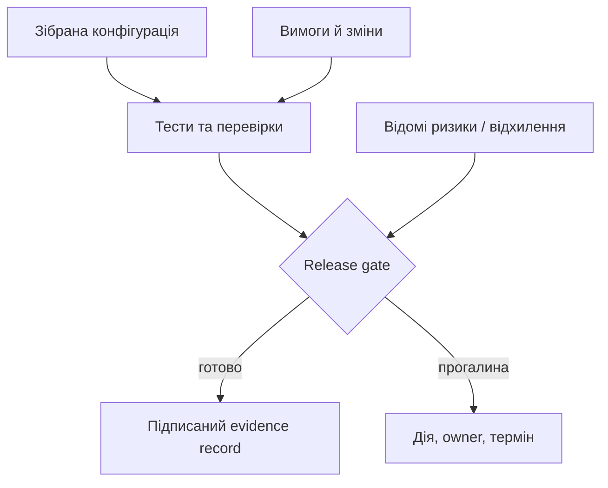
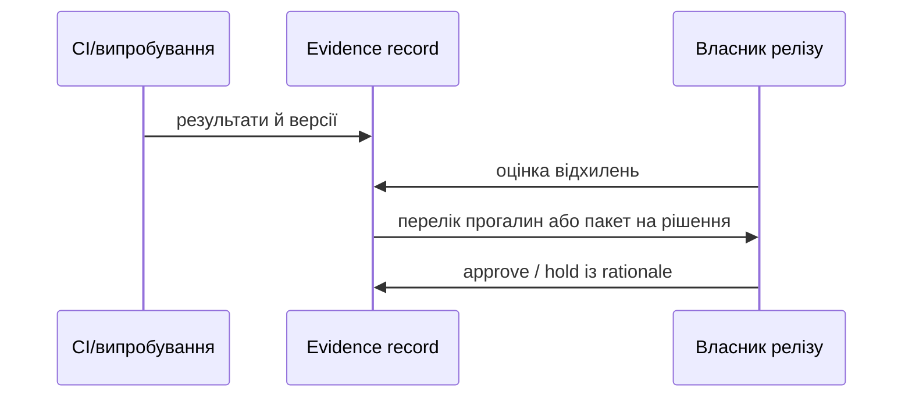

# Release evidence: чому реліз має доводити себе сам

Release notes повідомляють, що змінилося. Release evidence пояснює, на підставі чого команда вважає зміну придатною для постачання. У простому продукті це може бути короткий набір CI-результатів; у складній системі — ще й зв’язок з вимогами, конфігурацією, ризиками, approval та обмеженнями використання.

Evidence record має бути коротким, але відтворюваним: ідентифікатор релізу й склад конфігурації, посилання на обов’язкові перевірки, їхні результати та середовище, відкриті відхилення, рішення й підпис відповідальної ролі. Секрети, персональні дані й зайві фрагменти логів слід редагувати до публікації, але факт редагування й причина мають лишатися видимими.

Можна оцінювати готовність набором обов’язкових контрольних точок:

$$G=\bigwedge_{i=1}^{n}(e_i \land a_i),$$

де $e_i$ — наявність потрібного доказу, а $a_i$ — його актуальність для конкретної конфігурації. Важливо: один критичний false не компенсується десятьма зеленими пунктами. Саме тому gate — не середній бал.

Сухий прогін (dry-run) і readback перед публікацією особливо корисні для автоматизованих процесів: вони перевіряють не лише артефакт, а й сам механізм постачання. З часом release evidence стає операційною пам’яттю: дає змогу пояснити, що саме пішло в поле, чому рішення було прийняте і які обмеження були відомі на той момент.
