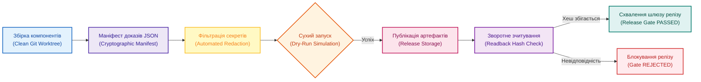

# Докази випуску (Release Evidence): чому інженерний реліз має доводити себе сам

**Автор:** [Микола Федчик (Mykola Fedchyk)](book/about-the-author.md) · [LinkedIn](https://www.linkedin.com/in/nickfedchik/) · [GitHub](https://github.com/nick-fedchik)

---

## Вступ

**Мета статті:** визначити інженерні засади та практичні механізми формування доказів випуску (*Release Evidence*) як строгої інженерної дисципліни, яка усуває суб'єктивні запевнення та забезпечує повну машинно-перевірну відтворюваність релізу.

**Технологічна проблема, яка вирішується:** у більшості розробок готовність версії досі доводиться усними запевненнями та маркетинговими примітками до випуску (*Release Notes*). У складних багатокомпонентних продуктах такі списки не гарантують взаємної сумісності модулів: закрита задача в трекері не доводить, що скомпільований бінарний файл відповідає перевіреній ревізії коду, а збірка не містить локальних неперевірених правок. Стаття пропонує практичний конвеєр генерації криптографічно підписаних маніфестів випуску з обов'язковим попереднім моделюванням (*dry-run*) та зворотним зчитуванням (*readback*).

---

## Примітки до випуску проти доказів випуску

Поширена плутанина між текстовими примітками до релізу та реальними інженерними доказами готовності є причиною численних збоїв на етапі експлуатації.

Традиційні примітки до випуску (*Release Notes*) створюються для людей: вони перелічують нові функції, виправлені дефекти та дають інструкції з оновлення. Проте фраза «додано підтримку нового протоколу зв'язку» не є доказом сумісності. Натомість докази випуску (*Release Evidence*) формуються для машинної верифікації: вони фіксують точний хеш-ідентифікатор коміту Git, перелік використаних бібліотек, версії компілятора, результати проходження обов'язкових наборів тестів (*fixture corpus*), коди завершення процесів та підтвердження відсутності неперевірених локальних змін у робочому дереві репозиторію.

Примітки до випуску слугують засобом комунікації, тоді як докази випуску є фундаментом інженерної довіри та регуляторної безпеки.

Реліз, який не підтверджений машинно-перевірними доказами, лише просить про довіру; реліз із повним пакетом цифрових доказів доводить свою надійність сам.

```mermaid
flowchart LR
    accTitle: Конвеєр формування та верифікації доказів випуску
    accDescr: Від збирання артефактів через фільтр цензурування, сухе моделювання та публікацію до зворотного зчитування.

    BLD["Збірка компонентів<br/>(Clean Git Worktree)"] --> MAN["Маніфест доказів JSON<br/>(Cryptographic Manifest)"]
    MAN --> RED["Фільтрація секретів<br/>(Automated Redaction)"]
    RED --> DRY{"Сухий запуск<br/>(Dry-Run Simulation)"}
    DRY -->|Успіх| PUB["Публікація артефактів<br/>(Release Storage)"]
    PUB --> RBK["Зворотне зчитування<br/>(Readback Hash Check)"]
    RBK -->|Хеш збігається| ACC["Схвалення шлюзу релізу<br/>(Release Gate PASSED)"]
    RBK -->|Невідповідність| ERR["Блокування релізу<br/>(Gate REJECTED)"]

    classDef bld fill:#e3f2fd,stroke:#1565c0,stroke-width:2px,color:#0d47a1;
    classDef man fill:#ede7f6,stroke:#512da8,stroke-width:2px,color:#311b92;
    classDef red fill:#fff9c4,stroke:#fbc02d,stroke-width:2px,color:#f57f17;
    classDef dry fill:#fff3e0,stroke:#e65100,stroke-width:2px,color:#bf360c;
    classDef pub fill:#fce4ec,stroke:#c2185b,stroke-width:2px,color:#880e4f;
    classDef rbk fill:#f3e5f5,stroke:#7b1fa2,stroke-width:2px,color:#4a148c;
    classDef acc fill:#e0f2f1,stroke:#00796b,stroke-width:2px,color:#004d40;
    classDef err fill:#ffebee,stroke:#d32f2f,stroke-width:2px,color:#b71c1c;

    class BLD bld;
    class MAN man;
    class RED red;
    class DRY dry;
    class PUB pub;
    class RBK rbk;
    class ACC acc;
    class ERR err;
```

*Конвеєр гарантує цілісність релізу: опубліковані артефакти проходять зворотне зчитування та побайтове порівняння контрольних сум.*

## Математична оцінка цілісності та доказової сили релізу

Для об'єктивного допуску версії до розгортання повнота інженерних доказів повинна оцінюватися через строгий мультиплікативний індекс цілісності.

Будь-яка невідповідність хешів або наявність незафіксованих змін у коді повністю знецінює результати тестування. Розглянемо індекс доказової цілісності релізу $I_{\text{evidence}}$:

$$I_{\text{evidence}} = \left(\prod_{i=1}^{N_c} \mathbb{I}\left(\text{hash}(A_i) \equiv \text{hash}_{\text{expected}}(A_i)\right)\right) \cdot \left(\sum_{j=1}^{M_t} w_j \cdot \frac{T_{j,\text{pass}}}{T_{j,\text{total}}}\right) \cdot \left(1 - \mathbb{I}_{\text{dirty}}\right)$$

**Тут:**
- $I_{\text{evidence}}$ є інтегральним індексом доказової цілісності релізу (безрозмірна величина в межах $[0; 1]$).
- $N_c$ є загальною кількістю скомпільованих бінарних компонентів та опублікованих конфігурацій (ціле додатне число).
- $\text{hash}(A_i)$ є фактичним криптографічним хешем SHA-256 артефакту $A_i$, отриманим під час зворотного зчитування зі сховища релізів.
- $\text{hash}_{\text{expected}}(A_i)$ є очікуваним хешем, зафіксованим конвеєром збирання у первинному маніфесті доказів.
- $\mathbb{I}(\text{hash}(A_i) \equiv \text{hash}_{\text{expected}}(A_i))$ є бінарним індикатором побайтової ідентичності ($1$, якщо хеші повністю збіглися, та $0$ за найменшої розбіжності).
- $M_t$ є кількістю обов'язкових категорій верифікаційних тестів (юніт-тести, HIL, регресія, сканування безпеки).
- $w_j$ є ваговим коефіцієнтом важливості $j$-ї категорії тестів, де $\sum w_j = 1{,}0$.
- $T_{j,\text{pass}}$ та $T_{j,\text{total}}$ є кількістю успішно пройдених та запланованих тестів у $j$-й категорії відповідно.
- $\mathbb{I}_{\text{dirty}}$ є індикатором «брудного» репозиторію: $\mathbb{I}_{\text{dirty}} = 1$, якщо на машині збирання зафіксовано незакомічені файли чи локальні патчі, і $\mathbb{I}_{\text{dirty}} = 0$ для повністю чистого стану Git (*Clean Tree*).

**Навчальний числовий приклад:**
Нехай проєкт містить $N_c = 4$ бінарні модулі, а всі заплановані тести успішно пройдені на 100% ($\sum w_j \cdot \frac{T_{j,\text{pass}}}{T_{j,\text{total}}} = 1{,}0$).
1. Якщо всі 4 артефакти успішно верифіковані при зворотному зчитуванні, а збірка виконана з чистого тегу Git ($\mathbb{I}_{\text{dirty}} = 0$):
   $$I_{\text{evidence}} = (1 \cdot 1 \cdot 1 \cdot 1) \cdot 1{,}0 \cdot (1 - 0) = 1{,}0 \quad (100\%)$$
2. Проте якщо інженер перед збиранням вручну підправив конфігураційний файл на сервері без коміту в репозиторій, виникає брудний стан Git ($\mathbb{I}_{\text{dirty}} = 1$):
   $$I_{\text{evidence}} = 1 \cdot 1{,}0 \cdot (1 - 1) = 0$$

Мультиплікативна структура формули гарантує: наявність навіть одного незафіксованого локального виправлення або пошкодження одного байта під час завантаження в сховище миттєво обнуляє довіру до релізу, запобігаючи передачі сумнівного коду замовнику.

## Структура канонічного маніфесту доказів випуску

Щоб докази були придатними для машинної перевірки, вони повинні фіксуватися у стандартизованому структурованому форматі (JSON або YAML), а не в довільних текстових звітах.

Канонічний запис доказу випуску (*Release Evidence Record*) обов'язково відповідає на вісім інженерних запитань:
1. **Точна ідентифікація артефакту:** назва компонента, версія згідно з SemVer, повний хеш Git SHA, тег релізу та підтвердження чистоти робочого дерева (`dirty: false`).
2. **Контракт сумісності:** версія спільного протоколу взаємодії, ревізія схем інтерфейсів та підтверджене вікно міжкомпонентної сумісності.
3. **Обсяг верифікації:** ідентифікатор запущеного набору тестів (*fixture corpus*), контрольна команда перевірки працездатності (*smoke command*), відсоток покриття коду та коди повернення процесів.
4. **Апаратний та програмний контекст:** цільова архітектура процесора (ARM, RISC-V, x86), ревізія друкованої плати, версія компілятора та налагоджувача.
5. **Трасувальний зразок:** ідентифікатор наскрізного запиту (*Correlation ID / Traceparent*), що доводить проходження сигналу через усі підсистеми.
6. **Цензурування конфіденційних даних:** статус видалення корпоративних секретів, внутрішніх IP-адрес і ключів доступу (*Redaction Status: PASSED*).
7. **Залишкові прогалини:** явна фіксація свідомо відкладених другорядних тестів із зазначенням технічного обґрунтування та схваленого ризику.
8. **Цілісність публікації:** цільове сховище артефактів, контрольна сума SHA-256 та статус зворотного зчитування (*Readback Status: VERIFIED*).

Якщо маніфест не надає відповідей на ці пункти, заява про готовність релізу залишається голослівним припущенням.

## Безпечна автоматизація: сухий запуск та зворотне зчитування

Автоматизовані скрипти публікації релізів несуть значні ризики пошкодження даних, якщо вони позбавлені механізмів контролю цілісності.

Інженерна дисципліна високої надійності спирається на дві обов'язкові операції:
- **Сухий запуск (Dry-Run):** повна імітація процесу формування релізу без реальної модифікації цільового сховища чи репозиторію. Конвеєр збирає всі файли, проводить синтаксичний аналіз, обчислює контрольні суми та формує попередній перегляд звіту, дозволяючи виявити помилки конфігурації до моменту публікації.
- **Зворотне зчитування (Readback):** після успішного завантаження файлів у сховище система автоматично завантажує їх назад, обчислює криптографічний хеш і побайтово порівнює його з первинним маніфестом збирання.

Ця пара операцій гарантує, що мережевий збій чи помилка сховища не призведуть до поширення пошкодженого бінарного файлу серед клієнтів.

## Цензурування як обов'язковий бар'єр безпеки

Докази випуску часто акумулюють детальні технічні логи, які можуть містити конфіденційні параметри внутрішньої мережі, тестові облікові записи чи апаратні дампи.

Якщо маніфести та звіти випробувань публікуються у відкритих сховищах або передаються зовнішнім аудиторам, автоматизоване цензурування (*Automated Redaction*) є критично необхідним етапом. Конвеєр повинен гарантувати повне маскування чутливих маркерів без втрати інженерного змісту повідомлень:
- Статус «Схвалено» (*Passed*): усі внутрішні шляхи, ключі та адреси успішно знеособлені за затвердженими шаблонами.
- Статус «Заблоковано» (*Blocked*): виявлено незамаскований токен доступу або конфіденційний коментар розробника; публікацію артефакту автоматично зупинено.

Коли реліз аналізується асистентами на базі штучного інтелекту, згенеровані моделями підсумки також повинні проходити валідацію на відсутність галюцинацій та витоку конфіденційного контексту.

## Покроковий план впровадження доказової дисципліни

Перехід до релізів, що доводять себе самі, здійснюється поступово, без зупинки чинних процесів доставки коду.

Практичні кроки інженерного впровадження:
1. **Крок 1:** затвердити єдину JSON-схему маніфесту випуску для одного ключового сервісу чи мікропрограми.
2. **Крок 2:** навчити конвеєр збирання автоматично генерувати маніфест із фіксацією Git SHA, версій залежностей та результатів тестів.
3. **Крок 3:** заборонити випуск версій за наявності незакомічених локальних змін у робочому дереві (`git status --porcelain` має повертати порожній результат).
4. **Крок 4:** додати процедуру автоматичного зворотного зчитування та порівняння хешів після вивантаження бінарних пакетів у сховище.
5. **Крок 5:** зробити будь-які відкладені або пропущені перевірки явними полями маніфесту із зазначенням технічної причини та відповідального власника.

Ця послідовність швидко вибудовує культуру поваги до фактів, звільняючи команду від безплідних суперечок про те, що саме і коли було протестовано.

---

## Висновки

1. Інженерний реліз не повинен доводитися суб'єктивними запевненнями: він зобов'язаний спиратися на машинно-перевірні цифрові докази випуску (Release Evidence).
2. Текстові примітки до випуску (Release Notes) орієнтовані на інформування користувачів, тоді як докази випуску забезпечують технічну та регуляторну відтворюваність стану продукту.
3. Будь-яка модифікація коду поза контролем версій або найменша розбіжність контрольних сум при зворотному зчитуванні повністю зводить доказову довіру до релізу до нуля.
4. Процедури сухого запуску (Dry-Run) та зворотного зчитування (Readback) є обов'язковим інженерним бар'єром проти розгортання пошкоджених пакетів.
5. Машинно-зчитувані маніфести у форматі JSON утворюють довготривалу оперативну пам'ять підприємства, яка дозволяє через роки довести точний контекст кожного випущеного виробу.

---

## Посилання

1. NIST SP 800-218. *Secure Software Development Framework (SSDF) Version 1.1: Recommendations for Mitigating the Risk of Software Vulnerabilities*. National Institute of Standards and Technology, Gaithersburg, MD, 2022. [https://doi.org/10.6028/NIST.SP.800-218](https://doi.org/10.6028/NIST.SP.800-218)
2. ISO 21502:2020. *Project, programme and portfolio management — Guidance on project management*. International Organization for Standardization, Geneva, Switzerland. [https://www.iso.org/standard/74947.html](https://www.iso.org/standard/74947.html)
3. ISO 26262-8:2018. *Road vehicles — Functional safety — Part 8: Supporting processes (Clause 10: Software tool qualification)*. International Organization for Standardization, Geneva, Switzerland. [https://www.iso.org/standard/68387.html](https://www.iso.org/standard/68387.html)
4. Humble, J., Farley, D. *Continuous Delivery: Reliable Software Releases through Build, Test, and Deployment Automation*. Addison-Wesley, 2010.
5. SLSA Framework. *Supply-chain Levels for Software Artifacts*. OpenSSF, 2023. [https://slsa.dev/](https://slsa.dev/)

---

## Терміни

- **Брудне робоче дерево (Dirty Working Tree)**: стан локального репозиторію Git, коли на файловій системі присутні модифіковані або невідстежувані файли, відсутні в зафіксованій ревізії коміту.
- **Докази випуску (Release Evidence)**: повний комплекс криптографічно підтверджених артефактів (маніфести збирання, протоколи випробувань, логи перевірок), що однозначно засвідчують відповідність релізу затвердженим критеріям.
- **Зворотне зчитування (Readback)**: процедура повторного завантаження щойно опублікованого файлу зі сховища та перевірки його побайтової ідентичності за допомогою криптографічного хешу.
- **Примітки до випуску (Release Notes)**: документ, що містить стислий опис нових функцій, покращень та виправлених дефектів для кінцевих користувачів.
- **Сухий запуск (Dry-Run)**: режим виконання автоматизованого сценарію, за якого проводяться всі розрахунки та перевірки без внесення фізичних змін у цільові бази даних чи файлові сховища.
- **Цензурування даних (Redaction)**: автоматизоване видалення або маскування конфіденційної інформації (паролів, токенів, внутрішніх мережевих адрес) у відкритих інженерних звітах.

---

## Скорочення

- **CI/CD**: Continuous Integration / Continuous Delivery (неперервна інтеграція та доставка)
- **HIL**: Hardware-in-the-Loop (апаратно-програмне моделювання на фізичному стенді)
- **ISO**: International Organization for Standardization (Міжнародна організація зі стандартизації)
- **JSON**: JavaScript Object Notation (текстовий формат обміну структурованими даними)
- **NIST**: National Institute of Standards and Technology (Національний інститут стандартів і технологій США)
- **SemVer**: Semantic Versioning (семантичне версіонування)
- **SHA-256**: Secure Hash Algorithm 256-bit (криптографічний алгоритм обчислення хешу)
- **SLSA**: Supply-chain Levels for Software Artifacts (рівні безпеки ланцюга постачання програмного забезпечення)

---

## Про автора

**Микола Федчик (Mykola Fedchyk)**: український інженер, системний архітектор та дослідник у галузі кіберфізичних комплексів, доказового штучного інтелекту та критичних вбудованих систем. Понад двадцять років керує інженерними розробками та проєктуванням складних апаратно-програмних комплексів у сфері мережевої безпеки, телекомунікацій та автомобільної електроніки відповідно до вимог міжнародних стандартів ISO 26262 та ISO/SAE 21434. Досліджує практичне застосування експертних систем, семантичних онтологій та цифрової нитки для управління складними інженерними програмами.

Детальніша інформація: [Про автора](book/about-the-author.md) · [LinkedIn](https://www.linkedin.com/in/nickfedchik/) · [GitHub](https://github.com/nick-fedchik)
