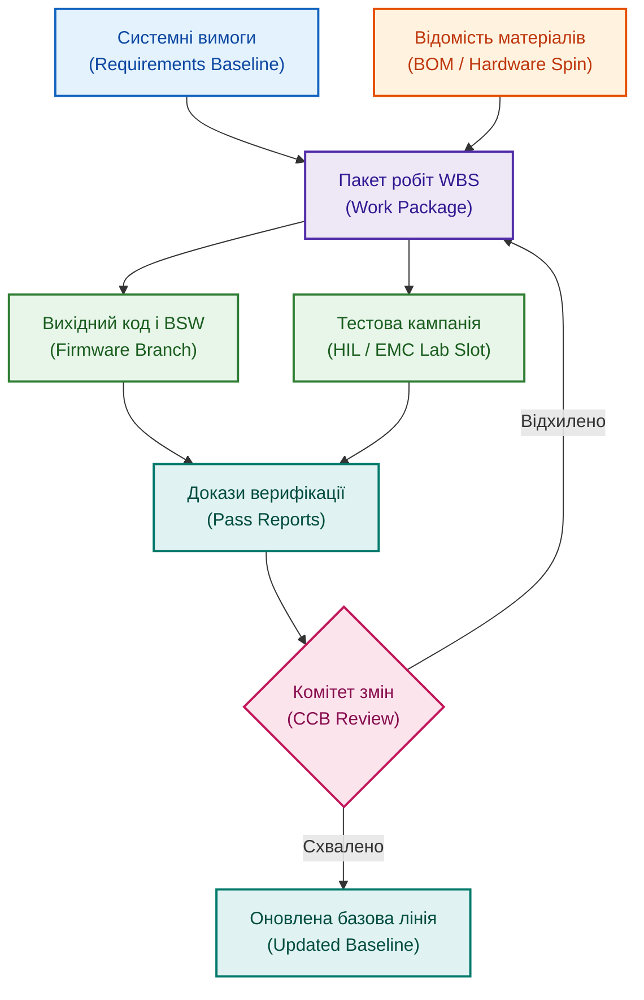

# Чому ієрархічна структура робіт (WBS) у великих апаратно-програмних проєктах стає болем

**Автор:** [Микола Федчик (Mykola Fedchyk)](book/about-the-author.md) · [LinkedIn](https://www.linkedin.com/in/nickfedchik/) · [GitHub](https://github.com/nick-fedchik)

---

## Вступ

**Мета статті:** розкрити системні причини кризи класичної ієрархічної структури робіт (WBS) у складних апаратно-програмних програмах та надати практичну методику її адаптації через динамічне зв'язування з вимогами, відомостями матеріалів, тестовими лабораторіями та базовими лініями.

**Технологічна проблема, яка вирішується:** у проєктах із тривалими циклами створення заліза та швидкими циклами програмування деталізований графік WBS на сотні рядків швидко втрачає зв'язок із реальністю. Затримка постачання мікросхеми, ревізія друкованої плати чи уточнення нормативу безпеки вимагають постійного ручного оновлення плану. Стаття демонструє, як трансформувати статичний графік у машинно-перевірну модель робіт, захищену від розриву контексту.

---

## Призначення ієрархічної структури робіт та межі її застосування

Ієрархічна декомпозиція робіт покликана впорядкувати повний обсяг завдань проєкту, проте у відриві від інженерних фактів вона перетворюється на самоціль.

Якісна ієрархічна структура робіт (WBS, *Work Breakdown Structure*) розкладає складну ціль на керовані робочі пакети (*work packages*). Вона допомагає чітко відповісти на питання: які кінцеві результати (*deliverables*) мають бути створені, хто призначений відповідальним власником, де проходить критичний шлях (*critical path*), які задачі можна виконувати паралельно та які ресурси необхідні. На етапі старту WBS є незамінним інструментом вирівнювання очікувань між керівництвом, розробниками апаратури, програмістами, тестувальниками та постачальниками.

Проблема виникає тоді, коли план сприймається як непорушний гранітний моноліт, а не як динамічна модель діяльності. Будь-яка модель швидко застаріває, якщо вона не отримує зворотного зв'язку від реальних подій інженерного процесу: затримок виготовлення плат, виявлених дефектів та змін стандартів.

WBS має фіксувати інтерфейси передачі результатів між підрозділами, а не регламентувати погодинну активність кожного окремого інженера.

*Графік WBS є лише одним із переглядів моделі: він має бути нерозривно пов'язаний із вимогами, апаратними зразками, тестами та базовими версіями.*

## Чому апаратно-програмні розробки ламають класичні плани

Різниця в темпах модифікації програмного коду та виготовлення фізичних компонентів створює непереборні складнощі для традиційного календарного планування.

У суто програмному проєкті зміни вимог компенсуються гнучкими практиками: невиконані задачі повертаються в беклог, реліз відкладається на наступний спринт, а знайдена помилка закривається терміновим патчем. В апаратно-програмній програмі діють незворотні фізичні обмеження. Виготовлення нової ревізії друкованої плати (*board spin*) потребує щонайменше 4–6 тижнів, доставка дефіцитного контролера від постачальника (*lead time*) може тривати кілька місяців, а спеціалізована безлунна камера для випробувань на електромагнітну сумісність (EMC) бронюється за пів року наперед.

Кожна непередбачена зміна схеми чи затримка партії процесорів миттєво робить недійсними десятки залежних завдань у WBS. Якщо графік робіт не інтегрований із даними постачальників та лабораторій, проєктний менеджер змушений вручну розплутувати вузли залежностей.

Спроба керувати фізичним залізом за допомогою правил гнучкої веб-розробки призводить до втрати контролю над реальними строками здачі продукту.

## Математичне моделювання невизначеності на критичному шляху (PERT)

Для формування реалістичного графіка WBS інженерні оцінки тривалості операцій повинні враховувати асиметрію ризиків фізичного світу за допомогою триточкового оцінювання.

Традиційне детерміноване планування спирається на одну цифру тривалості задачі, що гарантує помилку в умовах дослідницької невизначеності. Метод PERT (*Program Evaluation and Review Technique*) моделює тривалість кожної операції $i$ на критичному шляху через бета-розподіл із використанням трьох оцінок: оптимістичної $t_{o,i}$, найбільш імовірної $t_{m,i}$ та песимістичної $t_{p,i}$.

Математичне сподівання тривалості задачі $\mu_i$ та дисперсія $\sigma_i^2$ обчислюються за формулами:

$$\mu_i = \frac{t_{o,i} + 4 t_{m,i} + t_{p,i}}{6}, \quad \sigma_i^2 = \left(\frac{t_{p,i} - t_{o,i}}{6}\right)^2$$

Для всього критичного шляху $\text{CP}$, що складається з послідовності незалежних задач, сумарне очікуване значення $\mu_{\text{CP}}$ та стандартне відхилення $\sigma_{\text{CP}}$ становлять:

$$\mu_{\text{CP}} = \sum_{i \in \text{CP}} \mu_i, \quad \sigma_{\text{CP}} = \sqrt{\sum_{i \in \text{CP}} \sigma_i^2}$$

**Тут:**
- $\mu_{\text{CP}}$ є математичним сподіванням сумарної тривалості критичного шляху (у календарних днях або тижнях).
- $\sigma_{\text{CP}}$ є стандартним відхиленням сумарної тривалості критичного шляху (у днях або тижнях).
- $t_{o,i}$ є оптимістичною оцінкою тривалості операції $i$ за ідеальних умов (додатне дійсне число).
- $t_{m,i}$ є найбільш імовірною тривалістю операції $i$ за нормального перебігу робіт (додатне дійсне число).
- $t_{p,i}$ є песимістичною тривалістю операції $i$ за настання всіх технічних та логістичних ризиків (додатне дійсне число).
- $\text{CP}$ є множиною задач, що утворюють критичний шлях проєкту.

**Практичний приклад розрахунку:**
Розглянемо виготовлення та сертифікацію нової плати блоку керування, де критичний шлях складається з трьох етапів:
1. Монтаж дослідної партії: $t_{o,1} = 10, t_{m,1} = 12, t_{p,1} = 26$ днів.
   $$\mu_1 = \frac{10 + 4 \cdot 12 + 26}{6} = \frac{84}{6} = 14 \text{ днів}, \quad \sigma_1 = \frac{26 - 10}{6} = 2{,}67 \text{ днів}$$
2. Первинна прошивка та налагодження BSW: $t_{o,2} = 5, t_{m,2} = 8, t_{p,2} = 17$ днів.
   $$\mu_2 = \frac{5 + 4 \cdot 8 + 17}{6} = \frac{54}{6} = 9 \text{ днів}, \quad \sigma_2 = \frac{17 - 5}{6} = 2{,}0 \text{ днів}$$
3. Випробування на електромагнітну сумісність: $t_{o,3} = 4, t_{m,3} = 5, t_{p,3} = 12$ днів.
   $$\mu_3 = \frac{4 + 4 \cdot 5 + 12}{6} = \frac{36}{6} = 6 \text{ днів}, \quad \sigma_3 = \frac{12 - 4}{6} = 1{,}33 \text{ днів}$$

Загальне очікуване значення та стандартне відхилення критичного шляху:

$$\mu_{\text{CP}} = 14 + 9 + 6 = 29 \text{ днів}$$

$$\sigma_{\text{CP}} = \sqrt{2{,}67^2 + 2{,}0^2 + 1{,}33^2} = \sqrt{7{,}13 + 4{,}0 + 1{,}77} = \sqrt{12{,}9} \approx 3{,}59 \text{ днів}$$

Щоб гарантувати завершення етапу з довірчою ймовірністю 95% (коефіцієнт $Z \approx 1{,}65$ для нормального розподілу), проектний буфер має становити:

$$T_{95\%} = \mu_{\text{CP}} + 1{,}65 \cdot \sigma_{\text{CP}} = 29 + 1{,}65 \cdot 3{,}59 \approx 29 + 5{,}92 \approx 35 \text{ днів}$$

Якщо керівник запланує на цей ланцюг лише 25 днів (проста сума найбільш імовірних оцінок $12 + 8 + 5 = 25$), проєкт зірве терміни з імовірністю понад 85%. Математичний розрахунок доводить: плановий строк зобов'язаний спиратися на дисперсію ризиків, а не на оптимістичні сподівання.

## Складність підтримки монолітних календарних планів

Використання важких інструментів планування часто створює додатковий адміністративний тягар замість реальної допомоги інженерам.

Багато керівників проєктів стикалися з планами на 500 і більше рядків у MS Project чи подібних програмах: складні ієрархії, численні типи зв'язків, календарі ресурсів, обмеження дат та призначені відсотки виконання. На старті це виглядає потужно, проте за частих технічних змін вирівнювання завантаження ресурсів (*resource leveling*) та зміщення однієї віхи запускають неконтрольований каскад перерахунку всього графіка. Керівник витрачає години на ручне виправлення штучних конфліктів у файлі.

Причина полягає в тому, що традиційний інструмент планування ізольований від повсякденного інженерного життя. Він фіксує лише дати й тривалості, але не знає, що нічний тест у CI/CD провалився, постачальник попередив про брак компонентів, а системний архітектор змінив конфігурацію виводів мікроконтролера.

План повинен автоматично підживлюватися сигналами з репозиторіїв та тестових систем, інакше він стає застарілим у день його затвердження.

## Базові лінії: чому виникає небезпечне роздвоєння планів

Формальна фіксація базової лінії графіка часто призводить до виникнення двох паралельних реальностей всередині команди.

Базова версія плану (*Baseline*) є критично необхідною для контролю бюджету та термінів: вона захищає проєкт від хаотичних змін. Проте якщо кожне коригування дати вимагає тривалого узгодження на раді контролю змін (*Change Control Board*, CCB) з підготовкою десятків слайдів презентацій, інженери та менеджери починають уникати офіційних процедур. У результаті виникає небезпечне явище подвійного планування: існує офіційний графік для вищого керівництва, де все зафарбовано зеленим, і реальний внутрішній розклад у нотатках тімліда, де затримка вже перевищує місяць.

Це створює системний ризик для підприємства: керівництво приймає стратегічні зобов'язання перед клієнтами на основі застарілого базового плану, тоді як технічна команда вже знає про неминучий зрив термінів.

Здорова дисципліна вимагає автоматизованого формування пакета впливу зміни: система має миттєво генерувати аналітику для комітету змін, показуючи зачеплені вимоги, договори та бюджети, що скорочує час ухвалення рішення з тижнів до годин.

## Машинно-перевірна структура робіт: зв'язок із цифровою ниткою

Щоб декомпозиція робіт залишалася живим інструментом, кожен її елемент повинен мати машинно-перевірні зв'язки з інженерними даними.

Кожен робочий пакет у структурі робіт повинен містити не просто назву, а унікальний ідентифікатор, призначеного власника, посилання на вимоги, перелік очікуваних артефактів та критерії готовності (*Definition of Done*). Наприклад, робочий пакет зі створення драйвера периферії зв'язується з технічною специфікацією, документом опису регістрів чипа, ревізією плати, тестовими сценаріями на стенді HIL та звітом про статичний аналіз коду.

Якщо постачальник передає нову ревізію кремнієвого кристала з виправленням апаратних помилок (*errata*), система автоматично знаходить пов'язані пакети робіт у WBS, визначає перелік тестів, які необхідно повторити, та перевіряє, чи не зміститься дата сертифікації.

Машинно-зчитувана структура робіт звільняє керівника від ручної перевірки зв'язків і перетворює WBS на аналітичну базу даних інженерного стану розробки.

## Практичні рекомендації: хвильове планування та баланс деталізації

Надмірна деталізація довгострокових завдань є однією з найпоширеніших помилок під час складання ієрархічної структури робіт.

Спроба детально розписати на 18 місяців уперед щотижневі задачі розробників мікропрограм створює ілюзію контролю, але на практиці генерує величезні витрати на перепланування. Досвідчені інженерні лідери застосовують принцип хвильового планування (*Rolling-Wave Planning*):
1. **Горизонт 4–8 тижнів:** максимальна деталізація до рівня окремих інженерних задач тривалістю від кількох днів до двох тижнів із чіткими критеріями приймання та призначеними виконавцями.
2. **Горизонт одного кварталу:** декомпозиція до рівня інтегрованих робочих пакетів із визначеними інтерфейсами, очікуваними артефактами та оціненими залежностями між командами.
3. **Дальній горизонт (до завершення проєкту):** планування на рівні великих віх, фаз розробки, цільових показників вартості та зафіксованих архітектурних припущень.

Коли чергова фаза наближається, її пакети робіт деталізуються на основі уточнених інженерних фактів. Такий підхід об'єктивно враховує наявність невизначеності й запобігає марнуванню часу на моделювання невідомого майбутнього.

## Роль штучного інтелекту в аналізі структури робіт

Алгоритми штучного інтелекту здатні взяти на себе рутинний моніторинг цілісності графіка робіт за умови заземлення на цифрову нитку.

Локальний асистент може автоматично виконувати аудит розкладу: виявляти пакети робіт без призначеного власника, знаходити задачі на критичному шляху без визначених критеріїв приймання, підсвічувати розриви зв'язків після оновлення вимог та формувати проєкт обґрунтування для ради контролю змін. Під час затримки постачання асистент порівнює кілька альтернативних сценаріїв: зміщення віхи, скорочення другорядного обсягу робіт або паралельне тестування на емуляторах.

При цьому штучний інтелект не повинен автоматично модифікувати затверджені базові версії. План проєкту є контрактним зобов'язанням команди, тому остаточна оцінка компромісів і затвердження рішень завжди залишаються виключною відповідальністю керівника.

---

## Висновки

1. Ієрархічна структура робіт (WBS) є ефективним інструментом структурування зобов'язань, але перетворюється на бюрократичний баласт, якщо ведеться у відриві від інженерних артефактів.
2. Фізичні обмеження виробництва електроніки та механіки диктують жорсткі часові рамки, які унеможливлюють управління розробкою заліза за правилами гнучких двотижневих спринтів.
3. Оцінка тривалості операцій на критичному шляху повинна спиратися на математичний апарат триточкового оцінювання PERT із обов'язковим розрахунком дисперсії ризиків для захисту від каскадних затримок.
4. Щоб уникнути роздвоєння реальності на офіційний та тіньовий плани, процедура аналізу та затвердження змін базової лінії має бути максимально автоматизована через інструменти цифрової нитки.
5. Застосування хвильового планування (Rolling-Wave Planning) дозволяє досягти оптимального балансу між короткостроковою деталізацією завдань і довгостроковою гнучкістю архітектурних рішень.

---

## Посилання

1. ISO 21511:2018. *Work breakdown structures for project and programme management*. International Organization for Standardization, Geneva, Switzerland. [https://www.iso.org/standard/74705.html](https://www.iso.org/standard/74705.html)
2. ISO 21502:2020. *Project, programme and portfolio management — Guidance on project management*. International Organization for Standardization, Geneva, Switzerland. [https://www.iso.org/standard/74947.html](https://www.iso.org/standard/74947.html)
3. Project Management Institute. *Practice Standard for Work Breakdown Structures*. 3rd Edition. PMI, Newtown Square, PA, 2019.
4. Malcolm, D. G., Roseboom, J. H., Clark, C. E., Fazar, W. *Application of a Technique for Research and Development Program Evaluation (PERT)*. Operations Research, 7(5), 646–669, 1959. [https://doi.org/10.1287/opre.7.5.646](https://doi.org/10.1287/opre.7.5.646)
5. Kerzner, H. *Project Management: A Systems Approach to Planning, Scheduling, and Controlling*. 13th Edition. John Wiley & Sons, 2022.

---

## Терміни

- **Базова лінія графіка (Schedule Baseline)**: офіційно затверджена версія календарного графіка проєкту, яка змінюється лише через формальну процедуру ради контролю змін і слугує основою для вимірювання відхилень.
- **Вирівнювання ресурсів (Resource Leveling)**: техніка оптимізації розкладу, за якої дати початку та завершення задач коригуються для усунення перевантаження призначених фахівців або обладнання.
- **Ієрархічна структура робіт (Work Breakdown Structure, WBS)**: орієнтована на результат ієрархічна декомпозиція загального обсягу робіт проєкту на менші, керовані компоненти.
- **Критичний шлях (Critical Path)**: найдовша за тривалістю послідовність залежних завдань від початку до завершення проєкту, затримка будь-якої з яких безпосередньо відкладає дату фіналу.
- **Пакет робіт (Work Package)**: найнижчий рівень декомпозиції у структурі робіт, для якого призначається відповідальний виконавець, розраховується бюджет і визначаються кінцеві артефакти.
- **Рада контролю змін (Change Control Board, CCB)**: колегіальний орган проєкту, уповноважений розглядати пропозиції щодо змін базових версій і оцінювати їхній технічний і фінансовий вплив.
- **Хвильове планування (Rolling-Wave Planning)**: техніка ітеративного планування, за якої найближчі роботи плануються детально, а майбутні етапи залишаються на вищому рівні узагальнення.

---

## Скорочення

- **ADR**: Architecture Decision Record (журнал архітектурних рішень)
- **BOM**: Bill of Materials (відомість матеріалів)
- **BSW**: Basic Software (базове програмне забезпечення)
- **CCB**: Change Control Board (рада контролю змін)
- **EMC**: Electromagnetic Compatibility (електромагнітна сумісність)
- **HIL**: Hardware-in-the-Loop (апаратно-програмне моделювання на фізичному стенді)
- **PERT**: Program Evaluation and Review Technique (метод оцінки та перегляду програм)
- **WBS**: Work Breakdown Structure (ієрархічна структура робіт)

---

## Про автора

**Микола Федчик (Mykola Fedchyk)**: український інженер, системний архітектор та дослідник у галузі кіберфізичних комплексів, доказового штучного інтелекту та критичних вбудованих систем. Понад двадцять років керує інженерними розробками та проєктуванням складних апаратно-програмних комплексів у сфері мережевої безпеки, телекомунікацій та автомобільної електроніки відповідно до вимог міжнародних стандартів ISO 26262 та ISO/SAE 21434. Досліджує практичне застосування експертних систем, семантичних онтологій та цифрової нитки для управління складними інженерними програмами.

Детальніша інформація: [Про автора](book/about-the-author.md) · [LinkedIn](https://www.linkedin.com/in/nickfedchik/) · [GitHub](https://github.com/nick-fedchik)
