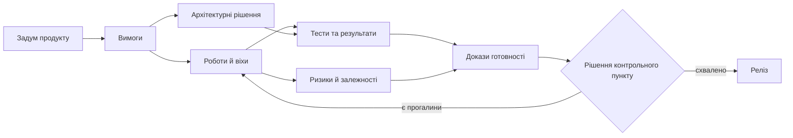
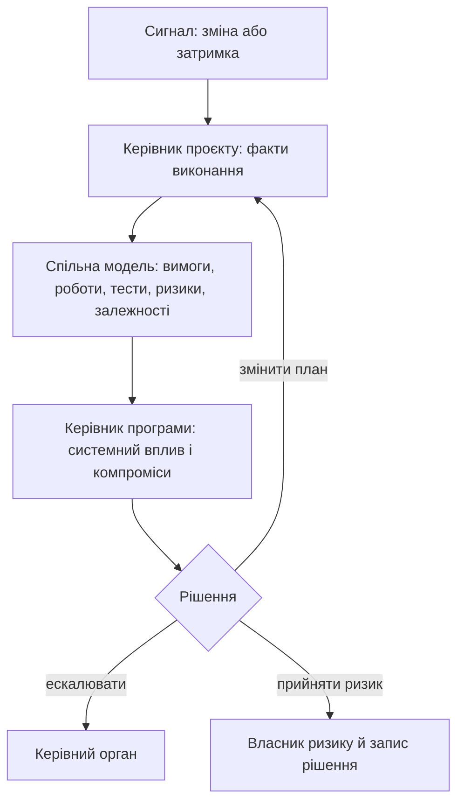
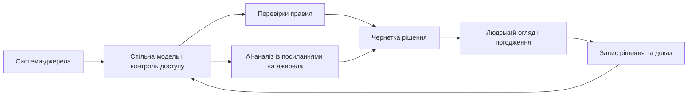
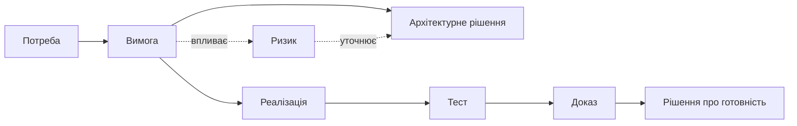

# Система управління складними інженерними проєктами: контекст, зв’язки та рішення

Коли перед контрольним пунктом команда не може швидко показати, як зміна вимоги впливає на роботи, тести, постачання, ризики та погодження, проблема не в нестачі ще одного звіту. Факти про продукт розійшлися між інструментами й перестали утворювати пояснюваний контекст. Для складного апаратно-програмного виробу така втрата зв’язків перетворює навіть «зелений» статус на припущення.

Ця стаття поєднує практичну модель управління проєктом і програмою, архітектуру спільних даних, цифрову нитку простежуваності та обережне застосування AI. Центральна теза проста: система управління має не збирати статуси, а допомагати людям відтворити підстави рішення, побачити наслідок зміни й призначити наступну дію.

Спершу розмежуємо горизонти проєкту, програми й портфеля. Далі розглянемо спільні артефакти, модель даних і цифрову нитку; лише після цього — автоматизацію та AI. Такий порядок важливий: модель не може надійно пояснювати те, для чого немає визначених об’єктів, версій, прав доступу й доказів.

## Від статусів до спільної моделі

Уявімо типову ситуацію перед релізом: команда бачить «зелений» план, але не може за пів години відповісти, чи зміна вимоги зачепила тести, постачання, ризики й потрібні погодження. Дані існують, проте розкладені між трекером задач, репозиторієм коду, системою вимог, таблицями та чатами. Це вже не проблема одного звіту — це втрата керованого контексту.

Системи управління проєктами давно перестали бути лише дошками задач і календарями. Для складних інженерних продуктів, особливо апаратно-програмних програм, вони мають поєднувати планування, вимоги, архітектурні рішення, ризики, залежності, докази виконання, відповідність вимогам, AI-асистентів і формальні правила. Інакше проєктний менеджмент лишається набором інструментів, а не системою прийняття рішень.

У багатьох компаніях ситуація знайома: backlog в одному інструменті, code в іншому, requirements у третьому, tests у четвертому, risks у таблиці, status у презентації, а частина decisions у chat history. Коли команда невелика, це ще працює. Коли продукт має кілька підсистем, supplier-ів, safety/security вимоги, regulatory audits і багаторічний lifecycle, звичайний task tracker перестає відповідати на головні питання.

Чи достатньо evidence для release? Які requirements зачеплені зміною? Які dependencies блокують інші teams? Чи зростає programme risk? Чому саме було прийнято technical decision? Як product priority вплине на architecture, testing, schedule і compliance scope? Якщо відповідь на кожне питання треба збирати вручну, система ще не зріла.

## Проєкт і програма мають різні горизонти

Project manager відповідає за delivery конкретного result. Його фокус - scope, team, plan, schedule, capacity, tasks, risks, changes, quality, communication. Programme manager працює з кількома проектами, які разом мають дати strategic outcome. Його фокус - cross-project dependencies, integration, shared risks, benefits, programme gates, release trains, resource conflicts і decisions на вищому рівні.

Це різні ролі. Project manager питає: чи ця команда доставить затверджений scope? Programme manager питає: чи всі частини разом дадуть потрібний результат? Саме тому programme management не можна замінити агрегацією project status reports.

Кілька проєктів можуть виглядати «зеленими» окремо, але разом створити критичний ризик для програми. Апаратний результат затримався на два дні, збірка прошивки не потрапила в інтеграційне вікно, втрачено слот лабораторії, не надійшов документ постачальника. Жоден окремий статус не пояснює системний ризик повністю.

Для термінології корисно орієнтуватися на серію ISO 21500: ISO 21502:2020 описує практики управління проєктом, а ISO 21503:2022 — поняття, передумови й практики управління програмою. Це не рецепти конкретного інструменту, а спільна мова для ролей і рішень.

## Спільні артефакти замість нескінченних статус-зустрічей

Здорова взаємодія PM і PgM будується не на тому, що всі частіше зустрічаються. Вона будується на shared artifacts: dependency map, programme risk register, gate criteria, decision records, RACI, traceability, escalation path.

Керівник проєкту приносить факти: стан виконання, блокери, ризики, потреби в ресурсах, зміни вимог, тести, дефекти й докази. Керівник програми повертає контекст: пріоритети програми, міжпроєктні залежності, рішення керівного органу, зміни дорожньої карти та стратегічні компроміси.

Якщо ця взаємодія тримається тільки на meetings, організація платить часом. Якщо вона тримається на operational memory системи, meetings стають коротшими і змістовнішими.

*Діаграма показує не послідовність «раз і назавжди», а зв'язки, які система має вміти пояснити під час зміни або контрольного пункту.*

## Особливості апаратно-програмного продукту

Software-only project може швидше змінювати scope, release cadence і implementation plan. Hardware/software programme має фізичні constraints: component lead time, board spin, prototype batch, lab availability, supplier delivery, firmware dependency, certification window, test equipment booking, environmental tests, EMC tests, safety reviews, cybersecurity assessment, production readiness.

Такий продукт живе не тільки в tasks. Він живе в BOM, schematics, PCB revisions, mechanical constraints, firmware branches, calibration data, test benches, lab measurements, supplier notices, manufacturing feedback, field returns і safety/security evidence.

Якщо system of management бачить тільки tasks, вона втрачає половину реальності. Наприклад, task може бути on track, але потрібний hardware sample не приїхав. Test campaign може бути запланована, але fixture не ready. Firmware готовий, але register map змінився. Це не "деталі", це schedule і risk.

## Керування планом і змінами

Детальний WBS для багаторічного проекту корисний, але небезпечний, якщо живе окремо від engineering reality. На старті програми сотні rows, dependencies, durations і milestones дають відчуття control. Через кілька місяців змінюються components, architecture, supplier dates, lab schedule, requirements або cybersecurity impact. План починає вимагати постійного ручного обслуговування.

Якщо WBS уже став baseline, його не можна тихо поправити. Зміна має пройти Change Control Board, impact analysis, resource review, stakeholder communication. Це правильно, але тільки якщо система допомагає. Якщо PM мусить вручну збирати affected requirements, tests, suppliers і risks, governance стає важкою ношею.

Інтегрована система має пов'язувати WBS, milestones, dependencies, risks, requirements, tests, suppliers і evidence. Зміна milestone має одразу показати impacted objects і підготувати draft change package.

## Інструменти: сильні, але фрагментовані

Ринок інструментів великий. Jira, YouTrack, Azure DevOps, GitLab Issues і GitHub Issues сильні як task/backlog trackers. GitLab і GitHub дають близький до code контур: repositories, code review, CI/CD, security scanning, releases. Confluence, SharePoint, Notion і wiki зберігають documents. Polarion, DOORS Next, Jama Connect, codeBeamer сильні у requirements, baselines і traceability. TestRail, Zephyr, Xray закривають testing. Aha!, Productboard, Jira Product Discovery допомагають product management. MS Project, Smartsheet, Planview, Planisware, Clarity дивляться на planning, portfolio і reporting.

Проблема не в тому, що ці systems погані. Проблема в межах. Requirement тут, code там, test в іншому місці, risk у таблиці, decision у листуванні, explanation у голові людини. Складний product живе між системами, а саме там найменше automation.

## Модель предметної області як основа

Сучасна project/programme system має починатися з domain model. Вона має розуміти project, programme, portfolio, product requirement, stakeholder requirement, system requirement, work product, risk, dependency, decision, baseline, test evidence, release, role, approval, audit trail.

Ключова вимога — простежуваність. Бізнес-ціль або продуктова вимога має вести до вимог зацікавлених сторін, системних, програмних та апаратних вимог, архітектурних рішень, задач, запитів на злиття, тестів, дефектів, ризиків, погоджень і доказів готовності до релізу. Не кожному проєкту потрібні всі ці ланки, але для обраного контуру вони мають бути явними. Інакше аудит і перевірка готовності до релізу перетворюються на ручну реконструкцію.

Потрібні baselines і versioning. Стан проекту на момент gate review або release candidate має бути відтворюваним. Якщо requirement змінився через два місяці, система має показати, що було approved тоді.

Потрібна integration architecture: APIs, webhooks, event streams, schema versioning, idempotency, audit logs, access control. Нова система не замінить усі tools. Вона має зв'язати їх.

## Підтримка рішень замість звітності

Reporting відповідає на питання "що сталося". Decision support допомагає з питаннями "що буде, якщо", "які alternatives", "які trade-offs", "які assumptions", "який confidence". Для programme management це критично: зміна одного milestone може зачепити supplier delivery, compliance gates, lab booking, release train і customer commitment.

Metrics теж мають бути signals for action, а не картинки для report. Якщо defect trend погіршився, coverage впав, critical resource перевантажений, supplier затримує delivery або requirements накопичуються без review, система має не чекати кінця тижня. Вона має показати impact, owner-а і possible actions.

## AI-асистент корисний лише в керованому контексті

AI Assistant у такій системі не має бути просто chat поруч із backlog. Найбільша цінність з'являється, коли AI працює в context конкретного artifact, role і workflow.

Для PM він може підсумувати status із tasks, merge requests, tests і risks; знайти tasks без owner; виявити discrepancies між roadmap і execution; підготувати draft status report with sources. Для PgM - знайти cross-project dependencies, systemic risks, release scenarios, gate review gaps. Для engineers - пояснити requirement history, знайти related defects and tests, підготувати impact analysis або draft ADR.

Але рекомендації AI мають бути придатними до перевірки: з джерелами, версіями, припущеннями, рівнем упевненості й обмеженнями. «AI так сказав» не є доказом. Добрий результат AI — це структурована чернетка для людського рішення, а не саме рішення. Такий підхід узгоджується з профілем NIST для генеративного AI: ризики треба керувати протягом життєвого циклу, а не оцінювати лише після появи помилки.

## Мовні моделі, локальне розгортання й експертні правила

LLM добре працює з language, summary, explanation. Але вона потребує керованого context: retrieval, access control, prompt logs, model version, source links, separation of facts and assumptions, human approval.

Для confidential engineering потрібні різні modes: cloud LLM для low-risk tasks, private deployment, local models, air-gapped inference, hybrid routing, data redaction, sensitivity labels, project compartments. Для defense-related, automotive, aviation, MedTech або semiconductor дані не завжди можуть покидати controlled perimeter.

Там, де потрібні formal checks, LLM недостатньо. Expert systems можуть тримати rules, facts, domain model, inference, explanations, conflict detection, case-based reasoning. Hybrid approach виглядає найперспективніше: LLM працює з текстом і неструктурованими sources, expert rules перевіряють traceability, gates, missing evidence і conflicts.

## Докази мають виникати в процесі роботи

У regulated domains compliance має виникати з роботи, а не збиратися після. Review records, approvals, test runs, trace updates, risk decisions, release notes, security scan results і change history мають формувати evidence chain у процесі.

Тоді audit package не збирається в останній момент. Release readiness не залежить від ручного optimism. Safety, cybersecurity, QA, requirements і systems engineering бачать свої gaps у реальному context.

Engineers теж отримують користь. Software engineer бачить, яка requirement стоїть за change. QA отримує risk-based testing. Systems engineer бачить duplicates і conflicts. Safety бачить link між hazards і evidence. Cybersecurity бачить assets, threats, mitigations і release decisions. Hardware/embedded бачать board revisions, firmware, errata, lab measurements і integration risks.

Система перестає бути місцем, куди люди здають status. Вона починає повертати їм context.

## Перші кроки без великого переписування

Не обов'язково одразу будувати нову платформу. Можна почати з integration layer для кількох критичних links: requirement -> task -> test -> defect -> release gate. Потім додати dependency map для programme level. Потім зробити release readiness view, який не дозволяє сховати missing evidence за green status.

Важливо вибирати workflow, де користь відчують і managers, і engineers. Якщо система лише додає поля для PMO, її обходитимуть. Якщо вона допомагає швидше знайти impacted tests, пояснити delay, підготувати gate package або уникнути повторної помилки, adoption буде природнішим.

## Висновок: система має повертати контекст

Сучасна система project і programme management - це не один mega-tool і не ще один dashboard. Це інтегрований operational layer між product intent, engineering reality, evidence, risks, dependencies і decisions.

Її цінність у тому, що вона зменшує ручну реконструкцію context. PM і PgM отримують більше часу на decisions. Engineers отримують кращий context. PMO отримує governance, вбудовану в workflow. Leadership отримує не traffic lights, а trade-offs and evidence.

AI має бути частиною цієї системи, але не її заміною. Там, де потрібна мова, AI пояснює. Там, де потрібні rules, працюють expert systems. Там, де потрібне decision, відповідальність лишається за людьми.

Тепер можна чіткіше сформулювати мінімальний результат: керівник та інженер мають бачити не лише статус, а й підстави для нього, вплив зміни та наступне відповідальне рішення. Це не означає побудувати «мегаінструмент». Часто достатньо почати з одного ланцюга — вимога → робота → тест → доказ → рішення контрольного пункту — і зробити його надійним.

## Зв’язок плану з інженерною реальністю

Перед важливою віхою команда часто бачить десятки «зелених» карток, але не може швидко відповісти на просте запитання: що саме зірветься, якщо постачальник запізниться на тиждень? Відповідь розкидана між беклогом, кодом, вимогами, тестами, планом, журналом ризиків і листуванням. Кожен інструмент може бути добрим у своїй ролі, але реальний стан проєкту губиться між ними.

У складних інженерних проєктах управління рідко живе в одному місці. Беклог може бути в Jira або Azure DevOps, код — у GitLab чи GitHub, вимоги — у Polarion або DOORS, тести — в окремій системі, WBS — у MS Project, ризики — у таблиці, а рішення й частина контексту — у пошті або чатах. Проблема не в самих інструментах, а у відсутності надійних зв'язків між їхніми фактами.

Ця стаття - перша частина розмови про біль сьогоднішнього проєктного і програмного управління. Особливо в апаратно-програмних продуктах, де є вбудована розробка, тестові лабораторії, постачальники, сертифікація, аудит, функціональна безпека, кібербезпека і багаторічні плани.

Трекер задач показує, хто що робить. Але складніші питання звучать інакше: чи закрита вимога? Чи є докази перевірки? Чи змінився ризик після невдалих тестів? Чи готовий релізний контрольний пункт? Чи впливає перенесення віхи на бронювання лабораторії? Чи всі зацікавлені сторони знають про зміну базової версії? Саме тут звичайний набір інструментів тріщить.

Це не абстрактна критика інструментів. Я бачив цю проблему з різних ролей: розробника, системного інженера, керівника розробки, менеджера доставки, продуктового менеджера, керівника проєкту і керівника інженерних команд. У веб-платформах, фінансових системах, медіапродуктах, логістиці, електронній комерції й автомобільній розробці вбудованих систем проблема повторюється по-різному, але суть одна: реальний стан складного проєкту часто живе між інструментами, людьми й неформальною пам'яттю організації.

## Керівник проєкту і керівник програми

Керівник проєкту дивиться на конкретний проєкт: обсяг робіт, команда, строки, бюджет або доступна спроможність, задачі, ризики, блокери, якість, постачання результату. Його базове питання: чи можемо ми доставити цей результат у прийнятний спосіб?

Керівник програми дивиться ширше. Програма може містити кілька проєктів, які разом дають бізнес-результат, можливість продукту або стратегічну перевагу. Тут важливі міжпроєктні залежності, інтеграційні події, спільні ризики, релізні потоки, очікувана користь, ресурси і рішення на рівні всієї програми.

В автомобільній розробці це може бути програма нової ECU або функції автомобіля: один проєкт веде ревізію апаратної плати, другий - embedded-прошивку і BSW, третій - хмарну або серверну інтеграцію, четвертий - HIL/SIL-перевірку, докази функціональної безпеки і кібербезпеки. У MilTech це може бути програма складного апаратно-програмного комплексу: окремо йдуть електроніка, embedded-ПЗ, наземний застосунок, захищений зв'язок, польові випробування, ланцюг постачання і кваліфікація. Кожен проєкт має свій план, але цінність з'являється тільки тоді, коли все інтегрується в одну працездатну спроможність.

Програмне управління не складається з пачки статусних звітів. Якщо три проєкти локально зелені, програма все одно може бути червоною. Один результат залежить від ревізії плати, другий від складання прошивки, третій від доступності лабораторії. Кожна команда окремо може бути майже права, але інтеграційне вікно усе одно буде втрачено.

## Взаємодія керівників проєктів і програм

У здоровій моделі керівник проєкту приносить у контур програми факти: що зроблено, що заблоковано, де ризик, які ресурси потрібні, що змінилося у вимогах, тестах, дефектах або релізному плані. Керівник програми повертає контекст: які пріоритети програми, які залежності від інших проєктів, де потрібна ескалація, які рішення прийняв керівний комітет, що змінилося в плані розвитку.

На практиці ця взаємодія часто тримається на зустрічах і ручних звітах. PM оновлює дошку задач. Потім окремо журнал ризиків. Потім презентацію зі статусом. Потім ще раз пояснює це на огляді програми. PgM консолідує, уточнює, шукає пропущені залежності. Усі працюють багато, але система все одно не має єдиної робочої пам'яті.

Я неодноразово стикався з тим, що одного статусного звіту майже ніколи не вистачає, щоб зрозуміти реальний стан складного проєкту. Доводиться йти в задачі, вимоги, merge request-и, тести, дефекти, коментарі, рішення і людей. Тільки після цього з'являється відчуття, що ти бачиш картину. І спіткався з протилежними випадками, коли детальний багатосторінковий статусний звіт регулярно публікувався, але його ніхто уважно не читав.

*Цикл не замінює розмову людей: він робить її предметною, бо кожне рішення повертається до видимих фактів і відповідального власника.*

## Апаратно-програмні продукти болять сильніше

У суто програмному проєкті ще можна швидко змінити беклог, перенести спринт, випустити патч, відкотити зміни або зробити термінове виправлення. В апаратно-програмній програмі все важче. Тут є строки постачання компонентів, нова ревізія плати, партія прототипів, доступність лабораторії, тестове обладнання, поставка від постачальника, залежності прошивки, EMC-тести, кліматичні та механічні випробування, огляд функціональної безпеки, оцінка кібербезпеки і готовність до виробництва.

Такий проєкт розмазаний по значно ширшій картині: BOM, схемах, ревізіях PCB, механічних обмеженнях, гілках прошивки, калібрувальних даних, тестових стендах, повідомленнях постачальника, лабораторних вимірюваннях і відгуках із поля. Якщо система управління бачить тільки задачі, вона бачить тінь проєкту, а не проєкт.

Найболючіше це проявляється у залежностях. Задача може йти за планом, але апаратний зразок не приїхав. Гілка прошивки може бути готовою, але ревізія плати має errata. Лабораторію може бути заброньовано, але тестове оснащення не готове. Це не дрібні деталі. Це реальний графік і реальний ризик.

## Структура робіт і реальний стан виконання

Структура декомпозиції робіт (WBS) на старті великого проєкту виглядає привабливо. Можна розкласти роботу на сотні або тисячі рядків, поставити залежності, ресурси, дати, віхи і передачі між командами. Для керівництва це дає відчуття контролю.

Потім приходить інженерна реальність. Змінюється компонент. Постачальник переносить дату. Архітектура уточнюється. Тестова стратегія змінюється. Лабораторія доступна не тоді, коли планувалося. Замовник уточнює вимогу. З'являється новий вплив на функціональну безпеку або кібербезпеку.

WBS сам по собі не ворог. Небезпека з'являється тоді, коли він відривається від вимог, ризиків, тестів, постачальників, віх і інженерних подій. Якщо WBS живе окремо, PM постійно обслуговує план замість того, щоб керувати проєктом. А якщо WBS уже став базовою версією плану, кожна зміна потребує аналізу впливу, комітету з керування змінами (CCB), перегляду ресурсів і комунікації із зацікавленими сторонами.

У великих планах із 500+ рядками навіть сильні інструменти стають важкими: навігація, залежності, вирівнювання завантаження ресурсів, фільтри, власні поля, оновлення базової версії. План перетворюється на окрему систему, яку треба синхронізувати з реальністю вручну.

## Віха тягне за собою більше, ніж дату

У складній програмі зміна віхи може зачепити поставку від постачальника, бронювання лабораторії, інтеграційну подію, оцінку функціональної безпеки, огляд кібербезпеки, складання прототипу, готовність виробництва або демонстрацію для замовника. Але в багатьох командах така зміна усе ще виглядає як правка дати в одному місці і серія ручних оновлень в інших.

Нормальна система має одразу показувати зачеплені пакети робіт, вимоги, тести, ризики, залежності, ресурси і зацікавлені сторони. Якщо зміна потребує CCB, система має допомогти сформувати пакет зміни: що змінюється, чому, які альтернативи, який вплив, хто має погодити.

Коли цього немає, частина залежностей оновлюється, частина забувається, а частина стає видимою тільки тоді, коли вже пізно.

## Метрики збираються пізно

Багато стандартів і внутрішніх правил вимагають контролювати метрики: графік, завершення задач, динаміку дефектів, покриття тестами, відкриті ризики, дії з пом'якшення ризиків, зміни базової версії, зауваження з оглядів, завантаження ресурсів, готовність контрольних пунктів і готовність до релізу. Це корисно, якщо метрики працюють як ранній сигнал.

Але у фрагментованих системах метрики живуть у різних джерелах. Частина в трекері задач, частина в системі керування тестами, частина в інструменті вимог, частина в CI/CD, частина в Excel, частина в статусних нотатках. PM збирає їх вручну перед тижневим або місячним звітом.

Ручний процес має погану властивість: він запізнюється. Система тестування може знати, що регресія падає вже три дні. Трекер задач може знати, що задачі прострочені. Інструмент вимог може знати, що є непереглянуті зміни. Але якщо ці сигнали не зібрані в управлінський контекст, PM дізнається про проблему тоді, коли вона вже стала серйозною.

Метрики, які збираються тільки для звіту, показують історію. Вони не допомагають діяти вчасно.

## Інструменти сильні у своїх зонах

Важливо не зводити все до "наш інструмент поганий". Jira, YouTrack, Azure DevOps, GitLab Issues, GitHub Issues добре працюють як трекери задач. GitLab і GitHub сильні там, де управління близьке до коду, merge request-ів, CI/CD і релізів. Confluence, SharePoint, Notion і wiki добре зберігають тексти. Polarion, DOORS Next, Jama Connect, codeBeamer сильніші у вимогах, базових версіях і трасуванні. TestRail, Zephyr, Xray закривають тестування. MS Project, Smartsheet, Planview, Planisware, Clarity сильніші у плануванні, портфелі та звітності.

Більшість інструментів не провалюються у своїй зоні. Вони провалюються на межах між зонами. Вимога тут, код там, тест в іншому місці, ризик у таблиці, рішення в листі, пояснення в чаті. А саме межі й визначають реальний стан проєкту.

## Спільна мова для проєкту, програми й портфеля

Коли говоримо про системи управління проєктами, програмами і портфелем, корисно згадати актуальну серію ISO 21500. ISO 21500:2021 дає загальний контекст, ISO 21502:2020 — настанови з проєктного управління, ISO 21503:2022 — з програмного, ISO 21504:2022 — з портфельного, а ISO 21505:2017 — з урядування.

Я не кажу, що кожна система має бути "під ISO". Але ця мова допомагає перевірити, чи система розрізняє проєкт, програму, портфель, урядування, зацікавлені сторони, користь, ризики, ресурси і рішення. Якщо інструмент бачить тільки дошку задач, він не зможе підтримати повну управлінську модель.

## Відповідність вимогам робить біль видимим

У веб-проєкті багато слабких місць можна довго компенсувати комунікацією. У регульованих галузях це складніше. Автомобільна галузь, авіація, MedTech, оборонні розробки та інші середовища з жорсткими вимогами відповідності питають значно більше, ніж "чи зроблено". Їм потрібна відповідь: яка вимога, який тест, який доказ, хто погодив, яка версія, який ризик, що змінилося після базової версії.

Вхід у такий проєкт сам по собі важкий. Треба вивчити процесні документи, плани функціональної безпеки, плани кібербезпеки, контрольні пункти якості, шаблони, очікування до доказів. Потім ці знання треба підтримувати, бо контекст змінюється. PM або PgM не може тримати все це в голові щодня. Для цього потрібні експерти з функціональної безпеки, кібербезпеки, якості, вимог і перевірки. Але система управління має збирати їхні частини картини.

Перед аудитом часто наростає нервування не тому, що команда нічого не робила. А тому, що важко швидко довести, що все зроблено правильно, докази актуальні, зауваження закриті, зміни контрольовані. Якщо ці відповіді збираються вручну, команда витрачає сили на реконструкцію історії.

## Первинна перевірка системи

Є простий тест для будь-якої організації. Виберіть одну важливу віху і спробуйте за годину відповісти: які вимоги вона зачіпає, які тести обов'язкові, які дефекти блокують готовність, які ризики відкриті, які погодження очікуються, які вхідні дані від постачальника потрібні. Якщо відповідь потребує серії дзвінків і ручного пошуку, система не тримає стан проєкту як цілісну модель.

Другий тест - трасування залежності. Візьміть критичну залежність і подивіться, чи має вона відповідальних з обох сторін, дату виконання, критерії приймання, шлях ескалації і наслідки запізнення. Якщо залежність існує лише як фраза у статусному звіті, програмний ризик уже недооцінений.

## Висновок

Сучасна система проєктного і програмного управління має працювати як робоча пам'ять для менеджерів, інженерів, якості, функціональної безпеки, кібербезпеки, тестування і зацікавлених сторін. Її завдання - зв'язати план, вимоги, ризики, тести, докази і рішення. Дошка задач або календар тут лише один із багатьох поглядів на реальний стан.

Поточний біль не в тому, що всі інструменти погані. Біль у тому, що складний продукт живе між ними, а простір між інструментами часто заповнений ручною роботою PM, PgM і досвідчених інженерів.

У наступному матеріалі логічне питання таке: якою має бути система, що підтримує рішення, метрики, AI-допомогу, експертні правила, докази відповідності й інженерну реальність, а не зводить усе до чергового статусу?

## AI у межах керованого контексту

Дошка задач може чесно показувати виконання, але не відповість сама по собі, чи готовий реліз: чи є докази тестування, відкриті ризики, потрібні погодження та вплив недавньої зміни вимог. Для цього потрібна інтегрована система, у якій AI-асистент, локальні мовні моделі та експертні правила допомагають роботі, а не прикрашають дорожню карту красивою AI-обіцянкою.

Цей текст самодостатньо пояснює, якою має бути така система. Перша частина серії докладніше розбирає причини фрагментації: багато інструментів, ручну синхронізацію, апаратно-програмні залежності, WBS, віхи, комітет з керування змінами (CCB) і розрив між планом та реальною інженерною роботою.

Перший крок тут доволі нудний: модель проєкту. Якщо система не розуміє, що таке вимога, ризик, залежність, віха, базова версія, доказ перевірки, релізний контрольний пункт і рішення, AI лише швидко напише красивий текст поверх хаосу.

Сучасна система управління для складних інженерних продуктів має працювати як робоча модель. Дошка задач тут лише один з екранів. Усередині мають жити проєкт, програма, портфель, задум продукту, вимога зацікавленої сторони, системна вимога, пакет робіт, елемент WBS, ризик, залежність, віха, рішення, базова версія, доказ перевірки, реліз, роль, погодження і слід аудиту. Без зв'язків між цими об'єктами це знов буде набір красивих таблиць.

Для мене це питання практичне, бо в різних компаніях і доменах доводилося будувати або перебудовувати саме такі робочі системи: від командної доставки і звітності до керування вимогами, ризиками, базовими версіями, GitLab-процесами, аудитом, відповідністю і ШІ-підтримкою інженерної роботи. Тому друга частина статті говорить не про "додати ШІ до дошки задач", а про те, як зробити систему управління машинозчитуваною, доказовою і придатною до прийняття рішень.

*AI і правила працюють над тим самим контрольованим контекстом, але лише людина затверджує рішення. Збережений запис рішення знову стає частиною моделі.*

## Модель реальності як відправна точка

Багато систем починаються з задачі: назва, виконавець, статус, пріоритет, строк. Це корисно, але для складного продукту замало. Вимога має вести до задач, архітектурних рішень, тестів, ризиків і доказів. Віха має бути пов'язана з пакетами робіт, поставками від постачальників, тестовими кампаніями, погодженнями і готовністю до релізу. Ризик має мати вплив, відповідального, дію з пом'якшення, тригер, рішення і комунікацію із зацікавленими сторонами.

Якщо ці зв'язки є, система може відповідати на складні питання: що зміниться, якщо перенести віху? Які вимоги без тестів? Які ризики блокують реліз? Які рішення втратили актуальність після зміни базової версії? Якщо зв'язків немає, відповідь шукатимуть люди вручну.

Предметна модель тут працює як практична основа для автоматизації, метрик, AI і придатності до аудиту. Без неї далі лишається ворожіння по текстах і статусах.

## Артефакти мають бути машинозчитуваними

Багато проєктних артефактів історично створювалися як документи для читання: план проєкту, план якості, журнал ризиків, запит на зміну, статусний звіт, пакет для огляду контрольного пункту. Це зрозуміло. Люди читали, погоджували, підписували, архівували.

Але документи, готові до друку, погано працюють як живий робочий стан. У них багато оповідного тексту, дублювання контексту і ручних таблиць. Машині важко зрозуміти, що є джерелом істини, що є похідним поданням, а що вже застаріло.

У перспективній системі план проєкту має бути конфігурацією: пакети робіт, залежності, календарі, ролі, ресурси, правила змін, контрольні пункти, метрики, ризики, посилання на базові версії і трасування. Людина все одно отримує сторінку, дашборд або PDF. Просто це згенероване подання над структурованим джерелом, а не основний носій істини.

Те саме з журналом ризиків, пакетом CCB, контрольним списком готовності до релізу і пакетом для аудиту. Якщо вони спершу дані, а вже потім документ, система може їх перевіряти, оновлювати, пов'язувати і пояснювати.

## Різні рівні управління, спільна модель

Проєктний погляд допомагає доставити конкретний результат: обсяг робіт, план, команда, задачі, ризики, тести, виконання. Програмний погляд показує координацію: залежності, інтеграційні події, спільні ризики, контрольні пункти, користь, релізні потоки. Портфельний погляд тримає стратегію: що фінансувати, що зупинити, де спроможність, де цінність, де ризик. Продуктовий погляд приносить задум продукту: відгуки замовника, план розвитку, цінність, очікування зацікавлених сторін.

Проблеми з'являються, коли ці рівні змішані. Дошка проєкту перетворюється на портфельний дашборд. Огляд портфеля лізе в дрібні задачі. Продуктовий план не бачить інженерних обмежень. Керівник програми отримує суму статусів проєктів замість карти залежностей.

Добра система дає різні робочі поверхні над спільною моделлю. PM бачить виконання. PgM бачить залежності. Продуктовий менеджер бачить зв'язок між задумом продукту і інженерною реальністю. Керівництво бачить рішення, ризики, цінність і спроможність.

## Пріоритети автоматизації

Автоматизація не означає, що система керує людьми. Вона прибирає ручне перенесення фактів. Наприклад, зміна віхи показує зачеплені залежності, ресурси, тести, постачальників і погодження. Оцінка ризику оновлюється з фактичних даних: прострочені задачі, невдалі тести, відкриті дефекти, заблоковані залежності, прогалини в ресурсах. Якщо ризик переходить поріг, система повідомляє відповідального або створює задачу з пом'якшення ризику. Якщо зміна зачіпає базову версію, формується чернетка пакета CCB.

Статусний звіт має збиратися з джерел, замість того щоб писатися з пам'яті. Готовність до релізу має враховувати закриті задачі разом із відсутніми доказами, відкритими ризиками, невдалими тестами, очікуваними погодженнями і непереглянутими вимогами. Метрика має працювати як сигнал для дії, а не як картинка для звіту.

Це звільняє PM і PgM для справжньої роботи: рішень, переговорів, компромісів, роботи із зацікавленими сторонами, реакції на ризики.

## AI-асистент має працювати з контрольованим контекстом

AI-асистент цінний тоді, коли працює всередині конкретного робочого процесу. Для PM він може підготувати короткий статус, знайти задачі без відповідального, показати розбіжності між планом і виконанням, підсвітити ризики, запропонувати сценарії для зміни обсягу робіт або віхи.

Для керівника програми він може знайти міжпроєктні залежності, підготувати підсумок огляду контрольного пункту, пояснити системний ризик, порівняти релізні сценарії. Для інженерів - пояснити історію вимоги, знайти пов'язані дефекти, рішення і тести, допомогти з аналізом впливу, чернеткою ADR, тестовою нотаткою або нотаткою до релізу.

AI може бути активним другим поглядом. Якщо менеджер відкрив ризик, віху, вимогу, пакет CCB або дашборд програми, асистент може поруч пояснити терміни, показати фактори за оцінкою ризику, знайти відсутні критерії приймання, вказати зачеплені зацікавлені сторони, підготувати нотатку для ескалації.

Але принцип має залишатися: AI не є тим, хто погоджує рішення. Він прискорює аналіз, показує джерела, припущення і рівень впевненості. Відповідальність за рішення лишається за людьми.

## Мовна модель потребує контрольованого контексту

Велика мовна модель добре працює з текстом, підсумками і поясненнями. Але якщо дати їй хаотичну базу документів, вона швидше підсумує хаос, ніж створить порядок. Тому потрібні пошук по джерелах, посилання на джерела, контроль доступу, журнали запитів, версіонування моделей, розділення фактів, припущень і рекомендацій, а також людське погодження перед змінами.

У середовищі з жорсткими вимогами відповідності фраза «AI так сказав» не є доказом. Потрібні джерела, версії, зафіксовані припущення та відповідальний власник. Не варто вимагати від моделі прихованого «ланцюга міркувань»; для перевірки достатньо показати вихідні артефакти, коротке обґрунтування й межі висновку. AI-вивід може бути кандидатом у доказ, але не заміною результату тесту, погодження, запису огляду або підписаного рішення.

Добра відповідь має звучати не "ризик релізу прийнятний", а "на основі тестів T-17 і T-22, дефектів D-4 і D-9, вимог R-11/R-14, очікуваного waiver W-3; впевненість середня, бо бракує звіту постачальника". Тоді її можна переглядати.

## Конфіденційні дані та локальні мовні моделі

У MilTech/DefTech, автомобільних, авіаційних, MedTech або semiconductor-проєктах не все можна відправити у зовнішній AI-сервіс. Вимоги, вихідний код, звіти постачальників, аналіз функціональної безпеки, аналіз загроз, вразливості, оборонні проєктні дані або документи конкретного замовника можуть бути конфіденційними, обмеженими або контрольованими контрактом.

Тому сучасна система має підтримувати різні режими AI: хмарну LLM для задач із низьким ризиком, приватне розгортання для корпоративного середовища, локальні моделі для чутливих даних, ізольоване виконання для обмежених програм. До цього додаються класифікація даних, мітки чутливості, проєктні відсіки, шифрування у сховищі, журнали аудиту, правила зберігання, гарантії невикористання для навчання, контроль векторних індексів і можливість повністю відключити зовнішні точки доступу.

Архітектура AI для конфіденційної інженерії має починатися з класифікації даних, контролю доступу й моделі загроз, а не з демо. Профіль NIST AI RMF для генеративного AI пропонує саме життєвий підхід до таких ризиків: їх потрібно виявляти, оцінювати й контролювати в процесі використання системи.

## Застосування експертних правил

LLM може написати хороший підсумок. Але іноді тексту недостатньо: потрібна перевірка за правилами. Чи всі вимоги функціональної безпеки мають докази перевірки? Чи всі кіберризики мають рішення щодо обробки? Чи не порушене трасування після зміни базової версії? Чи є критерії контрольного пункту? Чи нове рішення не суперечить погодженому рішенню?

Тут потрібні елементи експертної системи: факти, правила, предметна модель, виведення, пояснення, пошук конфліктів, уроки з минулого, міркування за схожими випадками. Найцікавіший підхід - гібридний. LLM працює з мовою і неструктурованими джерелами. Експертна система тримає правила і формальний контекст.

У результаті з'являється досьє рішення: що сталося, які джерела, які правила спрацювали, які альтернативи, які ризики, який рівень впевненості, хто має прийняти рішення. Це вже матеріал для рішення, а не красива відповідь на екрані.

## Відповідність вимогам має виникати з роботи

У регульованих галузях найбільша цінність з'являється тоді, коли докази формуються в процесі роботи. Вимоги, погодження, тестові запуски, записи оглядів, рішення щодо ризиків, базові версії і коригувальні дії мають не збиратися перед аудитом, а жити в системі постійно.

Система може показувати готовність до аудиту в реальному часі: які стандартні вимоги покриті, де прогалини, які зауваження закриті, які коригувальні дії прострочені, які зміни базової версії потребують огляду, які ризики впливають на аудиторський пакет. AI може пояснювати, чому пункт непокритий, який доказ потрібен, що змінилося після базової версії.

Мета тут проста: не реконструювати історію вручну перед кожним аудитом. Якщо ланцюг доказів живе в системі постійно, аудиторський стрес падає не через магію, а через дисципліну.

## Користь для інженерів

Програмні інженери бачать, яка вимога стоїть за зміною і які тести перевірити. Системні інженери бачать дублікати, прогалини, конфлікти і слабкі критерії приймання. QA отримує тестування на основі ризиків. Функціональна безпека бачить зв'язок між небезпеками, цілями безпеки, вимогами і доказами. Кібербезпека бачить активи, загрози, вразливості, заходи пом'якшення і релізні рішення. Hardware- і embedded-інженери бачать ревізії плат, прошивку, карти регістрів, errata, лабораторні вимірювання і інтеграційні ризики.

У такій моделі інженери перестають бути людьми, які просто "здають статус" у систему. Вони отримують назад корисний контекст для власної роботи.

## Мінімальний план впровадження

Починати варто не з великої перебудови всіх інструментів, а з одного цінного робочого процесу. Наприклад, готовність до релізу або аналіз впливу зміни. Для нього треба описати об'єкти, джерела, відповідальних, правила і очікуваний результат. Потім інтегрувати мінімальні джерела: вимоги, задачі, тести, дефекти, ризики, погодження. Лише після цього додавати AI-підсумок.

Другий крок - зробити відповіді трасованими. Кожен AI- або системно згенерований підсумок має вести до джерел. Третій - додати правила для очевидних прогалин: відсутній тест, відсутній відповідальний, очікуване погодження, розірване трасування. Четвертий - ввести процес огляду, щоб люди могли приймати або відхиляти згенеровані рекомендації.

Такий шлях менш видовищний, ніж демо з чат-асистентом, але набагато корисніший. Він будує довіру поступово і показує, де дані справді готові до автоматизації.

## Висновок: спершу модель і контроль даних

Майбутнє проєктного і програмного управління я бачу в інтегрованому шарі, який пов'язує вимоги, задачі, WBS, віхи, метрики, ризики, рішення, тести, докази, задум продукту і інженерну реальність. Універсальний мегаінструмент або чат-вікно над беклогом самі по собі цього не дадуть.

Роль AI у такій системі доволі конкретна: аналітик, пояснювач, шукач контексту, генератор чернеток. Там, де потрібні формальні перевірки, поруч мають працювати експертні правила. А люди мають залишатися власниками рішень.

Найкраща система не замінює PM, PgM, інженерів або ролі якості. Вона зменшує ручне збирання контексту і допомагає приймати кращі рішення швидше.

Тепер можна сформулювати послідовність без магії: спочатку визначити об'єкти, зв'язки, джерела та відповідальних; потім автоматизувати прості перевірки; і лише тоді додавати AI як пояснювача та генератора перевірюваних чернеток. Такий порядок зберігає людську відповідальність і робить автоматизацію корисною навіть у разі помилки моделі.

## Цифрова нитка для змін і рішень

У великому інженерному проекті завжди є один момент, коли все стає очевидним: у нас є багато артефактів, але немає нитки, яка б їх зв'язувала. Вимоги існують. Задачі існують. Код існує. Тести існують. Дефекти, ризики, supplier-документи, evidence для compliance - усе це є. Але коли треба відповісти на питання "що зміниться, якщо ми змінимо ось цю вимогу", відповідь потребує ручного обходу п'яти-семи систем і кількох людей, які пам'ятають подробиці.

Це і є фрагментація. І digital thread - це не модне слово, а пряма відповідь на цю проблему.

## Сутність цифрової нитки

Digital thread - це наскрізний цифровий зв'язок між усіма артефактами проекту, продукту або програми, що дозволяє у будь-який момент відстежити повний контекст будь-якої сутності.

Тобто кожна вимога знає, від якої замовницької потреби вона походить, з якими нижчими вимогами пов'язана, які задачі її реалізують, який код, які тести верифікують, які дефекти стосуються, які ризики на неї впливають, які evidence-докази підтверджують її статус, які зміни вона зазнала і які рішення стояли за цими змінами.

Те саме для тестів, для ризиків, для evidence-записів, для рішень. Кожен артефакт - вузол у графі, кожен зв'язок - частина цифрової нитки.

*Цифрова нитка — це мережа контрольованих зв'язків, а не один лінійний процес. Її конкретний склад залежить від продукту й вимог до нього.*

## Цифрова нитка як система зв’язків

Traceability matrix - це старший родич digital thread. Зазвичай це таблиця, яка зв'язує вимоги з тестами і, можливо, з компонентами. Її будують вручну, оновлюють епізодично, найчастіше перед аудитом, і вона дуже швидко застаріває.

Digital thread - інший тип сутності:

- він живе у системі, а не у документі;
- він автоматично оновлюється з подій (новий test result, новий defect, change request, baseline update);
- він багаторівневий і охоплює не лише вимоги-тести, а й рішення, evidence, ризики, supplier records;
- він навігаційний: користувач має змогу проходити графом, а не лише дивитися на табличку;
- він підтримує versioning: який вигляд мала нитка у конкретний momento часу.

Якщо traceability matrix - це фотографія, то digital thread - це жива модель.

## Простежуваність має допомагати щодня

Найпоширеніша помилка з трасованістю - сприймати її лише як audit artifact. Це робить її дорогою для підтримки і малоцінною для команди. Її роблять "бо треба".

У зрілій моделі трасованість стає інструментом щоденної роботи:

- impact analysis: змінюємо вимогу - бачимо, що ще зачепить;
- onboarding: новий інженер бачить контекст компонента, з яким працює;
- risk management: ризик прив'язаний до конкретних вимог і компонентів, а не висить у повітрі;
- defect triage: defect одразу показує, які вимоги, тести і компоненти він стосується;
- release readiness: видно, які evidence-докази готові, які - ні;
- supplier management: видно, які зовнішні артефакти прив'язані до яких частин системи;
- compliance status: видно, які пункти стандарту мають evidence, а які ні.

У такій моделі команда сама зацікавлена в підтримці нитки, бо без неї щоденна робота гірша.

## Вплив зміни апаратної частини

Розглянемо типову ситуацію: змінюється вимога до інтерфейсу між software-компонентом і hardware-модулем.

Без digital thread аналіз виглядає так: PM пише в чат, інженери думають, хтось пригадує supplier зобов'язання, хтось перевіряє тести вручну, безпекова команда питає про cybersecurity impact, окремо обговорюється certification scope. Через кілька днів виникає більш-менш цілісна картина.

З digital thread сценарій інший: вимога відкривається, система показує:

- усі дочірні вимоги і їх статус;
- задачі і код, які її реалізують;
- тести, які її верифікують;
- ризики, на які вона впливає;
- supplier зобов'язання, що з нею пов'язані;
- evidence-докази, які потребують перегляду;
- частину safety case і cybersecurity case, до яких вона належить;
- minimum required reviews при її зміні.

Менеджер бачить картину за хвилини, а не за дні. Це не питання менш зрілих команд - це питання інфраструктури.

## Цифрова нитка як перевірюваний контекст для AI

Тут стає очевидною ще одна перевага. AI без digital thread має слабкий контекст. LLM може підсумувати документ, але не розуміє реальних залежностей між артефактами, бо не бачить їх як граф.

З digital thread AI отримує структурований контекст, з яким може робити справді корисні речі:

- пояснити impact зміни вимоги конкретною мовою для PM, інженера, замовника, аудитора;
- знайти невидимі залежності, які не очевидні людині;
- виявити evidence gaps на основі повноти нитки;
- запропонувати ризики на основі історичних patterns;
- скласти summary release readiness або compliance status із live state;
- пояснити, чому конкретний defect стосується конкретного customer requirement.

Без digital thread AI у проектному середовищі залишається genericним помічником. З digital thread він стає по-справжньому контекстним інструментом.

## Учасники, що отримують користь

Digital thread корисний майже для всіх ролей у проекті:

- PM і PgM - швидкий impact analysis, точніше management of changes;
- QA - повна картина test coverage і defect impact;
- safety і cybersecurity інженери - перевірка цілісності safety/security cases;
- systems engineers - наскрізне розуміння архітектури;
- compliance officer - audit-ready evidence в будь-який момент;
- product manager - зв'язок продукту з реальними інженерними артефактами;
- замовник - впевненість у traceability контрактних вимог.

Кожна з цих ролей отримує не документ, а інструмент.

## Ризики побудови цифрової нитки

Digital thread не безкоштовний. Реальні ризики:

- фальшива трасованість: формально посилання є, але семантично воно неправильне;
- застарілі links: артефакт ще існує, але посилання ведуть на видалену чи переосмислену сутність;
- ручна підтримка: команда втомлюється підтримувати нитку без автоматизації;
- надлишкова деталізація: занадто дрібні вузли роблять граф нечитабельним.

Лікування - це автоматизація з подій у системах, owner-ship для зв'язків, lifecycle management, validation checks і періодичні перевірки якості нитки.

## З яких зв'язків варто починати

Digital thread не треба будувати одразу для всього. Найкраще починати з links, які мають найбільший operational value. Для regulated engineering це часто requirement -> test -> evidence. Для release management - requirement -> task -> defect -> release gate. Для hardware/software - requirement -> interface -> board revision -> firmware -> test bench. Для programme management - milestone -> dependency -> supplier input -> integration event.

Перший thread має бути коротким, але корисним. Якщо команда бачить, що link допомагає швидше відповісти на реальне питання, вона починає підтримувати його. Якщо links потрібні лише для audit matrix, підтримка буде формальною.

## Оцінювання якості зв’язків

Не кожне посилання корисне. Link має мати type і meaning. "Related to" занадто слабке, якщо все related to everything. Краще розрізняти implements, verifies, blocks, supersedes, derived from, mitigates, approved by, impacts. Тоді система може не лише показувати graph, а й робити висновки.

Потрібні validation checks. Requirement without verification link - gap. Test linked to deprecated requirement - warning. Risk without impacted artifact - weak signal. Decision without affected baseline - incomplete record. Саме такі checks роблять digital thread живим, а не декоративним.

## Версії та час у цифровій нитці

Digital thread має відповідати не лише на питання "що пов'язано зараз", а й "що було пов'язано тоді". Для audit, incident investigation або release postmortem це критично. Якщо сьогодні test linked to new requirement, це не означає, що він був linked під час release decision три місяці тому.

Тому thread має мати versioning або хоча б time-aware snapshots. Baseline, release candidate, gate review, audit package - усе це moments, у яких graph має бути відтворюваним. Без time dimension digital thread швидко стає красивою поточною картиною, але слабким доказом історії.

## Відповідальність за правила цифрової нитки

Digital thread потребує governance не менше, ніж вимоги або код. Має бути зрозуміло, хто може створювати link, хто може його видаляти, які link types дозволені, які links mandatory для певних artifact types, як перевіряється quality. Інакше graph швидко стане або порожнім, або надто заплутаним.

Корисна практика - link ownership. Якщо test verifies requirement, QA або verification owner відповідає за цей link. Якщо risk impacts component, risk owner відповідає за актуальність. Якщо decision approves baseline change, decision owner або configuration manager відповідає за зв'язок. Без ownership links старіють мовчки.

Ще одна практика - periodic thread audit. Не великий audit у формальному сенсі, а lightweight quality check: orphan requirements, tests without requirements, decisions without impacted artifacts, deprecated links, circular references, missing evidence. Такі checks можна автоматизувати, а AI може пояснювати findings human-readable мовою.

Digital thread не має бути ідеальним з першого дня. Але він має бути довіреним у тій частині, де використовується для decisions.

Тому варто явно маркувати confidence of thread. Частина links може бути system-generated, частина manually reviewed, частина imported з legacy data. Для важливих decisions потрібні reviewed links. Для exploratory analysis можуть бути достатні candidate links. Така прозорість краще, ніж робити вигляд, що весь graph однаково надійний.

Це також допомагає AI: assistant має знати, чи спирається на verified thread, чи лише на candidate links.

Інакше він може звучати однаково впевнено і тоді, коли має доказову нитку, і тоді, коли бачить лише слабку гіпотезу зв'язку.

## Висновок: цифрова нитка повертає інженерам контекст

Digital thread - це не нова панацея, а зріла еволюція traceability у бік живої, автоматизованої моделі. Він замінює фрагментарну роботу за п'ятьма системами і людською пам'яттю на структурований граф, який підтримує щоденну роботу і одночасно є основою для AI і audit readiness. У зрілих інженерних організаціях саме він стає невидимою інфраструктурою, на якій тримається все інше.

## Запитання для самоперевірки

- Де у ваших проектах traceability найчастіше рветься?
- Чи використовуєте ви її як робочий інструмент, чи лише як audit artifact?
- Які зв'язки у вашому контексті варто будувати першими?
- Що зміниться у вашій роботі, якщо impact analysis займе хвилини замість днів?

## Висновок

Повноцінна система управління складним інженерним проєктом не зводиться до одного застосунку або до чергової панелі індикаторів. Це керований шар зв’язків між наміром продукту, вимогами, роботою, конфігураціями, тестами, ризиками, доказами та рішеннями. Його варто будувати поступово — з одного критичного ланцюга простежуваності й чітких відповідальних ролей.

AI доречний лише після цього фундаменту: він може пришвидшити пошук, пояснення та підготовку чернеток, але не замінює версію джерела, формальне правило чи відповідальне людське рішення. Читач може перевірити зрілість свого контуру простим запитанням: чи може він за хвилини, а не дні, показати підстави статусу та наслідки зміни?

## Посилання

- [ISO 21502:2020 — guidance on project management](https://www.iso.org/standard/74947.html)
- [ISO 21503:2022 — guidance on programme management](https://committee.iso.org/sites/tc258/home/projects/published/iso-21503.html)
- [NIST AI 600-1: Generative AI Profile](https://doi.org/10.6028/NIST.AI.600-1)
- [ISO 21500 series — контекст і стандарти проєктного, програмного та портфельного управління](https://committee.iso.org/sites/tc258/home/projects/published/iso-21503.html)
- [NIST AI Risk Management Framework — офіційні ресурси](https://www.nist.gov/itl/ai-risk-management-framework/ai-risk-management-framework-resources)
- [ISO/DIS 21520 — AI in project, programme and portfolio management](https://www.iso.org/obp/ui?_escaped_fragment_=iso%3Astd%3Aiso%3A21520%3Adis%3Aed-1%3Av1%3Aen)
- [NIST SP 800-160, Vol. 1 — Systems Security Engineering](https://csrc.nist.gov/pubs/sp/800/160/v1/r1/final)
