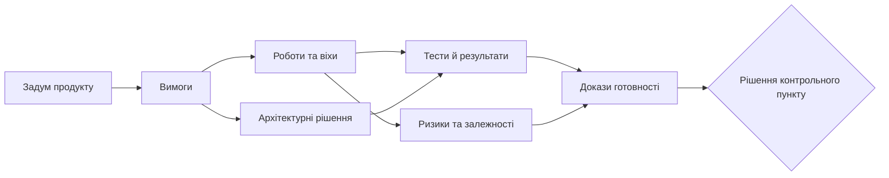

# Система управління складними проєктами: від вимог до рішень

Перед релізом команда може бачити зелений план, але не знати, чи зміна вимоги зачепила тести, постачання, ризики й потрібні погодження. Дані є — у трекері задач, репозиторії коду, системі вимог, таблицях і чатах, — проте відповідь доводиться збирати вручну. Це не проблема одного звіту. Це втрата керованого контексту.

Сучасна система управління складним проєктом не повинна замінювати всі наявні інструменти. Її завдання — зв'язати задум продукту, вимоги, роботи, рішення, тести, ризики та докази так, щоб зміна в одному місці пояснювала наслідки в іншому.

## Проєкт, програма й портфель відповідають на різні питання

Керівник проєкту відповідає за конкретний результат: обсяг робіт, команду, строки, ризики й якість. Керівник програми відповідає за результат, що виникає лише після інтеграції кількох проєктів: залежності, спільні ресурси, контрольні пункти та компроміси. Портфельний рівень вирішує, що фінансувати, прискорювати або зупиняти.

Тому сума зелених статусів не гарантує здорової програми. Апаратна ревізія може запізнитися на кілька днів, прошивка — не потрапити в інтеграційне вікно, а лабораторний слот — бути втрачений. Жодна команда окремо не обов'язково помиляється, але спільний результат уже під ризиком.

## Спільна модель важливіша за ще один дашборд

Дошка задач добре показує виконання, але не пояснює весь стан інженерного продукту. Для цього потрібна спільна модель: вимога, базова версія, пакет робіт, залежність, ризик, тест, дефект, рішення, доказ, реліз і погодження мають бути окремими, пов'язаними об'єктами.

*Це не лінійний процес: зміна будь-якого вузла може вимагати перегляду пов'язаних із ним рішень і доказів.*

## Цифрова нитка повертає контекст

Цифрова нитка — це не таблиця простежуваності, яку оновлюють перед аудитом. Це живі зв'язки між потребою, вимогою, реалізацією, тестом, дефектом, ризиком і доказом. Вона дозволяє за хвилини побачити вплив зміни, а не відновлювати його з пам'яті кількох людей.

Корисність з'являється щодня: інженер бачить контекст компонента, тестувальник — що саме перевіряє, а керівник — які докази або залежності блокують рішення. Якщо зв'язок не допомагає роботі, команда не підтримуватиме його лише заради аудиту.

## Автоматизація має переносити факти, а не відповідальність

Система може автоматично знаходити зачеплені тести, показувати залежності, формувати чернетку аналізу впливу й сигналізувати про прогалини. Але вона не має тихо ухвалювати рішення про реліз, прийняття ризику чи зміну обсягу робіт.

AI-асистент корисний тоді, коли працює з дозволеним, версійованим контекстом. Його відповідь має містити джерела, припущення та межі висновку. Людина перевіряє чернетку, обирає дію і залишає запис рішення.

## Починати варто з одного ланцюга

Не потрібно одразу будувати універсальну платформу. Оберіть один дорогий ручний процес — наприклад, готовність до релізу або аналіз впливу зміни — і зв'яжіть для нього вимогу, роботу, тест, ризик, доказ і рішення.

Такий перший контур покаже, які дані справді мають власника, які зв'язки корисні, а де організація лише накопичує поля. Після цього можна додавати події, метрики, правила й AI-пояснення.

## Як перевірити підхід на одному процесі

Анонімізований сценарій: команда готує реліз, а вимога змінилася після початку перевірок. Мінімальний контур має за одним ідентифікатором показати нову й попередню версію вимоги, пов'язані роботи, тести, відкриті ризики та рішення про реліз.

Критерій успіху простий: відповідальна людина за 30 хвилин відтворює вплив зміни без пошуку в особистому листуванні. Якщо для цього все ще потрібні дзвінки й ручне зведення таблиць, спільна модель поки не стала джерелом управлінського контексту.

## Межі застосування

Такий контур не виправдовує побудову нової платформи для кожного невеликого проєкту. Він потрібен там, де вартість ручної реконструкції, помилки інтеграції або вимоги до доказів уже перевищують вартість підтримки зв'язків.

## Висновок

Зріла система управління не є «мегаінструментом». Це інтегрований шар, який повертає людям контекст: інженерам — підстави для роботи, керівникам — вплив і варіанти дій, PMO — перевірювані правила, а керівництву — компроміси замість кольорових індикаторів.

## Посилання

- [ISO 21502:2020 — guidance on project management](https://www.iso.org/standard/74947.html)
- [ISO 21503:2022 — guidance on programme management](https://committee.iso.org/sites/tc258/home/projects/published/iso-21503.html)
- [NIST AI 600-1: Generative AI Profile](https://doi.org/10.6028/NIST.AI.600-1)
