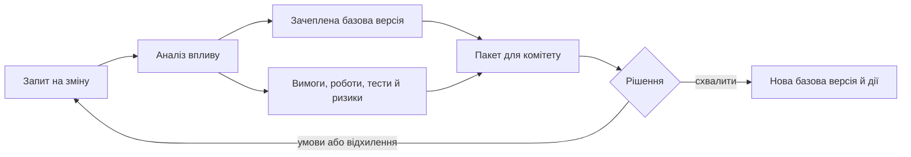

# План, базові версії та зміни в інженерному проєкті

План корисний лише доти, доки команда може відрізнити затверджене зобов’язання від поточного припущення. У складному виробі зміна постачання, вимоги або конфігурації зачіпає не один рядок графіка, тому приховане редагування плану руйнує довіру до нього. Ця стаття зберігає повний практичний матеріал про WBS, базові версії та керований розгляд змін.

## Від структури робіт до керованого плану

Детальний work breakdown structure (WBS) на старті великого project виглядає як дисципліна. Усе розкладено: work packages, tasks, dependencies, dates, resources, milestones, handovers. Leadership бачить план. PM бачить шлях. Команда начебто бачить, що і коли робити. Але через кілька місяців у великому hardware/software проекті цей самий WBS може стати джерелом постійного страждання.

Проблема не в тому, що WBS поганий. Навпаки, WBS корисний. Він допомагає структурувати scope, домовитися про work packages, побачити dependencies, оцінити resource needs і пояснити plan stakeholder-ам. Проблема починається, коли WBS стає окремим артефактом, який живе швидше або повільніше за реальну engineering work.

Hardware/software project змінюється не лише через бажання команди. Змінюються components, suppliers, lab windows, board revisions, firmware dependencies, test strategy, certification constraints, customer уточнення, safety або cybersecurity impact. Якщо WBS не пов'язаний із цими events, він дуже швидко перестає бути моделлю реальності і перетворюється на документ, який треба обслуговувати.

## Навіщо WBS потрібний

Добрий WBS розкладає work на зрозумілі частини. Він допомагає відповісти: який scope, які deliverables, хто owner, які dependencies, які milestones, де critical path, які resources потрібні, які work packages можна виконувати паралельно. Без цього великий проект легко перетворюється на набір задач без структури.

WBS особливо корисний на старті, коли треба узгодити expectations. Він дає мову для розмови між PM, engineering leads, QA, suppliers, leadership. Він дозволяє побачити, що робота складається не лише з development tasks, а й з design reviews, procurement, lab preparation, verification, documentation, release readiness, audit evidence.

Але WBS - це модель. Будь-яка модель старіє, якщо її не зв'язати з джерелами змін.

## Чому hardware/software швидко ламає план

У software-only project changes часто швидше проходять через backlog. Scope можна переоцінити, sprint перенести, release patch зробити, feature flag вимкнути. У hardware/software все повільніше і фізичніше.

Board revision може затриматися. Supplier може змінити lead time. Component може піти в shortage. Lab slot може бути доступний тільки в конкретне вікно. Firmware залежить від hardware sample. Test fixture не готовий. EMC або environmental testing виявляє проблему. Safety review додає requirement. Cybersecurity assessment змінює scope. Customer уточнює operational scenario.

Кожна така подія зачіпає WBS. Але якщо WBS не пов'язаний із supplier data, requirements, risks, test plans і milestones, PM мусить вручну зрозуміти impact. Це і є біль: реальність змінюється в engineering systems, а WBS треба наздоганяти.

## MS Project pain

Багато PM добре знають великі плани в MS Project або подібних tools. 500+ rows, hierarchy, dependencies, constraints, resources, calendars, custom fields, baselines, filters, reports. На папері це виглядає потужно. У щоденній роботі може бути важким.

Одна невелика зміна date тягне cascade. Resource leveling поводиться не так, як очікували. Dependencies складно review. Частина tasks має умовний статус, бо реальні signals живуть у Jira, Git, test management або supplier email. Reporting потребує manual cleanup. Baseline update стає окремою ceremony.

Знову ж таки, проблема не в конкретному tool. Проблема в тому, що planning tool часто не має живого зв'язку з engineering reality. Він знає dates і dependencies, але не знає, що test failed, requirement changed, supplier risk increased або waiver pending.

## Baseline робить зміни важкими

У великих проектах WBS і schedule можуть стати частиною baseline. Це правильно: baseline потрібен для control. Але baseline означає, що зміни не можна робити тихо. Якщо schedule baseline змінюється, може знадобитися Change Control Board, impact analysis, stakeholder approval, resource review, customer communication.

Це створює tension. З одного боку, PM бачить, що plan уже не відповідає реальності. З іншого - оновити baseline складно, довго і політично чутливо. У результаті з'являється два плани: офіційний і реальний. Офіційний красивий, реальний у нотатках, chat-ах і голові PM.

Це небезпечний стан. Leadership бачить baseline view, team живе actual view, audit питає evidence, а programme manager намагається зрозуміти, де правда. Краще мати контрольовану зміну baseline, ніж тихе розходження планів.

## WBS має бути пов'язаний з вимогами і evidence

Щоб WBS не ставав окремим документом, його треба зв'язати з requirements, risks, tests, defects, suppliers, milestones, baselines і evidence. Work package має знати, які requirements він реалізує. Test campaign має знати, які work packages і requirements вона verifies. Risk має знати, які WBS items affected. Supplier delay має знати, які milestones impact.

Тоді WBS стає не static hierarchy, а частиною operational model. Якщо requirement changes, система показує affected WBS items. Якщо test failed, видно work packages і milestones. Якщо supplier date moves, видно critical path. Якщо milestone shifts, видно impacted risks, resources, approvals.

У такій моделі PM не обслуговує WBS вручну. Він працює з WBS як з одним view над real project state.

## Machine-readable WBS

WBS має бути machine-readable structure, а не тільки human-readable plan. Це означає, що кожен item має stable ID, owner, type, status, dependencies, source, links, baseline relation, change history, evidence expectations. Не все треба робити важким. Але critical work packages мають бути достатньо структуровані, щоб система могла виконувати impact analysis.

Наприклад, work package для firmware driver має links to software requirements, hardware interface document, board revision, test cases, defects, risks, release gate. Якщо board revision changes, система може показати: цей work package affected, ці tests need rerun, цей milestone at risk, цей supplier input pending.

Machine-readable не означає нечитаємий. Людині все одно потрібен зручний view: timeline, hierarchy, dependency map, status summary. Але source of truth має бути object model, а не вручну відредагована таблиця.

## Що має робити інтегрована система

Інтегрована system могла б автоматично показувати impact для WBS changes. Якщо PM переносить milestone, система питає: які dependencies affected, які lab slots conflict, які suppliers impacted, які release gates shift, які approvals потрібні. Якщо task delay зачіпає critical path, створюється risk update або mitigation action. Якщо WBS item linked to safety-related requirement змінюється, system пропонує safety impact review.

Вона також могла б відрізняти planning change від baseline change. Не кожна робоча корекція має йти на CCB. Але якщо зміна зачіпає approved scope, release commitment, regulated evidence або customer baseline, система має підказати правильний workflow.

AI assistant тут може допомогти поясненням: "цей WBS change affects milestone M-4, tests T-11/T-18, supplier delivery S-3 and risk R-7; CCB likely required because baseline B-2026.04 changes". Але рішення про baseline change все одно приймають люди.

## Як зменшити біль уже зараз

Навіть без великої platform можна зробити кілька речей. По-перше, визначити, які WBS items є critical і потребують links to requirements, tests, risks, suppliers. По-друге, не намагатися однаково деталізувати весь план. Чим далі горизонт і вища невизначеність, тим легшою має бути структура. По-третє, фіксувати assumptions: supplier date, lab availability, prototype readiness, requirement stability.

По-четверте, регулярно робити WBS reality review: які items уже не відповідають engineering facts? Де official plan і actual plan розходяться? Де dependency exists only in someone's head? По-п'яте, тримати change log для schedule decisions: що змінили, чому, який impact, хто погодив.

Це не прибирає складність, але зменшує розрив між планом і реальністю.

## Ризик надмірного деталювання

Є спокуса зробити WBS максимально детальним. Здається, що більше деталей означає більше control. У довгих hardware/software проектах це часто навпаки. Надто детальний план на далекому горизонті швидко стає неточним, а підтримка його актуальності забирає більше сил, ніж дає користі.

Краще мати rolling-wave planning: найближчі етапи детальні, дальші - на рівні work packages і assumptions. Коли uncertainty зменшується, деталізація зростає. Це чесніше, ніж робити вигляд, що ми вже знаємо tasks через 18 місяців.

## Baseline hygiene

Щоб WBS не роз'їжджався з реальністю, потрібна baseline hygiene. Це не означає, що baseline треба змінювати щодня. Навпаки: baseline має бути стабільним настільки, щоб ним можна було керувати. Але команда має регулярно перевіряти, де official baseline вже не відповідає known facts.

Корисний rhythm - окремий baseline review перед важливими gates. Не просто "чи ми on track", а "які assumptions з baseline більше не діють", "які dependencies змінилися", "які work packages потребують replanning", "чи є зміни, що мають пройти CCB". Якщо такі питання ставити регулярно, baseline change перестає бути кризою.

Окремо варто домовитися про planning granularity. Найближчі 4-8 тижнів можуть мати detailed tasks. Наступний квартал - work packages and dependencies. Дальший горизонт - milestones, assumptions and options. Це не слабкість планування, а чесне відображення uncertainty. Чим hardware/software project довший, тим небезпечніше деталізувати майбутнє так, ніби воно вже відоме.

## AI як помічник PM, а не власник плану

AI може бути корисним для WBS, якщо працює з джерелами. Він може знайти tasks без owner-а, dependencies without target date, work packages linked to failed tests, schedule items affected by supplier delay. Він може підготувати impact summary для CCB або пояснити leadership, чому milestone shift не є просто зміною дати.

Але AI не повинен автоматично переплановувати baseline. План - це commitment, а не тільки optimization problem. Assistant може запропонувати scenarios: move milestone, reduce scope, add resource, split work package, accept risk. Люди мають оцінити trade-offs і зафіксувати decision.

## Висновок

WBS не ворог. Ворог - WBS, відірваний від engineering reality. У великих hardware/software проектах plan має жити поруч із requirements, risks, suppliers, tests, evidence, baselines і milestones. Інакше він швидко стає або outdated, або надто дорогим в обслуговуванні.

Сильний WBS не просто розкладає work. Він допомагає бачити impact changes, critical dependencies, evidence gaps і baseline consequences. Для цього він має бути structured, linked і machine-readable. А PM має керувати проектом, не служити плану.

Питання до читачів: де WBS у ваших проектах найбільше допомагає, а де починає жити окремо від реальності - у dependencies, baseline changes, resource planning, supplier dates, lab windows чи reporting?

## Як зміна стає рішенням

Baseline і Change Control Board (CCB) - дві речі, які у багатьох організаціях існують радше формально, ніж функціонально. Baseline нібито є, але ніхто точно не знає, який її поточний склад. CCB нібито збирається, але рішення там приймаються на основі усної доповіді менеджера, а не на основі структурованого пакета з трасуванням. У результаті механізм контролю змін перетворюється або на bottleneck, що уповільнює роботу, або на ритуал, що нічого не контролює.

Я зіткнувся з цим у різних організаціях і думаю, що проблема не в самій ідеї baseline або CCB, а в тому, як вони реалізовані. У цифровій системі ці два механізми можуть і мають працювати інакше.

## Що саме фіксує базова версія

Baseline - це відтворюваний стан проекту, програми або продукту на певний момент часу. Не PDF "Plan v1.2", не expression в Jira, не таблиця в Excel. Саме відтворюваний стан: requirements, plan, risks, tests, decisions, evidence, configuration items, зв'язки між ними.

Зрілий baseline дозволяє у будь-який момент відповісти на питання: який саме набір вимог був узгоджений на цю дату, який план виконання, які ризики були відомі, які тести були пройдені, які рішення були прийняті, які evidence підтверджували поточний статус.

У слабких реалізаціях baseline - це лише замороження документів. У сильних - це snapshot живого, структурованого стану, який можна відтворити, порівняти з іншим baseline і використати як точку відліку для будь-якої зміни.

## Чому зміни треба контролювати

Без change control будь-яка велика інженерна або програмна робота швидко перетворюється на хаос. Вимоги повзуть, плани зсуваються, тести стають неактуальними, ризики не оновлюються, supplier-зобов'язання плутаються, certification scope непомітно розширюється.

Change control - це механізм, що дозволяє організації відрізняти controlled зміну від drift. Controlled зміна означає, що команда розуміє, що саме змінюється, які наслідки, хто і чому ухвалив рішення, які дії з цього випливають. Drift означає, що щось змінилося само по собі, і ніхто не може ні відтворити причини, ні передбачити наслідків.

У regulated, contractual і safety-critical контекстах різниця між цими двома станами критична. Drift у вимогах може зруйнувати safety case. Drift у plan може поставити під сумнів виконання контракту. Drift у baseline означає, що жоден аудит або сертифікація не може спертися на стабільну референцію.

## Коли комітет стає вузьким горлечком

CCB як ідея проста: коли зміна має достатній impact, її розглядає колегіальний орган і ухвалює рішення. На практиці CCB у багатьох організаціях стає bottleneck з кількох причин.

По-перше, підготовка пакета. Менеджер вручну збирає, що саме змінюється, які тести зачіпає, які ризики виникають, який supplier impact, який scope. Це займає дні. Часто навіть не дні, а тижні, бо інформація розкидана по системах і людях.

По-друге, склад пакета. CCB отримує презентацію або документ, у якому частина даних суб'єктивна, частина застаріла, частина просто відсутня. Рішення в таких умовах ухвалюється напівсвідомо.

По-третє, частота. У великих програмах кількість змін стає такою, що CCB фізично не встигає розглядати їх своєчасно. Зміни або накопичуються у черзі, або застрягають у lower-level approvals і пізніше неузгодженими виходять у roadmap.

По-четверте, фіксація. Рішення CCB у багатьох організаціях зберігаються у форматі meeting minutes, які пізніше важко прив'язати до конкретних змін у системі.

У сумі це означає, що CCB перестає бути механізмом якості і стає або гальмом, або декорацією.

## Пакет зміни має збиратися з фактів

У цифровій системі CCB package має формуватися автоматично з даних, а не вручну з пам'яті менеджера. Що це означає на практиці.

Change request - це структурована сутність із полями: requested change, rationale, scope, impacted artifacts, impacted milestones, impacted tests, impacted risks, impacted suppliers, impacted evidence, alternatives, estimated effort, residual risk.

Система автоматично заповнює impacted artifacts, проходячи по traceability. Якщо змінюється вимога, система знає, які наступні вимоги, тести, ризики, документи, baseline-елементи зачіпаються. Менеджер може скоригувати або доповнити, але стартова робота вже зроблена.

Система також автоматично рахує impact на план: які milestones під загрозою, які залежності розриваються, які resource constraints виникають. У regulated проектах - також impact на safety case, cybersecurity case, certification scope.

CCB отримує не презентацію, а structured decision dossier. У ньому видно: що змінюється, які прямі наслідки, які варіанти, який rationale, які залишкові ризики. Рішення приймається на основі даних, а не оратора.

*Діаграма показує контрольований цикл: рішення не зникає в протоколі зустрічі, а створює новий відтворюваний стан або повертає запит на доопрацювання.*

## AI може пояснити вплив, але не ухвалює рішення

AI у CCB-процесі грає роль помічника, який скорочує час підготовки і покращує якість матеріалу.

Корисні застосування:

- генерація impact summary звичайною мовою для нетехнічних членів CCB;
- пошук історичних змін, схожих за scope, і узагальнення їхніх наслідків;
- пропозиція альтернативних варіантів реалізації зміни;
- виявлення rationale, який потрібно посилити доказами;
- перевірка повноти change package: чи всі обов'язкові поля заповнені, чи всі очікувані evidence-докази присутні;
- draft-формулювання рішення і умов його затвердження.

При цьому всі AI-висновки залишаються рекомендаційними. CCB ухвалює рішення, людина-секретар фіксує його, і фіксація стає частиною change record-у.

## Рішення мають залишати відтворюваний слід

Кожне рішення CCB має лишити слід, який пізніше можна відтворити. У цифровій системі це не вимагає окремої роботи: change request і пов'язане з ним рішення зберігаються як один decision record із усіма полями, evidence, голосуванням, умовами, прив'язкою до baseline.

Через рік або п'ять років можна відкрити будь-яку baseline і подивитися, які саме зміни її сформували, які CCB-рішення стояли за ними, на якій інформації ці рішення базувалися. Це не теоретична зручність. Це базова вимога для будь-якого серйозного аудиту, юридичного розслідування або контрактного спору.

## Як відрізнити керовану зміну від дрейфу

У підсумку зріла цифрова реалізація baseline і CCB виглядає так:

- baseline - відтворюваний snapshot живого стану, не PDF;
- зміни заходять у систему як structured change requests, а не як email або усне доручення;
- impact формується автоматично з traceability;
- CCB отримує decision dossier, а не презентацію;
- AI допомагає з summary і alternatives, але не приймає рішень;
- кожне CCB-рішення зберігається як decision record, прив'язаний до зміни і нової baseline.

Така модель не уповільнює роботу. Навпаки, вона звільняє менеджерів і інженерів від виснажливої ручної підготовки пакетів і дозволяє CCB реально працювати на якість.

## Які зміни потребують рішення комітету

Одна з практичних проблем - не кожна зміна має проходити однаковий шлях. Якщо все тягнути на CCB, board стане bottleneck. Якщо майже нічого не тягнути, change control стане декоративним. Тому потрібна явна classification changes.

Наприклад, low-level task update без impact на scope, baseline або evidence може лишатися на рівні team. Requirement wording clarification без зміни meaning може проходити lightweight review. Зміна approved requirement, release commitment, safety/cybersecurity scope, supplier obligation, verification strategy або schedule baseline має йти на formal impact analysis і, можливо, CCB.

Ці правила мають бути в системі. Коли користувач створює change request, система має ставити питання: чи зачіпає baseline, чи змінює verification evidence, чи впливає на supplier, чи змінює customer commitment, чи торкається regulated scope. Відповіді визначають workflow. Це краще, ніж покладатися на те, що кожен PM пам'ятає всі правила.

## Порівняння базових версій пояснює історію

Сильна цифрова система має вміти порівнювати baselines. Не просто показати два document versions, а відповісти: які requirements додані, видалені або змінені; які tests стали неактуальними; які risks змінили exposure; які decisions з'явилися між baseline A і B; які evidence стали stale; які work packages були replanned.

Baseline compare корисний не лише для audit. Він потрібен для learning. Команда бачить, чому план змінився, які assumptions не справдилися, які change categories домінують. Якщо більшість змін приходить від supplier uncertainty, це один management action. Якщо від poor requirements quality - інший. Якщо від late cybersecurity findings - третій.

## Комітет має покращувати рішення, а не карати за зміни

CCB часто сприймається як орган, який "дозволяє або забороняє". У зрілій моделі CCB має бути сервісом quality of decisions. Він допомагає побачити impact, alternatives і residual risk. Він не має карати за зміну. Він має забезпечити, що зміна контрольована.

Така культурна зміна важлива. Якщо teams бояться CCB, вони приховують drift. Якщо CCB працює швидко і на основі даних, teams приносять changes раніше, коли impact ще керований.

## Коли пакет зміни готовий до розгляду

Щоб CCB працював швидко, change package має мати чіткі acceptance criteria. Мінімально: опис зміни, причина, affected baselines, impacted requirements, impacted tests, impacted risks, impacted milestones, affected suppliers, alternatives, recommendation, residual risk, proposed decision. Якщо будь-який critical блок відсутній, package не має йти на board як готовий.

Це не бюрократія, а захист часу. CCB meeting не повинен витрачатися на з'ясування базових фактів. Він має обговорювати trade-offs. Якщо package неповний, system повертає його owner-у з конкретним feedback: missing test impact, missing supplier statement, no residual risk assessment, no rollback plan.

Корисно також мати standard decision outcomes: approved, approved with conditions, rejected, deferred pending evidence, split into smaller changes. Кожен outcome має створювати наступні actions автоматично: update baseline, create tasks, request evidence, schedule review, notify stakeholders. Тоді CCB decision не зависає у meeting minutes, а переходить у execution.

## Як вимірювати якість контролю змін

Change control теж можна вимірювати. Скільки change requests aging без decision? Скільки packages returned as incomplete? Який середній час від request до decision? Скільки emergency changes bypassed normal flow? Скільки approved changes потім спричинили defects або rework?

Ці metrics показують не лише швидкість CCB, а й quality of planning. Якщо emergency changes ростуть, можливо, команда погано бачить impact рано. Якщо incomplete packages багато, потрібен кращий template або automation. Якщо deferred decisions накопичуються, board не має достатнього evidence або authority.

## Висновок: контроль зміни має бути частиною щоденної роботи

Baseline і CCB не повинні бути паперовою формальністю або вузьким горлечком. У правильно побудованій цифровій системі вони стають природною частиною щоденної роботи: baseline відтворюваний, зміни структуровані, impact автоматичний, рішення задокументовані. Це не додаткова бюрократія - це нормальна гігієна для будь-якого серйозного проекту або програми.

## Питання для обговорення

- Які типи змін у ваших проектах потребують CCB, а які проходять lower-level?
- Скільки часу зараз займає підготовка одного change package?
- Що з полів change package у вас могло б формуватися автоматично?
- Чи може ваша команда відтворити baseline трирічної давнини з повною трасованістю рішень?

## Висновок

Керований план не має бути ідеальним передбаченням. Його цінність у тому, що він фіксує домовленість, робить відхилення видимим і дає змогу пояснити, хто та на яких підставах змінив зобов’язання. WBS, базова версія й контроль змін працюють як один контур, коли вони пов’язані з реальними вимогами, доказами та відповідальними рішеннями.

## Посилання

- [ISO 21511:2018 — work breakdown structures](https://committee.iso.org/sites/tc258/home/projects/published/iso-21503.html)
- [ISO 21502:2020 — guidance on project management](https://www.iso.org/standard/74947.html)
