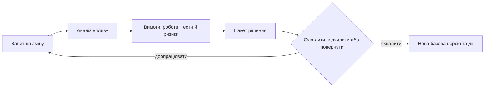

# План, базові версії та контроль змін в апаратно-програмних проєктах

Детальний план на старті великого проєкту дає відчуття контролю: роботи розкладено, дати й залежності визначено. Через кілька місяців змінюються компоненти, постачальники, лабораторні вікна, вимоги й результати перевірок. Якщо план живе окремо від цих фактів, він перетворюється на документ, який команда обслуговує замість того, щоб за ним керувати.

Проблема не в WBS — структурі декомпозиції робіт. Вона виникає, коли WBS, базова версія та контроль змін не пов'язані з інженерною реальністю.

## План має бути моделлю, а не списком дат

WBS допомагає домовитися про обсяг робіт, результати, залежності, ресурси й контрольні пункти. В апаратно-програмному продукті він повинен бачити не лише задачі, а й поставки, ревізії обладнання, прошивку, лабораторні випробування, вимоги та докази готовності.

Надмірна деталізація не робить план точнішим. Чим далі горизонт і вища невизначеність, тим легшим має бути опис. Натомість критичні пакети робіт потребують явних зв'язків із вимогами, ризиками, тестами й постачальниками.

## Базова версія фіксує відтворюваний стан

Базова версія — не просто PDF плану. Це погоджений стан вимог, робіт, ризиків, тестів, рішень і зв'язків між ними на певний момент. Саме тому через рік можна пояснити, що було затверджено, на яких припущеннях і чому.

Порівняння двох базових версій має відповідати не лише на питання «який файл змінився», а й показувати змінені вимоги, зачеплені тести, нові ризики, перенесені віхи та застарілі докази.

## Контроль зміни має пришвидшувати рішення

Не кожна правка потребує однакового маршруту. Уточнення тексту без зміни змісту може пройти легкий огляд; зміна погодженої вимоги, зобов'язання перед замовником або стратегії перевірки потребує формального аналізу впливу й, за потреби, колегіального рішення.

Комітет контролю змін має обговорювати компроміси, а не витрачати зустріч на пошук базових фактів. Неповний пакет система повинна повертати з конкретним переліком прогалин: немає впливу на тест, оцінки ризику або підтвердження від постачальника.

## Метрики показують, де процес ламається

Корисно вимірювати не лише кількість запитів на зміну, а й час до рішення, частку неповних пакетів, позапроцесні екстрені зміни та повторну роботу після схвалення. Це сигнали про якість планування й автоматизації, а не привід карати команду.

## Мінімальний пакет зміни

Анонімізований сценарій: постачальник переносить дату критичного компонента. Запит на зміну має містити причину, зачеплену базову версію, пов'язані віхи, тести, ризики, альтернативи, залишковий ризик і запропоноване рішення.

Пакет вважається достатнім не тоді, коли він довгий, а коли колегіальний орган може пояснити своє рішення через місяць: що змінилося, які наслідки розглядали та хто погодив компроміс. Вимоги до такого пакета залежать від договору, домену й рівня ризику.

## Межі застосування

Не кожне уточнення потребує формального комітету. Надмірне винесення дрібних змін у важкий процес створює обхідні шляхи й прихований дрейф; маршрут має бути пропорційним впливу.

## Висновок

План корисний, коли він пов'язаний із джерелами змін. Базова версія корисна, коли її можна відтворити. Контроль змін корисний, коли він робить наслідки видимими до рішення, а не створює чергу з документів.

## Посилання

- [ISO 21502:2020 — guidance on project management](https://www.iso.org/standard/74947.html)
- [ISO 21511:2018 — work breakdown structures](https://committee.iso.org/sites/tc258/home/projects/published/iso-21503.html)
