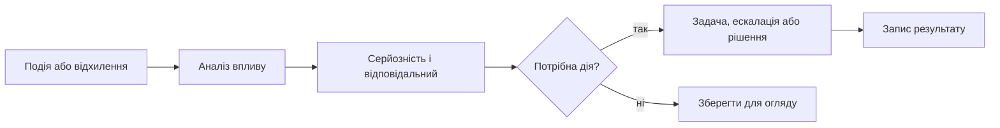

# Метрики та події: як система має запускати управлінську дію

Проблема часто стає видимою у вівторок, а потрапляє до керівника в понеділок разом зі статус-звітом. Невдала регресія, затримка постачальника чи прострочена дія з пом'якшення ризику не виникають за календарем зустрічей. Якщо система лише збирає цифри для звіту, вона повідомляє про минуле замість того, щоб допомагати діяти.

Метрика має бути не прикрасою дашборда, а сигналом із визначеним власником, порогом і маршрутом реакції.

## Від події до рішення має бути короткий шлях

Значуща подія містить джерело, час, зачеплені артефакти й початкову серйозність. Далі система пов'язує її з віхами, залежностями, ризиками й потрібними ролями. Лише після цього виникає дія: перевірка, ескалація, запит на ресурс, аналіз зміни або свідоме прийняття ризику.

Без цього ланцюга подієве управління перетворюється на шум сповіщень, а метрики — на кольорові лампочки.

## Метрика має відповідати на питання «що робити?»

Число «37 відкритих дефектів» майже нічого не каже. Корисний сигнал уточнює: скільки критичних дефектів входить до обсягу релізу, які вимоги й тести вони блокують, хто відповідальний і коли потрібно ескалювати.

Для кожної метрики слід визначити джерело, частоту оновлення, власника, поріг, дію та шлях ескалації. Не всі сигнали мають бути миттєвими: довгостроковий тренд і критичний збій релізної перевірки потребують різного темпу реакції.

## Сповіщення мають враховувати роль і контекст

Керівник проєкту, тестувальник, керівник програми та фахівець із відповідності потребують різних подань однієї події. Повторні або очікувані сигнали треба об'єднувати, а критичні — не ховати в щотижневому дайджесті.

Регулярний огляд політики сповіщень важливий так само, як її первинне налаштування. Якщо сигнал не приводить до рішення, дії чи свідомого прийняття ризику, він рідко заслуговує на термінове повідомлення.

## AI може пояснювати, але не створювати тривогу з нічого

AI корисний для групування повторів, пояснення причинного ланцюга та підготовки чернетки ескалації. Він не повинен самостійно визначати критичність без видимих правил, даних і людського огляду.

## Практична перевірка сигналу

Анонімізований сценарій: обов'язкова перевірка релізу двічі завершується невдало. Система має показати зачеплений обсяг, відповідального за тріаж, час підтвердження сигналу та обрану дію — повторну перевірку, виправлення, ескалацію або прийняття ризику.

Корисні метрики для цього контуру: час від події до підтвердження, час до рішення, частка повторних сигналів і частка хибних тривог. Вони показують, чи допомагає політика сповіщень, а не лише скільки повідомлень вона генерує.

## Межі застосування

Поріг не можна копіювати між командами без перевірки. Те, що є критичним для релізної перевірки в одному продукті, може бути звичайним шумом в іншому; правила мають належати конкретному контексту.

## Висновок

Операційний контроль починається не з красивого центру управління, а з кількох сигналів, які справді змінюють рішення. Коли метрика або подія має контекст, відповідального й дію, вона зменшує час реакції замість того, щоб збільшувати обсяг звітності.

## Посилання

- [ISO 21502:2020 — guidance on project management](https://www.iso.org/standard/74947.html)
- [NIST AI Risk Management Framework — resources](https://www.nist.gov/itl/ai-risk-management-framework/ai-risk-management-framework-resources)
