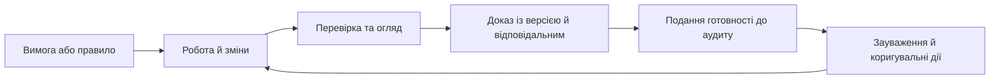

# Комплаєнс, аудит і докази готовності до релізу

Найнебезпечніший момент для команди — не сам аудит, а тиждень перед ним, коли докази намагаються зібрати з пам’яті, листування та різних систем. Якщо походження рішення, перевірки й версії продукту не фіксувалося в процесі, гарно оформлений пакет не зробить його надійним. Ця стаття об’єднує повні практики операційного комплаєнсу, готовності до аудиту та доказового релізу.

## Комплаєнс як щоденна властивість процесу

У compliance-heavy проектах найбільший стрес виникає не від того, що команда нічого не зробила, а від того, що важко швидко довести, що зроблено правильно. Це принципова відмінність, і її варто проговорити окремо: відсутність evidence у потрібному форматі сприймається як відсутність роботи, навіть якщо робота фактично виконана.

Мій досвід тут такий: вхід у compliance-heavy проект часто болючий. Багато довгих документів, safety plans, cybersecurity plans, quality gates, process rules, templates, checklists, supplier qualifications. PM не може щодня тримати всю цю картину в голові. Інженер не зобов'язаний пам'ятати, який пункт стандарту перекривається яким evidence. У результаті compliance перетворюється на сезонну активність перед аудитом, і це формує всі проблеми, які з нею пов'язані.

Альтернативна модель проста на словах і складна на практиці: комплаєнс має бути поточним станом проекту, а не подією у календарі.

## Чому про готовність до аудиту згадують запізно

Типовий сценарій. Стандарт існує. Команда знає про нього. Документи покладено в репозиторій. Кілька процесів встановлено. Але повсякденна робота розгортається в інших інструментах, і compliance evidence збирається або хаотично, або вручну, або тоді, коли наближається перевірка.

За кілька тижнів до аудиту запускається паралельний проект з підготовки package. Хтось зводить таблиці, хтось перевіряє traceability, хтось перепитує колишніх членів команди, хтось переписує rationale, бо у системі залишилася лише фінальна редакція. Часто з'ясовується, що частина evidence просто відсутня - не тому, що роботу не зробили, а тому, що її не зафіксували в потрібний момент.

Це класичний прояв розриву між реальною роботою і здатністю її довести. Команда фізично виконала вимоги стандарту, але не може швидко це продемонструвати.

## Які стандарти створюють цей тиск

Майже всі серйозні regulated галузі мають таку проблему.

Automotive: ASPICE, ISO 26262, ISO/SAE 21434, UNECE R155/R156. Усе це вимагає процесних доказів, traceability вимог, тестових артефактів, change records, supplier evidence.

Aviation: DO-178C, DO-254, ARP4754A, ARP4761. Дуже жорсткі вимоги до traceability, configuration management, verification evidence.

MedTech: ISO 13485, IEC 62304, ISO 14971, IEC 62366, FDA 21 CFR Part 11. Risk management, software lifecycle, usability engineering, electronic records.

MilTech / DefTech: MIL-STD-882E, MIL-STD-810, MIL-STD-461/464, MIL-STD-1472, NATO AQAP, STANAG, NIST SP 800-171, NIST SP 800-160, CMMC, експортний контроль, контрактні зобов'язання.

Для всіх цих стандартів характерне одне: оцінка відбувається не за фактом роботи, а за фактом продемонстрованої роботи з доказами.

## Чому керівникам потрібна щоденна картина відповідності

У більшості організацій compliance status - це або документ, який оновлюється раз на квартал, або відповідь конкретної людини "у нас все добре". Жодне з цих джерел не дає менеджеру інструменту для щоденного управління.

Зрілий PM/PgM має бачити compliance як живий статус. Не "ми відповідаємо стандарту X", а:

- які вимоги стандарту наразі мають evidence, які - ні;
- які evidence застаріли або прив'язані до старої baseline;
- які gates пропущені;
- які findings залишаються відкритими;
- які corrective actions у роботі і у кого вони;
- які зміни в baseline можуть зачепити compliance scope;
- які supplier evidence потребує оновлення.

Це не аудит. Це управлінська картина, що дозволяє діяти, поки відхилення невеликі.

## Стандарти як функціональні компоненти системи

Найсильніша архітектурна ідея, яку я бачу в зрілих compliance-проектах, - перетворення стандарту з PDF на функціональну частину системи.

Що це означає:

- ключові вимоги стандарту перетворені на структуровані controls;
- кожен control має очікувані evidence types;
- кожна сутність у системі (requirement, test, risk, document, change request, supplier record) знає, до яких controls вона належить;
- gates і workflows перевіряють наявність evidence перед переходом;
- зміна категорії продукту або застосовного стандарту автоматично змінює набір applicable controls;
- compliance scope - не папка, а структурований view над активними controls для конкретного продукту.

PDF стандарту залишається як джерело інтерпретації, але повсякденна робота вже відбувається у середовищі, де стандарт реалізовано як активний шар системи.

## AI може пояснити прогалини, але не підтверджує відповідність

AI у compliance-середовищі не визначає, чи відповідає продукт стандарту. Це залишається за людьми з authority. Але AI може суттєво прискорити рутинну роботу.

Корисні застосування:

- пояснення compliance gaps звичайною мовою: чому конкретний пункт стандарту не покритий evidence, чого саме бракує;
- автоматичний пошук evidence у системі за описом вимоги;
- виявлення застарілих evidence (прив'язаних до неактуальної baseline);
- draft-генерація compliance reports на основі live state;
- пояснення findings і пропозиція корективних дій на основі історичних cases;
- швидкі відповіді на запити аудитора з посиланням на конкретні артефакти;
- підготовка зрозумілих summary для нетехнічних stakeholder-ів.

AI тут працює над структурованими, контрольованими даними системи. Він не вигадує compliance. Він прискорює і пояснює.

## Пакет для аудиту має бути постійним артефактом

Логічний наслідок усього вищесказаного - audit package має формуватися постійно, а не до події.

У зрілій моделі audit package - це не окремо створений документ, а view над поточним станом системи: структура controls, evidence для кожного, відкриті findings, активні corrective actions, історія baseline, прив'язка supplier-доказів. Зовнішній аудитор отримує не реконструкцію, а актуальний snapshot.

Це не магія і не повна автоматизація. Команда все одно готує сам аудит, але вже без фази "зібрати в одне місце все, що ми робили рік". Ця фаза просто не потрібна.

## Як працює щоденний цикл відповідності

Щоб compliance став операційним станом, потрібен короткий щоденний або щотижневий loop. Не великий audit meeting, а звичайна робоча перевірка сигналів: які controls змінили статус, які evidence протерміновані, які findings отримали нові corrective actions, які baseline changes зачепили scope стандарту, які owners не оновили свої частини.

У такому loop PM або PgM не мусить бути експертом з кожного стандарту. Йому потрібна зрозуміла management view: що blocked, що at risk, що overdue, що потребує decision. Safety, cybersecurity, quality і verification roles бачать глибші views, але всі дивляться на той самий live state.

Практично це може працювати як набір triggers. Requirement без verification link у regulated scope - сигнал. Test evidence зі старої baseline - сигнал. Finding без corrective action owner-а - сигнал. Supplier evidence, що не оновлювався після component change, - сигнал. Ці сигнали мають запускати actions, а не чекати audit preparation.

## Відповідальність має бути розподілена явно

Окремо треба домовитися, хто відповідає за compliance state. Це не може бути лише auditor або quality manager наприкінці проекту. Кожен evidence type має owner-а: requirement evidence, test evidence, risk evidence, supplier evidence, review evidence. PM/PgM відповідає за видимість і coordination, але не підміняє domain owner-ів.

AI тут може нагадувати, пояснювати і готувати draft actions. Але якщо finding закритий, має бути людина, яка підтвердила closure. Якщо control вважається covered, має бути evidence і owner. Якщо risk прийнятий, має бути decision record. Саме ця комбінація live system + human authority робить compliance довіреним.

## Помилки, які перетворюють комплаєнс на формальність

Є кілька anti-patterns, які варто впізнавати. Перший - "audit heroics", коли команда героїчно збирає package в останній момент і вважає це нормою. Другий - "PDF compliance", коли стандарт лежить поруч із проектом, але не впливає на workflow. Третій - "green by assertion", коли статус позначено green без links to evidence. Четвертий - "single expert memory", коли лише одна людина знає, де справжні докази.

Усі ці патерни можуть виглядати терпимо до першого серйозного audit question. Потім з'ясовується, що compliance був не станом системи, а вірою в те, що потрібні докази десь існують.

## З чого почати впровадження

Найкраще починати не з усього стандарту, а з одного критичного ланцюга evidence. Наприклад: requirement -> verification method -> test run -> review record -> release decision. Якщо цей ланцюг живе в системі і його можна відкрити за хвилину, команда вже відчуває різницю.

Другий крок - вибрати кілька controls, які найчастіше болять перед аудитом. Для кожного control описати expected evidence, owner-а, refresh rule, status logic і escalation. Потім додати автоматичний check: evidence missing, evidence stale, owner missing, baseline mismatch. Це прості правила, але вони створюють operational visibility.

Третій крок - зробити compliance view корисним не лише auditor-у. PM має бачити risk і readiness. Engineer має бачити, який evidence очікується від його work product. Quality role має бачити gaps. Якщо view корисний тільки перед аудитом, команда не буде підтримувати його щодня.

І лише після цього варто додавати AI reports. Інакше assistant просто красиво переказуватиме неготовий стан.

Ще один корисний крок - домовитися про evidence freshness. Деякі докази старіють після baseline change, інші після toolchain update, supplier update або requirement revision. Якщо система не знає, коли evidence стає stale, вона показуватиме зелений статус на основі старої правди. Для compliance це майже так само погано, як відсутність evidence.

Freshness rule має бути таким самим явним, як owner або status, інакше audit-ready view швидко стане історичною довідкою.

У хорошій системі це видно одразу: evidence не лише існує, а й чинний для поточного baseline, поточного scope і поточного рішення.

## Висновок: відповідність має бути видимою щодня

Комплаєнс перестає бути джерелом стресу, коли він перетворюється з сезонної активності на щоденний операційний стан. Для цього потрібно: вбудувати стандарти у систему як функціональні компоненти, зробити compliance status видимим щодня, дати AI роль пояснювача і прискорювача, а audit package формувати з live state. У такій моделі команда не "готується до аудиту". Вона просто продовжує робити свою роботу, а аудит проходить як контрольована перевірка контрольованого стану.

## Питання для обговорення

- Що у вас найчастіше болить перед аудитом: докази, трасованість, findings, baseline чи ownership?
- Чи бачить ваш PM compliance status щодня, чи лише перед перевіркою?
- Які частини audit package у вас могли б формуватися автоматично без втрати довіри аудитора?
- Чи реалізовані ваші стандарти як функціональні компоненти системи, чи як PDF поруч із проектом?

## Готовність до аудиту без пожежі

Майже в кожній організації, що працює з regulated, safety-critical або contract-driven продуктами, аудит сприймається як окрема подія. До нього готуються тижнями, іноді місяцями. Збирають документи з різних систем, узгоджують версії, перепитують інженерів, які вже не пам'ятають подробиць, реконструюють хід рішень, шукають evidence, який десь точно був.

Я зіткнувся з тим, що ця модель витрачає величезний обсяг ресурсів і не дає головного - впевненості. Команда напружено готує audit package і одночасно не знає, чи знайде аудитор щось, чого вони самі не помітили. Аудит у такій моделі - це стрес, а не контрольована перевірка стану.

Альтернатива звучить просто: audit readiness має бути не окремим проектом, а побічним продуктом щоденної роботи. Звідси і термін audit-ready by design.

## Чому підготовка до аудиту стає окремим стресовим проєктом

У типовій схемі evidence розкиданий по багатьох системах: requirements у одному tool, тести у другому, defects у третьому, ризики у четвертому, документи у file share, рішення у листуванні, supplier-докази у поштовій скриньці менеджера.

Перед аудитом починається ручна реконструкція. Хтось експортує таблиці, хтось зводить версії, хтось переписує rationale, бо у системі залишилася лише фінальна редакція. Що складніший проект, то довша ця реконструкція. Що довша реконструкція, то більше шансів пропустити gap або неузгодженість.

Така модель також формує неправильне ставлення до evidence. Він сприймається як штука, яку треба "зібрати під аудит", а не як живий атрибут роботи. У результаті значна частина рішень не залишає сліду в системі, бо ніхто не очікує перевірки прямо зараз.

## Докази мають виникати безперервно

Audit-ready by design починається з простої ідеї: evidence - це не разова викладка, а постійний артефакт.

Що це означає на практиці:

- кожен test execution залишає запис із версією, оточенням, results, evidence файлами;
- кожна зміна requirement має зв'язок із джерелом, owner-ом, change record-ом і impact-аналізом;
- кожен ризик має історію, owner-а, статус mitigation, evidence-докази дій;
- кожне ключове рішення фіксується як decision record із rationale, options, approvers, datestamp;
- кожен supplier-артефакт лежить у тому ж контексті, що й продукт, а не у поштовій скриньці.

Накопичення evidence стає природною частиною роботи, а не додатковою задачею перед перевіркою. У такій системі audit package - це view над поточним станом, а не окремо побудована викладка.

*Пакет для аудиту є поданням цього ланцюга. Він не замінює первинні записи, а посилається на них.*

## Зауваження, коригувальні дії та огляди мають бути пов'язані

Друга велика частина audit readiness - це робота з findings. У реальних аудитах і внутрішніх перевірках завжди з'являються зауваження. Питання в тому, як вони живуть далі.

У слабкій моделі findings перетворюються на список у Excel, який ніхто не оновлює. У зрілій моделі finding - це сутність із власним lifecycle:

- опис, контекст, severity, джерело (внутрішній аудит, зовнішній, supplier, замовник);
- зв'язок із конкретними артефактами: requirement, test, risk, document, baseline;
- corrective action: owner, дата, опис заходу;
- evidence закриття: який саме артефакт підтверджує, що finding закритий;
- review: хто перевірив і коли;
- зв'язок із наступним аудитом, де finding має бути верифікований.

Audit-ready by design передбачає, що ці елементи живуть у тій самій системі, що й інша робота. Аудитор не питає "де список findings", він відкриває view і бачить його у поточному стані з усією трасуванням.

## Стандарти мають працювати як правила, а не лежати PDF-файлами

Один із ключових бар'єрів до audit readiness - це те, що стандарти зазвичай живуть окремо від проектної роботи. PDF зі стандартами індустрії - ASPICE, ISO 26262, IEC 62304, NIST SP 800-171, залежно від домену - лежать у спільному файловому сховищі. Людина має пам'ятати, що саме там написано, і вручну застосовувати це до своєї роботи.

Audit-ready by design передбачає, що ключові вимоги стандартів вбудовані у систему як активні правила і expectations.

Приклади:

- модель вимог автоматично вимагає acceptance criteria, traceability, verification method;
- зміни критичних артефактів запускають expected reviews відповідно до стандарту;
- evidence для процесу безпеки автоматично перевіряється на повноту;
- release не може бути формально завершений без обов'язкового набору records, передбачених стандартом;
- зміна категорії продукту автоматично змінює набір applicable controls і evidence-вимог.

PDF-документ стандарту нікуди не зникає. Він залишається як джерело правди для interpretation. Але повсякденна робота вже відбувається у середовищі, де стандарт перетворений на операційну поведінку системи.

## AI може готувати звіт і пояснювати прогалини

AI у audit-ready середовищі грає допоміжну, але дуже цінну роль. Він не приймає рішень про compliance, але прискорює багато речей, які зараз робляться вручну.

Корисні застосування:

- автоматична генерація draft audit reports на основі live evidence;
- пояснення поточного audit state звичайною мовою для менеджменту;
- виявлення gap-ів у evidence: відсутні tests, прострочені reviews, requirement без acceptance criteria;
- пояснення findings і пропозиція кандидатів на corrective actions на основі історичних даних;
- порівняння поточного стану проекту з вимогами стандарту і виділення проблемних місць;
- draft-відповідей на запити аудиторів із посиланнями на конкретні артефакти.

При цьому AI працює над структурованими, контрольованими даними системи. Його роль - не вигадувати compliance, а пояснювати і прискорювати роботу з тим, що вже є.

## Ціль: години перевірки замість днів реконструкції

Якщо звести аudit-ready by design до однієї практичної мети - це скорочення часу від "запит надійшов" до "відповідь готова" з днів і тижнів до годин.

У моделі, де evidence живий, findings - сутність із lifecycle, стандарти - embedded rules, а AI допомагає з draft-роботою, аудитор отримує:

- view над поточним станом продукту і процесу;
- traceability між вимогами, тестами, ризиками, рішеннями, evidence;
- історію змін baseline із rationale;
- список findings і corrective actions з статусами;
- свіжі звіти, сформовані з даних, а не написані вручну.

Команда у такій моделі майже не готується до аудиту. Вона лише робить snapshot поточного стану, який і так є коректним.

## Як це впливає на культуру

Audit-ready by design змінює не лише архітектуру системи, а й культуру. Evidence перестає бути тягарем. Він стає природною частиною роботи, тому що дає інформацію не лише аудиторам, а й команді: чи знаємо ми, що зараз у нас зроблено, чи можемо ми це довести, чи розуміємо ми поточні ризики.

У такій культурі дисципліна не вступає у конфлікт зі швидкістю. Навпаки, вона звільняє швидкість, тому що команда не витрачає час на реконструкцію.

## Як вимірювати готовність до аудиту

Audit-ready by design потребує метрик, але не vanity metrics. Корисно дивитися на evidence completeness, stale evidence count, findings aging, corrective action overdue rate, requirements without verification links, approvals pending before gate, baseline changes without completed impact analysis. Це signals, які допомагають діяти до аудиту.

Окремо важлива метрика time-to-answer. Якщо auditor або internal reviewer питає "покажіть evidence для requirement X", скільки часу потрібно? Хвилини, години, дні? Цей показник дуже чесно показує зрілість системи. Якщо відповідь залежить від того, чи доступний конкретний senior engineer, система ще не audit-ready.

Ще одна корисна метрика - finding recurrence. Якщо однаковий finding повторюється в кількох проектах, проблема не в одному документі. Проблема в process, template, training або system check. Audit-ready system має повертати такі findings назад у governance: оновити checklist, rule, template або automated validation.

## Як враховувати докази від постачальників

У багатьох проектах найслабше місце audit package - supplier evidence. Внутрішні артефакти ще можна змусити жити в системі. Supplier certificates, test reports, declarations, security statements, qualification records часто приходять email-ами і залишаються в локальних folders.

Audit-ready by design має включати supplier evidence у той самий lifecycle: source, version, owner, validity period, related component, related requirement, applicable baseline. Якщо supplier змінює component або документ старіє, система має показати gap. Інакше команда може мати ідеальний internal evidence chain, але провалитися на external dependency.

AI може допомогти витягти metadata з supplier documents, але final classification і acceptance мають лишатися за відповідальною роллю.

## Що перевірити перед контрольним пунктом

Audit-ready system особливо корисна перед gates. Перед design review, verification gate, release candidate або external audit система має автоматично показати readiness checks: requirements with missing acceptance criteria, tests without results, risks without current review, findings without closure evidence, approvals pending, supplier documents expired, baseline changes without decision records.

Такий check не має бути каральним. Його цінність у ранньому signal. Якщо gap видно за три тижні до gate, це manageable work. Якщо gap знаходить auditor, це finding. Різниця лише в тому, коли система подивилася.

Добрий readiness check також має пояснювати priority. Не всі gaps однакові. Missing evidence для non-critical internal note не дорівнює missing verification для regulated requirement. Система має показувати severity, owner і recommended action.

## Хто відповідає за модель готовності до аудиту

Audit readiness не може бути повністю делегована tool-у. Потрібен owner моделі: які evidence types існують, які controls applicable, які gates mandatory, які checks blocking, які advisory. Часто це спільна відповідальність quality, PMO, compliance і engineering leads.

Без такого ownership система швидко застаріє. Стандарт зміниться, template оновиться, supplier process стане іншим, а automated checks залишаться старими. Audit-ready by design потребує lifecycle не лише для evidence, а й для самої audit model.

## Висновок: готовність до аудиту — це властивість процесу

Audit-ready by design - це не про додаткову бюрократію. Це про правильно побудовану систему, у якій evidence накопичується природно, findings мають lifecycle, стандарти живуть як правила, а AI допомагає з draft-роботою і поясненнями. У такій моделі аудит перестає бути окремим стресовим проектом і стає звичайним сriзом стану, який команда може зробити майже миттєво.

## Питання для обговорення

- Скільки часу у вас зараз займає підготовка до зовнішнього аудиту?
- Які докази найважче знайти і чому?
- Чи живуть у вас findings як сутності із lifecycle, чи як список у таблиці?
- Чи можлива у вашій галузі audit-ready система без надмірної бюрократії?

## Реліз як перевірювана конфігурація

У багатьох командах реліз досі доводиться словами. Є release notes, changelog, status meeting, кілька посилань на pipeline, скриншот тестів, коментар QA, короткий summary від PM. Усе це може бути чесним. Але коли продукт складний, крос-командний або regulated, слів уже недостатньо.

Реліз має доводити себе сам.

Під цим я маю на увазі release evidence - структурований набір доказів, який показує, що саме було зібрано, з яких версій, якими тестами перевірено, з якими протоколами сумісно, які gaps лишилися, які security/redaction checks пройдені, куди evidence опубліковано і чи можна цю публікацію відтворити.

Це не просто ще один файл у релізі. Це дисципліна.

## Release notes не є release evidence

Release notes пояснюють, що змінилося. Release evidence доводить, що це перевірено.

Release notes можуть сказати: «додано сумісність із новою версією протоколу». Release evidence має сказати:

- які версії компонентів були перевірені разом;
- яка версія спільного контракту використовувалася;
- чи були локальні заміни залежностей;
- який protocol version активний;
- який fixture corpus прогнано;
- яка smoke command виконана;
- який exit code;
- який trace/correlation sample підтверджує шлях;
- чи були residual gaps;
- чи був repository dirty;
- чи є evidence artifact, який можна відкрити пізніше.

Це зовсім інший рівень. Release notes працюють для комунікації. Release evidence працює для довіри.

## Чому це важливо у крос-продуктових системах

У моноліті release evidence може бути простішим. Є один repository, одна pipeline, один artifact, один set of tests. У продуктовій сім'ї все складніше.

Один компонент випускає protocol constant. Другий використовує його через shared SDK. Третій очікує payload field. Четвертий публікує Wiki report. П'ятий збирає evidence з GitLab. Кожен окремо може бути green. Але programme compatibility залежить від того, чи вони перевірені разом.

Саме тут release evidence стає programme-level об'єктом.

Якщо один компонент заявляє, що інтеграція з іншим працює, доказ має показати, на яких версіях це перевірено. Якщо можливість позначена як чернетка або відкладена, реліз не має називати її активною сумісністю. Якщо інструмент автоматизації публікує звіт, доказ має містити попередній перегляд, перевірку цілі та зворотне читання. Якщо система перейшла на резервний режим, реліз не має називати це апаратним прискоренням.

Без такого evidence сумісність стає narrative. З evidence вона стає перевірюваним фактом.

## Інструмент публікації не має підміняти управлінське рішення

Інструмент автоматизації може збирати факти з конвеєра, формувати попередній перегляд публікації, перевіряти ціль, виконувати знеособлення чутливих даних, зчитувати опублікований вміст і порівнювати хеш. Це корисна, але вузька відповідальність.

Важливо не плутати межі: інструмент публікації не є рушієм політик для всієї програми. Він не вирішує, чи компоненти сумісні, чи доказ достатній, або чи згенерований AI підсумок схвалено для публікації.

Правильна модель така:

- компоненти продукують власні докази;
- спільна документація визначає схему й словник;
- інструмент автоматизації перевіряє, публікує та фіксує доказ публікації;
- відповідальний за реліз схвалює чутливі твердження й твердження про деградований режим.

Тобто інструмент автоматизації робить докази придатними до публікації та повторюваними. Але самі докази мають народжуватися в компонентах.

## Як застосувати підхід до інших компонентів

Так, але координовано. Кожен компонент має продукувати докази у своїй зоні відповідальності: стан проєкту, сумісність інтеграції, перевірки, діагностику виконання, якість отримання знань або дотримання контракту інтеграції. Спільна бібліотека контрактів має підтверджувати сумісність інтерфейсів і контрактні тести.

Інструмент публікації відповідає лише за перевірку цілі, попередній перегляд, знеособлення, результат запису, зворотне читання та хеш вмісту. Це не означає, що всі компоненти мають копіювати один інструмент: кожен формує власні докази, а публікаційний процес лише збирає й перевіряє їх.

## Мінімальний release evidence record

Мінімальний evidence record для крос-продуктового релізу має відповідати на кілька простих питань.

Що саме релізимо? Component name, version, git SHA, tag або branch, dirty state.

З ким сумісно? Protocol version, shared SDK version, required component versions, compatibility window.

Що перевірили? Fixture corpus, smoke command, test summary, coverage або relevant CI job IDs, exit codes.

Який runtime/context був активний? CPU/GPU/NPU, local LLM runtime, provider, fallback, model/runtime evidence where relevant.

Який trace sample доводить шлях? Request ID, correlation ID, traceparent, artifact references.

Які security boundaries зачеплено? Classification, movement policy, redaction status, generated content review state.

Що лишилося невирішеним? Residual gaps, skipped checks, degraded components, draft/deferred capabilities.

Де це опубліковано? Target, URL/path, content hash, readback status.

Якщо evidence record не може відповісти на ці питання, release compatibility claim слабкий.

## Dry-run і readback як культура безпечної автоматизації

Мені дуже подобається пара dry-run/readback. Це проста, але сильна ідея.

Dry-run відповідає на питання: "що саме ми збираємося зробити, куди, з яким content hash, після яких checks, але без мутації target system".

Readback відповідає на питання: "чи справді те, що ми опублікували, лежить там, де очікували, і чи збігається content".

Це особливо важливо для GitLab Wiki, issue/MR comments, release pages, generated Markdown reports. Automation, яка пише у GitLab без dry-run і readback, може бути корисною, але не audit-grade. Вона може помилитися target-ом, опублікувати не той content, втратити форматування, пропустити redaction gap або залишити команду без доказу, що publication успішна.

Dry-run/readback змінює характер автоматизації. Вона перестає бути "скрипт щось написав" і стає "workflow має доказ наміру і доказ результату".

## Redaction як частина release evidence

Release evidence часто містить sensitive context: internal URLs, logs, job traces, snippets, generated summaries, provider diagnostics, local paths, tokens by accident. Якщо evidence автоматично публікується у GitLab, redaction не може бути optional afterthought.

Добрий release evidence workflow має явно фіксувати redaction status:

- passed;
- blocked;
- manual review required;
- not required.

Також має бути видно redaction profile. Одне діло - публікувати open-source release notes. Інше - публікувати cross-product engineering evidence з logs, trace IDs, generated summaries і internal component names.

AI тут додає ще один ризик. Generated content може випадково переказати restricted details або змішати source contexts. Тому AI summaries у release evidence мають бути або human-approved, або marked as manual review required.

## Release evidence має бути machine-readable

Markdown report корисний для людей. Але source of truth має бути machine-readable JSON або інший стабільний structured format. Інакше evidence неможливо автоматично перевіряти.

Machine-readable evidence дозволяє:

- перевірити schema;
- порівняти component versions;
- побачити dirty repos;
- знайти skipped checks;
- gate-ити реліз за required fields;
- будувати programme compatibility matrix;
- публікувати human-readable report з того самого source;
- робити readback hash;
- накопичувати history для trend analysis.

Якщо CLI має `--json`, stdout має бути чистим JSON. Без banner, progress text, color codes, warning messages. Diagnostics можуть іти у stderr. Це дрібниця, яка відрізняє automation-friendly CLI від красивого human CLI.

## Release evidence як operational memory

Через пів року після релізу команда часто не пам'ятає деталей. Яка версія спільного контракту була в компоненті? Чи була локальна заміна залежності? Чи проганяли набір перевірок? Чи можливість була активною або лише чернеткою? Чи апаратне прискорення справді працювало, чи система перейшла на резервний режим? Чому реліз схвалили попри залишкову прогалину?

Release evidence відповідає на ці питання без розкопок.

Це важливо не лише для audit. Це важливо для debugging, incident review, migration planning, customer support, compatibility matrix, onboarding і future architecture decisions.

У цьому сенсі release evidence - це пам'ять релізу.

## Зв'язок із програмною аналітикою

Release evidence і програмна аналітика дуже близькі. Programme analysis формулює, що має бути правдою між проектами. Release evidence доводить, що це було правдою для конкретного релізу.

Наприклад, аналітика може вимагати, щоб поля трасування й кореляції однаково проходили через усі компоненти. Доказ релізу має показати відповідний приклад трасування.

Analysis каже: "classification and movement policy metadata must be preserved without raw restricted content". Release evidence має показати metadata sample і redaction status.

Analysis каже: "local LLM runtime claims need model hash, quantization, backend and fallback". Release evidence має містити ці fields, якщо runtime був частиною compatibility claim.

Без release evidence programme analysis залишається policy. З release evidence вона стає перевірюваною дисципліною.

## З чого почати команді

Не треба одразу будувати ідеальний release evidence platform. Почати можна з малого.

Перший крок - визначити canonical evidence schema для одного release flow.

Другий - змусити кожен компонент виводити свою частину evidence у machine-readable format.

Третій - додати smoke command, який створює evidence artifact.

Четвертий - додати redaction check перед publication.

П'ятий - додати dry-run для GitLab publication.

Шостий - додати readback hash після publication.

Сьомий - зробити skipped checks явними. Не "ми не встигли", а structured skipped check з owner, reason і risk.

Це вже дає величезну різницю.

## Чи є тут тема для статті

Так, і дуже сильна. Release evidence — це міст між релізною інженерією, відповідністю вимогам, DevOps, проєктним менеджментом і урядуванням програми. Майже кожна інженерна організація має проблему: релізи є, але докази релізів живуть у журналах CI, сторінках документації, коментарях, таблицях, пошті й пам'яті людей.

Стаття на цю тему може бути навіть практичнішою за багато абстрактних розмов про DevOps maturity. Бо вона ставить просте питання: якщо завтра треба довести, що реліз був сумісний, перевірений і безпечно опублікований, де цей доказ?

Якщо відповідь - "пошукаємо в pipeline і спитаємо QA", release evidence discipline ще не побудована.

## Мій висновок

Так, підхід із доказами релізу варто застосовувати до інших компонентів, але з правильними межами відповідальності. Компоненти мають продукувати власні докази, а інструмент публікації — безпечно збирати, перевіряти, публікувати й зчитувати назад зведений доказ. Спільна документація має тримати схему, словник і правила перенесення результатів у роботу.

Release evidence - це не бюрократія. Це спосіб зробити реліз доказовим. Команда менше сперечається про те, що було перевірено, і більше працює з фактами. А коли з'являється audit, incident або compatibility question, відповідь уже існує.

Реліз, який не може показати evidence, просить довіри. Реліз, який має evidence, доводить себе сам.

## Питання до читачів

- Чи можете ви зараз відкрити evidence record для релізу піврічної давності?
- Чи видно там component versions, commit SHAs, fixture set, smoke command і residual gaps?
- Чи має ваша release automation dry-run і readback, чи просто пише у target system?
- Який evidence у вашій організації найважче відтворити після релізу?

## Висновок

Доказовий контур працює тоді, коли запис рішення, версія об’єкта, результат перевірки та правило приймання з’являються під час роботи. Тоді аудит перевіряє звичний процес, а релізне рішення спирається на відтворювану конфігурацію, а не на оптимізм.

## Посилання

- [ISO 21505:2017 — guidance on governance](https://committee.iso.org/sites/tc258/home/projects/published/iso-21503.html)
- [NIST AI 600-1: Generative AI Profile](https://doi.org/10.6028/NIST.AI.600-1)
- [ISO 21502:2020 — guidance on project management](https://www.iso.org/standard/74947.html)
- [NIST SP 800-218 — Secure Software Development Framework](https://csrc.nist.gov/pubs/sp/800/218/final)
