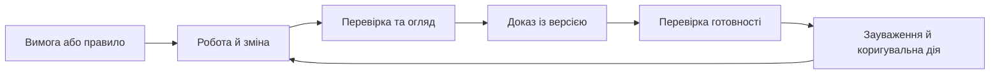

# Комплаєнс, аудит і докази релізу як постійний стан системи

Команда може виконати велику роботу й усе одно не пройти перевірку, якщо не здатна швидко показати, що саме зроблено, ким, за якою версією та з яким результатом. Перед аудитом або релізом тоді починається реконструкція: пошук тестів, погоджень, журналів змін і листування. Проблема не в браку документів, а в тому, що докази не народжувалися в процесі роботи.

Комплаєнс і готовність до аудиту мають бути поточним станом системи, а не коротким проєктом напередодні перевірки.

## Доказ має бути пов'язаний із роботою

Вимога, зміна, тест, зауваження, коригувальна дія та рішення мають залишати запис із версією, відповідальним і посиланням на первинний артефакт. Пакет для аудиту тоді не створюють наново: це подання вже наявного ланцюга.

Стандарт не зникає як джерело тлумачення, але його застосовні вимоги мають проявлятися у звичайній роботі: потрібний огляд, обов'язковий запис, перевірка повноти або заборона закрити контрольний пункт без доказу.

## Доказ релізу відрізняється від приміток до релізу

Примітки пояснюють, що змінилося. Доказ релізу показує, які версії компонентів і контрактів перевірено разом, які тести виконано, які перевірки пропущено, які залишкові ризики прийнято та де зберігається відтворюваний запис.

Для автоматичної перевірки потрібне машинозчитуване джерело істини. Людський Markdown-звіт може будуватися з нього, але не має бути єдиним носієм фактів. Публікація також потребує попереднього перегляду, перевірки цілі, знеособлення чутливих даних і зворотного читання результату.

## AI може шукати прогалини, але не сертифікувати відповідність

AI може підготувати чернетку звіту, пояснити зауваження або знайти відсутній тест. Він не може замінити результат перевірки, формальне погодження чи відповідального фахівця. Будь-який висновок про відповідність потребує видимого доказу та людського підтвердження.

## Мінімальний запис доказу релізу

Анонімізований запис має містити версію компонента й спільного контракту, перелік виконаних і пропущених перевірок, посилання на первинні результати, статус знеособлення даних, залишкові ризики, відповідального та рішення про реліз.

Перевірка якості не повинна доводити, що реліз «ідеальний». Вона має показати, чи можна відтворити факти та чи всі винятки названо явно. Саме це дає аудиту й команді спільну основу для розмови.

## Межі застосування

Склад доказу залежить від домену й контракту. Не варто подавати запропонований запис як сертифікаційну схему або заміну вимог конкретного стандарту.

## Висновок

Доказовий процес зменшує аудиторський стрес не тому, що приховує проблеми, а тому, що показує їх завчасно. Реліз, який може пояснити свої версії, перевірки, межі та залишкові ризики, не просить довіри — він надає підстави для неї.

## Посилання

- [NIST SP 800-218 — Secure Software Development Framework](https://csrc.nist.gov/pubs/sp/800/218/final)
- [ISO 21502:2020 — guidance on project management](https://www.iso.org/standard/74947.html)
