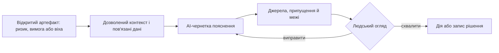

# AI-асистент і PMO: від автоматизації тексту до керованих рішень

AI може за секунди написати підсумок, але сам підсумок не робить управління кращим. Керівник має бачити джерела, версію даних, припущення та відповідального за наступне рішення. У цій статті збережено повну аргументацію про AI-асистента для менеджера й зміну ролі PMO.

## Асистент у робочому контексті менеджера

Коли говорять про AI у проєктному менеджменті, найчастіше уявляють вікно чату поруч із беклогом або дашбордом. Воно корисне для разових запитань, але змушує менеджера щоразу переказувати контекст: проєкт, віху, залежності, ризики та останні зміни. Для щоденної роботи цього замало.

Справжня цінність AI-асистента для керівника проєкту, програми чи PMO — пояснювати стан і пропонувати варіанти саме тоді, коли людина відкрила конкретний ризик, віху, вимогу, дашборд або запит на зміну. Але така підказка має показувати джерела, припущення та межі висновку.

## Чому чат-інтерфейс необхідний, але недостатній

Чат-інтерфейс має один великий недолік: він вимагає від користувача формулювати контекст самостійно. PM має пояснити асистенту, який проект, який milestone, які залежності, які стейкхолдери, який стандарт, які останні зміни. У реальному житті у менеджера на це немає ні часу, ні бажання. Він дивиться на екран і хоче зрозуміти, що тут не так і що з цим робити.

Тому асистент-лише-як-чат у проектному середовищі швидко перетворюється на місце для разових запитань і генерації тексту: "напиши статусне оновлення", "перефразуй цей ризик", "сформулюй лист до замовника". Це корисно, але це не управлінська допомога. **Це секретарська функція.**

Контекстний AI-асистент працює інакше. Він знає, на якому елементі знаходиться користувач, які поля заповнені, які відсутні, які пов'язані артефакти, який поточний стан baseline. Так взаємодія стає менш формальною: менеджер уже нічого не описує, він просто дивиться, а асистент коментує те саме.

## Асистент має бачити контекст роботи

Найпростіший спосіб уявити такого асистента - це бічна панель у системі управління проектами, яка реагує на те, що менеджер відкрив на сторінці.
Начебто звичне явище, але я спробував так робити інтерфейс користувача - **це працює!**

З ризиками це працює найкраще. Асистент пояснює оцінку (risk score), показує схожі ризики з минулих проектів, перелічує відкриті дії з пом'якшення (mitigation actions), нагадує про відповідального і дату наступного перегляду. Справді так було: дивлюсь я на ризик і думаю, що там усе зрозуміло, навіщо його розписувати. А асистент запропонував кілька похідних ризиків і доволі прийнятно їх прорахував.

З milestone-ами інший сценарій. Асистент показує задачі й артефакти, які блокують дату, виділяє червону зону і пояснює, які саме недоробки тягнуть реліз назад. Я можу дивитися на темп робіт і думати, що все більш-менш прийнятно, а він у цей час перевіряє купу дрібниць, до яких у мене миттєво руки не дійдуть.

З вимогами усе ще приземленіше: асистент перевіряє верифіковність, нечіткість формулювань, відсутність критеріїв приймання, дублювання з іншими вимогами й узгодженість із вищим рівнем. Ну тут класика. Аналітики інколи настільки лаконічно пишуть вимоги, що на першому читанні розробники їх приймають. А коли справа доходить до реалізації і сфокусованого аналізу, з'являються питання, уточнення, а потім і зміни. *А вимога вже в бейслайні: треба міняти версію, збирати архітекторів з dev lead-ом, і це знов непрогнозовані витрати часу.*

А з дашбордом усе швидко стає чесним. Якщо асистент може пояснити, чому метрика погіршилася за тиждень, які проекти вплинули найбільше і що саме змінилося в baseline, значить дашборд справді має дані. Якщо ні - ми просто дивимося на красиві індикатори без причинно-наслідкового шару.

У всіх цих сценаріях користувач не пише запит. Він просто дивиться на елемент, а в цей час AI пропонує другий погляд. Звісно, система керування проектами має "подбати", щоб асистент мав доступ до цих знань, подій і фактів. Інакше він закине вам припущення або галюцинації.

*Асистент не отримує «весь проєкт за замовчуванням»: контекст обмежують правами доступу й конкретною робочою задачею.*

## Які пояснення справді допомагають менеджеру

Один із моїх висновків з роботи з (не лише проектними) менеджерами: вони часто бачать технічний статус, але не мають ні часу, ні доменної глибини, щоб одразу інтерпретувати всі його наслідки. Це природно.
PM дивиться на список дефектів і бачить число. Він не бачить, скільки з них критичні для конкретного safety case, скільки заблокують реліз, скільки впливають на замовника, скільки потягнуть зміну тестового плану.

Так, інколи ми можемо щось поміряти, але не знаємо точно, що з цим робити - ну "вилітіло з голови". Або точно не знаємо - "та й не залітало". :)

> *Прилади? - Двадцять! - Що двадцять? - А що - прилади?*

AI-асистент може закрити саме цей розрив.

Приклади корисних пояснень:

- "Цей ризик має score 18, тому що ймовірність зросла з 3 до 5 після останнього збою постачальника. Подібний ризик у минулому проекті призвів до затримки на 6 тижнів - прислали партію нових бордів, а вона уся дефектна". *Ви не знали, що в бордах теж можуть бути дефекти? Доріжки там хибно провели або не довели їх до контактів.*
- "Цей milestone заблокований трьома задачами. Дві з них залежать від одного інженера, який у відпустці аж два тижні до кінця місяця. Розгляньте перенесення дати або створіть запит на ресурс". *Уся команда не вірила, що Вадим піде у відпустку, але він себе переборов - і пішов!*
- "Ця вимога містить слово 'should', не має кількісних критеріїв приймання, не має зв'язку з верифікаційним тестом і дублює частину вимоги REQ-204". *Класика, але ж трапляється таке, знов і знов.*
- "Метрика defect leakage збільшилася на 14% за тиждень. Основний вплив - проект X, де додалося 12 нових дефектів після міграції коду на бібліотеку XCAL". *Може, весь скоуп дефектів фікситься за годину, а може - за кілька днів. Хто ПМ-у це відразу підкаже? Треба щось відповісти на мітингу за годину. А усі розробники щільно зайняті.*

Зрозуміло, що магії тут немає. Є акуратна агрегація і пояснення вже наявних даних. Але саме цього зазвичай і не вистачає PM у щоденній роботі. Дрібниці. Багато дрібниць. Їх швидка інтерпретація і варіанти дій (або бездіяльності).

## AI може покращити вимоги, ризики й метрики

Окремий клас сценаріїв - коли AI пояснює стан і одразу підсвічує, як його покращити.

З вимогами це дуже приземлено: асистент ловить нечіткі формулювання, пропонує кількісні критерії приймання, перевіряє трасування до верхнього рівня і до тестів, знаходить дублікати або суперечності. *Здається, це шаблонні фрази, але на практиці - усі спрацьовують!*

З ризиками корисність з'являється тоді, коли система має історію. Асистент може знайти схожі минулі ризики, показати, які дії з пом'якшення тоді спрацювали, перевірити відповідального, дату перегляду, зв'язок із milestone-ами, а потім порахувати вплив на графік і бюджет. Звісно, тільки якщо ми самі надали всі вхідні дані.

З метриками він часто робить найнеприємніше - пояснює, чому "зелена" цифра насправді не така вже й зелена. Наприклад, метрика давно не оновлювалася, джерело даних застаріло, або тренд виглядає стабільним лише тому, що ніхто не копався у деталях. *Та не було часу копатися, чого та метрика не змінюється, вона ж "зелена"? Ну і добре.*

На цьому етапі асистент уже готує конкретні чернетки. PM їх приймає, править або викидає. Для мене саме такі підказки найчастіше викликають емоцію "от за це дякую, я б на це сам не глянув".

## Менеджеру потрібні варіанти дій

Я часто бачив звіти, які кажуть менеджеру, що щось не так, але не пропонують жодного руху. *"Усе зрозуміло, але що конкретно?"*
Добрий AI-асистент у проектному середовищі має біля кожного значущого спостереження показувати можливий наступний крок. Звісно, з огляду на стандартизовані процеси, яким він має бути навчений.

Можливі варіанти дій:

- ескалювати до програмного рівня, або до Product Owner;
- зробити запит на ресурс;
- запустити дію з пом'якшення;
- ініціювати зміну обсягу робіт через CCB;
- замовити додатковий перегляд або оцінку ризику;
- сформувати запит на зміну із попередньо заповненими полями.

Важлива деталь: AI не виконує цих дій сам. Він готує чернетку, відкриває потрібний процес і передає його людині. Це звільняє PM від рутини формулювання, але залишає рішення за ним.
На практиці це дуже важливо, бо така рутина дрібних поточних завдань часто призводить до локального емоційного вигоряння, швидкої ментальної втоми.

## Асистент може перекладати між ролями

Ще одна функція, про яку рідко пишуть, - переклад між ролями. PM не зобов'язаний розуміти всі деталі hardware, firmware, cybersecurity, certification або обмежень постачальника. Інженер не зобов'язаний пояснювати очевидні для нього речі. У результаті між ними виникає інформаційний розрив. Ще більше "розривається" голова у ПМ після крос-функціональних мітингів, хто був - той зрозуміє, про що я.

AI може акуратно перекладати:

- пояснювати PM, що означає певний дефект, абревіатура, технічний термін або посилання на стандарт;
- пояснювати інженеру, чому певна управлінська вимога важлива для замовника або для compliance;
- пояснювати замовнику, що насправді означає поточний статус, без надмірного технічного жаргону.

І це не косметика. Коли один і той самий статус треба пояснити інженеру, замовнику й PMO, такий переклад економить більше часу, ніж ще один автоматичний звіт.

## Як підготувати AI-асистента до роботи

Тут спрацьовує проста закономірність: як подбаєш про підготовку - так і матимеш результати. Асистент не вгадає, що у вас baseline зсунувся вчора, що Вадим у відпустці, що постачальник тиждень не відповідає, що дефект із релізного скоупу перенесли в наступний реліз. Він про це знатиме лише тоді, коли PM свідомо побудує середовище, у якому ці факти живуть структуровано і вчасно.

Першим я б починав не з універсального помічника, а з одного вузького контексту - наприклад, асистента для ризиків. І перш ніж його вмикати, перевіряв би прості речі. Чи має кожен ризик відповідального і дату наступного перегляду? Чи зв'язані ризики з milestone-ами і відповідними діями з пом'якшення? Чи закриваємо ми старі ризики, чи вони просто "висять"? Чи історичні ризики з попередніх проектів живуть у тій самій системі, а не в чиєїсь голові? Якщо хоча б половина відповідей "ні", асистент видасть рівно те, що йому згодували.

Те саме з асистентом для milestone-ів. Він стає корисним лише тоді, коли в milestone є явний відповідальний, перелік умов приймання, прив'язані задачі, тести і затвердження, а не "ну, до п'ятниці маємо випустити". Моя робота як PM - саме привчити команду тримати ці поля живими. Без цього "milestone під ризиком" від асистента буде або очевидним, або ні про що.

## Чого не варто автоматизувати

**Менеджер приймає рішення сам.** AI не має сам змінювати статус проекту, приймати ризик, закривати зауваження аудиту, затверджувати waiver або міняти baseline. Навіть якщо технічна інтеграція це дозволяє, governance не має цього дозволяти без дії людини. Асистент може підготувати чернетку, але людина має натиснути "затвердити" і взяти відповідальність.

**Довіряй, але перевіряй.** Не варто робити асистента єдиним шляхом доступу до інформації. Джерела мають лишатися видимими. Якщо PM не може перевірити відповідь без AI, довіра до інструмента буде крихкою.

## Як міряти користь

Кількість згенерованих текстів майже нічого не каже про користь AI-асистента для менеджера. Краще дивитися на простіші речі: скільки часу йде від питання до рішення, скільки - на підготовку статусу, скільки ризиків ми пропустили цього кварталу, наскільки описи ризиків стали зрозумілими наступному читачу, як швидко збирається CCB-пакет, як швидко знаходиться першоджерело під твердженням у звіті, як часто доводиться перепитувати інженерів те саме.

Наприклад, якщо PM раніше готував release readiness summary два дні, а тепер робить це за годину з перевіреними джерелами, асистент створює цінність. Якщо ж він просто пише красиві статусні оновлення без посилань, то лише покращує форму, не якість управління.

Ще один критерій - прийняття саме скептиками. Якщо асистент корисний тільки тим, хто й так вірить в AI, це слабкий сигнал. А от коли ним починають користуватися скептичні PM або інженерні ліди - бо відповіді трасовані й справді економлять час - тоді інструмент став робочим.

## Висновок: AI має готувати перевірювані чернетки

Якщо коротко, чат у браузері сам по собі ще не робить AI-асистента корисним для менеджера. У PM є конкретний ризик, milestone або вимога на екрані, і саме поруч із ними потрібен другий погляд: звідки взялося твердження, які наслідки, яка дія далі.

Відповідальність за рішення лишається людською. AI може забрати собі агрегацію, інтерпретацію і підготовку чернеток. Саме це реально економить час менеджера. Кількість красивих абзаців у статусі сама по собі такої користі не дає.

## Питання для обговорення

- До ПМ-ів - коли і як AI Assistant зменшив вашу залежність від постійних уточнень у технічних фахівців? Чи всеж не допоміг?
- Які рішення у ваших проектах (поки що) не можна довіряти AI навіть як рекомендацію? Нехай лише про технічні рішення, а не людські відносини.
- Які випадки недовіри до пропозицій ШІ-асистента з вами траплялися і як ви діяли?
- Траплялося що AI Assistant псував ваші документи власними фантазіями і припущеннями? (ну траплялося, я впевнений, розкажіть про це)

## PMO як власник управлінського контуру

Якщо AI та інтегровані project/programme systems справді почнуть автоматично збирати статуси, метрики, ризики, залежності й evidence, роль PMO неминуче зміниться. У складних організаціях PMO не зникне; швидше стане важливішим. Просто його цінність буде вже не в тому, щоб переслідувати команди за оновленнями в Excel і презентаціях.

Класичний PMO часто асоціюється зі status reporting, templates, governance meetings, portfolio decks, weekly updates і контрольними питаннями: чи оновили risk register, чи є актуальний plan, чи поставили правильний колір у dashboard. Частина цієї роботи корисна. Інша частина лише показує, що управлінська система не вміє сама збирати свій стан.

AI підсвічує цю проблему дуже різко. Якщо дані в системах хороші, assistant може за хвилини підготувати status summary, знайти overdue risks, порівняти milestone drift, витягти blockers і скласти draft steering update. Якщо дані погані, AI просто швидше підсумує хаос. Тому PMO після AI має займатися правилами, даними і governance model; ручний збір статусів має відходити на другий план.

## Класичний PMO і його слабке місце

У багатьох компаніях PMO виріс як відповідь на хаос. Проекти звітували по-різному, managers використовували різні формати, керівництво не мало єдиної картини. PMO стандартизував templates, cadence, reporting, stage gates, risk categories, escalation rules. Це дало дисципліну.

Але з часом PMO часто стає офісом звітності. Він не управляє системою, а збирає її симптоми. Команди заповнюють status reports, PMO консолідує, leadership дивиться на summary, а реальний стан все одно треба уточнювати в окремих дзвінках. Колір project status може бути green, але critical dependency не оновлена. Risk register формально існує, але mitigations overdue. Milestone виглядає стабільно, але test failures ростуть.

Слабке місце такого PMO - залежність від ручної інтерпретації. Він знає, як має виглядати звіт, але не завжди контролює якість underlying data. А саме ці дані визначають, чи можна довіряти AI, metrics і dashboards.

## Що автоматизують сучасні системи

Інтегровані project і programme systems можуть автоматично збирати значну частину того, що PMO раніше просив вручну: task progress, defect trends, test status, requirements changes, pending approvals, open risks, dependency delays, release gate state, resource conflicts. AI може перетворити ці дані на narrative: що змінилося, де impact, які рішення потрібні.

PMO не зникає, але роль human API між інструментами вже не виглядає життєздатною. Якщо PMO витрачає більшість часу на копіювання статусів, система погано спроектована. Якщо AI може зібрати status сам, PMO має перевіряти rules замість wording: які джерела враховано, які thresholds застосовано, які assumptions зроблено, які exceptions дозволені.

Найцінніша робота зміщується в upstream: визначити, що таке project health, які metrics справді мають значення, коли status має автоматично перейти в red, як працює change control, які evidence потрібні для gate, хто може approve waiver, як AI має пояснювати рекомендацію.

## PMO як owner governance model

Після AI PMO має бути owner-ом governance architecture. Це звучить сухо, але суть дуже практична. Хтось має відповідати за templates, metrics, gates, risk taxonomy, dependency model, CCB rules, audit model, AI policies, status semantics і escalation logic. Інакше кожна команда створить власну версію правди.

Наприклад, що означає amber status? Для одного проекту це "є ризики, але все під контролем". Для іншого - "ми вже запізнюємося, але не хочемо лякати leadership". Якщо PMO не визначив semantics, dashboard стає політичним. Те саме з risk probability, milestone confidence, release readiness, compliance gap, blocked dependency.

Governance model має бути machine-readable настільки, наскільки можливо. Якщо rule звучить як "critical defect in release scope blocks release gate unless waiver approved", система має це перевіряти. Якщо rule звучить як "major scope change after baseline requires CCB", система має створювати або хоча б пропонувати change review. PMO тут працює як дизайнер правил управління, а не як хранитель шаблонів.

## Якість управлінського контексту

AI дуже залежить від контексту. Якщо risk не має owner-а, assistant не може чесно запропонувати mitigation path. Якщо dependency не пов'язана з milestone, система не бачить impact. Якщо approval живе в листуванні, release readiness буде неповною. Якщо requirement change не прив'язаний до work packages і tests, impact analysis буде декоративним.

Тому PMO має відповідати за якість управлінського контексту. Не за технічний зміст кожного requirement або defect, а за те, щоб управлінські об'єкти мали потрібні attributes і зв'язки. Project має owner, scope, baseline, milestones, risks, dependencies, gates. Risk має trigger, impact, mitigation, owner, due date. Decision має source facts, options, approval і date. Metric має source, threshold, owner і action policy.

Це менш помітна робота, ніж підготовка великої презентації, але вона набагато цінніша. Коли управлінський контекст якісний, status report генерується майже автоматично. Коли контекст поганий, навіть найкращий PMO перетворюється на ручний консолідатор.

## PMO ближче до architecture, quality і data governance

PMO після AI не може жити окремо від engineering disciplines. У складних проектах governance rules перетинаються з architecture, quality, safety, cybersecurity, data governance, compliance і product management. Release gate не можна визначити без QA. Change control не можна визначити без requirements і architecture. AI routing policy не можна визначити без security і data classification. Audit model не можна визначити без compliance.

Це змінює профіль PMO. Йому потрібні люди, які розуміють schedule, budget і systems thinking. Вони мають говорити з architects про dependencies, з quality про evidence, з cybersecurity про controls, з product managers про value, з leadership про portfolio decisions. PMO стає місцем, де управлінська мова перекладається в системні правила.

Не кожен PMO готовий до цього. Частина команд звикла до адміністративної ролі. Але саме AI робить адміністративну роль вразливою: усе, що є повторюваним summarization без ownership of rules, буде автоматизоване.

## PMO як product owner внутрішньої management platform

Якщо організація будує інтегровану management platform, PMO має поводитися як product owner цього внутрішнього продукту. Користувачі - project managers, programme managers, engineers, QA, leadership, auditors. Value - менше ручної роботи, швидший insight, кращі decisions, надійніший audit trail.

Це означає roadmap для самої управлінської системи. Які integrations потрібні першими? Які metrics мають найбільший decision value? Які reports варто автоматизувати? Які AI use cases допустимі? Які pain points у PM і teams? Які governance rules створюють зайву бюрократію? Де система не допомагає, а заважає?

Такий PMO просить команди заповнювати тільки ті поля, які справді потрібні, зрозумілі і дають користь. Якщо команда вводить дані тільки для PMO, процес слабкий. Якщо команда вводить дані, бо вони допомагають керувати роботою, PMO спроектував систему правильно.

## Ризики нової ролі

Перший ризик - надмірна централізація. PMO може вирішити, що раз він owner governance model, то всі мають працювати однаково. Це небезпечно. Різні типи проектів потребують різної глибини governance. R&D prototype, regulated product release і internal tooling не повинні мати однаковий process weight.

Другий ризик - неправильні метрики. Якщо PMO автоматизує погані metrics, організація швидше отримає погані рішення. Наприклад, velocity без quality context, defect count без severity, milestone progress без evidence, budget burn без value. AI тільки зробить ці метрики переконливішими.

Третій ризик - бюрократія під виглядом data quality. Можна вимагати стільки metadata, що команди почнуть заповнювати систему формально. PMO має балансувати: достатньо структури для управління, мінімум зайвого тертя для команд.

## Як оцінити PMO після AI

Успішність PMO після AI я б міряв не кількістю звітів. Краще дивитися на reaction time, decision quality, data trust, manual reporting effort, audit readiness, risk visibility і user satisfaction. Чи швидше видно cross-project dependency? Чи менше часу PM витрачає на status report? Чи точніше leadership бачить stop/go decisions? Чи можна від AI-summary перейти до sources? Чи зменшилась кількість surprises перед gates?

Якщо PMO після AI усе ще головно просить slides, значить трансформація не відбулася. Якщо PMO проектує правила, які дозволяють системі чесно показувати реальність, роль стала сильнішою.

## З чого почати трансформацію

Я б не починав із великої програми "AI transformation for PMO". Краще взяти один болючий процес: weekly status, release readiness, CCB package або risk review. Потім розкласти його на джерела даних, правила, owner-ів, thresholds і decision points. Що зараз збирається вручну? Які поля дублюються? Де PM додає judgment, а де просто копіює факти? Які дані мають приходити автоматично?

Після цього можна зробити перший machine-readable workflow. Наприклад, release readiness summary має збирати open critical defects, failed mandatory tests, pending waivers, changed requirements, unresolved risks і missing approvals. AI може написати narrative, але PMO має визначити, які facts обов'язкові і що означає blocked, amber або ready.

Такий підхід швидко показує різницю між automation і governance. Автоматизувати поганий шаблон легко. Побудувати кращу систему важче. Але саме це і є нова роль PMO: прибирати стару бюрократію там, де вона більше не створює цінності, замість того щоб просто пришвидшувати її.

Мінімальний успішний результат для першого кроку - зменшення ручного тертя. Новий dashboard сам по собі не рахується. Якщо PM витрачає менше часу на збір фактів, leadership бачить джерела статусу, а команда краще розуміє правила escalation, PMO вже створив value. Решту можна нарощувати поступово.

## Висновок

AI не вб'є PMO. Він прибере алібі для PMO, який існує лише як конвеєр звітності. Майбутня роль PMO - архітектура управлінської системи: governance model, data quality, metrics logic, AI policy, evidence model і decision workflow.

Ця роль складніша за збір статусів і набагато цінніша. У світі, де AI може швидко написати будь-який summary, довіра буде не до кращого формулювання статусу, а до системи, з якої цей статус можна перевірити.

Питання до читачів: де PMO у ваших організаціях створює реальну управлінську цінність, а де лише підтримує ручну бюрократію?

## Висновок

Корисний AI не замінює відповідальність PM або PMO. Він скорочує ручний пошук, показує суперечності, готує перевірювану чернетку й залишає рішення людині. Тому зрілість AI-впровадження вимірюють не кількістю згенерованих текстів, а якістю джерел, контролів і рішень.

## Посилання

- [NIST AI 600-1: Generative AI Profile](https://doi.org/10.6028/NIST.AI.600-1)
- [OWASP Top 10 for LLM Applications, 2025](https://owasp.org/www-project-top-10-for-large-language-model-applications/)
- [ISO 21505:2017 — guidance on governance](https://committee.iso.org/sites/tc258/home/projects/published/iso-21503.html)
