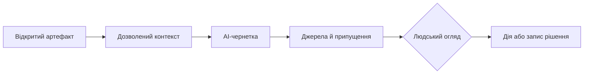

# AI у проєктному менеджменті та нова роль PMO

Чат поруч із беклогом корисний для разових запитань, але змушує менеджера щоразу переказувати контекст. Коли відкрито ризик, віху або запит на зміну, потрібна не загальна відповідь, а пояснення саме цього артефакту: що змінилося, на що це впливає і які варіанти дії є.

AI дає таку користь лише тоді, коли організація вже визначила модель даних, правила доступу, значення статусів і відповідальних. Саме тут змінюється роль PMO.

## Асистент має працювати з видимим контекстом

Контекстний асистент може підсумувати стан ризику, знайти пов'язані тести й залежності, виявити неповні критерії приймання або підготувати чернетку ескалації. Його відповідь має показувати джерела, версії, припущення та межі висновку.

AI не є власником рішення. Він прискорює пошук і пояснення, а відповідальна роль погоджує дію, приймає ризик або відхиляє чернетку.

## PMO переходить від звітності до архітектури управління

Якщо факти автоматично надходять із систем-джерел, PMO не має витрачати основну енергію на переслідування команд за кольорами у презентації. Його робота — визначити правила: таксономію ризиків, значення статусів, контрольні пункти, модель залежностей, політику AI, маршрути ескалації та вимоги до доказів.

Ці правила мають бути достатньо формальними, щоб система могла їх перевіряти, але не настільки жорсткими, щоб замінити професійне судження. Наприклад, правило може вимагати огляду при критичному дефекті в обсязі релізу, але рішення про виняток лишається за людьми.

## Довіра до AI починається не з моделі

Якщо ризик не має відповідального, залежність не пов'язана з віхою, а погодження живе в листуванні, AI лише швидше переказує неповну картину. Перед упровадженням варто обрати один процес із достатньо чистими даними, визначити межі доступу, спосіб перевірки відповіді й власника якості результату.

## Як оцінити корисність AI-підказки

Анонімізований сценарій: асистент пояснює ризик релізу на основі вимог, тестів і відкритих дій. Для вибірки таких відповідей команда перевіряє чотири речі: чи правильні посилання на джерела, чи не пропущено критичний факт, чи не з'явилося вигадане твердження і чи запропонована дія була корисною.

Мінімальні метрики — частка відповідей із перевірюваними джерелами, частка виправлених людиною висновків, хибні тривоги та час, який заощадила перевірка. Без такого оцінювання «корисний асистент» лишається враженням, а не результатом.

## Межі застосування

Асистент не має бути єдиним шляхом до важливої інформації або останньою інстанцією для прийняття ризику. Політика доступу, зберігання запитів і навчання користувачів залежать від юрисдикції, договору та чутливості даних.

## Висновок

Корисний AI у менеджменті — не чарівний співрозмовник, а перевірюваний другий погляд у конкретному робочому процесі. PMO в цій моделі стає архітектором правил і даних, що роблять такий погляд безпечним і корисним.

## Посилання

- [NIST AI 600-1: Generative AI Profile](https://doi.org/10.6028/NIST.AI.600-1)
- [NIST AI Risk Management Framework — resources](https://www.nist.gov/itl/ai-risk-management-framework/ai-risk-management-framework-resources)
