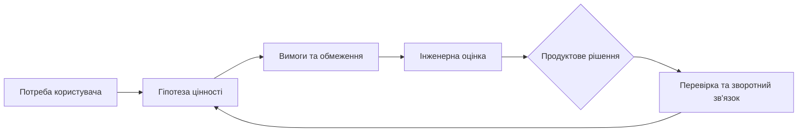

# Продуктовий менеджмент у складній та регульованій інженерії

Нова функція на дорожній карті може виглядати одним рядком, але в складному продукті зачіпати системну вимогу, апаратний інтерфейс, перевірку, постачальника або межі сертифікації. Якщо продуктовий менеджер бачить лише цінність для клієнта, команда відкриє справжню вартість рішення надто пізно.

Продуктовий менеджмент в R&D — це міст між потребою ринку й інженерною реальністю, а не лише управління беклогом.

## Задум продукту має пройти контрольований шлях

Потреба клієнта, гіпотеза цінності та пріоритет мають перетворюватися на вимоги, обмеження, оцінку здійсненності й план перевірки. У відповідь інженерія повертає не загальне «можемо» або «не можемо», а варіанти, ризики, строки й компроміси.

Цей цикл не означає, що продуктовий менеджер керує безпекою, технічною базовою версією чи підтвердженням перевірки. Він має бачити їхній вплив рано, щоб не продавати обіцянку, яку неможливо чесно виконати.

## Ритми програмного й апаратного світу різні

Програмний компонент часто можна змінити або відкотити швидше. Апаратний продукт залежить від виробництва, постачання, фізичних випробувань і сертифікації. У системному продукті ці ритми накладаються один на одного, тому дорожня карта не може жити в темпі лише програмного забезпечення.

## Регульоване середовище робить ціну зміни видимою

Зміна може вплинути на аналіз безпеки, кібербезпеку, кваліфікацію постачальника, стратегію перевірки чи доказ для аудиту. Це не привід віддати продуктове рішення інженерам; це причина зробити вплив зміни частиною продуктового рішення.

## Карта рішення до появи беклогу

Анонімізований сценарій: клієнт просить новий режим роботи продукту. До створення задачі команда фіксує проблему користувача, гіпотезу цінності, зачеплені частини системи, обмеження, припущення, спосіб перевірки користі й власників наступних кроків.

Критерій якості — здатність пояснити, чому ідею прийнято, відкладено або відхилено, не посилаючись на усну домовленість. Це не обов'язково складний документ: важливіше зберегти зв'язок між цінністю, здійсненністю й перевіркою результату.

## Межі застосування

Продуктовий менеджер не замінює архітектора, фахівця з безпеки чи відповідального за якість. У регульованому середовищі їхні рішення мають власні процедури, хоча продуктовий контекст повинен бути для них видимим.

## Висновок

Сильний продуктовий менеджмент у складній інженерії зберігає фокус на цінності, але не відриває її від здійсненності. Найкращий результат — не найбільший беклог, а перевірений продукт, для якого зрозуміло, яку проблему він розв'язує і якою ціною.

## Посилання

- [ISO 21502:2020 — guidance on project management](https://www.iso.org/standard/74947.html)
- [NIST AI 600-1: Generative AI Profile](https://doi.org/10.6028/NIST.AI.600-1)
