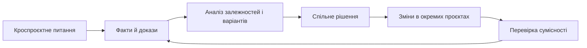

# Управління програмою: залежності, спільні рішення та аналітика

Кілька проєктів можуть чесно звітувати про зелений статус і все одно втратити інтеграційне вікно. Причина живе між ними: спільний ресурс, несумісні інтерфейси, залежність від постачальника або рішення, яке залишилося в локальній нотатці. Програмне управління починається там, де суми статусів недостатньо.

## Програма потребує власної моделі

Керівник програми має бачити залежності, інтеграційні події, спільні ризики, користь, ресурси й контрольні пункти. Це інший рівень роботи, ніж редагування звітів окремих проєктів.

Програмна аналітика підтримує цей рівень: вона збирає факти, прогалини, альтернативи й рішення, що стосуються кількох команд, до того як зміни розійдуться по локальних беклогах.

## Аналіз повинен залишати шлях до виконання

Для кожної кроспроєктної теми потрібні проблема, джерела фактів, зачеплені компоненти, ризики, рекомендація, відповідальні та спосіб перевірки. Аналіз не має бути ще одним документом «для знання»; він повинен перетворюватися на вимоги, задачі, оновлення контрактів або тести.

## AI допомагає шукати невідповідності

AI може порівнювати документи, контракти, тести та нотатки, щоб знайти суперечливі визначення або рішення без продовження. Він не повинен сам оголошувати архітектурне рішення правильним: остаточний вибір потребує власника й явного запису причин.

## Мінімальний артефакт програмної аналітики

Для однієї міжпроєктної теми достатньо завести запис із проблемою, джерелами фактів, зачепленими командами, залежностями, альтернативами, рекомендацією, власниками дій і критерієм перевірки. Це робить аналіз відтворюваним без прив'язки до внутрішніх назв систем чи репозиторіїв.

Анонімізований сценарій: дві команди по-різному трактують поле спільного контракту. Успішним результатом буде не просто домовленість, а оновлений контракт, зміни в обох компонентах і перевірка сумісності, що підтверджує однакове трактування.

## Межі застосування

Не кожна координаційна розмова потребує окремого аналізу. Артефакт виправданий для питань із кількома власниками, ризиком несумісності або наслідком для релізу; інакше він створить зайву бюрократію.

## Висновок

Управління програмою — це не більша кількість статус-зустрічей. Це дисципліна роботи з тим, що існує між проєктами: залежностями, спільними рішеннями, сумісністю й пам'яттю про причини вибору.

## Посилання

- [ISO 21503:2022 — guidance on programme management](https://committee.iso.org/sites/tc258/home/projects/published/iso-21503.html)
- [ISO 21505:2017 — guidance on governance](https://committee.iso.org/sites/tc258/home/projects/published/iso-21503.html)
