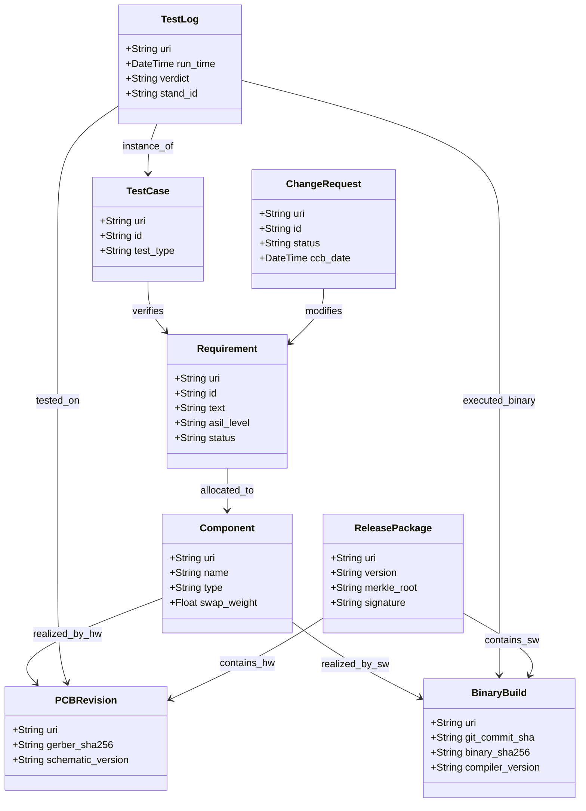

# Додаток Б. Еталонна схема цифрової нитки інженерного проєкту

> **Книга:** [Керування складними інженерними проєктами та програмами](README.md) · Додатки  
> **Попередній додаток:** [Додаток А. Реєстр інженерних стандартів і методологій](appendix-a-standards-and-frameworks.md)  
> **Наступний додаток:** [Додаток В. Довідник математичних формул проєктного та програмного менеджменту](appendix-c-project-mathematics-and-formulas.md)  
> **Зміст книги:** [README.md](README.md)  
> **Автор:** [Микола Федчик](about-the-author.md)  
> **Рівень:** системні архітектори, інженери даних, розробники інструментів інтеграції  
> **Очікувані результати:** впроваджувати структуровану схему графа цифрової нитки (Digital Thread Schema); налаштовувати інтеграційні коннектори між інструментами; виконувати запити аналізу впливу змін мовами запитів до графів.

---

## Концептуальна модель даних

Цифрова нитка інженерного підприємства моделюється як типізований орієнтований граф властивостей (*Labeled Property Graph, LPG*). Кожен вузол представляє інженерний артефакт, а кожне ребро задає семантичний зв'язок простежуваності.



---

## Специфікація сутностей цифрової нитки

Кожен артефакт має глобальний однозначний ідентифікатор URI та мінімальний набір обов'язкових атрибутів:

### 1. Requirement (Вимога)
* `uri`: однозначний ідентифікатор за стандартом OSLC (наприклад, `urn:req:safe:042`).
* `id`: людсько-зчитуваний шифр (наприклад, `REQ-SAFE-042`).
* `text`: нормативне формулювання вимоги за шаблоном EARS.
* `asil_level`: рівень критичності (`ASIL-A` .. `ASIL-D`, `None`).
* `status`: стан життєвого циклу (`Draft`, `Approved`, `Suspect`, `Deprecated`).

### 2. BinaryBuild (Збірка мікропрограми)
* `uri`: `urn:build:fw:nav:412`.
* `git_commit_sha`: точний 40-символьний геш коміту вихідного коду в Git.
* `binary_sha256`: незворотний криптографічний геш зібраного бінарного файлу `.bin`.
* `compiler_version`: версія інструментального ланцюга (Toolchain) крос-компілятора.

### 3. PCBRevision (Ревізія плати)
* `uri`: `urn:hw:pcb:nav-board:rev-c`.
* `gerber_sha256`: геш-сума виробничого архіву Gerber/ODB++ для виготовлення друкованої плати.
* `bom_version`: посилання на затверджену специфікацію компонентів у системі ERP/PLM.

### 4. TestLog (Лог верифікаційного тесту)
* `uri`: `urn:testrun:hil:2026-04-12:412`.
* `verdict`: об'єктивний результат прогону (`PASS`, `FAIL`, `INCONCLUSIVE`).
* `stand_id`: серійний номер фізичного стенду HIL, на якому проводилися випробування.
* `log_sha256`: геш бінарного файлу телеметрії стенду.

---

## Приклад запиту аналізу впливу мовою Cypher

Нижче наведено приклад запиту мовою Cypher для графової бази даних Neo4j, що знаходить усі скомпільовані бінарні збірки та тести, на які вплинула зміна вимоги `REQ-SAFE-042`:

```text
MATCH (r:Requirement {id: "REQ-SAFE-042"})
MATCH path = (r)-[:allocated_to|realized_by_sw*1..3]->(target)
RETURN target.uri AS AffectedArtifact,
       labels(target)[0] AS ArtifactType,
       length(path) AS DependencyDistance;
```

Запит виконує обхід графа за секунди й повертає точний перелік елементів, які необхідно перевірити перед погодженням зміни на засіданні ради CCB.

---

## Словник

- **Граф властивостей (Property Graph):** модель структури даних, у якій як вузли, так і ребра можуть містити довільну кількість іменованих атрибутів (властивостей).
- **Схема цифрової нитки:** формальний опис типів артефактів, дозволених атрибутів та семантичних зв'язків між ними в системній моделі підприємства.

---

## Абревіатури

- **API** (*Application Programming Interface*): програмний інтерфейс взаємодії.
- **ASIL** (*Automotive Safety Integrity Level*): рівень повноти безпеки в автопромі.
- **EARS** (*Easy Approach to Requirements Syntax*): стандартний шаблон формулювання вимог.
- **ERP** (*Enterprise Resource Planning*): система обліку ресурсів.
- **HIL** (*Hardware-in-the-Loop*): випробувальний комплекс з апаратним модулем.
- **LPG** (*Labeled Property Graph*): типізований граф властивостей.
- **OSLC** (*Open Services for Lifecycle Collaboration*): стандарт інтеграції систем розробки.
- **PCB** (*Printed Circuit Board*): друкована плата.
- **PLM** (*Product Lifecycle Management*): система управління життєвим циклом виробу.
- **SHA** (*Secure Hash Algorithm*): алгоритм криптографічного гешування.
- **URI** (*Uniform Resource Identifier*): уніфікований ідентифікатор ресурсу.

---

## Джерела

1. <a id="src-1"></a>OASIS Open. [*OSLC Core Specification Version 3.0*](https://open-services.net/specifications/). OASIS Standard, 2020.
2. <a id="src-2"></a>World Wide Web Consortium. [*PROV-DM: The PROV Data Model*](https://www.w3.org/TR/prov-dm/). W3C Recommendation, 2013.
3. <a id="src-3"></a>Neo4j Inc. [*The Cypher Graph Query Language Reference*](https://neo4j.com/docs/cypher-manual/current/). Neo4j Documentation, 2024.

---

[← Додаток А](appendix-a-standards-and-frameworks.md) | [Зміст книги](README.md) | [Додаток В →](appendix-c-project-mathematics-and-formulas.md)
