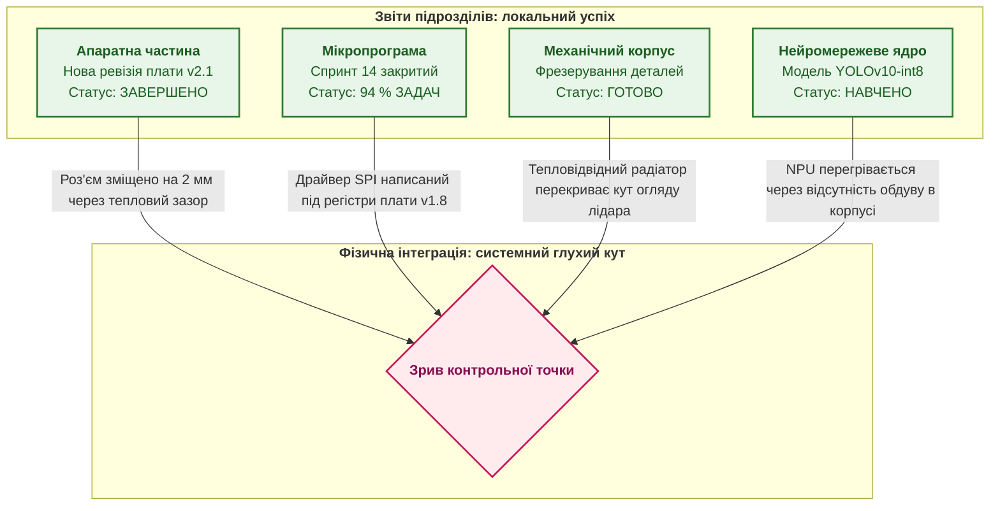
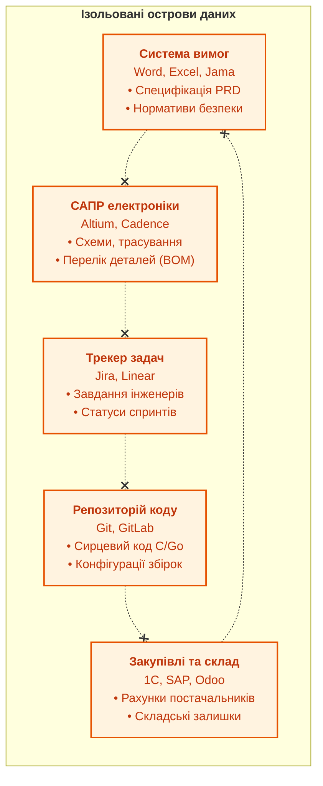

# Глава 1. Криза статусів: чому традиційний проєктний менеджмент не рятує складні вироби

> **Книга:** [Керування складними інженерними проєктами та програмами](README.md) · [Частина I](part-01-foundations-and-systems-model.md)  
> **Наступна глава:** [Глава 2. Три горизонти: проєкт, програма, портфель і межі їхніх рішень](ch02-three-horizons-project-programme-portfolio.md)  
> **Зміст книги:** [README.md](README.md)  
> **Автор:** [Микола Федчик](about-the-author.md)  
> **Рівень:** інженерні лідери, проєктні менеджери, системні архітектори, керівники PMO  
> **Очікувані результати:** розуміти природу системної кризи традиційного обліку завдань у складних інженерних виробах; розрізняти активність команд і фактичний стан готовності продукту; виявляти розриви інженерного контексту між апаратними, програмними й регуляторними доменами; закласти основу для переходу до єдиної моделі даних.

---

## Пастка «зеленого» статусу перед контрольним пунктом

Уявімо показову ситуацію за два тижні до запланованого показу дослідного зразка роботизованого комплексу або бортового блоку керування замовникові. На щотижневій координаційній зустрічі керівник кожного підрозділу демонструє звіт про стовідсоткове виконання:

* команда вбудованого програмного забезпечення закрила 94 % запланованих завдань у поточному спринті;
* схемотехніки завершили трасування нової ревізії процесорного модуля й передали файли на контрактне виробництво;
* конструктори механічних вузлів відзвітували про готовність корпусних деталей;
* спеціалісти з комп'ютерного зору успішно навчили нову модель виявлення перешкод на тестовому наборі зображень.

Зведена презентація світиться зеленими індикаторами. Керівництво проекту впевнене в успіху. Проте в день фізичного складання зразка в лабораторії виникає колапс:



Виявляється, що в новій ревізії плати інженер-схемотехнік замінив мікросхему контролера шини через дефіцит на ринку, але програміст мікропрограм дізнався про це лише під час спроби завантажити прошивку. Механічний радіатор охолодження перекрив порт налагодження JTAG, тому зняти телеметрію неможливо без повного розбирання приладу. Нейромережева модель вимагає більше пам'яті, ніж виділено в конфігурації мікроконтролера, а слот кліматичної камери для випробувань, заброньований за місяць, згорає через неможливість запустити живлення.

Кожен окремий підрозділ діяв сумлінно й виконав свій план. Проте система як ціле не працює. 

Звідси постає перше запитання цієї книги: **чому сучасні цифрові інструменти обліку задач, якими насичені інженерні компанії, систематично створюють ілюзію контролю, але виявляються безпорадними перед системними зв'язками складного виробу?**

---

## Чому складний інженерний виріб не є звичайним софтом

Останні два десятиліття в індустрії управління проєктами домінує культура чистої розробки програмного забезпечення. Гнучкі підходи (Agile, Scrum, Kanban) здійснили справжній переворот у створенні мобільних додатків, веб-сервісів та корпоративних інформаційних систем. Вони навчили команди швидко адаптуватися до побажань клієнта, розбивати роботу на невеликі відрізки й відмовлятися від важких попередніх специфікацій.

Проте механічне перенесення цих практик на створення складних кіберфізичних систем (роботів, авіоніки, радіоелектроніки, автомобілів, медичного обладнання) породило системну кризу. Причина криється в суттєвих фізичних і часових відмінностях між чистим софтом та інженерним виробом.

### 1. Незворотність фізичних помилок

У хмарному програмному забезпеченні вартість внесення виправлень близька до нуля. Якщо розробник припустився помилки в коді, він може виправити рядок, запустити автоматизовані тести й за хвилину розгорнути оновлення на сервері через конвеєр CI/CD.

В апаратному світі помилка топології друкованої плати або помилка в розрахунку міцності тримача двигуна означає матеріальний брак. Необхідно заново замовляти склотекстоліт, чекати на доставку компонентів, переналагоджувати лінію поверхневого монтажу й повторювати стендові випробування. Ціна такої «ітерації» вимірюється тижнями простою та тисячами доларів.

### 2. Мультитемповий ритм розробки

Складний виріб об'єднує підсистеми, що розвиваються з принципово різною швидкістю:

| Інженерний домен | Характерний цикл ітерації | Вартість помилки | Обмеження гнучкості |
| :--- | :--- | :--- | :--- |
| **Системна архітектура** | 3–6 місяців | Критична (зміна концепції виробу) | Специфікація інтерфейсів, розподіл бюджетів енергоспоживання |
| **Механіка й корпуси** | 4–8 тижнів | Висока (переробка прес-форм, фрезерування) | Терміни постачання металу, завантаження верстатів ЧПУ |
| **Електроніка (PCB/HW)** | 3–6 тижнів | Висока (виготовлення плат, закупівля компонентів) | Терміни постачання чипів (Lead Time до 26 тижнів) |
| **Мікропрограми (Firmware)** | 1–2 тижні | Середня (ризик блокування апаратного стенду) | Залежність від фізичної наявності ревізії заліза |
| **Прикладний софт** | 1–3 дні | Низька (швидке перескладання) | Залежність від стабільності API нижнього рівня |
| **Сертифікація та аудит** | 1–3 місяці | Катастрофічна (заборона продажу виробу) | Фіксовані нормативні стандарти та протоколи |

Спроба загнати всі ці домени в єдиний двотижневий спринт перетворює планування на профанацію. Конструктор не може видавати готовий литий корпус кожні два тижні, а інженер-схемотехнік не може замовити виготовлення багатошарової плати на три дні лише тому, що в п'ятницю закінчується спринт.

### 3. Закон неповноти локального контексту

Коли інженер працює над завданням у трекері (наприклад, у Jira чи Redmine), він бачить формулювання: «Оптимізувати споживання енергії мікроконтролера в режимі сну». Для розробника це локальна оптимізація коду. Він знижує тактову частоту шини SPI до 1 МГц і переводить периферію в режим енергозбереження.

Але в системному контексті ця зміна означає катастрофу: зовнішній датчик кутової швидкості не встигає передати пакет телеметрії в підсистему стабілізації польоту, і дрон втрачає керованість під час пориву вітру. Трекер задач не знає про фізичний зв'язок між тактовою частотою шини та стійкістю динамічної моделі апарата. Цей зв'язок існує лише в архітектурній моделі системи.

---

## Інформація про активність проти знання про стан продукту

Управлінська криза виникає тоді, коли керівництво плутає два принципово різні типи даних:

1. **Інформація про активність (Activity Data):** скільки годин списали інженери, скільки завдань переміщено по дошці, скільки комітів відправлено до репозиторію, скільки засідань проведено. Це показники зайнятості процесу.
2. **Знання про стан продукту (Product State Knowledge):** чи зібраний поточний бінарний образ з перевіреною версією схеми; чи покриті сертифікаційні вимоги результатами випробувань; які зміни внесено до електричної схеми після затвердження базової лінії; чи існує фізичний зразок, на якому пройшли інтеграційні тести.

Більшість класичних інструментів управління зосереджені виключно на активності. Вони відповідають на запитання: «Чи працюють люди?». Але вони мовчать на запитання: «У якому стані перебуває створюваний матеріальний об'єкт?».

Розглянемо формальне співвідношення між кількістю виконаних задач і ступенем завершеності складної системи. Нехай загальний перелік робіт містить $N$ завдань. Якщо кожне завдання вважати незалежним, рівень прогресу часто подають наївною формулою:

```math
P_{\text{naive}}=\frac{1}{N}\sum_{i=1}^{N}x_i.
```

Позначення:

- $P_{\text{naive}}$ є наївним індексом прогресу закриття завдань, що набуває значень від 0 до 1;
- $N$ є загальною кількістю запланованих завдань у проєкті;
- $`x_i \in \{0, 1\}`$ є бінарним індикатором виконання $i$-го завдання (1, якщо задача переміщена в колонку «Зроблено», і 0, якщо ні);
- $\sum_{i=1}^{N}x_i$ показує сумарну кількість формально закритих завдань на поточний момент.

На практиці складний виріб функціонує як зв'язний граф, де працездатність залежить від спільних інтерфейсів і коректності парних взаємодій. Якщо система складається з $M$ взаємозалежних модулів, а успіх інтеграції вимагає узгодженості кожного інтерфейсного зв'язку, справжня системна готовність описується добутком готовності інтерфейсів:

```math
P_{\text{system}}=\prod_{k=1}^{K}I_k,
\qquad I_k \in [0, 1].
```

Складники формули:

- $P_{\text{system}}$ є показником системної готовності виробу як єдиного цілого, у діапазоні від 0 до 1;
- $K$ є кількістю критичних міжмодульних інтерфейсів у системній архітектурі;
- $I_k$ є ступенем верифікованої сумісності $k$-го інтерфейсу за результатами апаратних чи стендових випробувань;
- знак $\prod_{k=1}^{K}$ означає мультиплікативне накопичення: порушення хоча б одного інтерфейсу обнуляє працездатність усього комплексу.

Читається це так: якщо в системі з 10 критичних інтерфейсів 9 узгоджені ідеально ($I_k = 1{,}0$), а один інтерфейс має дефект або не перевірений ($I_{10} = 0$), загальна системна готовність дорівнює:

$$P_{\text{system}} = 1{,}0^9 \times 0 = 0.$$

У цей самий момент трекер завдань може показувати виконання 95 % завдань ($P_{\text{naive}} = 0{,}95$), оскільки програмісти й конструктори завершили свої локальні блоки робіт. Керівник, який дивиться лише на $P_{\text{naive}}$, бачить зелений звіт і готує урочисту презентацію. Системний інженер, який дивиться на $P_{\text{system}}$, розуміє, що виріб є недієздатним.

---

## Розрив контексту та інструментальні острови

Чому виникає цей розрив між формальним звітом і реальною готовністю? Відповідь криється в інструментальній структурі сучасного підприємства.

У типовій компанії, що розробляє високотехнологічну продукцію, дані про проєкт розподілені між ізольованими сховищами:



Кожен інструмент оптимізований під вузьку задачу своєї дисципліни:

* **Специфікація вимог** живе в текстових документах або спеціалізованих базах вимог. Вона фіксує, *що саме* має робити продукт з точки зору замовника чи нормативного стандарту.
* **Електронний САПР (EDA)** зберігає схеми, файли топології та переліки елементів (*Bill of Materials*, BOM). Він знає про корпуси мікросхем, теплові режими й паразитні ємності провідників.
* **Система керування версіями (VCS)** зберігає код мікропрограм і прикладного софту. Вона знає історію комітів, гілок і тегів релізів.
* **Трекер завдань** веде облік виконавців, дедлайнів і коментарів до робіт.
* **Система управління ресурсами (ERP)** відстежує закупівлі, договори з фабриками монтажу та складські залишки.

Між цими островами немає машинозчитуваного зв'язку. Єдиним містком між ними залишається пам'ять окремих інженерів і нескінченні координаційні наради.

Коли замовник змінює вимогу до діапазону робочих температур виробу з $`-20\,^\circ\text{C}\dots+50\,^\circ\text{C}`$ на $`-40\,^\circ\text{C}\dots+85\,^\circ\text{C}`$, цей запис з'являється в документі вимог. Але інженер із закупівель не отримує автоматичного сповіщення про те, що замовлені напівпровідникові стабілізатори комерційного класу (Commercial Grade) більше не придатні, і необхідно терміново законтрактувати компоненти індустріального класу (Industrial Grade) з іншим терміном постачання. 

Проблема спливає лише під час кліматичних випробувань, коли плата виходить із ладу на стенді охолодження. Проєкт втрачає два місяці на повторну закупівлю й перепайку модулів.

---

## Вартість запізнілого виявлення дефектів: крива Боема в апаратно-програмних комплексах

Класичне дослідження Баррі Боема в галузі програмної інженерії довело, що вартість виправлення помилки експоненційно зростає з кожною наступною фазою життєвого циклу проекту [[1]](#src-1). В апаратно-програмних та кіберфізичних комплексах цей закон діє ще жорсткіше.


Якщо невідповідність між вимогами безпеки та апаратною архітектурою виявлено на етапі системного аналізу, її виправлення коштує кілька годин роботи архітектора (вартість $1\times$). Якщо ця сама невідповідність просочилася крізь етапи розробки й призвела до відмови блоку під час державних випробувань чи сертифікаційного аудиту, вартість її виправлення зростає до сотень разів ($200\times\dots500\times$).

Якщо ж дефект виявлено після початку серійного виробництва у кінцевого користувача, компанія стикається з катастрофічними витратами: відкликанням фізичних виробів, повною зупинкою конвеєра, юридичною відповідальністю та втратою ринкової репутації ($1000\times+$).

Традиційне проєктне управління, побудоване на ручних звітах і суб'єктивних оцінках, зміщує момент виявлення дефектів праворуч за шкалою часу: ближче до інтеграції та випробувань. Це явище в теорії систем відоме як запізніла петля зворотного зв'язку.

Головне завдання сучасної інженерно-управлінської платформи полягає в реалізації принципу **зсуву вліво (Shift-Left)**: виявленні інтерфейсних, розкладних, логічних і нормативних розривів якомога раніше, коли їхнє усунення не потребує переробки фізичного заліза.

---

## Шлях виходу: цифрова нитка, подійні сигнали та доказовість

Щоб подолати кризу розірваного контексту, інженерний менеджмент має спиратися на три конструктивні засади, яким присвячено наступні частини цієї монографії:

1. **Єдина цифрова нитка (Digital Thread):** кожен артефакт проекту повинен мати стабільний ідентифікатор і машинозчитувані зв'язки. Зміна у вимозі повинна автоматично позначати пов'язані задачі, електричні ланцюги, тестові сценарії та розділи технічного опису як такі, що вимагають верифікації.
2. **Подійно-орієнтоване управління (Event-Driven Management):** система управління повинна реагувати не на суб'єктивні запевнення на нарадах, а на фактичні події інженерного середовища: завершення компіляції прошивки, зміну статусу митного оформлення партії деталей, фіксацію аномалії на випробувальному стенді, випуск нової базової лінії архітектури.
3. **Доказові шлюзи готовності (Evidence-Based Gates):** перехід між етапами проекту й допуск виробу до релізу мають базуватися на обчислюваних контрактах. Замість збирання підписів керівників автоматизований шлюз аналізує криптографічні докази: чи всі обов'язкові тести успішно виконані на цільовій ревізії обладнання, чи закриті блокувальні дефекти, чи відповідає стан виробу вимогам сертифікаційних регламентів.

Тільки побудувавши таку прозору, зв'язну й математично обґрунтовану інфраструктуру, інженерна організація може ефективно підключати сучасні аналітичні інструменти, включно з прикладними асистентами на базі штучного інтелекту.

---

## Висновок

Традиційний проєктний менеджмент, запозичений із галузі веброзробки чи загального адміністрування, вичерпує свої можливості під час створення складних апаратно-програмних виробів. Облік абстрактних задач і збирання щотижневих статус-звітів створюють небезпечну ілюзію прогресу, маскуючи каскадне накопичення системних ризиків на стиках інженерних дисциплін.

Справжній контроль над складним проєктом вимагає переходу від інформації про зайнятість людей до точного знання про фізичний і програмний стан створюваного виробу. Цей перехід спирається на формування цифрової нитки артефактів, синхронізацію різнотемпових циклів розробки через базові версії та впровадження обчислюваних доказових шлюзів якості.

У наступній главі ми розмежуємо масштаби управління та дослідимо, як взаємодіють три горизонти інженерного лідерства: проєкт, програма та портфель.

---

## Питання для обговорення

1. Чому високий відсоток закритих завдань у системі обліку робіт часто супроводжується повним провалом етапу системної інтеграції виробу?
2. Які фізичні та економічні фактори роблять неможливим використання стандартного двотижневого спринту Scrum для розробки апаратних модулів і корпусних деталей?
3. У чому полягає різниця між інформацією про активність інженерної команди та перевіреним знанням про стан продукту?
4. Чому вартість виправлення помилки специфікації інтерфейсу зростає в сотні разів під час переходу від етапу проєктування до етапу польових або стендових випробувань?
5. Які інструментальні острови існують у вашій організації, і яким чином зараз передається інформація про технічні зміни між розробниками апаратури, програмістами мікропрограм та інженерами з тестування?

---

## Словник

- **Апаратно-програмний комплекс:** інтегрована інженерна система, що поєднує електронні модулі, механічні вузли, датчики, вбудовані мікропрограми та прикладне програмне забезпечення для виконання цільових функцій у фізичному середовищі.
- **Базова лінія (Baseline):** офіційно перевірена й затверджена конфігурація вимог, архітектури, розкладу чи бюджету проєкту, яка слугує узгодженою основою для подальшої роботи та може бути змінена лише через формальну процедуру контролю змін.
- **Вбудоване програмне забезпечення (Firmware):** спеціалізовані мікропрограми, скомпільовані для виконання безпосередньо на мікроконтролерах чи цифрових сигнальних процесорах інженерного пристрою без проміжних рівнів абстракції.
- **Закон Боема:** емпірична закономірність інженерії систем, згідно з якою вартість усунення дефекту зростає експоненційно з переходом на кожну наступну стадію життєвого циклу розробки виробу.
- **Зсув уліво (Shift-Left):** інженерний підхід, спрямований на перенесення процедур верифікації, аналізу ризиків, тестування сумісності та перевірки комплаєнсу на максимально ранні етапи проєкту для запобігання дорогим переробкам на пізніх фазах.
- **Кіберфізична система (Cyber-Physical System):** обчислювально-механічний комплекс, у якому цифрові алгоритми керування тісно пов'язані з фізичними процесами передавання енергії, руху, вимірювань і матеріальних перетворень.
- **Мультитемпова розробка (Multi-Cadence Delivery):** методологія організації інженерного проєкту, що дозволяє синхронізувати підсистеми з принципово різною тривалістю циклу створення (довгі цикли механіки й схемотехніки проти швидких ітерацій софту) через фіксовані інтеграційні вікна.
- **Цифрова нитка (Digital Thread):** неперервний, машинно-простежуваний граф даних, що пов'язує всі цифрові артефакти інженерного виробу протягом усього життєвого циклу: від вихідних вимог і моделей CAD/EDA до збірок коду, звітів випробувань і сертифікаційних свідоцтв.

---

## Абревіатури

- **ALM** (*Application Lifecycle Management*): управління життєвим циклом прикладного програмного забезпечення.
- **ASIC** (*Application-Specific Integrated Circuit*): спеціалізована інтегральна схема, оптимізована для виконання конкретного завдання.
- **ASIL** (*Automotive Safety Integrity Level*): рівень повноти безпеки в автомобільній промисловості відповідно до стандарту ISO 26262.
- **BOM** (*Bill of Materials*): специфікація матеріалів і компонентів, необхідних для виготовлення виробу.
- **CAD** (*Computer-Aided Design*): система автоматизованого проєктування механічних деталей і вузлів.
- **CI/CD** (*Continuous Integration / Continuous Delivery*): безперервна інтеграція та безперервне розгортання програмних компонентів.
- **DAL** (*Development Assurance Level*): рівень гарантії розробки в авіаційній промисловості відповідно до DO-178C і DO-254.
- **EDA** (*Electronic Design Automation*): система автоматизації проєктування електронних пристроїв і друкованих плат.
- **ERP** (*Enterprise Resource Planning*): система планування ресурсів підприємства (облік фінансів, закупівель і складів).
- **GSN** (*Goal Structuring Notation*): графічний стандарт структурування доказів та аргументів безпеки систем.
- **HIL** (*Hardware-in-the-Loop*): стендове моделювання з реальним апаратним обладнанням у випробувальному стенді.
- **JTAG** (*Joint Test Action Group*): стандартизований апаратний інтерфейс для тестування й налагодження мікропроцесорної техніки (IEEE 1149.1).
- **PCB** (*Printed Circuit Board*): друкована плата з електричними з'єднаннями для монтажу електронних компонентів.
- **PLM** (*Product Lifecycle Management*): система управління повним життєвим циклом виробу від креслень до утилізації.
- **RTM** (*Requirements Traceability Matrix*): матриця простежуваності вимог до компонентів системи та протоколів їхньої верифікації.
- **SPI** (*Serial Peripheral Interface*): послідовний синхронний інтерфейс зв'язку між мікроконтролером і периферійними мікросхемами.
- **VCS** (*Version Control System*): система контролю версій сирцевого коду та інженерної документації.
- **WBS** (*Work Breakdown Structure*): ієрархічна структура декомпозиції робіт проєкту.

---

## Джерела

1. <a id="src-1"></a>Barry W. Boehm. [*Software Engineering Economics*](https://www.pearson.com/en-us/subject-catalog/p/software-engineering-economics/P200000000570). Prentice-Hall, 1981.
2. <a id="src-2"></a>International Organization for Standardization. [*ISO 26262: Road vehicles - Functional safety*](https://www.iso.org/standard/68383.html). ISO, 2018.
3. <a id="src-3"></a>RTCA / EUROCAE. [*DO-178C / ED-12C: Software Considerations in Airborne Systems and Equipment Certification*](https://www.rtca.org/). RTCA, 2011.
4. <a id="src-4"></a>International Council on Systems Engineering. [*INCOSE Systems Engineering Handbook: A Guide for System Life Cycle Processes and Activities*](https://doi.org/10.1002/9781119516828), 4th Edition. Wiley, 2015.
5. <a id="src-5"></a>Project Management Institute. [*A Guide to the Project Management Body of Knowledge (PMBOK Guide)*](https://www.pmi.org/pmbok-guide-standards/foundational/pmbok), 7th Edition. PMI, 2021.
6. <a id="src-6"></a>Eliyahu M. Goldratt. [*Critical Chain*](https://www.goldrattbooks.com/). The North River Press, 1997.
7. <a id="src-7"></a>World Wide Web Consortium. [*PROV-DM: The PROV Data Model*](https://www.w3.org/TR/prov-dm/). W3C Recommendation, 2013.

---

[← До змісту книги](README.md) | [Частина I](part-01-foundations-and-systems-model.md) | [Глава 2 →](ch02-three-horizons-project-programme-portfolio.md)
